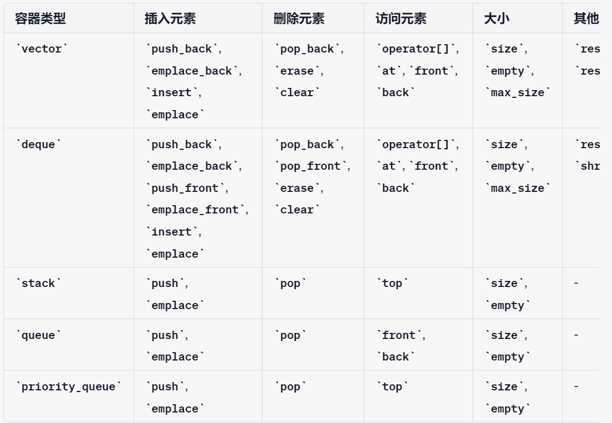

* [1、《C++》](#1c)
  * [1.1）C++基础](#11c基础)
    * [1.1.1）关键字与运算符](#111关键字与运算符)
      * [1.1.1.1）、指针与引⽤](#1111指针与引)
      * [1.1.1.10）、static](#11110static)
      * [1.1.1.11）、前置++与后置++](#11111前置与后置)
      * [1.1.1.12）、std::atomic](#11112stdatomic)
      * [1.1.1.2）、const关键字](#1112const关键字)
      * [1.1.1.3）、define和typedef的区别](#1113define和typedef的区别)
      * [1.1.1.4）、define和inline的区别](#1114define和inline的区别)
      * [1.1.1.5）、override和overload](#1115override和overload)
      * [1.1.1.6）、new和malloc](#1116new和malloc)
      * [1.1.1.7）、constexpr和const](#1117constexpr和const)
      * [1.1.1.8）、volatile](#1118volatile)
      * [1.1.1.9）、extern](#1119extern)
    * [1.1.2）C++三⼤特性](#112c三特性)
      * [1.1.2.1）、访问权限](#1121访问权限)
      * [1.1.2.2）、继承](#1122继承)
      * [1.1.2.3）、封装](#1123封装)
      * [1.1.2.4）、多态](#1124多态)
      * [1.1.2.5）、虚函数](#1125虚函数)
      * [1.1.2.6）、空类](#1126空类)
      * [1.1.2.7）、抽象类与接⼜的实现](#1127抽象类与接的实现)
    * [1.1.3）智能指针](#113智能指针)
      * [1.1.3.1）、shared\_ptr](#1131shared_ptr)
      * [1.1.3.2）、unique\_ptr](#1132unique_ptr)
      * [1.1.3.3）、weak\_ptr](#1133weak_ptr)
    * [1.1.4）C++强制类型转换](#114c强制类型转换)
      * [1.1.4.1）、static\_cast](#1141static_cast)
      * [1.1.4.2）、dynamic\_cast](#1142dynamic_cast)
      * [1.1.4.3）、reinterpret\_cast](#1143reinterpret_cast)
      * [1.1.4.4）、const\_cast](#1144const_cast)
    * [1.1.5）C++内存模型](#115c内存模型)
      * [1.1.5.1）、字符串操作函数](#1151字符串操作函数)
      * [1.1.5.2）、内存泄漏](#1152内存泄漏)
      * [1.1.5.3）、测试题⽬](#1153测试题)
    * [1.1.6）计算机中的乱序执⾏](#116计算机中的乱序执)
      * [1.1.6.1）、副作⽤](#1161副作)
      * [1.1.6.2）、信号量](#1162信号量)
      * [1.1.6.3）、future库](#1163future库)
    * [1.1.7）运算符重载](#117运算符重载)
  * [1.2）c++11,14,17等的新特性](#12c111417等的新特性)
    * [1.2.1)  C++11新特性](#121--c11新特性)
      * [1.2.1.1)、类型推到](#1211类型推到)
      * [1.2.1.2)、右值引用](#1212右值引用)
      * [1.2.1.3)、nullptr](#1213nullptr)
      * [1.2.1.4)、范围for循环](#1214范围for循环)
      * [1.2.1.5)、列表初始化](#1215列表初始化)
      * [1.2.1.6)、lambda表达式](#1216lambda表达式)
      * [1.2.1.7)、并发](#1217并发)
      * [1.2.7.1).std::thread](#1271stdthread)
      * [1.2.7.2).lock\_guard](#1272lock_guard)
      * [1.2.7.3).unique\_lock](#1273unique_lock)
  * [1.3）《EffectiveSTL》](#13effectivestl)
  * [1.4）《EffectiveC++》](#14effectivec)
  * [1.5）C++ STL和string类](#15c-stl和string类)
    * [1.5.1）STL实现原理及其实现](#151stl实现原理及其实现)
      * [1.5.1.1）、容器](#1511容器)
      * [1.5.1.2）、算法](#1512算法)
      * [1.5.1.3）、迭代器](#1513迭代器)
      * [1.5.1.4）、仿函数](#1514仿函数)
      * [1.5.1.5）、适配器](#1515适配器)
      * [1.5.1.6）、空间适配器](#1516空间适配器)
      * [1.5.1.7）、STL的优点](#1517stl的优点)
    * [1.5.2）pair容器](#152pair容器)
    * [1.5.3）vector容器实现与扩充](#153vector容器实现与扩充)
      * [1.5.3.1）、底层实现](#1531底层实现)
      * [1.5.3.2）、扩容过程](#1532扩容过程)
      * [1.5.3.3）、vector源码](#1533vector源码)
    * [1.5.4）list（链表）](#154list链表)
      * [1.5.4.1）、list设计](#1541list设计)
      * [1.5.4.2）、vector和list的区别](#1542vector和list的区别)
    * [1.5.5）deque（双端数组）](#155deque双端数组)
    * [1.5.6）stack \&\& queue](#156stack--queue)
      * [1.5.6.1）、源码](#1561源码)
    * [1.5.7）heap \&\& priority\_queue](#157heap--priority_queue)
    * [1.5.8）map \&\& set](#158map--set)
    * [1.5.9）map \&\& unordered\_map](#159map--unordered_map)
    * [1.5.10）string类](#1510string类)
    * [1.5.11）容器vector、stack、queue等相关操作](#1511容器vectorstackqueue等相关操作)


## 1、《C++》

1、


2、


3、


4、


5、


6、


7、


8、


### 1.1）C++基础

 


#### 1.1.1）关键字与运算符

1、


2、


3、


4、


5、


6、


7、


8、


##### 1.1.1.1）、指针与引⽤


##### 1.1.1.10）、static


##### 1.1.1.11）、前置++与后置++


##### 1.1.1.12）、std::atomic


##### 1.1.1.2）、const关键字


##### 1.1.1.3）、define和typedef的区别


##### 1.1.1.4）、define和inline的区别


##### 1.1.1.5）、override和overload


##### 1.1.1.6）、new和malloc


##### 1.1.1.7）、constexpr和const


##### 1.1.1.8）、volatile


##### 1.1.1.9）、extern


#### 1.1.2）C++三⼤特性

1、

访问权限
封装
继承
多态
虚函数
空类
抽象类与接口实现


2、


3、


4、


5、


6、


7、


8、


##### 1.1.2.1）、访问权限


##### 1.1.2.2）、继承


##### 1.1.2.3）、封装


##### 1.1.2.4）、多态


##### 1.1.2.5）、虚函数


##### 1.1.2.6）、空类


##### 1.1.2.7）、抽象类与接⼜的实现


#### 1.1.3）智能指针

1、


2、


3、


4、


5、


6、


7、


8、


##### 1.1.3.1）、shared_ptr


##### 1.1.3.2）、unique_ptr


##### 1.1.3.3）、weak_ptr

<h2>1、再举例子详细说明引用计数加或减的规则</h2>

好的，通过具体例子来详细说明 `std::shared_ptr` 和 `std::weak_ptr` 的引用计数规则，以及如何通过这些规则管理对象的生命周期。

 **示例背景**

我们用一个包含两个类 `Person` 和 `Company` 的例子来说明。`Person` 持有指向 `Company` 的 `std::shared_ptr`，而 `Company` 持有指向 `Person` 的 `std::weak_ptr`。

 **示例代码**


```cpp
#include <iostream>
#include <memory>
#include <string>

class Company; // 前向声明

class Person {
public:
    std::string name;
    std::shared_ptr<Company> company;

    Person(const std::string& name) : name(name) {
        std::cout << "Person " << name << " constructed" << std::endl;
    }

    ~Person() {
        std::cout << "Person " << name << " destructed" << std::endl;
    }
};

class Company {
public:
    std::string name;
    std::weak_ptr<Person> manager; // 使用 std::weak_ptr 打破循环引用

    Company(const std::string& name) : name(name) {
        std::cout << "Company " << name << " constructed" << std::endl;
    }

    ~Company() {
        std::cout << "Company " << name << " destructed" << std::endl;
    }

    void showManager() {
        if (auto mgr = manager.lock()) { // 转换为 std::shared_ptr
            std::cout << "Manager: " << mgr->name << std::endl;
        } else {
            std::cout << "Manager has been destructed" << std::endl;
        }
    }
};

int main() {
    auto john = std::make_shared<Person>("John");
    auto abcCorp = std::make_shared<Company>("ABC Corp");

    john->company = abcCorp;      // 增加 abcCorp 的引用计数
    abcCorp->manager = john;      // 不增加 john 的引用计数

    std::cout << "Before end of main()" << std::endl;
    abcCorp->showManager();       // 显示 Manager 信息

    // 作用域结束，john 和 abcCorp 的引用计数分别减1

    return 0;
}
```

 <h3>引用计数变化的详细说明</h3>

1. **创建 `Person` 和 `Company` 对象**:
   ```cpp
   auto john = std::make_shared<Person>("John");
   auto abcCorp = std::make_shared<Company>("ABC Corp");
   ```
   - `john` 和 `abcCorp` 的引用计数均为1。

2. **`john` 持有 `abcCorp` 的 `shared_ptr`**:
   ```cpp
   john->company = abcCorp;
   ```
   - `abcCorp` 的引用计数增加到2，因为 `john->company` 持有一个 `shared_ptr` 指向 `abcCorp`。

3. **`abcCorp` 持有 `john` 的 `weak_ptr`**:
   ```cpp
   abcCorp->manager = john;
   ```
   - `john` 的引用计数不变，仍然为1，因为 `abcCorp->manager` 持有的是 `weak_ptr`，不增加引用计数。

4. **调用 `showManager` 方法**:
   ```cpp
   abcCorp->showManager();
   ```
   - `manager.lock()` 创建一个临时的 `shared_ptr`，如果 `john` 存在，则返回一个指向 `john` 的 `shared_ptr`，增加 `john` 的引用计数到2。打印 Manager 信息后，临时 `shared_ptr` 销毁，`john` 的引用计数回到1。

5. **程序结束，释放资源**:
   - `john` 和 `abcCorp` 的作用域结束，它们的引用计数各自减1：
     - `john` 的引用计数减到0，`Person` 对象被销毁。
     - `abcCorp` 的引用计数减到1，因为 `john->company` 仍然持有对 `abcCorp` 的引用。
     - `john` 被销毁后，`john->company` 也失效，`abcCorp` 的引用计数减到0，`Company` 对象被销毁。(**循环引用中`john->company` 没失效，才导致的二者的引用计数都未清零！！！**)


<h3>引用计数总结</h3>

- **增加引用计数**:
  - 当一个新的 `std::shared_ptr` 复制或者移动构造时，或者通过赋值运算符分配时，目标对象的引用计数增加。
  - 在 `john->company = abcCorp;` 这一行，`abcCorp` 的引用计数增加了。

- **减少引用计数**:
  - 当一个 `std::shared_ptr` 离开其作用域，或者通过赋值运算符被重新分配时，源对象的引用计数减少。
  - 在 `main` 函数结束时，`john` 和 `abcCorp` 的引用计数分别减少，最终对象被销毁。

- **`std::weak_ptr` 不影响引用计数**:
  - `std::weak_ptr` 不会增加对象的引用计数，用于打破循环引用。
  - 在本例中，`abcCorp->manager = john;` 并不会增加 `john` 的引用计数。

通过上述示例，展示了如何使用 `std::shared_ptr` 和 `std::weak_ptr` 来管理对象的生命周期，避免循环引用导致的内存泄漏问题。


2、


3、


4、


5、


6、


7、


8、

#### 1.1.4）C++强制类型转换


##### 1.1.4.1）、static_cast


##### 1.1.4.2）、dynamic_cast


##### 1.1.4.3）、reinterpret_cast


##### 1.1.4.4）、const_cast


#### 1.1.5）C++内存模型


##### 1.1.5.1）、字符串操作函数


##### 1.1.5.2）、内存泄漏


##### 1.1.5.3）、测试题⽬


#### 1.1.6）计算机中的乱序执⾏


##### 1.1.6.1）、副作⽤


##### 1.1.6.2）、信号量


##### 1.1.6.3）、future库


#### 1.1.7）运算符重载


### 1.2）c++11,14,17等的新特性

1、


2、


3、


4、


5、


6、


7、


8、


#### 1.2.1)  C++11新特性


##### 1.2.1.1)、类型推到


##### 1.2.1.2)、右值引用


##### 1.2.1.3)、nullptr


##### 1.2.1.4)、范围for循环


##### 1.2.1.5)、列表初始化


##### 1.2.1.6)、lambda表达式


##### 1.2.1.7)、并发


##### 1.2.7.1).std::thread


##### 1.2.7.2).lock_guard


##### 1.2.7.3).unique_lock


### 1.3）《EffectiveSTL》

1、


2、


3、


4、


5、


6、


7、


8、


### 1.4）《EffectiveC++》

1、


2、


3、


4、


5、


6、


7、


8、


1.5）C++ 


### 1.5）C++ STL和string类


#### 1.5.1）STL实现原理及其实现


##### 1.5.1.1）、容器


##### 1.5.1.2）、算法


##### 1.5.1.3）、迭代器


##### 1.5.1.4）、仿函数


##### 1.5.1.5）、适配器


##### 1.5.1.6）、空间适配器


##### 1.5.1.7）、STL的优点


#### 1.5.2）pair容器


#### 1.5.3）vector容器实现与扩充


##### 1.5.3.1）、底层实现


##### 1.5.3.2）、扩容过程


##### 1.5.3.3）、vector源码


#### 1.5.4）list（链表）


##### 1.5.4.1）、list设计


##### 1.5.4.2）、vector和list的区别


#### 1.5.5）deque（双端数组）


#### 1.5.6）stack && queue


##### 1.5.6.1）、源码


#### 1.5.7）heap && priority_queue


#### 1.5.8）map && set


#### 1.5.9）map && unordered_map

#### 1.5.10）string类

>在C++中，std::string 是一个非常强大的类，提供了大量的成员函数来处理和操作字符串。以下是 std::string 的一些常用成员函数：

**构造函数和赋值操作**:  
**string()**：默认构造函数。  
**string(const string& str)**：拷贝构造函数。  
**string(const char\* s)**：从C字符串构造。  
**operator=**：赋值操作。

**元素访问:**  
**at(size_t pos)**：返回指定位置的字符。  
**operator[]**：返回指定位置的字符。  
**front()**：返回第一个字符。  
**back()**：返回最后一个字符。  
**c_str()**：返回C风格的字符串。  
**data()**：返回字符串的内部数据。

**迭代器**:  
begin()、end()：返回指向字符串开始和结束的迭代器。
rbegin()、rend()：返回指向字符串开始和结束的反向迭代器。
容量:

size()、length()：返回字符串的长度。
max_size()：返回字符串可能的最大长度。
resize(size_t n)：调整字符串的大小。
empty()：检查字符串是否为空。
capacity()：返回为字符串分配的内存大小。
reserve(size_t n)：预留内存空间。
shrink_to_fit()：减少存储容量以适应其大小。
修改:

clear()：清除内容。
insert()：插入子字符串。
erase()：删除子字符串。
push_back(char c)：添加字符到字符串末尾。
pop_back()：删除字符串末尾的字符。
append()：添加子字符串到字符串末尾。
replace()：替换子字符串。
字符串操作:

copy()：复制子字符串。
substr(size_t pos = 0, size_t len = npos)：返回子字符串。
swap(string& str)：交换字符串内容。
查找和比较:

find()：查找子字符串。
rfind()：从尾部开始查找子字符串。
find_first_of()、find_last_of()、find_first_not_of()、find_last_not_of()：查找字符集合。
compare()：比较字符串。
数值转换:

stoi(), stol(), stoll(), stof(), stod(), stold()：将字符串转换为整数或浮点数。
1、


2、


3、


4、


5、


6、


7、


8、

#### 1.5.11）容器vector、stack、queue等相关操作

在C++中，不同的容器类型提供了不同的成员函数来操作容器中的元素。以下是一些常用容器及其相关操作的总结：


这里是每个操作的简要说明：

插入元素:

**push_back:** 在容器的末尾添加一个元素（vector, deque）。  
**emplace_back:** 在容器的末尾直接构造一个元素（vector, deque）。  
**push_front:** 在容器的开始添加一个元素（deque）。  
**emplace_front:** 在容器的开始直接构造一个元素（deque）。  
**insert:**在容器的指定位置插入一个或多个元素（vector, deque）。  
emplace: 在容器的指定位置构造一个元素（vector, deque）。  
push: 在栈顶添加一个元素（stack, queue, priority_queue）。  
emplace: 在容器中直接构造一个元素（stack, queue, priority_queue）。  
删除元素:

pop_back: 删除容器末尾的元素（vector, deque）。  
pop_front: 删除容器开始的元素（deque）。  
erase: 删除容器中的一个或多个元素（vector, deque）。  
clear: 清空容器中的所有元素（vector, deque）。  
pop: 删除栈顶或队列前端的元素（stack, queue, priority_queue）。  
访问元素:

operator[]: 通过索引访问元素（vector, deque）。  
at: 通过索引访问元素，带边界检查（vector, deque）。  
front: 访问容器第一个元素（vector, deque, queue）。  
back: 访问容器最后一个元素（vector, deque, queue）。  
top: 访问栈顶元素（stack, priority_queue）。  
大小:

size: 返回容器中元素的数量。  
empty: 检查容器是否为空。  
max_size: 返回容器可能包含的最大元素数量。  
其他常用操作:

reserve: 分配至少能容纳指定数量元素的内存（vector）。  
resize: 改变容器中元素的数量（vector, deque）。  
shrink_to_fit: 尝试减少容器占用的内存空间（deque）。  
1、


2、


3、


4、


5、


6、


7、


8、