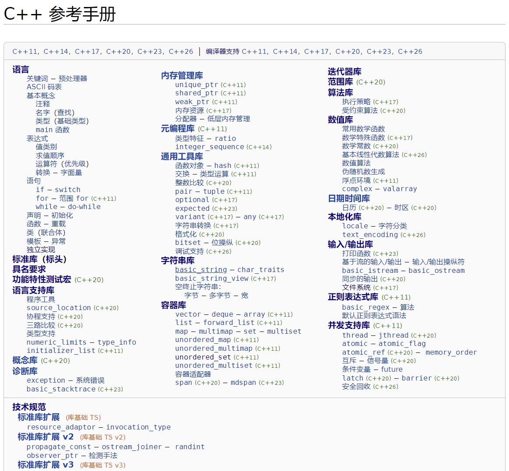

* [1. 基础知识](#1-基础知识)
  * [1.1 C++ 简介](#11-c-简介)
    * [1.1.1 C++ 的历史和发展](#111-c-的历史和发展)
      * [1.1.1.1 简介](#1111-简介)
      * [1.1.1.2 发展历程](#1112-发展历程)
    * [1.1.2 C++ 与 C 的区别](#112-c-与-c-的区别)
      * [1.1.2.1 语法差异](#1121-语法差异)
      * [1.1.2.2 功能差异](#1122-功能差异)
    * [1.1.3 C++ 的应用领域](#113-c-的应用领域)
      * [1.1.3.1 系统编程](#1131-系统编程)
      * [1.1.3.2 游戏开发](#1132-游戏开发)
      * [1.1.3.3 嵌入式系统](#1133-嵌入式系统)
  * [1.2 数据类型](#12-数据类型)
    * [1.2.1 基本数据类型](#121-基本数据类型)
      * [1.2.1.1 整型](#1211-整型)
      * [1.2.1.2 浮点型](#1212-浮点型)
      * [1.2.1.3 字符型](#1213-字符型)
    * [1.2.2 用户定义类型](#122-用户定义类型)
      * [1.2.2.1 枚举](#1221-枚举)
      * [1.2.2.2 结构体](#1222-结构体)
      * [1.2.2.3 联合体](#1223-联合体)
    * [1.2.3 类型转换](#123-类型转换)
      * [1.2.3.1 隐式转换](#1231-隐式转换)
      * [1.2.3.2 显式转换](#1232-显式转换)
  * [1.3 变量和常量](#13-变量和常量)
    * [1.3.1 变量的声明与定义](#131-变量的声明与定义)
      * [1.3.1.1 声明](#1311-声明)
      * [1.3.1.2 定义](#1312-定义)
      * [1.3.1.3 初始化](#1313-初始化)
    * [1.3.2 常量的定义与使用](#132-常量的定义与使用)
      * [1.3.2.1 常量的定义](#1321-常量的定义)
      * [1.3.2.2 常量的使用](#1322-常量的使用)
    * [1.3.3 作用域和生命周期](#133-作用域和生命周期)
      * [1.3.3.1 作用域](#1331-作用域)
      * [1.3.3.2 生命周期](#1332-生命周期)
  * [1.4 运算符和表达式](#14-运算符和表达式)
    * [1.4.1 算术运算符](#141-算术运算符)
      * [1.4.1.1 基本算术运算符](#1411-基本算术运算符)
      * [1.4.1.2 递增和递减运算符](#1412-递增和递减运算符)
    * [1.4.2 关系运算符](#142-关系运算符)
      * [1.4.2.1 等于和不等于](#1421-等于和不等于)
      * [1.4.2.2 大于和小于](#1422-大于和小于)
    * [1.4.3 逻辑运算符](#143-逻辑运算符)
      * [1.4.3.1 与](#1431-与)
      * [1.4.3.2 或](#1432-或)
      * [1.4.3.3 非](#1433-非)
    * [1.4.4 位运算符](#144-位运算符)
      * [1.4.4.1 与](#1441-与)
      * [1.4.4.2 或](#1442-或)
      * [1.4.4.3 异或](#1443-异或)
      * [1.4.4.4 取反](#1444-取反)
      * [1.4.4.5 左移](#1445-左移)
      * [1.4.4.6 右移](#1446-右移)
    * [1.4.5 条件运算符](#145-条件运算符)
      * [1.4.5.1 三元运算符](#1451-三元运算符)
    * [1.4.6 相关问题](#146-相关问题)
      * [1. 示例](#1-示例)
      * [2. 示例](#2-示例)
      * [3. 示例](#3-示例)
      * [4. 示例](#4-示例)
      * [5. 示例](#5-示例)
  * [1.5 控制结构](#15-控制结构)
    * [1.5.1 if-else 语句](#151-if-else-语句)
      * [1.5.1.1 单分支](#1511-单分支)
      * [1.5.1.2 双分支](#1512-双分支)
      * [1.5.1.3 多分支](#1513-多分支)
    * [1.5.2 switch-case 语句](#152-switch-case-语句)
      * [1.5.2.1 switch 的使用](#1521-switch-的使用)
      * [1.5.2.2 case 和 default](#1522-case-和-default)
    * [1.5.3 循环](#153-循环)
      * [1.5.3.1 for 循环](#1531-for-循环)
        * [1.5.3.1.1 语法结构](#15311-语法结构)
        * [1.5.3.1.2 使用示例](#15312-使用示例)
      * [1.5.3.2 while 循环](#1532-while-循环)
        * [1.5.3.2.1 语法结构](#15321-语法结构)
        * [1.5.3.2.2 使用示例](#15322-使用示例)
      * [1.5.3.3 do-while 循环](#1533-do-while-循环)
        * [1.5.3.3.1 语法结构](#15331-语法结构)
        * [1.5.3.3.2 使用示例](#15332-使用示例)
      * [1.5.3.4 循环控制 (break, continue)](#1534-循环控制-break-continue)
        * [1.5.3.4.1 break 的使用](#15341-break-的使用)
        * [1.5.3.4.2 continue 的使用](#15342-continue-的使用)
* [2. 函数](#2-函数)
  * [2.1 函数定义和声明](#21-函数定义和声明)
    * [2.1.1 函数的基本结构](#211-函数的基本结构)
      * [2.1.1.1 函数头](#2111-函数头)
      * [2.1.1.2 函数体](#2112-函数体)
    * [2.1.2 函数声明与定义](#212-函数声明与定义)
      * [2.1.2.1 函数声明](#2121-函数声明)
      * [2.1.2.2 函数定义](#2122-函数定义)
    * [2.1.3 函数调用](#213-函数调用)
      * [2.1.3.1 调用函数](#2131-调用函数)
      * [2.1.3.2 传递参数](#2132-传递参数)
  * [2.2 函数参数和返回值](#22-函数参数和返回值)
    * [2.2.1 值传递](#221-值传递)
      * [2.2.1.1 定义](#2211-定义)
      * [2.2.1.2 示例](#2212-示例)
    * [2.2.2 引用传递](#222-引用传递)
      * [2.2.2.1 定义](#2221-定义)
      * [2.2.2.2 示例](#2222-示例)
    * [2.2.3 指针传递](#223-指针传递)
      * [2.2.3.1 定义](#2231-定义)
      * [2.2.3.2 示例](#2232-示例)
    * [2.2.4 默认参数](#224-默认参数)
      * [2.2.4.1 定义](#2241-定义)
      * [2.2.4.2 示例](#2242-示例)
    * [2.2.5 返回值类型](#225-返回值类型)
      * [2.2.5.1 基本返回类型](#2251-基本返回类型)
      * [2.2.5.2 引用和指针作为返回值](#2252-引用和指针作为返回值)
    * [2.2.6 问答](#226-问答)
      * [1）详细解释下常量指针和指针常量](#1详细解释下常量指针和指针常量)
        * [图示：](#图示)
        * [说明：](#说明)
        * [图示：](#图示-1)
        * [说明：](#说明-1)
  * [2.3 函数重载](#23-函数重载)
    * [2.3.1 重载的定义](#231-重载的定义)
      * [2.3.1.1 定义](#2311-定义)
    * [2.3.2 重载的规则](#232-重载的规则)
      * [2.3.2.1 区分重载函数](#2321-区分重载函数)
    * [2.3.3 重载的使用场景](#233-重载的使用场景)
      * [2.3.3.1 示例](#2331-示例)
  * [2.4 内联函数](#24-内联函数)
    * [2.4.1 内联函数的定义](#241-内联函数的定义)
      * [2.4.1.1 定义](#2411-定义)
    * [2.4.2 内联函数的使用](#242-内联函数的使用)
      * [2.4.2.1 示例](#2421-示例)
    * [2.4.3 内联函数的优缺点](#243-内联函数的优缺点)
      * [2.4.3.1 优点](#2431-优点)
      * [2.4.3.2 缺点](#2432-缺点)
  * [2.5 递归函数](#25-递归函数)
    * [2.5.1 递归的基本概念](#251-递归的基本概念)
      * [2.5.1.1 定义](#2511-定义)
    * [2.5.2 递归的实现](#252-递归的实现)
      * [2.5.2.1 基本结构](#2521-基本结构)
      * [2.5.2.2 示例](#2522-示例)
    * [2.5.3 递归的优势与劣势](#253-递归的优势与劣势)
      * [2.5.3.1 优势](#2531-优势)
      * [2.5.3.2 劣势](#2532-劣势)
    * [2.5.4 常见的递归问题](#254-常见的递归问题)
      * [2.5.4.1 示例问题](#2541-示例问题)
* [3. 面向对象编程](#3-面向对象编程)
  * [3.1 类和对象](#31-类和对象)
    * [3.1.1 类的定义](#311-类的定义)
      * [3.1.1.1 基本概念](#3111-基本概念)
      * [3.1.1.2 示例](#3112-示例)
    * [3.1.2 对象的创建](#312-对象的创建)
      * [3.1.2.1 基本概念](#3121-基本概念)
      * [3.1.2.2 示例](#3122-示例)
    * [3.1.3 成员变量与成员函数](#313-成员变量与成员函数)
      * [3.1.3.1 成员变量](#3131-成员变量)
      * [3.1.3.2 成员函数](#3132-成员函数)
  * [3.2 构造函数和析构函数](#32-构造函数和析构函数)
    * [3.2.1 默认构造函数](#321-默认构造函数)
      * [3.2.1.1 定义](#3211-定义)
      * [3.2.1.2 示例](#3212-示例)
    * [3.2.2 有参构造函数](#322-有参构造函数)
      * [3.2.2.1 定义](#3221-定义)
      * [3.2.2.2 示例](#3222-示例)
    * [3.2.3 拷贝构造函数](#323-拷贝构造函数)
      * [3.2.3.1 定义](#3231-定义)
      * [3.2.3.2 示例](#3232-示例)
    * [3.2.4 析构函数](#324-析构函数)
      * [3.2.4.1 定义](#3241-定义)
      * [3.2.4.2 示例](#3242-示例)
  * [3.3 访问控制 (public, private, protected)](#33-访问控制-public-private-protected)
    * [3.3.1 访问控制符的作用](#331-访问控制符的作用)
      * [3.3.1.1 定义](#3311-定义)
      * [3.3.1.2 示例](#3312-示例)
    * [3.3.2 public、private 和 protected 的区别](#332-publicprivate-和-protected-的区别)
      * [3.3.2.1 定义](#3321-定义)
      * [3.3.2.2 示例](#3322-示例)
    * [3.3.3 访问控制的使用场景](#333-访问控制的使用场景)
      * [3.3.3.1 示例](#3331-示例)
  * [3.4 继承](#34-继承)
    * [3.4.1 继承的基本概念](#341-继承的基本概念)
      * [3.4.1.1 定义](#3411-定义)
      * [3.4.1.2 示例](#3412-示例)
    * [3.4.2 基类与派生类](#342-基类与派生类)
      * [3.4.2.1 定义](#3421-定义)
      * [3.4.2.2 示例](#3422-示例)
    * [3.4.3 单继承与多继承](#343-单继承与多继承)
      * [3.4.3.1 定义](#3431-定义)
      * [3.4.3.2 示例](#3432-示例)
    * [3.4.4 继承中的访问控制](#344-继承中的访问控制)
      * [3.4.4.1 定义](#3441-定义)
      * [3.4.4.2 示例](#3442-示例)
  * [3.5 多态](#35-多态)
    * [3.5.1 多态的基本概念](#351-多态的基本概念)
      * [3.5.1.1 定义](#3511-定义)
      * [3.5.1.2 示例](#3512-示例)
    * [3.5.2 虚函数](#352-虚函数)
      * [3.5.2.1 虚函数的定义](#3521-虚函数的定义)
      * [3.5.2.2 虚函数的实现](#3522-虚函数的实现)
      * [3.5.2.3 虚函数的作用](#3523-虚函数的作用)
    * [3.5.3 纯虚函数和抽象类](#353-纯虚函数和抽象类)
      * [3.5.3.1 纯虚函数的定义](#3531-纯虚函数的定义)
      * [3.5.3.2 抽象类的概念](#3532-抽象类的概念)
      * [3.5.3.3 抽象类的使用场景](#3533-抽象类的使用场景)
  * [3.6 运算符重载](#36-运算符重载)
    * [3.6.1 运算符重载的定义](#361-运算符重载的定义)
      * [3.6.1.1 定义](#3611-定义)
      * [3.6.1.2 示例](#3612-示例)
    * [3.6.2 运算符重载的规则](#362-运算符重载的规则)
      * [3.6.2.1 定义](#3621-定义)
      * [3.6.2.2 示例](#3622-示例)
    * [3.6.3 常见的运算符重载](#363-常见的运算符重载)
      * [3.6.3.1 算术运算符](#3631-算术运算符)
      * [3.6.3.2 关系运算符](#3632-关系运算符)
      * [3.6.3.3 赋值运算符](#3633-赋值运算符)
      * [3.6.3.4 输入输出运算符](#3634-输入输出运算符)
  * [3.7 类和对象的动态内存分配](#37-类和对象的动态内存分配)
    * [3.7.1 new 和 delete 操作符](#371-new-和-delete-操作符)
      * [3.7.1.1 定义](#3711-定义)
      * [3.7.1.2 示例](#3712-示例)
    * [3.7.2 动态内存分配的注意事项](#372-动态内存分配的注意事项)
      * [3.7.2.1 定义](#3721-定义)
      * [3.7.2.2 示例](#3722-示例)
    * [3.7.3 智能指针](#373-智能指针)
      * [3.7.3.1 定义](#3731-定义)
      * [3.7.3.2 示例](#3732-示例)
  * [3.8 关键字](#38-关键字)
    * [3.8.1 指针与引用](#381-指针与引用)
      * [3.8.1.1 定义](#3811-定义)
      * [3.8.1.2 示例](#3812-示例)
    * [3.8.2 static](#382-static)
      * [3.8.2.1 定义](#3821-定义)
      * [3.8.2.2 示例](#3822-示例)
    * [3.8.3 前置++与后置++](#383-前置与后置)
      * [3.8.3.1 定义](#3831-定义)
      * [3.8.3.2 示例](#3832-示例)
    * [3.8.4 std::atomic](#384-stdatomic)
      * [3.8.4.1 定义](#3841-定义)
      * [3.8.4.2 示例](#3842-示例)
    * [3.8.5 const 关键字](#385-const-关键字)
      * [3.8.5.1 定义](#3851-定义)
      * [3.8.5.2 示例](#3852-示例)
    * [3.8.6 define 和 typedef 的区别](#386-define-和-typedef-的区别)
      * [3.8.6.1 定义](#3861-定义)
      * [3.8.6.2 示例](#3862-示例)
    * [3.8.7 define 和 inline 的区别](#387-define-和-inline-的区别)
      * [3.8.7.1 定义](#3871-定义)
      * [3.8.7.2 示例](#3872-示例)
    * [3.8.8 override 和 overload](#388-override-和-overload)
      * [3.8.8.1 定义](#3881-定义)
      * [3.8.8.2 示例](#3882-示例)
    * [3.8.9 new 和 malloc](#389-new-和-malloc)
      * [3.8.9.1 定义](#3891-定义)
      * [3.8.9.2 示例](#3892-示例)
    * [3.8.10 constexpr 和 const](#3810-constexpr-和-const)
      * [3.8.10.1 定义](#38101-定义)
      * [3.8.10.2 示例](#38102-示例)
    * [3.8.11 volatile](#3811-volatile)
      * [3.8.11.1 定义](#38111-定义)
      * [3.8.11.2 示例](#38112-示例)
    * [3.8.12 extern](#3812-extern)
      * [3.8.12.1 定义](#38121-定义)
      * [3.8.12.2 示例](#38122-示例)
* [4. 标准模板库 (STL)](#4-标准模板库-stl)
  * [4.1 容器](#41-容器)
    * [4.1.1 vector](#411-vector)
      * [4.1.1.1 定义与使用](#4111-定义与使用)
      * [4.1.1.2 常用操作函数](#4112-常用操作函数)
      * [4.1.1.3 迭代器](#4113-迭代器)
    * [4.1.2 list](#412-list)
      * [4.1.2.1 定义与使用](#4121-定义与使用)
      * [4.1.2.2 常用操作函数](#4122-常用操作函数)
      * [4.1.2.3 迭代器](#4123-迭代器)
    * [4.1.3 deque](#413-deque)
      * [4.1.3.1 定义与使用](#4131-定义与使用)
      * [4.1.3.2 常用操作函数](#4132-常用操作函数)
      * [4.1.3.3 迭代器](#4133-迭代器)
    * [4.1.4 set 和 unordered\_set](#414-set-和-unordered_set)
      * [4.1.4.1 定义与使用](#4141-定义与使用)
      * [4.1.4.2 常用操作函数](#4142-常用操作函数)
      * [4.1.4.3 迭代器](#4143-迭代器)
    * [4.1.5 map 和 unordered\_map](#415-map-和-unordered_map)
      * [4.1.5.1 定义与使用](#4151-定义与使用)
      * [4.1.5.2 常用操作函数](#4152-常用操作函数)
      * [4.1.5.3 迭代器](#4153-迭代器)
    * [4.1.6 heap](#416-heap)
      * [4.1.6.1 定义与使用](#4161-定义与使用)
      * [4.1.6.2 常用操作函数](#4162-常用操作函数)
    * [4.1.7 priority\_queue](#417-priority_queue)
      * [4.1.7.1 定义与使用](#4171-定义与使用)
      * [4.1.7.2 常用操作函数](#4172-常用操作函数)
    * [4.1.8 相关问题](#418-相关问题)
      * [1，容器的方法1](#1容器的方法1)
      * [2，容器的方法2](#2容器的方法2)
      * [3，emplace用法](#3emplace用法)
      * [4，string各种方法](#4string各种方法)
      * [5，与元素位置相关的方法总结1](#5与元素位置相关的方法总结1)
      * [6，与元素位置相关的方法总结2](#6与元素位置相关的方法总结2)
      * [7，字符、数字转换与判断，空格判断等](#7字符数字转换与判断空格判断等)
      * [8，对一组（x，y）这样的数据按照x进行排序的容器](#8对一组xy这样的数据按照x进行排序的容器)
      * [9，对元素为pair\<int,int\>容器中数据进行增删改查](#9对元素为pairintint容器中数据进行增删改查)
      * [10，对元素为pair\<int,int\>容器中数据用front、\[0\]方式查找](#10对元素为pairintint容器中数据用front0方式查找)
      * [11，“decltype(cmp)”、“min\_heap(cmp)”写法分析](#11decltypecmpmin_heapcmp写法分析)
      * [12，multimap、priority\_queue使用比较函数来指定排序](#12multimappriority_queue使用比较函数来指定排序)
      * [13，是否有容器可以按照值进行排序？](#13是否有容器可以按照值进行排序)
      * [14，multimap的decltype(cmp)形式的写法](#14multimap的decltypecmp形式的写法)
      * [15，multimap比较函数的多种写法](#15multimap比较函数的多种写法)
      * [16，multimap的可以对值进行排序？](#16multimap的可以对值进行排序)
      * [17，multimap的排序函数写法](#17multimap的排序函数写法)
      * [18，multimap的键为pair\<int, int\>时的排序函数写法](#18multimap的键为pairint-int时的排序函数写法)
      * [19，priority\_queue、multimap的cmp比较函数的参数差别](#19priority_queuemultimap的cmp比较函数的参数差别)
      * [20，priority\_queue的emplace()、decltype(cmp)用法](#20priority_queue的emplacedecltypecmp用法)
      * [21，priority\_queue的比较函数cmp使用重载运算符operator()](#21priority_queue的比较函数cmp使用重载运算符operator)
      * [22，“decltype”和“auto”区别](#22decltype和auto区别)
      * [23 2](#23-2)
      * [24 2](#24-2)
      * [25 2](#25-2)
      * [26 2](#26-2)
      * [27 2](#27-2)
      * [28 2](#28-2)
      * [29 2](#29-2)
    * [4.1.9 相关问题的总结](#419-相关问题的总结)
  * [4.2 迭代器](#42-迭代器)
    * [4.2.1 基本概念](#421-基本概念)
      * [4.2.1.1 定义](#4211-定义)
    * [4.2.2 迭代器的类型](#422-迭代器的类型)
      * [4.2.2.1 输入迭代器](#4221-输入迭代器)
      * [4.2.2.2 输出迭代器](#4222-输出迭代器)
      * [4.2.2.3 前向迭代器](#4223-前向迭代器)
      * [4.2.2.4 双向迭代器](#4224-双向迭代器)
      * [4.2.2.5 随机访问迭代器](#4225-随机访问迭代器)
    * [4.2.3 迭代器的操作](#423-迭代器的操作)
      * [4.2.3.1 迭代器的初始化](#4231-迭代器的初始化)
      * [4.2.3.2 迭代器的移动](#4232-迭代器的移动)
      * [4.2.3.3 迭代器的比较](#4233-迭代器的比较)
  * [4.3 算法](#43-算法)
    * [4.3.1 常用算法](#431-常用算法)
      * [4.3.1.1 排序算法](#4311-排序算法)
      * [4.3.1.2 查找算法](#4312-查找算法)
      * [4.3.1.3 变换算法](#4313-变换算法)
    * [4.3.2 算法的使用](#432-算法的使用)
      * [4.3.2.1 sort](#4321-sort)
      * [4.3.2.2 find](#4322-find)
      * [4.3.2.3 transform](#4323-transform)
  * [4.4 仿函数 (functors)](#44-仿函数-functors)
    * [4.4.1 定义](#441-定义)
      * [4.4.1.1 基本概念](#4411-基本概念)
      * [4.4.1.2 示例](#4412-示例)
    * [4.4.2 使用](#442-使用)
      * [4.4.2.1 常见使用场景](#4421-常见使用场景)
    * [4.4.3 自定义仿函数](#443-自定义仿函数)
      * [4.4.3.1 定义](#4431-定义)
      * [4.4.3.2 示例](#4432-示例)
  * [4.5 适配器](#45-适配器)
    * [4.5.1 定义](#451-定义)
      * [4.5.1.1 基本概念](#4511-基本概念)
      * [4.5.1.2 示例](#4512-示例)
    * [4.5.2 常见适配器](#452-常见适配器)
      * [4.5.2.1 迭代器适配器](#4521-迭代器适配器)
      * [4.5.2.2 函数适配器](#4522-函数适配器)
      * [4.5.2.3 容器适配器](#4523-容器适配器)
  * [4.6 空间适配器](#46-空间适配器)
    * [4.6.1 定义](#461-定义)
      * [4.6.1.1 基本概念](#4611-基本概念)
      * [4.6.1.2 示例](#4612-示例)
    * [4.6.2 常见空间适配器](#462-常见空间适配器)
      * [4.6.2.1 allocator](#4621-allocator)
      * [4.6.2.2 示例](#4622-示例)
* [5. 高级特性](#5-高级特性)
  * [5.1 模板编程](#51-模板编程)
    * [5.1.1 基本概念](#511-基本概念)
    * [5.1.2 函数模板](#512-函数模板)
      * [5.1.2.1 定义与使用](#5121-定义与使用)
      * [5.1.2.2 示例代码](#5122-示例代码)
    * [5.1.3 类模板](#513-类模板)
      * [5.1.3.1 定义与使用](#5131-定义与使用)
      * [5.1.3.2 示例代码](#5132-示例代码)
    * [5.1.4 模板特化](#514-模板特化)
      * [5.1.4.1 定义与使用](#5141-定义与使用)
      * [5.1.4.2 示例代码](#5142-示例代码)
  * [5.2 异常处理](#52-异常处理)
    * [5.2.1 基本概念](#521-基本概念)
    * [5.2.2 try-catch 语句](#522-try-catch-语句)
      * [5.2.2.1 定义与使用](#5221-定义与使用)
      * [5.2.2.2 示例代码](#5222-示例代码)
    * [5.2.3 throw 语句](#523-throw-语句)
      * [5.2.3.1 定义与使用](#5231-定义与使用)
      * [5.2.3.2 示例代码](#5232-示例代码)
    * [5.2.4 自定义异常](#524-自定义异常)
      * [5.2.4.1 定义与使用](#5241-定义与使用)
      * [5.2.4.2 示例代码](#5242-示例代码)
  * [5.3 智能指针](#53-智能指针)
    * [5.3.1 基本概念](#531-基本概念)
    * [5.3.2 shared\_ptr](#532-shared_ptr)
      * [5.3.2.1 定义与使用](#5321-定义与使用)
      * [5.3.2.2 示例代码](#5322-示例代码)
    * [5.3.3 unique\_ptr](#533-unique_ptr)
      * [5.3.3.1 定义与使用](#5331-定义与使用)
      * [5.3.3.2 示例代码](#5332-示例代码)
    * [5.3.4 weak\_ptr](#534-weak_ptr)
      * [5.3.4.1 定义与使用](#5341-定义与使用)
      * [5.3.4.2 示例代码](#5342-示例代码)
  * [5.4 多线程](#54-多线程)
    * [5.4.1 基本概念](#541-基本概念)
    * [5.4.2 线程的创建与管理](#542-线程的创建与管理)
      * [5.4.2.1 定义与使用](#5421-定义与使用)
      * [5.4.2.2 示例代码](#5422-示例代码)
    * [5.4.3 线程同步](#543-线程同步)
      * [5.4.3.1 基本概念](#5431-基本概念)
      * [5.4.3.2 mutex](#5432-mutex)
        * [5.4.3.2.1 定义与使用](#54321-定义与使用)
        * [5.4.3.2.2 示例代码](#54322-示例代码)
      * [5.4.3.3 lock\_guard](#5433-lock_guard)
        * [5.4.3.3.1 定义与使用](#54331-定义与使用)
        * [5.4.3.3.2 示例代码](#54332-示例代码)
      * [5.4.3.4 condition\_variable](#5434-condition_variable)
        * [5.4.3.4.1 定义与使用](#54341-定义与使用)
        * [5.4.3.4.2 示例代码](#54342-示例代码)
  * [5.5 标准库 (Standard Library)](#55-标准库-standard-library)
    * [5.5.1 I/O 库](#551-io-库)
      * [5.5.1.1 基本概念](#5511-基本概念)
      * [5.5.1.2 cin, cout, cerr](#5512-cin-cout-cerr)
        * [5.5.1.2.1 定义与使用](#55121-定义与使用)
        * [5.5.1.2.2 示例代码](#55122-示例代码)
      * [5.5.1.3 文件 I/O](#5513-文件-io)
        * [5.5.1.3.1 定义与使用](#55131-定义与使用)
        * [5.5.1.3.2 示例代码](#55132-示例代码)
    * [5.5.2 字符串处理](#552-字符串处理)
      * [5.5.2.1 string 类](#5521-string-类)
        * [5.5.2.1.1 定义与使用](#55211-定义与使用)
        * [5.5.2.1.2 示例代码](#55212-示例代码)
      * [5.5.2.2 常用字符串操作函数](#5522-常用字符串操作函数)
        * [5.5.2.2.1 定义与使用](#55221-定义与使用)
        * [5.5.2.2.2 示例代码](#55222-示例代码)
    * [5.5.3 日期和时间](#553-日期和时间)
      * [5.5.3.1 chrono 库](#5531-chrono-库)
        * [5.5.3.1.1 定义与使用](#55311-定义与使用)
        * [5.5.3.1.2 示例代码](#55312-示例代码)
      * [5.5.3.2 时间的获取与格式化](#5532-时间的获取与格式化)
        * [5.5.3.2.1 定义与使用](#55321-定义与使用)
        * [5.5.3.2.2 示例代码](#55322-示例代码)
    * [5.5.4 相关问题](#554-相关问题)
      * [1，`scanf`与`string`类型不兼容问题](#1scanf与string类型不兼容问题)
      * [2，等等](#2等等)
      * [3，等等](#3等等)
      * [4，等等](#4等等)
      * [5，等等](#5等等)
      * [6，等等](#6等等)
      * [7，等等](#7等等)
      * [8，等等](#8等等)
      * [9，等等](#9等等)
      * [10，等等](#10等等)
* [6. 设计模式](#6-设计模式)
  * [6.1 单例模式](#61-单例模式)
    * [6.1.1 基本概念](#611-基本概念)
    * [6.1.2 实现方法](#612-实现方法)
      * [6.1.2.1 饿汉式](#6121-饿汉式)
      * [6.1.2.2 懒汉式](#6122-懒汉式)
      * [6.1.2.3 双重检查锁](#6123-双重检查锁)
    * [6.1.3 示例代码](#613-示例代码)
    * [6.1.4 单例模式的应用场景](#614-单例模式的应用场景)
  * [6.2 工厂模式](#62-工厂模式)
    * [6.2.1 基本概念](#621-基本概念)
    * [6.2.2 实现方法](#622-实现方法)
      * [6.2.2.1 简单工厂](#6221-简单工厂)
      * [6.2.2.2 工厂方法](#6222-工厂方法)
      * [6.2.2.3 抽象工厂](#6223-抽象工厂)
    * [6.2.3 示例代码](#623-示例代码)
    * [6.2.4 工厂模式的应用场景](#624-工厂模式的应用场景)
  * [6.3 观察者模式](#63-观察者模式)
    * [6.3.1 基本概念](#631-基本概念)
    * [6.3.2 实现方法](#632-实现方法)
      * [6.3.2.1 传统实现](#6321-传统实现)
      * [6.3.2.2 使用 STL](#6322-使用-stl)
    * [6.3.3 示例代码](#633-示例代码)
    * [6.3.4 观察者模式的应用场景](#634-观察者模式的应用场景)
  * [6.4 访问者模式](#64-访问者模式)
    * [6.4.1 基本概念](#641-基本概念)
    * [6.4.2 实现方法](#642-实现方法)
      * [6.4.2.1 传统实现](#6421-传统实现)
      * [6.4.2.2 使用 STL](#6422-使用-stl)
    * [6.4.3 示例代码](#643-示例代码)
    * [6.4.4 访问者模式的应用场景](#644-访问者模式的应用场景)
* [7. 实践问题及解答](#7-实践问题及解答)
  * [7.1 常见编译错误](#71-常见编译错误)
    * [7.1.1 语法错误](#711-语法错误)
    * [7.1.2 链接错误](#712-链接错误)
    * [7.1.3 运行时错误](#713-运行时错误)
  * [7.2 内存管理问题](#72-内存管理问题)
    * [7.2.1 内存泄漏](#721-内存泄漏)
    * [7.2.2 悬挂指针](#722-悬挂指针)
    * [7.2.3 缓冲区溢出](#723-缓冲区溢出)
  * [7.3 性能优化](#73-性能优化)
    * [7.3.1 编译器优化](#731-编译器优化)
    * [7.3.2 代码优化](#732-代码优化)
    * [7.3.3 数据结构选择](#733-数据结构选择)
  * [7.4 代码风格和最佳实践](#74-代码风格和最佳实践)
    * [7.4.1 命名规范](#741-命名规范)
    * [7.4.2 注释规范](#742-注释规范)
    * [7.4.3 代码格式化](#743-代码格式化)
    * [7.4.4 重构](#744-重构)
* [8. C++11, 14, 17, 20 等新特性](#8-c11-14-17-20-等新特性)
  * [8.1 C++11 新特性](#81-c11-新特性)
    * [8.1.1 auto 关键字](#811-auto-关键字)
    * [8.1.2 lambda 表达式](#812-lambda-表达式)
    * [8.1.3 智能指针](#813-智能指针)
    * [8.1.4 右值引用和移动语义](#814-右值引用和移动语义)
    * [8.1.5 其他新特性](#815-其他新特性)
  * [8.2 C++14 新特性](#82-c14-新特性)
    * [8.2.1 lambda 表达式的增强](#821-lambda-表达式的增强)
    * [8.2.2 std::make\_unique](#822-stdmake_unique)
    * [8.2.3 二进制字面值](#823-二进制字面值)
    * [8.2.4 其他新特性](#824-其他新特性)
  * [8.3 C++17 新特性](#83-c17-新特性)
    * [8.3.1 std::optional](#831-stdoptional)
    * [8.3.2 std::variant](#832-stdvariant)
    * [8.3.3 std::any](#833-stdany)
    * [8.3.4 结构化绑定](#834-结构化绑定)
    * [8.3.5 if constexpr](#835-if-constexpr)
    * [8.3.6 其他新特性](#836-其他新特性)
  * [8.4 C++20 新特性](#84-c20-新特性)
    * [8.4.1 模块 (Modules)](#841-模块-modules)
    * [8.4.2 协程 (Coroutines)](#842-协程-coroutines)
    * [8.4.3 范围 (Ranges)](#843-范围-ranges)
    * [8.4.4 概念 (Concepts)](#844-概念-concepts)
    * [8.4.5 三路比较运算符 (\<=\>)](#845-三路比较运算符-)
    * [8.4.6 日志库 (std::format)](#846-日志库-stdformat)
    * [8.4.7 其他改进](#847-其他改进)
* [9. 项目和练习](#9-项目和练习)
  * [9.1 小型项目](#91-小型项目)
    * [9.1.1 学生成绩管理系统](#911-学生成绩管理系统)
    * [9.1.2 图书管理系统](#912-图书管理系统)
  * [9.2 代码挑战和练习题](#92-代码挑战和练习题)
    * [9.2.1 挑战1：排序算法的实现](#921-挑战1排序算法的实现)
    * [9.2.2 挑战2：数据结构的实现](#922-挑战2数据结构的实现)
  * [9.3 实践项目](#93-实践项目)
    * [9.3.1 简易Web服务器](#931-简易web服务器)
    * [9.3.2 聊天应用程序](#932-聊天应用程序)
  * [9.4 其他练习题](#94-其他练习题)
    * [9.4.1 练习题1](#941-练习题1)
    * [9.4.2 练习题2](#942-练习题2)
  * [9.5 项目心得和总结](#95-项目心得和总结)
* [10. 参考资料](#10-参考资料)
  * [10.1 书籍推荐](#101-书籍推荐)
    * [10.1.1 《C++ Primer》](#1011-c-primer)
    * [10.1.2 《Effective C++》](#1012-effective-c)
    * [10.1.3 《The C++ Programming Language》](#1013-the-c-programming-language)
    * [10.1.4 其他推荐书籍](#1014-其他推荐书籍)
  * [10.2 在线资源](#102-在线资源)
    * [10.2.1 C++ 官方文档](#1021-c-官方文档)
    * [10.2.2 C++ 教程网站](#1022-c-教程网站)
    * [10.2.3 C++ 社区论坛](#1023-c-社区论坛)
  * [10.3 常用库和框架](#103-常用库和框架)
    * [10.3.1 Boost](#1031-boost)
    * [10.3.2 Qt](#1032-qt)
    * [10.3.3 POCO](#1033-poco)
    * [10.3.4 其他常用库](#1034-其他常用库)
  * [10.4 常见问题与解答](#104-常见问题与解答)
    * [10.4.1 编译错误](#1041-编译错误)
    * [10.4.2 链接错误](#1042-链接错误)
    * [10.4.3 运行时错误](#1043-运行时错误)
  * [10.5 代码风格和最佳实践](#105-代码风格和最佳实践)
    * [10.5.1 命名规范](#1051-命名规范)
    * [10.5.2 注释规范](#1052-注释规范)
    * [10.5.3 代码格式化](#1053-代码格式化)
    * [10.5.4 重构](#1054-重构)
  * [10.6 学习心得和建议](#106-学习心得和建议)


## 1. 基础知识

https://zh.cppreference.com/w/cpp


### 1.1 C++ 简介

#### 1.1.1 C++ 的历史和发展

##### 1.1.1.1 简介
介绍C++语言的诞生背景和基本概念。

##### 1.1.1.2 发展历程
描述C++语言的发展历程和主要版本的变化。

#### 1.1.2 C++ 与 C 的区别

##### 1.1.2.1 语法差异
列出并解释C++与C在语法上的主要差异。

##### 1.1.2.2 功能差异
讨论C++相对于C增加的主要功能和特性。

#### 1.1.3 C++ 的应用领域

##### 1.1.3.1 系统编程
描述C++在系统编程中的应用，包括操作系统开发和底层驱动程序。

##### 1.1.3.2 游戏开发
介绍C++在游戏开发中的重要性和应用实例。

##### 1.1.3.3 嵌入式系统
讲述C++在嵌入式系统中的应用，包括设备控制和实时操作系统。

### 1.2 数据类型

#### 1.2.1 基本数据类型

##### 1.2.1.1 整型
介绍整型数据类型及其使用。

##### 1.2.1.2 浮点型
讲解浮点型数据类型及其使用。

##### 1.2.1.3 字符型
描述字符型数据类型及其使用。

#### 1.2.2 用户定义类型

##### 1.2.2.1 枚举
介绍枚举类型的定义和使用。

##### 1.2.2.2 结构体
讲解结构体的定义和使用。

##### 1.2.2.3 联合体
描述联合体的定义和使用。

#### 1.2.3 类型转换

##### 1.2.3.1 隐式转换
介绍隐式类型转换及其规则。

##### 1.2.3.2 显式转换
讲解显式类型转换的方法和使用场景。

### 1.3 变量和常量

#### 1.3.1 变量的声明与定义

##### 1.3.1.1 声明
介绍变量声明的语法和规则。

##### 1.3.1.2 定义
讲解变量定义的语法和规则。

##### 1.3.1.3 初始化
描述变量初始化的方法和注意事项。

#### 1.3.2 常量的定义与使用

##### 1.3.2.1 常量的定义
介绍常量的定义方法和语法。

##### 1.3.2.2 常量的使用
讲解如何在代码中使用常量。

#### 1.3.3 作用域和生命周期

##### 1.3.3.1 作用域
描述变量和常量的作用域规则。

##### 1.3.3.2 生命周期
讲解变量和常量的生命周期和内存管理。

### 1.4 运算符和表达式

#### 1.4.1 算术运算符

##### 1.4.1.1 基本算术运算符
介绍基本算术运算符（如加、减、乘、除）的使用。

##### 1.4.1.2 递增和递减运算符
讲解递增（++）和递减（--）运算符的使用。

#### 1.4.2 关系运算符

##### 1.4.2.1 等于和不等于
描述等于（==）和不等于（!=）运算符的使用。

##### 1.4.2.2 大于和小于
讲解大于（>）、小于（<）及其变体（>=、<=）运算符的使用。

#### 1.4.3 逻辑运算符

##### 1.4.3.1 与
介绍逻辑与（&&）运算符的使用。

##### 1.4.3.2 或
描述逻辑或（||）运算符的使用。

##### 1.4.3.3 非
讲解逻辑非（!）运算符的使用。

#### 1.4.4 位运算符

##### 1.4.4.1 与
介绍位与（&）运算符的使用。

##### 1.4.4.2 或
描述位或（|）运算符的使用。

##### 1.4.4.3 异或
讲解位异或（^）运算符的使用。

##### 1.4.4.4 取反
介绍位取反（~）运算符的使用。

##### 1.4.4.5 左移
描述左移（<<）运算符的使用。

##### 1.4.4.6 右移
讲解右移（>>）运算符的使用。

#### 1.4.5 条件运算符

##### 1.4.5.1 三元运算符
介绍三元运算符（?:）的使用。

#### 1.4.6 相关问题

##### 1. 示例

对于负数，若使用“/”进行运算，则结果是向上还是向下取整？

下面是针对不同除法表达式在各种取整方式下的结果归纳表格：

<h5>整数除法结果在不同取整方式下的行为</h5>

| 表达式          | 默认除法 `/` (向零取整) | 向上取整 (Ceil) | 向下取整 (Floor) |
|-----------------|-------------------------|-----------------|------------------|
| `7 / 2`         | 3                       | 4               | 3                |
| `-7 / 2`        | -3                      | -3              | -4               |
| `9 / 4`         | 2                       | 3               | 2                |
| `-9 / 4`        | -2                      | -2              | -3               |
| `10 / 3`        | 3                       | 4               | 3                |
| `-10 / 3`       | -3                      | -3              | -4               |

<h5>注意事项和易错点：</h5>

1. **默认除法 `/`**：**C++ 默认使用向零取整**，这意味着结果会向零靠近。例如 `-7 / 2` 的结果为 `-3`，即使数学上更接近的是 `-3.5`。
   
2. **`floor()` 函数**：向下取整总是取结果向负无穷方向。例如 `-7 / 2` 会返回 `-4`。

3. **`ceil()` 函数**：向上取整会取结果向正无穷方向。例如 `-7 / 2` 会返回 `-3`，比 `-3.5` 更接近正无穷。

##### 2. 示例


##### 3. 示例


##### 4. 示例


##### 5. 示例


### 1.5 控制结构

#### 1.5.1 if-else 语句

##### 1.5.1.1 单分支
介绍单分支if语句的使用。

##### 1.5.1.2 双分支
描述双分支if-else语句的使用。

##### 1.5.1.3 多分支
讲解多分支if-else if-else语句的使用。

#### 1.5.2 switch-case 语句

##### 1.5.2.1 switch 的使用
介绍switch语句的基本语法和使用。

##### 1.5.2.2 case 和 default
描述case标签和default标签的使用。

#### 1.5.3 循环

##### 1.5.3.1 for 循环

###### 1.5.3.1.1 语法结构
介绍for循环的语法结构。

###### 1.5.3.1.2 使用示例
提供for循环的使用示例。

##### 1.5.3.2 while 循环

###### 1.5.3.2.1 语法结构
介绍while循环的语法结构。

###### 1.5.3.2.2 使用示例
提供while循环的使用示例。

##### 1.5.3.3 do-while 循环

###### 1.5.3.3.1 语法结构
介绍do-while循环的语法结构。

###### 1.5.3.3.2 使用示例
提供do-while循环的使用示例。

##### 1.5.3.4 循环控制 (break, continue)

###### 1.5.3.4.1 break 的使用
介绍break语句的使用。

###### 1.5.3.4.2 continue 的使用
描述continue语句的使用。

## 2. 函数

### 2.1 函数定义和声明

#### 2.1.1 函数的基本结构

##### 2.1.1.1 函数头
介绍函数头部的组成部分，包括返回类型、函数名和参数列表。

##### 2.1.1.2 函数体
讲解函数体的结构和编写方法。

#### 2.1.2 函数声明与定义

##### 2.1.2.1 函数声明
描述函数声明的语法和作用。

##### 2.1.2.2 函数定义
讲解函数定义的语法和示例。

#### 2.1.3 函数调用

##### 2.1.3.1 调用函数
介绍如何在代码中调用已定义的函数。

##### 2.1.3.2 传递参数
讲解函数调用时参数的传递方式和规则。

### 2.2 函数参数和返回值

#### 2.2.1 值传递

##### 2.2.1.1 定义
介绍值传递的定义和基本概念。

##### 2.2.1.2 示例
提供值传递的代码示例。

#### 2.2.2 引用传递

##### 2.2.2.1 定义
介绍引用传递的定义和基本概念。

##### 2.2.2.2 示例
提供引用传递的代码示例。

#### 2.2.3 指针传递

##### 2.2.3.1 定义
介绍指针传递的定义和基本概念。

##### 2.2.3.2 示例
提供指针传递的代码示例。

#### 2.2.4 默认参数

##### 2.2.4.1 定义
介绍默认参数的定义和使用方法。

##### 2.2.4.2 示例
提供包含默认参数的函数定义和调用示例。

#### 2.2.5 返回值类型

##### 2.2.5.1 基本返回类型
讲解函数的基本返回类型及其使用。

##### 2.2.5.2 引用和指针作为返回值
介绍引用和指针作为返回值的用法和注意事项。

#### 2.2.6 问答

##### 1）详细解释下常量指针和指针常量

 
<h5>常量指针（Pointer to Constant）</h5>

常量指针指向的数据是不可修改的，但指针本身可以指向其他地址。

###### 图示：

```cpp
int x = 5;
int y = 10;
const int* ptr = &x;
```

```
  +----+      +----+       +-----+
  | x  |      | y  |       | ptr |
  |  5 |      | 10 |       |  *  |
  +----+      +----+       +-----+
     ^                  /
     |                 /
  ptr指向x          ptr可以指向y
```

###### 说明：

- `ptr` 指向变量 `x`，但不能通过 `ptr` 修改 `x` 的值。
- 如果尝试 `*ptr = 6;`，会导致编译错误，因为 `ptr` 是常量指针。
- 然而，`ptr` 本身可以重新指向其他变量，如 `y`：`ptr = &y;`。

<h5>指针常量（Constant Pointer）</h5>

指针常量是一个不能改变指向的指针，但可以通过它修改指向的数据。

###### 图示：

```cpp
int x = 5;
int* const ptr = &x;
```

```
  +----+       +-----+
  | x  |       | ptr |
  |  5 |       |  *  |
  +----+       +-----+
     ^         
     |        
  ptr指向x
```

###### 说明：

- `ptr` 指向 `x`，可以通过 `*ptr` 修改 `x` 的值，如 `*ptr = 6;`。
- 但是，`ptr` 本身的地址不能改变，即 `ptr` 不能指向其他变量。

<h5>常量指针 + 指针常量（Pointer to Constant + Constant Pointer）</h5>

这个组合意味着指针本身不能改变指向，且指向的数据也不能修改。

```cpp
int x = 5;
const int* const ptr = &x;
```

- `ptr` 无法指向其他变量。
- `*ptr` 也无法修改 `x` 的值。

### 2.3 函数重载

#### 2.3.1 重载的定义

##### 2.3.1.1 定义
介绍函数重载的定义和基本概念。

#### 2.3.2 重载的规则

##### 2.3.2.1 区分重载函数
讲解如何区分重载函数，包括参数个数、类型和顺序的不同。

#### 2.3.3 重载的使用场景

##### 2.3.3.1 示例
提供函数重载的代码示例和应用场景。

### 2.4 内联函数

#### 2.4.1 内联函数的定义

##### 2.4.1.1 定义
介绍内联函数的定义和基本概念。

#### 2.4.2 内联函数的使用

##### 2.4.2.1 示例
提供内联函数的代码示例。

#### 2.4.3 内联函数的优缺点

##### 2.4.3.1 优点
介绍使用内联函数的主要优点。

##### 2.4.3.2 缺点
讲解使用内联函数可能带来的缺点和限制。

### 2.5 递归函数

#### 2.5.1 递归的基本概念

##### 2.5.1.1 定义
介绍递归的定义和基本概念。

#### 2.5.2 递归的实现

##### 2.5.2.1 基本结构
讲解递归函数的基本结构和实现方法。

##### 2.5.2.2 示例
提供递归函数的代码示例。

#### 2.5.3 递归的优势与劣势

##### 2.5.3.1 优势
介绍递归的主要优势，包括代码简洁性和解决复杂问题的能力。

##### 2.5.3.2 劣势
讲解递归可能带来的劣势，如栈溢出和性能问题。

#### 2.5.4 常见的递归问题

##### 2.5.4.1 示例问题
提供一些常见的递归问题及其解决方案，如斐波那契数列和阶乘计算。

## 3. 面向对象编程

### 3.1 类和对象

#### 3.1.1 类的定义

##### 3.1.1.1 基本概念
介绍类的基本概念和结构。

##### 3.1.1.2 示例
提供类定义的代码示例。

#### 3.1.2 对象的创建

##### 3.1.2.1 基本概念
讲解对象创建的基本方法和概念。

##### 3.1.2.2 示例
提供对象创建的代码示例。

#### 3.1.3 成员变量与成员函数

##### 3.1.3.1 成员变量
介绍成员变量的定义和使用。

##### 3.1.3.2 成员函数
讲解成员函数的定义和使用。

### 3.2 构造函数和析构函数

#### 3.2.1 默认构造函数

##### 3.2.1.1 定义
介绍默认构造函数的定义和使用。

##### 3.2.1.2 示例
提供默认构造函数的代码示例。

#### 3.2.2 有参构造函数

##### 3.2.2.1 定义
介绍有参构造函数的定义和使用。

##### 3.2.2.2 示例
提供有参构造函数的代码示例。

#### 3.2.3 拷贝构造函数

##### 3.2.3.1 定义
介绍拷贝构造函数的定义和使用。

##### 3.2.3.2 示例
提供拷贝构造函数的代码示例。

#### 3.2.4 析构函数

##### 3.2.4.1 定义
介绍析构函数的定义和使用。

##### 3.2.4.2 示例
提供析构函数的代码示例。

### 3.3 访问控制 (public, private, protected)

#### 3.3.1 访问控制符的作用

##### 3.3.1.1 定义
介绍访问控制符的定义和作用。

##### 3.3.1.2 示例
提供使用访问控制符的代码示例。

#### 3.3.2 public、private 和 protected 的区别

##### 3.3.2.1 定义
讲解 public、private 和 protected 的定义和区别。

##### 3.3.2.2 示例
提供 public、private 和 protected 的使用示例。

#### 3.3.3 访问控制的使用场景

##### 3.3.3.1 示例
介绍访问控制在实际编程中的使用场景。

### 3.4 继承

#### 3.4.1 继承的基本概念

##### 3.4.1.1 定义
介绍继承的基本概念和定义。

##### 3.4.1.2 示例
提供继承的代码示例。

#### 3.4.2 基类与派生类

##### 3.4.2.1 定义
讲解基类和派生类的定义和区别。

##### 3.4.2.2 示例
提供基类和派生类的代码示例。

#### 3.4.3 单继承与多继承

##### 3.4.3.1 定义
介绍单继承和多继承的概念和区别。

##### 3.4.3.2 示例
提供单继承和多继承的代码示例。

#### 3.4.4 继承中的访问控制

##### 3.4.4.1 定义
讲解继承中的访问控制规则和使用方法。

##### 3.4.4.2 示例
提供继承中访问控制的代码示例。

### 3.5 多态

#### 3.5.1 多态的基本概念

##### 3.5.1.1 定义
介绍多态的基本概念和定义。

##### 3.5.1.2 示例
提供多态的代码示例。

#### 3.5.2 虚函数

##### 3.5.2.1 虚函数的定义
讲解虚函数的定义和使用。

##### 3.5.2.2 虚函数的实现
介绍虚函数的实现方法和示例。

##### 3.5.2.3 虚函数的作用
提供虚函数在实际编程中的使用场景。

#### 3.5.3 纯虚函数和抽象类

##### 3.5.3.1 纯虚函数的定义
介绍纯虚函数的定义和使用。

##### 3.5.3.2 抽象类的概念
讲解抽象类的概念和定义。

##### 3.5.3.3 抽象类的使用场景
提供抽象类在实际编程中的使用示例。

### 3.6 运算符重载

#### 3.6.1 运算符重载的定义

##### 3.6.1.1 定义
介绍运算符重载的定义和基本概念。

##### 3.6.1.2 示例
提供运算符重载的代码示例。

#### 3.6.2 运算符重载的规则

##### 3.6.2.1 定义
讲解运算符重载的规则和限制。

##### 3.6.2.2 示例
提供运算符重载规则的代码示例。

#### 3.6.3 常见的运算符重载

##### 3.6.3.1 算术运算符
介绍算术运算符的重载方法和示例。

##### 3.6.3.2 关系运算符
讲解关系运算符的重载方法和示例。

##### 3.6.3.3 赋值运算符
提供赋值运算符的重载方法和示例。

##### 3.6.3.4 输入输出运算符
介绍输入输出运算符的重载方法和示例。

### 3.7 类和对象的动态内存分配

#### 3.7.1 new 和 delete 操作符

##### 3.7.1.1 定义
介绍 new 和 delete 操作符的定义和使用。

##### 3.7.1.2 示例
提供 new 和 delete 操作符的代码示例。

#### 3.7.2 动态内存分配的注意事项

##### 3.7.2.1 定义
讲解动态内存分配时的注意事项。

##### 3.7.2.2 示例
提供动态内存分配注意事项的代码示例。

#### 3.7.3 智能指针

##### 3.7.3.1 定义
介绍智能指针的定义和基本概念。

##### 3.7.3.2 示例
提供智能指针的代码示例。

### 3.8 关键字

#### 3.8.1 指针与引用

##### 3.8.1.1 定义
介绍指针和引用的定义和区别。

##### 3.8.1.2 示例
提供指针和引用的代码示例。

#### 3.8.2 static

##### 3.8.2.1 定义
介绍 static 关键字的定义和使用场景。

##### 3.8.2.2 示例
提供 static 关键字的代码示例。

#### 3.8.3 前置++与后置++

##### 3.8.3.1 定义
讲解前置++和后置++的定义和区别。

##### 3.8.3.2 示例
提供前置++和后置++的代码示例。

#### 3.8.4 std::atomic

##### 3.8.4.1 定义
介绍 std::atomic 的定义和使用。

##### 3.8.4.2 示例
提供 std::atomic 的代码示例。

#### 3.8.5 const 关键字

##### 3.8.5.1 定义
讲解 const 关键字的定义和使用。

##### 3.8.5.2 示例
提供 const 关键字的代码示例。

#### 3.8.6 define 和 typedef 的区别

##### 3.8.6.1 定义
介绍 define 和 typedef 的定义和区别。

##### 3.8.6.2 示例
提供 define 和 typedef 的代码示例。

#### 3.8.7 define 和 inline 的区别

##### 3.8.7.1 定义
讲解 define 和 inline 的定义和区别。

##### 3.8.7.2 示例
提供 define 和 inline 的代码示例。

#### 3.8.8 override 和 overload

##### 3.8.8.1 定义
介绍 override 和 overload 的定义和区别。

##### 3.8.8.2 示例
提供 override 和 overload 的代码示例。

#### 3.8.9 new 和 malloc

##### 3.8.9.1 定义
讲解 new 和 malloc 的定义和区别。

##### 3.8.9.2 示例
提供 new 和 malloc 的代码示例。

#### 3.8.10 constexpr 和 const

##### 3.8.10.1 定义
介绍 constexpr 和 const 的定义和区别。

##### 3.8.10.2 示例
提供 constexpr 和 const 的代码示例。

#### 3.8.11 volatile

##### 3.8.11.1 定义
讲解 volatile 的定义和使用场景。

##### 3.8.11.2 示例
提供 volatile 的代码示例。

#### 3.8.12 extern

##### 3.8.12.1 定义
介绍 extern 的定义和使用场景。

##### 3.8.12.2 示例
提供 extern 的代码示例。

## 4. 标准模板库 (STL)

### 4.1 容器

#### 4.1.1 vector

##### 4.1.1.1 定义与使用
介绍 vector 容器的定义和基本使用方法。

##### 4.1.1.2 常用操作函数
讲解 vector 容器的常用操作函数及其使用。

##### 4.1.1.3 迭代器
提供 vector 容器的迭代器使用方法和示例。

#### 4.1.2 list

##### 4.1.2.1 定义与使用
介绍 list 容器的定义和基本使用方法。

##### 4.1.2.2 常用操作函数
讲解 list 容器的常用操作函数及其使用。

##### 4.1.2.3 迭代器
提供 list 容器的迭代器使用方法和示例。

#### 4.1.3 deque

##### 4.1.3.1 定义与使用
介绍 deque 容器的定义和基本使用方法。

##### 4.1.3.2 常用操作函数
讲解 deque 容器的常用操作函数及其使用。

##### 4.1.3.3 迭代器
提供 deque 容器的迭代器使用方法和示例。

#### 4.1.4 set 和 unordered_set

##### 4.1.4.1 定义与使用
介绍 set 和 unordered_set 容器的定义和基本使用方法。

##### 4.1.4.2 常用操作函数
讲解 set 和 unordered_set 容器的常用操作函数及其使用。

##### 4.1.4.3 迭代器
提供 set 和 unordered_set 容器的迭代器使用方法和示例。

#### 4.1.5 map 和 unordered_map

##### 4.1.5.1 定义与使用
介绍 map 和 unordered_map 容器的定义和基本使用方法。

##### 4.1.5.2 常用操作函数
讲解 map 和 unordered_map 容器的常用操作函数及其使用。

##### 4.1.5.3 迭代器
提供 map 和 unordered_map 容器的迭代器使用方法和示例。

#### 4.1.6 heap

##### 4.1.6.1 定义与使用
介绍 heap 容器的定义和基本使用方法。

##### 4.1.6.2 常用操作函数
讲解 heap 容器的常用操作函数及其使用。

#### 4.1.7 priority_queue

##### 4.1.7.1 定义与使用
介绍 priority_queue 容器的定义和基本使用方法。

##### 4.1.7.2 常用操作函数
讲解 priority_queue 容器的常用操作函数及其使用。

#### 4.1.8 相关问题

##### 1，容器的方法1

有哪些容器，请做一张表格，展示各容器的方法。之后再说明有哪些易错的地方，比如有的是push有的是push_back等等

<h5>常用 C++ 容器与其常见方法</h5>

下面是一张展示常用 C++ 容器及其常见方法的表格：

| 容器          | 插入元素        | 删除元素     | 访问首元素   | 访问尾元素   | 访问元素      | 检查是否为空   | 获取大小   | 其他常见方法            |
| ------------- | --------------- | ------------ | ------------ | ------------ | ------------- | ------------- | ---------- | ----------------------- |
| `vector`      | `push_back`     | `pop_back`   | `front`      | `back`       | `operator[]`  | `empty`       | `size`     | `clear`, `resize`        |
| `deque`       | `push_back`/`push_front` | `pop_back`/`pop_front` | `front` | `back` | `operator[]`  | `empty`       | `size`     | `clear`, `resize`        |
| `list`        | `push_back`/`push_front` | `pop_back`/`pop_front` | `front` | `back` | `iterator`   | `empty`       | `size`     | `remove`, `sort`         |
| `queue`       | `push`          | `pop`        | `front`      | `back`       | 不支持        | `empty`       | `size`     | -                       |
| `priority_queue` | `push`       | `pop`        | `top`        | 不支持       | 不支持        | `empty`       | `size`     | `emplace`, `swap`        |
| `stack`       | `push`          | `pop`        | `top`        | 不支持       | 不支持        | `empty`       | `size`     | `emplace`, `swap`        |
| `set`         | `insert`        | `erase`      | 不支持       | 不支持       | `find`        | `empty`       | `size`     | `count`, `clear`         |
| `map`         | `insert`        | `erase`      | 不支持       | 不支持       | `operator[]`  | `empty`       | `size`     | `find`, `clear`          |
| `unordered_map` | `insert`      | `erase`      | 不支持       | 不支持       | `operator[]`  | `empty`       | `size`     | `find`, `clear`          |

<h5>注意事项与易错点</h5>

1. **插入方法名称不统一**：
   - `vector` 和 `deque` 使用 `push_back` 来在容器末尾插入元素，而 `list` 除了 `push_back` 还有 `push_front` 可以在容器开头插入元素。
   - `queue` 和 `stack` 使用 `push`，它们是容器适配器，没有 `push_back` 和 `push_front`。

2. **访问元素方法的差异**：
   - `vector`, `deque`, `list` 可以使用 `operator[]` 直接访问特定索引的元素，而 `set` 和 `map` 则没有索引访问方法。
   - `queue` 和 `stack` 没有直接访问特定元素的方法，只有 `front`（`queue`）和 `top`（`stack`）来访问首元素。

3. **元素删除方法的区别**：
   - `vector`, `deque` 可以使用 `pop_back` 来删除最后一个元素。
   - `list` 还可以使用 `pop_front` 来删除第一个元素。
   - `queue` 和 `stack` 只能通过 `pop` 删除首元素或栈顶元素。

4. **`set` 和 `map` 的特殊性**：
   - `set` 和 `map` 的插入操作是 `insert`，而不是 `push_back` 或 `push`。
   - 它们不支持通过索引访问元素，需要通过迭代器或关键字访问。

5. **`unordered_map` 和 `map` 的区别**：
   - 两者都是键值对容器，但 `unordered_map` 是无序的，底层实现基于哈希表，插入和查找操作在平均情况下更快，但不保持元素的顺序。

理解并掌握这些方法的差异，有助于避免在不同容器之间切换时犯错。

##### 2，容器的方法2

除了以上这些，还有一些对象也有类似的这些方法，比如string等，请帮忙再给出你知道的还有哪些，并给出这些的方法，以及易错的用法等等

<h5>容器类对象和类似对象的方法对比</h5>

以下是常用的标准库容器类及类似对象（如 `string`）的方法对比表：

| 类别/对象          | 常用方法                     | 备注                                   |
|-------------------|-----------------------------|----------------------------------------|
| **`vector`**      | `push_back`, `pop_back`, `insert`, `erase`, `size`, `clear`, `empty` | 动态数组，支持随机访问                 |
| **`deque`**       | `push_front`, `push_back`, `pop_front`, `pop_back`, `size`, `clear`, `empty` | 双端队列，支持双向快速插入/删除       |
| **`list`**        | `push_back`, `push_front`, `pop_back`, `pop_front`, `insert`, `erase`, `size`, `clear`, `empty` | 双向链表，插入/删除效率高             |
| **`set`**         | `insert`, `erase`, `find`, `count`, `size`, `clear`, `empty` | 集合类容器，自动排序，唯一元素        |
| **`map`**         | `insert`, `erase`, `find`, `count`, `operator[]`, `size`, `clear`, `empty` | 键值对容器，自动排序                  |
| **`unordered_set`** | `insert`, `erase`, `find`, `count`, `size`, `clear`, `empty` | 哈希集合，唯一元素，无序              |
| **`unordered_map`** | `insert`, `erase`, `find`, `count`, `operator[]`, `size`, `clear`, `empty` | 哈希映射，无序                        |
| **`queue`**       | `push`, `pop`, `front`, `back`, `size`, `empty` | 先进先出队列，只能从一端插入/删除    |
| **`stack`**       | `push`, `pop`, `top`, `size`, `empty` | 后进先出栈                            |
| **`priority_queue`** | `push`, `pop`, `top`, `size`, `empty` | 优先队列，最大/最小堆                 |
| **`string`**      | `push_back`, `pop_back`, `insert`, `erase`, `size`, `clear`, `empty`, `substr`, `find` | 字符串对象，类似 `vector<char>` |

<h5>易错点</h5>

1. **`push` 和 `push_back`**：
   - `queue` 和 `stack` 使用 `push`，而 `vector` 和 `list` 使用 `push_back`。易混淆，不要在不支持 `push_back` 的容器上尝试使用它。

2. **`insert` 和 `emplace`**：
   - `insert` 用于在容器中插入元素。`emplace` 可以直接构造元素并插入，避免不必要的拷贝构造。对于容器如 `map`，`unordered_map`，`emplace` 可以减少开销。

3. **`operator[]`**：
   - 仅 `vector`、`map`、`unordered_map` 等支持 `operator[]` 操作。对于 `set` 和 `unordered_set`，没有此操作。

4. **`find`**：
   - `set`、`map` 和它们的无序版本（如 `unordered_set`、`unordered_map`）可以使用 `find` 来查找元素，但 `vector` 和 `list` 需要使用 `std::find`。

5. **`clear` 不释放内存**：
   - `clear` 清除元素但不释放已分配的内存，重新填充容器时不必再次分配内存，这对于 `vector` 和 `string` 特别重要。

6. **字符串对象 (`string`) 和容器类似**：
   - `string` 对象的方法和 `vector` 类似，但由于字符串的特殊性质，具有如 `substr`、`find` 等特有方法。

这些是常见的易错点，正确理解容器及其方法对于避免这些错误至关重要。

##### 3，emplace用法

**1，emplace 有哪些标准库容器类及类似对象有这个方法，并举例子详细说明其用法，以及优势，以及其为什么可以减少开销**

<h5>emplace 方法的概述</h5>

`emplace` 方法是一种直接在容器中构造对象的方法。它的主要优势在于减少了不必要的对象拷贝或移动，从而提高了效率。相比于使用 `push_back` 或 `insert` 等方法，`emplace` 可以避免多次构造和析构对象，因此在性能关键的场景下尤其有用。

<h5>支持 emplace 方法的容器类和类似对象</h5>

以下是支持 `emplace` 方法的标准库容器类及类似对象：

1. **`std::vector`**:
   - 方法：`emplace_back`
   - 例子：
     ```cpp
     std::vector<std::pair<int, int>> vec;
     vec.emplace_back(1, 2);  // 直接在容器中构造一个 std::pair<int, int>
     ```

2. **`std::list`**:
   - 方法：`emplace_back`, `emplace_front`, `emplace`
   - 例子：
     ```cpp
     std::list<std::string> lst;
     lst.emplace_back("hello");
     lst.emplace_front("world");
     lst.emplace(lst.begin(), "!");
     ```

3. **`std::deque`**:
   - 方法：`emplace_back`, `emplace_front`, `emplace`
   - 例子：
     ```cpp
     std::deque<int> deq;
     deq.emplace_back(42);
     deq.emplace_front(0);
     ```

4. **`std::set`, `std::multiset`**:
   - 方法：`emplace`
   - 例子：
     ```cpp
     std::set<int> s;
     s.emplace(10);
     ```

5. **`std::map`, `std::multimap`**:
   - 方法：`emplace`
   - 例子：
     ```cpp
     std::map<int, std::string> m;
     m.emplace(1, "one");
     ```

6. **`std::unordered_map`, `std::unordered_set`, `std::unordered_multimap`, `std::unordered_multiset`**:
   - 方法：`emplace`
   - 例子：
     ```cpp
     std::unordered_map<int, std::string> umap;
     umap.emplace(1, "one");
     ```

<h5>为什么 emplace 可以减少开销</h5>

通常情况下，向容器中添加元素时，会先创建一个临时对象，然后将其拷贝或移动到容器中。这意味着在创建元素时，可能会触发构造函数、拷贝构造函数或移动构造函数，以及析构函数。而 `emplace` 直接在容器的内存空间中构造对象，避免了创建临时对象及其拷贝或移动，因而减少了性能开销。

<h5>使用 emplace 的注意事项</h5>

- `emplace` 方法并不会创建一个临时对象，而是直接在容器内构造对象，因此必须传入构造函数所需的参数。
- 由于 `emplace` 可以直接在容器内构造对象，有时可能会出现一些不期望的构造或调用，因此在使用时要特别注意传入的参数是否正确。

使用 `emplace` 可以有效提高性能，特别是在需要大量插入操作的场景下。

2，**请用表格整理下**

下面是关于支持 `emplace` 方法的标准库容器类及类似对象的整理表格，以及其使用示例、方法、优势等信息。

| 容器类型                            | 方法                                        | 示例                                                         | 优势                                                      |
|-------------------------------------|---------------------------------------------|--------------------------------------------------------------|-----------------------------------------------------------|
| **`std::vector`**                   | `emplace_back`                              | `vec.emplace_back(1, 2);`                                    | 直接在容器中构造对象，避免额外的拷贝或移动                 |
| **`std::list`**                     | `emplace_back`, `emplace_front`, `emplace`  | `lst.emplace_back("hello");`<br>`lst.emplace_front("world");` | 直接在容器前、后或指定位置构造对象，减少不必要的操作       |
| **`std::deque`**                    | `emplace_back`, `emplace_front`, `emplace`  | `deq.emplace_back(42);`<br>`deq.emplace_front(0);`            | 支持在前后或中间位置构造对象，提升插入操作的效率           |
| **`std::set`, `std::multiset`**     | `emplace`                                   | `s.emplace(10);`                                              | 直接在集合中构造元素，避免拷贝或移动的开销                 |
| **`std::map`, `std::multimap`**     | `emplace`                                   | `m.emplace(1, "one");`                                        | 直接构造键值对，减少键值对插入时的性能开销                 |
| **`std::unordered_map`, `std::unordered_set`** | `emplace`                     | `umap.emplace(1, "one");`                                     | 提高哈希表插入效率，避免不必要的构造、拷贝或移动            |

<h5>为什么 `emplace` 可以减少开销</h5>

通常，在向容器中插入元素时，会先创建一个临时对象，然后将其拷贝或移动到容器中，这可能会触发构造、拷贝构造、移动构造和析构函数。而 `emplace` 直接在容器的内存空间中构造对象，避免了临时对象的创建和拷贝或移动，从而减少了性能开销。

<h5>使用 `emplace` 的注意事项</h5>

- `emplace` 直接在容器内构造对象，因此需要传入构造函数所需的参数。
- 由于 `emplace` 可以直接在容器内构造对象，可能会导致一些不期望的构造或调用，需确保传入的参数正确。

这个表格总结了 `emplace` 方法在不同容器中的应用，以及其优点和注意事项。

3，**我看到之前你有提到priority_queue和stack也有emplace 方法，但是你刚才的回复没有提到这两个，为什么，如果漏了，请再重新整理表格，并补充是否还有漏的**

感谢提醒，我确实遗漏了`priority_queue`和`stack`的`emplace`方法。下面是包含这些容器和类似对象的完整表格，以及它们的`emplace`方法和优势的详细说明。

<h5>容器及类似对象支持的 `emplace` 方法</h5>

| 容器/对象              | 支持 `emplace` 方法 | 示例用法                                                        | 优势                                                |
|-----------------------|-------------------|---------------------------------------------------------------|---------------------------------------------------|
| `std::vector`         | 是                 | `vec.emplace(vec.begin(), 10);`                               | 直接在目标位置构造元素，减少临时对象的创建。            |
| `std::deque`          | 是                 | `deq.emplace_front(10);`                                      | 减少临时对象创建，同时支持头尾插入。                      |
| `std::list`           | 是                 | `lst.emplace(lst.begin(), 10);`                               | 直接在链表中插入构造的对象，避免额外的复制。               |
| `std::map`            | 是                 | `mp.emplace(1, "one");`                                       | 直接在容器中构造键值对，减少内存开销和复制。                |
| `std::set`            | 是                 | `st.emplace(10);`                                             | 直接插入元素，减少不必要的复制操作。                       |
| `std::unordered_map`  | 是                 | `ump.emplace(1, "one");`                                      | 减少临时对象的创建和复制，优化性能。                        |
| `std::unordered_set`  | 是                 | `ust.emplace(10);`                                            | 直接构造并插入元素，提升插入效率。                         |
| `std::multimap`       | 是                 | `mmp.emplace(1, "one");`                                      | 提供高效的键值对插入，减少开销。                           |
| `std::multiset`       | 是                 | `mst.emplace(10);`                                            | 高效插入相同元素，减少不必要的内存使用。                    |
| `std::priority_queue` | 是                 | `pq.emplace(10);`                                             | 直接构造元素并插入队列，避免不必要的对象拷贝。                |
| `std::stack`          | 是                 | `stk.emplace(10);`                                            | 减少临时对象创建，直接在栈顶构造元素。                      |
| `std::queue`          | 是                 | `q.emplace(10);`                                              | 直接在队列末尾构造元素，减少额外的拷贝操作。                 |
| `std::string`         | 否                 | N/A                                                           | `string` 不支持 `emplace` 方法，使用 `push_back` 或 `append`。|

<h5>总结与优势</h5>
- `emplace` 方法允许在容器中直接构造对象，避免了临时对象的创建和不必要的复制操作，因此比使用 `insert` 或 `push_back` 等方法更高效，尤其在涉及复杂对象的情况下。
- `emplace` 的另一个优势是提供了更灵活的接口，可以根据对象的构造函数传递不同数量的参数，直接在容器中生成对象。
  
如果还有遗漏，欢迎进一步讨论！

##### 4，string各种方法

**关于string，详细讲解其各种方法，举例子，并说明易错地方**

<h5>1. <code>std::string</code>的基本构造方法</h5>

`std::string` 是一种标准库中的类，用来处理字符串。以下是一些常用的构造方法：

- **默认构造函数**：`std::string str;` 创建一个空字符串。
- **从C字符串构造**：`std::string str("Hello");` 从C风格字符串构造一个 `std::string` 对象。
- **从另一个字符串构造**：`std::string str2(str);` 从另一个 `std::string` 对象拷贝构造。
- **从子串构造**：`std::string substr(str, 1, 3);` 从另一个字符串的部分构造。

<h5>2. 常见方法及其用法</h5>

<code>std::string</code> 提供了许多方法来操作和处理字符串。以下是一些常见方法及其用法：

<h6>1. <code>size()</code> 和 <code>length()</code></h6>

- 返回字符串的长度（字符数）。
```cpp
std::string str = "Hello";
std::cout << "Length: " << str.size() << std::endl;
```

<h6>2. <code>empty()</code></h6>

- 判断字符串是否为空。
```cpp
std::string str = "";
if (str.empty()) {
    std::cout << "String is empty." << std::endl;
}
```

<h6>3. <code>substr()</code></h6>

- 获取字符串的子串。可以指定起始位置和长度。
```cpp
std::string str = "Hello, World!";
std::string sub = str.substr(7, 5); // "World"
std::cout << sub << std::endl;
```

<h6>4. <code>find()</code></h6>

- 查找子串在字符串中的位置。返回值为子串首次出现的位置索引。
```cpp
std::string str = "Hello, World!";
size_t pos = str.find("World");
if (pos != std::string::npos) {
    std::cout << "'World' found at position: " << pos << std::endl;
}
```

<h6>5. <code>append()</code> 和 <code>operator+=</code></h6>

- 在字符串末尾添加内容。
```cpp
std::string str = "Hello";
str.append(", World!"); // "Hello, World!"
str += "!!!"; // "Hello, World!!!!"
```

<h6>6. <code>replace()</code></h6>

- 替换子串，可以指定起始位置、长度以及替换内容。
```cpp
std::string str = "Hello, World!";
str.replace(7, 5, "Universe"); // "Hello, Universe!"
std::cout << str << std::endl;
```

<h6>7. <code>erase()</code></h6>

- 删除字符串中的部分内容，可以指定起始位置和长度。
```cpp
std::string str = "Hello, World!";
str.erase(5, 7); // "Hello"
std::cout << str << std::endl;
```

<h6>8. <code>compare()</code></h6>

- 比较两个字符串，返回值小于、等于或大于0，表示字符串分别小于、等于或大于比较对象。
```cpp
std::string str1 = "Hello";
std::string str2 = "World";
int result = str1.compare(str2);
if (result < 0) {
    std::cout << "str1 is less than str2" << std::endl;
}
```

<h6>9. <code>c_str()</code></h6>

- 返回C风格的字符串指针（`const char*`），可以用于C语言函数的接口。
```cpp
std::string str = "Hello";
const char* c_str = str.c_str();
printf("%s\n", c_str);
```

<h6>10. <code>at()</code> 和 <code>operator[]</code></h6>

- 访问或修改字符串中的单个字符。
```cpp
std::string str = "Hello";
char ch = str.at(1); // 'e'
str[1] = 'a'; // "Hallo"
```

<h5>3. 易错点</h5>

- **`find()`方法**：未检查返回值是否为`std::string::npos`，直接使用返回值会导致访问无效位置。
- **`substr()`方法**：未检查起始位置和长度是否越界，可能导致抛出`std::out_of_range`异常。
- **`replace()`方法**：如果替换的范围超过字符串长度，会导致异常或未定义行为。
- **`operator[]` 和 `at()`**：`operator[]`不进行越界检查，而`at()`会抛出异常，因此在可能越界时使用`at()`更安全。

通过这些方法，`std::string`提供了强大的字符串处理功能，但也需小心使用，避免常见错误。

##### 5，与元素位置相关的方法总结1

**有的方法的参数是要填入“（位置，长度）”这种形式，我记得有的方法是要填入“迭代器起始位置，迭代器终止位置”或者“迭代器起始位置，长度”这种形式。似乎sort方法是这样的。请帮忙归纳总结下这些用法相近的方法，最好用表格整理**

以下是一些常见的 C++ 标准库方法，它们的参数可以包括“位置和长度”或者“迭代器起始位置和终止位置”。我将这些方法归纳总结并以表格形式展示，方便比较和理解。

<h5>1. 使用“位置和长度”参数的方法</h5>

| 方法名称        | 适用容器         | 描述                                                    | 示例代码                                       |
|-----------------|------------------|---------------------------------------------------------|------------------------------------------------|
| `substr`        | `std::string`     | 返回一个从指定位置开始并具有指定长度的子字符串          | `str.substr(5, 3)`                             |
| `erase`         | `std::string`, `std::vector`, `std::deque` | 从指定位置开始删除指定数量的元素                        | `str.erase(2, 4)`                              |
| `replace`       | `std::string`     | 替换从指定位置开始、具有指定长度的子串或元素            | `str.replace(2, 3, "XYZ")`                     |
| `insert`        | `std::string`, `std::vector`, `std::deque` | 在指定位置插入指定数量的元素                          | `str.insert(2, "abc")`                         |
| `compare`       | `std::string`     | 比较两个字符串或子串                                    | `str.compare(2, 3, "abc")`                     |

<h5>2. 使用“迭代器起始位置和终止位置”参数的方法</h5>

| 方法名称        | 适用容器         | 描述                                                    | 示例代码                                       |
|-----------------|------------------|---------------------------------------------------------|------------------------------------------------|
| `erase`         | `std::string`, `std::vector`, `std::deque` | 删除范围内的元素，从起始迭代器到终止迭代器（不包括终止迭代器） | `vec.erase(vec.begin(), vec.begin() + 3)`      |
| `insert`        | `std::vector`, `std::deque`, `std::list`, `std::string` | 在指定位置插入指定范围内的元素                      | `vec.insert(vec.begin(), other.begin(), other.end())` |
| `assign`        | `std::vector`, `std::deque`, `std::list`, `std::string` | 用指定范围内的元素替换当前容器中的元素              | `vec.assign(other.begin(), other.end())`       |
| `replace`       | `std::string`     | 用指定范围内的元素替换当前子串中的元素                | `str.replace(str.begin() + 2, str.begin() + 4, "xyz")` |
| `sort`          | `std::vector`, `std::deque`, `std::list`  | 对指定范围内的元素进行排序                          | `std::sort(vec.begin(), vec.end())`            |

<h5>3. 使用“迭代器起始位置和长度”参数的方法</h5>

| 方法名称        | 适用容器         | 描述                                                    | 示例代码                                       |
|-----------------|------------------|---------------------------------------------------------|------------------------------------------------|
| `substr`        | `std::string`     | 返回一个从迭代器开始并具有指定长度的子字符串            | `std::string(str.begin() + 2, str.begin() + 5)` |
| `replace`       | `std::string`     | 替换从迭代器开始、具有指定长度的子串或元素              | `str.replace(str.begin() + 2, 3, "XYZ")`       |
| `erase`         | `std::vector`, `std::deque`, `std::string` | 删除从迭代器开始并具有指定长度的元素                    | `vec.erase(vec.begin() + 2, vec.begin() + 5)`  |

<h5>4. 易错点总结</h5>

- **迭代器的使用**：当使用“迭代器起始位置和终止位置”时，必须确保这两个迭代器都在同一个容器中，并且起始迭代器不能在终止迭代器之后。
- **迭代器失效**：在操作容器（如插入、删除元素）时，可能导致其他迭代器失效，尤其是在使用 `erase` 或 `insert` 时，须小心处理。
- **参数类型**：`位置和长度` 的参数通常是整数，而 `迭代器` 的参数是容器的迭代器类型。混用可能会导致编译错误或未定义行为。
- **范围外操作**：确保指定的位置或迭代器在容器的有效范围内，避免越界操作。

通过表格和总结，可以更好地理解这些相似方法的用法和差异，从而避免常见的错误。

##### 6，与元素位置相关的方法总结2

**是否还有相类似的方法，似乎可以归纳为增删改查排序等相关的方法，请帮忙再汇总下这些方法，用表格整理，并指明它们易错易混淆的用法。至少find方法你没在上面整理到，请尽可能完整尽可能多的找这些相关的方法，归纳总结**

<h5>增删改查排序方法的归纳总结</h5>

在C++中，有许多容器和对象提供了增、删、改、查、排序等相关方法。为了帮助你更好地理解这些方法并避免常见的易错点，下面将这些方法进行归纳和总结，并以表格形式呈现。

<h5>增、删、改、查、排序方法表格</h5>

| 类别       | 方法                                | 参数形式                                         | 适用容器/对象         | 易错点说明                                               |
|------------|-------------------------------------|-------------------------------------------------|-----------------------|----------------------------------------------------------|
| **增**     | `insert`                            | `(位置，元素)`<br>`(迭代器起始位置，迭代器终止位置)` | `vector`, `list`, `set`, `map`, `unordered_map`, `string` | 注意`insert`的位置参数应为合法的迭代器或指针             |
|            | `push_back`                         | `(元素)`                                        | `vector`, `deque`, `string`                              | `push_back` 不适用于 `list` 以外的其他序列容器           |
|            | `emplace`                           | `(位置，构造函数参数)`                          | `vector`, `list`, `deque`, `map`, `unordered_map`, `set` | `emplace` 直接在容器中构造元素，避免额外的临时对象开销    |
| **删**     | `erase`                             | `(位置)`<br>`(迭代器起始位置，迭代器终止位置)`  | `vector`, `list`, `deque`, `set`, `map`, `unordered_map` | `erase` 使用不当可能导致迭代器失效                        |
|            | `pop_back`                          | 无                                              | `vector`, `deque`, `list`, `string`                      | `pop_back` 仅适用于支持尾部操作的容器                     |
| **改**     | `assign`                            | `(位置，长度，元素)`<br>`(迭代器起始位置，迭代器终止位置)` | `vector`, `deque`, `list`, `string` | 当使用迭代器时要确保范围内的迭代器合法                  |
| **查**     | `find`                              | `(元素)`                                        | `set`, `map`, `unordered_map`, `string`                  | `find` 返回的是迭代器或`string::npos`，要注意检查结果     |
|            | `at`                                | `(位置)`                                        | `vector`, `deque`, `string`                              | `at` 与 `[]` 不同，会抛出越界异常                        |
| **排序**   | `sort`                              | `(迭代器起始位置，迭代器终止位置)`               | `vector`, `deque`, `list`, `array`                       | `sort` 不适用于 `list`，因其非连续内存存储                |

<h5>易错易混淆的用法</h5>

1. **迭代器范围**：在使用 `insert`, `erase`, `sort` 等方法时，务必确保提供的迭代器范围合法且有效。如果迭代器失效，会导致程序崩溃或出现未定义行为。
  
2. **`string` 特殊处理**：`string` 类的操作与 `vector` 类似，但要注意它处理的是字符序列而非对象，某些情况下需要特别关注`string::npos`的返回值。

3. **`find` 方法**：`find` 方法在无序容器（如 `unordered_map`）和有序容器（如 `set`）中都能使用，但返回值可能不同，需检查其是否等于 `end()` 或 `string::npos`。

4. **`emplace` 与 `insert` 区别**：`emplace` 直接构造元素，避免额外的临时对象构造与析构，通常性能更优；而 `insert` 则是拷贝或移动现有对象。

通过这张表格和总结，希望你能更好地理解和使用这些方法，减少使用中的常见错误。

##### 7，字符、数字转换与判断，空格判断等

字符转数字，数字转字符，数字判断，空格判断等等，请详细举例子讲解这些和这些类似的方法

<h5>字符转数字，数字转字符，数字判断，空格判断等常用方法</h5>

在C++中，处理字符和数字之间的转换、判断数字和空格、以及相关操作非常常见。下面列出并详细解释相关的常用方法，并提供示例。

<h5>1. 字符转数字</h5>

字符转数字可以通过减去字符 `'0'` 来实现，也可以使用 `atoi` 或 `stoi` 这样的标准库函数进行转换。

```cpp
char ch = '5';
int num = ch - '0';  // '5' 的 ASCII 值减去 '0' 的 ASCII 值得到整数 5
```

<h5>2. 数字转字符</h5>

数字转字符可以通过加上字符 `'0'` 来实现：

```cpp
int num = 5;
char ch = num + '0';  // 将数字5转换为字符 '5'
```

<h5>3. 使用 `atoi` 将字符串转换为整数</h5>

如果有字符串想要转换为整数，可以使用 `atoi` 或 `stoi` 函数：

```cpp
#include <cstdlib>
#include <string>

std::string str = "123";
int num = atoi(str.c_str());  // 将字符串"123"转为整数123

// 也可以使用stoi
int num2 = std::stoi(str);    // 效果相同
```

<h5>4. 使用 `itoa` 或 `to_string` 将整数转换为字符串</h5>

将整数转换为字符串可以使用 `itoa` 或 `to_string`：

```cpp
#include <string>
int num = 123;
std::string str = std::to_string(num);  // 将数字123转换为字符串"123"
```

注意：`itoa` 是非标准函数，一般建议使用 `std::to_string()`。

<h5>5. 数字判断</h5>

判断字符是否为数字可以使用 `isdigit()` 函数：

```cpp
#include <cctype>

char ch = '5';
if (isdigit(ch)) {
    std::cout << ch << " 是一个数字" << std::endl;
}
```

<h5>6. 空格判断</h5>

判断字符是否为空格可以使用 `isspace()` 函数：

```cpp
#include <cctype>

char ch = ' ';
if (isspace(ch)) {
    std::cout << "字符是空格" << std::endl;
}
```

<h5>7. 字符的大小写转换</h5>

可以使用 `toupper()` 和 `tolower()` 来转换字符的大小写：

```cpp
#include <cctype>

char ch = 'a';
char upper = toupper(ch);  // 将小写字母 'a' 转为大写 'A'

char upper_ch = 'A';
char lower = tolower(upper_ch);  // 将大写字母 'A' 转为小写 'a'
```

<h5>8. 检查字符是否为字母或字母数字</h5>

可以使用 `isalpha()` 来判断字符是否为字母，使用 `isalnum()` 来判断字符是否为字母或数字：

```cpp
#include <cctype>

char ch = 'A';
if (isalpha(ch)) {
    std::cout << ch << " 是一个字母" << std::endl;
}

char ch2 = '5';
if (isalnum(ch2)) {
    std::cout << ch2 << " 是一个字母或数字" << std::endl;
}
```

<h5>9. 相关易错点和提示</h5>

- **字符减 `'0'` 转数字**：只能用于单个字符，如 `'5'` 转换为 `5`。如果是处理字符串，必须先检查字符是否为数字。
- **`atoi`**：需要注意输入的字符串必须以数字开头，否则会返回0或未定义的行为。`atoi` 不处理异常，因此建议使用 `stoi`，它支持异常处理。
- **`isspace`**：判断空格时，不止是 `' '`，它还能判断制表符（`\t`）、换行符（`\n`）、回车符等其他空白字符。

这些方法在处理字符和数字的转换、判断时非常有用。通过这些例子，你可以更高效地进行字符操作并避免常见错误。

##### 8，对一组（x，y）这样的数据按照x进行排序的容器

我想对一组（x，y）这样的数据按照x进行排序，有哪些容器适合？

要对一组 `(x, y)` 数据按照 `x` 进行排序，在 C++ 中有几种适合的容器和方法可以选择：

<h5>1. 使用 `std::vector<std::pair<int, int>>`</h5>

`std::vector` 是一个动态数组，可以存储一组 `(x, y)` 数据作为 `std::pair<int, int>`。使用 `std::sort` 函数可以按照 `x` 进行排序。

```cpp
#include <vector>
#include <algorithm>
#include <iostream>

int main() {
    std::vector<std::pair<int, int>> points = {{3, 4}, {1, 2}, {5, 0}, {2, 3}};
    
    std::sort(points.begin(), points.end());

    for (const auto& p : points) {
        std::cout << "(" << p.first << ", " << p.second << ") ";
    }
    return 0;
}
```

<h5>2. 使用 `std::map<int, int>` 或 `std::multimap<int, int>`</h5>

`std::map` 和 `std::multimap` 是有序容器，默认会按照键（即 `x` 值）自动排序。`std::map` 不允许键重复，`std::multimap` 允许键重复。

```cpp
#include <map>
#include <iostream>

int main() {
    std::map<int, int> points = {{3, 4}, {1, 2}, {5, 0}, {2, 3}};

    for (const auto& p : points) {
        std::cout << "(" << p.first << ", " << p.second << ") ";
    }
    return 0;
}
```

如果存在多个相同的 `x` 值并且希望保留这些点，可以使用 `std::multimap`。

<h5>3. 使用 `std::set<std::pair<int, int>>` 或 `std::multiset<std::pair<int, int>>`</h5>

`std::set` 和 `std::multiset` 也是有序容器，并且会根据自定义排序规则自动排序。默认情况下，`std::set` 和 `std::multiset` 会按字典序排序 `std::pair`。

```cpp
#include <set>
#include <iostream>

int main() {
    std::set<std::pair<int, int>> points = {{3, 4}, {1, 2}, {5, 0}, {2, 3}};

    for (const auto& p : points) {
        std::cout << "(" << p.first << ", " << p.second << ") ";
    }
    return 0;
}
```

`std::multiset` 允许重复元素，而 `std::set` 不允许。

<h5>4. 使用 `std::deque<std::pair<int, int>>`</h5>

`std::deque` 也可以用于存储 `(x, y)` 数据，并且可以使用 `std::sort` 进行排序。

```cpp
#include <deque>
#include <algorithm>
#include <iostream>

int main() {
    std::deque<std::pair<int, int>> points = {{3, 4}, {1, 2}, {5, 0}, {2, 3}};
    
    std::sort(points.begin(), points.end());

    for (const auto& p : points) {
        std::cout << "(" << p.first << ", " << p.second << ") ";
    }
    return 0;
}
```

<h5>5. 容器选择建议</h5>

- 如果数据需要频繁排序或插入：`std::vector` 是一个很好的选择，因为它可以直接使用 `std::sort` 函数对数据进行排序，并且插入操作开销较低。
- 如果你需要数据始终保持有序：`std::map` 或 `std::set` 是不错的选择，它们会自动保持数据有序。
- 如果需要存储重复的 `x` 值：使用 `std::multimap` 或 `std::multiset`。

总结来说，最常用的方法是使用 `std::vector<std::pair<int, int>>`，并使用 `std::sort` 对其进行排序。这种方式直观且高效。

##### 9，对元素为pair<int,int>容器中数据进行增删改查

上面你提到的这些方法中，我如何插入或删除新数据，以及进行如何查询数据等其他操作呢，举例子详细说明

在C++中处理一组 `(x, y)` 数据时，可以使用多个标准库容器来插入、删除和查询数据。以下是一些常用的容器及其相关操作示例。

<h5>1. `std::vector`</h5>

`std::vector` 是一个动态数组，适合存储 `(x, y)` 数据对。

- **插入数据**:
  ```cpp
  std::vector<std::pair<int, int>> data;
  data.push_back({1, 2}); // 插入 (1, 2)
  data.emplace_back(3, 4); // 使用 emplace_back 插入 (3, 4)，效率更高
  ```

- **删除数据**:
  ```cpp
  data.erase(data.begin() + 1); // 删除第2个元素 (3, 4)
  ```

- **查询数据**:
  ```cpp
  for (const auto& pair : data) {
      if (pair.first == 1) {
          // 找到 x=1 的数据
      }
  }
  ```

- **排序**:
  ```cpp
  std::sort(data.begin(), data.end()); // 按照 x 值排序
  ```

<h5>2. `std::map`</h5>

`std::map` 是一个有序关联容器，自动按键排序，可以用来按 `x` 存储和查询 `y`。

- **插入数据**:
  ```cpp
  std::map<int, int> data;
  data[1] = 2; // 插入 (1, 2)
  data.emplace(3, 4); // 插入 (3, 4)
  ```

- **删除数据**:
  ```cpp
  data.erase(1); // 删除键为 1 的元素
  ```

- **查询数据**:
  ```cpp
  auto it = data.find(1); // 查找键为 1 的元素
  if (it != data.end()) {
      // 找到 (1, 2)
  }
  ```

<h5>3. `std::set`</h5>

`std::set` 是一个不包含重复元素的有序集合，适合存储 `(x, y)`。

- **插入数据**:
  ```cpp
  std::set<std::pair<int, int>> data;
  data.insert({1, 2}); // 插入 (1, 2)
  ```

- **删除数据**:
  ```cpp
  data.erase({1, 2}); // 删除 (1, 2)
  ```

- **查询数据**:
  ```cpp
  auto it = data.find({1, 2}); // 查找 (1, 2)
  if (it != data.end()) {
      // 找到元素
  }
  ```

<h5>4. `std::deque`</h5>

`std::deque` 是双端队列，适合频繁的插入和删除操作。

- **插入数据**:
  ```cpp
  std::deque<std::pair<int, int>> data;
  data.push_back({1, 2}); // 插入 (1, 2) 到队尾
  data.push_front({3, 4}); // 插入 (3, 4) 到队首
  ```

- **删除数据**:
  ```cpp
  data.pop_back(); // 删除队尾元素
  data.pop_front(); // 删除队首元素
  ```

- **查询数据**:
  ```cpp
  for (const auto& pair : data) {
      if (pair.first == 1) {
          // 找到 x=1 的数据
      }
  }
  ```

<h5>5. `std::multimap`</h5>

`std::multimap` 允许有重复键的有序关联容器，适合存储具有相同 `x` 值的多对 `(x, y)`。

- **插入数据**:
  ```cpp
  std::multimap<int, int> data;
  data.insert({1, 2}); // 插入 (1, 2)
  data.emplace(1, 3); // 插入 (1, 3)
  ```

- **删除数据**:
  ```cpp
  data.erase(1); // 删除键为 1 的所有元素
  ```

- **查询数据**:
  ```cpp
  auto range = data.equal_range(1); // 查找键为 1 的所有元素
  for (auto it = range.first; it != range.second; ++it) {
      // 处理键为 1 的所有元素
  }
  ```

这些容器提供了灵活的操作方式，根据具体需求选择合适的容器能提高效率并简化代码。


##### 10，对元素为pair<int,int>容器中数据用front、[0]方式查找

我实际是想方便的查询最大或者最小值，比如容器使用front方法，或者使用“[0]”这种方式来查找，有哪种容器可以做到吗

<h5>方便查询最大值或最小值的容器选择及使用方法</h5>

在C++中，如果你需要方便地查询一组 `(x, y)` 数据中的最大值或最小值，并希望能够通过 `front()` 或 `operator[]` 等方法快速访问，以下几种容器和方法将非常适合你的需求。

 **1. 使用 `std::vector` 并保持排序**

`std::vector` 是一个动态数组，支持通过 `operator[]` 和 `front()` 快速访问元素。通过在插入后保持向量的排序，可以方便地访问最小值和最大值。

**插入、删除和查询示例**

```cpp
#include <vector>
#include <algorithm>
#include <iostream>

int main() {
    // 初始化并排序
    std::vector<std::pair<int, int>> data = { {3, 4}, {1, 2}, {5, 0}, {2, 3} };
    std::sort(data.begin(), data.end()); // 按 x 值升序排序

    // 插入新数据并保持排序
    std::pair<int, int> new_point = {4, 1};
    data.emplace_back(new_point);
    std::sort(data.begin(), data.end()); // 重新排序

    // 删除某个元素（例如 x = 2）
    auto it = std::find_if(data.begin(), data.end(), [&](const std::pair<int, int>& p) {
        return p.first == 2;
    });
    if (it != data.end()) {
        data.erase(it);
    }

    // 查询最小值和最大值
    if (!data.empty()) {
        std::cout << "最小值: (" << data.front().first << ", " << data.front().second << ")\n";
        std::cout << "最大值: (" << data.back().first << ", " << data.back().second << ")\n";
    }

    // 使用 operator[] 访问特定位置
    std::cout << "第一个元素: (" << data[0].first << ", " << data[0].second << ")\n";

    return 0;
}
```

 **优点**
- **随机访问**：可以通过 `operator[]` 访问任意位置的元素。
- **灵活性高**：适合需要频繁访问和遍历的场景。

 **缺点**
- **插入和删除开销**：在保持排序时，插入和删除操作可能需要重新排序，开销较大。

 **2. 使用 `std::set` 或 `std::multiset`**

`std::set` 和 `std::multiset` 是有序关联容器，自动按元素排序。`std::set` 不允许重复元素，而 `std::multiset` 允许。

 **插入、删除和查询示例**

```cpp
#include <set>
#include <iostream>

int main() {
    // 使用 std::set 存储 (x, y) 对，按 x 值排序
    std::set<std::pair<int, int>> data;
    data.emplace(3, 4);
    data.emplace(1, 2);
    data.emplace(5, 0);
    data.emplace(2, 3);

    // 插入新数据
    data.emplace(4, 1);

    // 删除某个元素（例如 (2, 3)）
    data.erase({2, 3});

    // 查询最小值和最大值
    if (!data.empty()) {
        auto min_it = data.begin();
        auto max_it = --data.end();
        std::cout << "最小值: (" << min_it->first << ", " << min_it->second << ")\n";
        std::cout << "最大值: (" << max_it->first << ", " << max_it->second << ")\n";
    }

    // 查询特定元素
    auto it = data.find({3, 4});
    if (it != data.end()) {
        std::cout << "找到元素: (" << it->first << ", " << it->second << ")\n";
    }

    return 0;
}
```

 **优点**
- **自动排序**：插入后自动保持元素有序，无需手动排序。
- **快速查询**：查找、插入和删除操作的时间复杂度为 O(log n)。

 **缺点**
- **不支持随机访问**：无法使用 `operator[]` 或 `front()`，只能通过迭代器访问元素。
- **内存开销较大**：相比于 `std::vector`，`std::set` 通常有更高的内存开销。

 **3. 使用 `std::deque` 并保持排序**

`std::deque` 类似于 `std::vector`，但支持在头尾高效地插入和删除元素。通过保持排序，可以使用 `front()` 和 `back()` 访问最小值和最大值。

 **插入、删除和查询示例**

```cpp
#include <deque>
#include <algorithm>
#include <iostream>

int main() {
    // 初始化并排序
    std::deque<std::pair<int, int>> data = { {3, 4}, {1, 2}, {5, 0}, {2, 3} };
    std::sort(data.begin(), data.end());

    // 插入新数据并保持排序
    std::pair<int, int> new_point = {4, 1};
    data.emplace_back(new_point);
    std::sort(data.begin(), data.end());

    // 删除某个元素（例如 x = 1）
    auto it = std::find_if(data.begin(), data.end(), [&](const std::pair<int, int>& p) {
        return p.first == 1;
    });
    if (it != data.end()) {
        data.erase(it);
    }

    // 查询最小值和最大值
    if (!data.empty()) {
        std::cout << "最小值: (" << data.front().first << ", " << data.front().second << ")\n";
        std::cout << "最大值: (" << data.back().first << ", " << data.back().second << ")\n";
    }

    // 使用 operator[] 访问特定位置
    std::cout << "第二个元素: (" << data[1].first << ", " << data[1].second << ")\n";

    return 0;
}
```

 **优点**
- **双端操作高效**：支持在头尾高效地插入和删除。
- **随机访问**：支持通过 `operator[]` 访问任意位置的元素。

 **缺点**
- **插入和删除开销**：在保持排序时，可能需要重新排序，导致插入和删除操作开销较大。

 **使用 `std::priority_queue`**

`std::priority_queue` 是一个堆（通常是最大堆），适合需要频繁获取最大值或最小值的场景。默认情况下，`std::priority_queue` 是最大堆，但可以通过自定义比较器实现最小堆。

 **插入、删除和查询示例**

```cpp
#include <queue>
#include <vector>
#include <iostream>
#include <functional>

int main() {
    // 定义一个最大堆，按 x 值排序
    auto cmp = [](const std::pair<int, int>& a, const std::pair<int, int>& b) {
        return a.first < b.first; // 最大堆
    };
    std::priority_queue<std::pair<int, int>, std::vector<std::pair<int, int>>, decltype(cmp)> max_heap(cmp);

    // 插入数据
    max_heap.emplace(3, 4);
    max_heap.emplace(1, 2);
    max_heap.emplace(5, 0);
    max_heap.emplace(2, 3);

    // 查询最大值
    if (!max_heap.empty()) {
        auto max_pair = max_heap.top();
        std::cout << "最大值: (" << max_pair.first << ", " << max_pair.second << ")\n";
    }

    // 删除最大值
    max_heap.pop();

    // 查询新的最大值
    if (!max_heap.empty()) {
        auto new_max = max_heap.top();
        std::cout << "新的最大值: (" << new_max.first << ", " << new_max.second << ")\n";
    }

    return 0;
}
```

 **优点**
- **快速访问极值**：可以在 O(1) 时间内访问最大值或最小值。
- **高效的插入和删除**：插入和删除操作的时间复杂度为 O(log n)。

 **缺点**
- **不支持随机访问**：只能访问堆顶元素，无法通过 `operator[]` 访问其他元素。
- **只维护一个极值**：只能高效访问一个极值（最大值或最小值），而不是同时维护最小值和最大值。

 **使用 `std::map` 或 `std::multimap`**

`std::map` 和 `std::multimap` 是有序关联容器，按键自动排序，适合需要通过键快速查找和访问最小值、最大值的场景。

 **插入、删除和查询示例**

```cpp
#include <map>
#include <iostream>

int main() {
    // 使用 std::map 存储 (x, y)，按 x 值排序
    std::map<int, int> data;
    data.emplace(3, 4);
    data.emplace(1, 2);
    data.emplace(5, 0);
    data.emplace(2, 3);

    // 插入新数据
    data.emplace(4, 1);

    // 删除某个元素（例如 x = 2）
    data.erase(2);

    // 查询最小值和最大值
    if (!data.empty()) {
        auto min_it = data.begin();
        auto max_it = --data.end();
        std::cout << "最小值: (" << min_it->first << ", " << min_it->second << ")\n";
        std::cout << "最大值: (" << max_it->first << ", " << max_it->second << ")\n";
    }

    // 查询特定元素
    auto it = data.find(3);
    if (it != data.end()) {
        std::cout << "找到元素: (" << it->first << ", " << it->second << ")\n";
    }

    return 0;
}
```

 **优点**
- **自动排序**：按键自动排序，方便访问最小值和最大值。
- **快速查找**：通过键查找元素的时间复杂度为 O(log n)。

 **缺点**
- **不支持随机访问**：无法通过 `operator[]` 访问特定位置的元素，只能通过键访问。
- **键唯一**：`std::map` 不允许重复键，若需要存储重复键，需要使用 `std::multimap`。

 **容器选择建议**

根据你的需求，以下是几种容器的选择建议：

| 容器类型            | 优点                                                         | 缺点                                                         | 适用场景                                             |
|---------------------|--------------------------------------------------------------|--------------------------------------------------------------|------------------------------------------------------|
| `std::vector`       | 支持随机访问（`operator[]`），遍历高效                     | 需要手动维护排序，插入和删除可能需要重新排序                 | 需要频繁随机访问和遍历，同时不频繁插入删除         |
| `std::set`          | 自动排序，插入和删除高效，查找元素高效                     | 不支持随机访问，内存开销较大                                 | 需要自动排序且主要进行插入、删除和查找操作           |
| `std::deque`        | 支持双端高效插入和删除，支持随机访问                       | 需要手动维护排序，插入和删除可能需要重新排序                 | 需要在头尾频繁插入和删除，同时需要随机访问         |
| `std::priority_queue` | 快速访问极值，插入和删除高效                                 | 只能访问堆顶元素，无法随机访问                                 | 需要频繁获取最大值或最小值，且不需要随机访问       |
| `std::map` / `std::multimap` | 自动排序，按键快速查找，支持关联查找                     | 不支持随机访问，`std::map` 不允许重复键                       | 需要按键快速查找和自动排序，且主要操作是插入、删除和查找 |

 **具体建议**

- **需要通过 `operator[]` 或 `front()` 访问最小值和最大值**：
  - 使用 `std::vector`，并保持其有序。通过 `front()` 访问最小值，通过 `back()` 访问最大值。
  - 示例：
    ```cpp
    std::vector<std::pair<int, int>> data = { {3, 4}, {1, 2}, {5, 0}, {2, 3} };
    std::sort(data.begin(), data.end());
    // 最小值
    auto min = data.front();
    // 最大值
    auto max = data.back();
    ```

- **需要自动维护排序，并快速访问极值**：
  - 使用 `std::set` 或 `std::multiset`。通过 `begin()` 访问最小值，通过 `rbegin()` 访问最大值。
  - 示例：
    ```cpp
    std::set<std::pair<int, int>> data = { {3, 4}, {1, 2}, {5, 0}, {2, 3} };
    // 最小值
    auto min = *data.begin();
    // 最大值
    auto max = *data.rbegin();
    ```

- **需要频繁获取最大值或最小值**：
  - 使用 `std::priority_queue`。如果需要最小堆，可以自定义比较器。
  - 示例：
    ```cpp
    auto cmp = [](const std::pair<int, int>& a, const std::pair<int, int>& b) {
        return a.first > b.first; // 最小堆
    };
    std::priority_queue<std::pair<int, int>, std::vector<std::pair<int, int>>, decltype(cmp)> min_heap(cmp);
    min_heap.emplace(3, 4);
    min_heap.emplace(1, 2);
    min_heap.emplace(5, 0);
    min_heap.emplace(2, 3);
    auto min = min_heap.top(); // 最小值
    ```

 **易错易混淆点**

1. **容器的排序维护**：
   - `std::vector` 和 `std::deque` 需要手动维护排序，插入后必须重新排序。
   - `std::set`、`std::multiset`、`std::map` 和 `std::multimap` 会自动保持有序，无需手动排序。

2. **访问方式**：
   - `std::vector` 和 `std::deque` 支持通过 `operator[]` 访问元素，而 `std::set` 和 `std::map` 不支持。
   - `std::priority_queue` 只能访问堆顶元素，无法访问其他元素。

3. **重复元素处理**：
   - `std::set` 和 `std::map` 不允许重复键。
   - `std::multiset` 和 `std::multimap` 允许重复键。
   - `std::vector` 和 `std::deque` 可以存储重复元素，不受限制。

4. **性能考虑**：
   - `std::vector` 在随机访问和遍历时性能最佳，但在中间插入和删除时性能较差。
   - `std::set` 和 `std::map` 在插入、删除和查找时性能较好，但不支持随机访问。
   - `std::priority_queue` 在需要频繁访问极值时非常高效，但不适合需要访问其他元素的场景。

通过了解不同容器的特性和操作方法，你可以根据具体需求选择最适合的容器，从而实现高效且简洁的代码。

##### 11，“decltype(cmp)”、“min_heap(cmp)”写法分析

下面的min_heap定义中，cmp用了下面两个位置，“decltype(cmp)”和“min_heap(cmp)”
std::priority_queue<std::pair<int, int>, std::vector<std::pair<int, int>>, decltype(cmp)> min_heap(cmp);
我记得有的方法是直接写cmp的，似乎sort方法就是。
请总结归纳下类似的用法，并说明易错点

在C++中，使用自定义比较器进行排序或其他操作时，不同的容器和算法有不同的写法和用法。这些用法之间的差异可能会导致一些易错点。下面是总结与归纳：

<h5>1. `std::priority_queue`</h5>
`std::priority_queue`是一个堆结构，默认情况下是最大堆。如果你需要定义一个最小堆或者用自定义的比较器来排序，可以通过如下方式进行定义：

```cpp
auto cmp = [](std::pair<int, int> left, std::pair<int, int> right) { return left.first > right.first; };
std::priority_queue<std::pair<int, int>, std::vector<std::pair<int, int>>, decltype(cmp)> min_heap(cmp);
```

**注意点**：
- 这里`decltype(cmp)`用于声明比较器的类型，因为`std::priority_queue`需要知道它的比较器的类型。
- `min_heap(cmp)`在构造函数中传入`cmp`对象，这样可以将自定义比较器传递给`std::priority_queue`。

<h5>2. `std::sort`</h5>
`std::sort`是一个标准算法，用于对范围内的元素进行排序。它可以接受一个自定义比较器，直接作为参数传入：

```cpp
std::vector<std::pair<int, int>> vec = {{2, 3}, {1, 5}, {4, 1}};
std::sort(vec.begin(), vec.end(), cmp);
```

**注意点**：
- 直接将`cmp`传入`std::sort`即可，不需要声明`decltype(cmp)`。
- `std::sort`对范围进行排序，通常要求`cmp`是一个二元谓词，比较两个元素并返回`bool`类型。

<h5>3. `std::set`和`std::map`</h5>
`std::set`和`std::map`可以接受自定义的排序规则作为模板参数。它们默认是按升序排序的红黑树实现。

```cpp
auto cmp = [](int left, int right) { return left > right; };
std::set<int, decltype(cmp)> custom_set(cmp);
```

**注意点**：
- 需要在模板参数中指定`decltype(cmp)`，并在构造时传入`cmp`。
- 这些容器在插入时会自动排序，因此比较器的作用在于定义元素的排序顺序。

<h5>4. `std::multiset`和`std::multimap`</h5>
类似于`std::set`和`std::map`，但允许存储相同的元素或键值对。它们也可以接受自定义比较器：

```cpp
std::multiset<int, decltype(cmp)> custom_multiset(cmp);
```

**注意点**：
- 用法与`std::set`类似，唯一不同的是允许重复的键值。

<h5>5. 易错点总结</h5>

- **模板参数声明：** 使用`std::priority_queue`和`std::set`等需要显式声明比较器的类型，而`std::sort`则不需要。  
- **传递比较器：** 对于`std::priority_queue`和`std::set`等容器，比较器在构造时必须传递。对于`std::sort`，比较器作为参数传递。
- **比较器返回类型：** 比较器必须是一个二元谓词，返回`bool`类型，表明两个元素的相对顺序。
  
通过这些规则的总结和归纳，可以帮助你更好地理解和使用自定义比较器，并避免常见的错误。

##### 12，multimap、priority_queue使用比较函数来指定排序

1，multimap使用比较函数来指定排序方式要怎么写？
2,从multiset的带cmp的写法和priority_queue的不同，连参数个数也不同，请详细解释这种差异。并推及其他容器，一起总结

<h5>1. 使用比较函数指定 `multimap` 的排序方式</h5>

在 C++ 中，可以通过自定义的比较函数来指定 `multimap` 的排序方式。默认情况下，`multimap` 使用 `std::less` 进行排序，即按键值升序排列。如果你想要使用自定义排序，可以通过以下方式进行：

```cpp
#include <iostream>
#include <map>

// 自定义比较函数
struct Compare {
    bool operator()(const int& a, const int& b) const {
        return a > b; // 按降序排列
    }
};

int main() {
    // 使用自定义比较函数的 multimap
    std::multimap<int, std::string, Compare> mmap;

    mmap.insert({2, "B"});
    mmap.insert({1, "A"});
    mmap.insert({3, "C"});

    for (const auto& pair : mmap) {
        std::cout << pair.first << " -> " << pair.second << std::endl;
    }

    return 0;
}
```

这个例子中，自定义的 `Compare` 函数对象通过 `operator()` 实现了降序排序。`multimap` 使用这个比较函数，元素将按键值降序排列。

<h5>2. 带 `cmp` 的 `multiset` 和 `priority_queue` 写法的差异</h5>

在 `multiset` 和 `priority_queue` 中使用比较函数时，语法和参数的个数存在差异，这是因为它们的设计和功能有所不同。

- **`multiset`**：可以直接在声明时通过模板参数指定比较函数。
  
  ```cpp
  #include <iostream>
  #include <set>

  struct Compare {
      bool operator()(const int& a, const int& b) const {
          return a > b; // 按降序排列
      }
  };

  int main() {
      std::multiset<int, Compare> mset;

      mset.insert(2);
      mset.insert(1);
      mset.insert(3);

      for (int n : mset) {
          std::cout << n << " ";
      }

      return 0;
  }
  ```

  在 `multiset` 中，比较函数作为模板参数提供给容器，不需要额外的构造函数参数。

- **`priority_queue`**：需要在模板参数中指定比较函数的类型，并在构造时传递比较函数对象。
  
  ```cpp
  #include <iostream>
  #include <queue>
  #include <vector>

  auto cmp = [](int left, int right) { return left > right; };

  int main() {
      std::priority_queue<int, std::vector<int>, decltype(cmp)> pq(cmp);

      pq.push(3);
      pq.push(1);
      pq.push(2);

      while (!pq.empty()) {
          std::cout << pq.top() << " ";
          pq.pop();
      }

      return 0;
  }
  ```

  在 `priority_queue` 中，比较函数的类型是 `decltype(cmp)`，并且在构造函数中显式传递了比较函数对象 `cmp`。这种设计允许在运行时动态决定比较规则。

<h5>总结</h5>

- **`multimap` 和 `multiset`**：比较函数在模板参数中指定，并且只需要在声明容器时定义。
  
- **`priority_queue`**：比较函数需要在模板参数中指定类型，并且在构造函数中传递对象。这使得 `priority_queue` 可以在运行时灵活地决定比较规则。

<h5>易错点</h5>

- 在 `priority_queue` 中，通常会忘记在构造函数中传递比较函数对象，导致编译错误。
- `multiset` 和 `multimap` 中，比较函数是编译时静态决定的，而 `priority_queue` 的比较函数可以动态决定，这一点需要注意。
- 对于需要自定义排序规则的容器，在使用 STL 容器时，务必要确认所用的容器类型是否要求提供比较函数的类型或对象。
- 
##### 13，是否有容器可以按照值进行排序？

是否有容器可以按照值进行排序，但是有能快速找到键？

在 C++ 中，`std::map` 和 `std::multimap` 是常用的关联容器，能够按照键进行排序，并且可以快速查找键。然而，如果你希望能够按照**值**进行排序并且能够快速查找键，这就比较复杂了，因为标准库中的容器通常都是按照键来排序的。

不过，可以通过一些组合方式来实现这一需求，下面是一些可能的策略：

<h5>1. 使用 `std::map` 或 `std::multimap` 的键-值互换</h5>

你可以使用两个 `std::map` 或 `std::multimap` 容器，一个按键排序，另一个按值排序。具体实现如下：

```cpp
#include <iostream>
#include <map>
#include <string>

int main() {
    std::map<int, std::string> keyToValue;  // 按键排序
    std::map<std::string, int> valueToKey;  // 按值排序

    keyToValue[1] = "apple";
    keyToValue[2] = "banana";
    keyToValue[3] = "cherry";

    for (const auto& pair : keyToValue) {
        valueToKey[pair.second] = pair.first;
    }

    // 按值排序的容器
    for (const auto& pair : valueToKey) {
        std::cout << pair.first << " -> " << pair.second << std::endl;
    }

    return 0;
}
```

这种方法的优点是你能够同时按键和按值排序，并且能够快速查找键或值。但是，需要注意两个容器中的数据需要保持同步。

<h5>2. 使用 `std::set` 或 `std::multiset` 并自定义结构体</h5>

你可以使用 `std::set` 或 `std::multiset`，自定义一个结构体，结构体包含键和值，并实现一个比较函数用于按值排序：

```cpp
#include <iostream>
#include <set>
#include <string>

struct KeyValue {
    int key;
    std::string value;

    // 按值排序
    bool operator<(const KeyValue& other) const {
        return value < other.value;
    }
};

int main() {
    std::set<KeyValue> sortedByValue;

    sortedByValue.insert({1, "banana"});
    sortedByValue.insert({2, "apple"});
    sortedByValue.insert({3, "cherry"});

    for (const auto& kv : sortedByValue) {
        std::cout << kv.value << " -> " << kv.key << std::endl;
    }

    return 0;
}
```

此方法的优势在于可以直接按值排序，并且还保留了键与值的映射关系。不过，在这种实现中，直接通过键来查找的效率不如 `std::map`。

<h5>3. 使用 `std::vector` 并配合 `std::sort` 和 `std::find_if`</h5>

你可以使用 `std::vector` 存储键值对，并通过 `std::sort` 来按值排序，再通过 `std::find_if` 或其他算法来查找键值对：

```cpp
#include <iostream>
#include <vector>
#include <algorithm>

int main() {
    std::vector<std::pair<int, std::string>> vec = {{1, "banana"}, {2, "apple"}, {3, "cherry"}};

    // 按值排序
    std::sort(vec.begin(), vec.end(), [](const auto& lhs, const auto& rhs) {
        return lhs.second < rhs.second;
    });

    for (const auto& pair : vec) {
        std::cout << pair.second << " -> " << pair.first << std::endl;
    }

    // 查找特定值对应的键
    auto it = std::find_if(vec.begin(), vec.end(), [](const auto& pair) {
        return pair.second == "apple";
    });

    if (it != vec.end()) {
        std::cout << "Key for 'apple' is: " << it->first << std::endl;
    }

    return 0;
}
```

这种方法灵活性高，但查找效率取决于使用的查找算法，而不具备 `std::map` 的 `O(log n)` 查找效率。

<h5>总结</h5>

- **如果需要按照键排序并且快速查找键，使用 `std::map` 或 `std::multimap`。**
- **如果需要按照值排序并且也希望快速查找键，可以使用组合策略，比如两个 `std::map` 或 `std::multimap`。**
- **`std::set` 或 `std::multiset` 适用于自定义结构体，通过按值排序来管理数据。**
- **`std::vector` 适合存储键值对，并且可以通过 `std::sort` 和 `std::find_if` 来灵活处理排序和查找。**

没有一个标准容器可以直接同时高效地满足按值排序和快速查找键的需求，因此需要根据具体应用场景进行组合和权衡。

##### 14，multimap的decltype(cmp)形式的写法

multimap也有如下形式的写法吗？
std::multiset<int, decltype(cmp)> custom_multiset(cmp);

是的，`std::multimap` 也可以像 `std::multiset` 一样使用自定义比较函数，并且可以用 `decltype` 关键字来推断比较函数的类型。这里是一个使用 `std::multimap` 的例子，展示了如何使用 `decltype` 推断比较函数的类型并初始化 `multimap`：

```cpp
#include <iostream>
#include <map>
#include <string>

// 自定义比较函数，按值递减排序（后续注释，这里不行对multiset的值进行排序。。）
auto cmp = [](const std::pair<int, std::string>& lhs, const std::pair<int, std::string>& rhs) {
    return lhs.second > rhs.second;
};

int main() {
    // 使用 decltype 推断比较函数类型并初始化 multimap
    std::multimap<int, std::string, decltype(cmp)> custom_multimap(cmp);

    // 插入元素
    custom_multimap.insert({1, "apple"});
    custom_multimap.insert({2, "banana"});
    custom_multimap.insert({3, "cherry"});

    // 打印 multimap 中的元素
    for (const auto& pair : custom_multimap) {
        std::cout << pair.first << " -> " << pair.second << std::endl;
    }

    return 0;
}
```

<h5>解释</h5>

1. **`cmp`**: 定义了一个自定义比较函数，用于按值（`std::string`）进行递减排序。

2. **`decltype(cmp)`**: 使用 `decltype` 推断出 `cmp` 的类型，这个类型作为 `std::multimap` 的第三个模板参数。

3. **`custom_multimap(cmp)`**: 在初始化 `multimap` 时，将比较函数 `cmp` 传递给它。

这种用法和 `std::multiset` 中的类似写法是一样的。`std::multimap` 和 `std::multiset` 的这种灵活性允许你在运行时指定自定义的排序规则，从而增强了它们的可用性。

因此，类似于 `std::multiset` 的写法，`std::multimap` 也可以采用这种形式来实现自定义排序。

##### 15，multimap比较函数的多种写法

1，你上面的cmp自定义函数将利用multimap的值进行排序，这样是可以的吗？
2，我经常见的multimap的自定义排序函数写法，一般如下。对比你上面的写法，是否这些容器的自定义比较函数是否有多种写法，请归纳总结，并说明易错用法
auto cmp = [](const int& a, const int& b){
            return a > b;   // return a.first > b.first;
        };

<h5>1. 自定义比较函数的多种写法</h5>

C++ 容器中的自定义比较函数可以有多种写法，具体取决于容器类型和使用场景。下面我将总结几种常见的写法，并说明它们的适用范围和易错点。

<h5>2. 常见写法</h5>

以下是几种常见的自定义比较函数的写法和它们的应用示例：

<h5>2.1. Lambda 表达式</h5>

Lambda 表达式是现代 C++ 中常用的定义比较函数的方式，尤其是在 STL 容器中。Lambda 表达式在代码中显得简洁，并且可以直接在需要传递比较函数的地方定义。

- **使用场景：** 常用于 `std::priority_queue` 和 `std::multiset` 等容器。
- **示例：**

```cpp
auto cmp = [](const int& a, const int& b) {
    return a > b;
};

std::priority_queue<int, std::vector<int>, decltype(cmp)> max_heap(cmp);
```

- **易错点：**
  - 在某些容器（如 `std::priority_queue`）中，必须指定比较函数的类型为 `decltype(cmp)`，并在初始化时传入比较函数。
  - 确保比较函数的返回类型为布尔值，否则可能导致编译错误。

<h5>2.2. 函数对象（仿函数）</h5>

函数对象是通过重载 `operator()` 的类或结构体来定义的。它们可以作为函数指针传递给容器。

- **使用场景：** 适用于所有 STL 容器，特别是在需要多次使用相同比较函数的情况下。
- **示例：**

```cpp
struct Compare {
    bool operator()(const int& a, const int& b) const {
        return a > b;
    }
};

std::multimap<int, int, Compare> custom_multimap;
```

- **易错点：**
  - 确保 `operator()` 是 `const`，以便可以在常量环境中使用。
  - 需要完整的类型定义，因此可能在某些情况下显得冗长。

<h5>2.3. 函数指针</h5>

函数指针是指向比较函数的指针，可以直接传递给容器。

- **使用场景：** 通常用于 `std::map` 或 `std::set` 等容器。
- **示例：**

```cpp
bool compareFunction(const int& a, const int& b) {
    return a > b;
}

std::set<int, bool(*)(const int&, const int&)> custom_set(compareFunction);
```

- **易错点：**
  - 函数指针的类型必须与容器要求的类型一致。
  - 函数指针不如 Lambda 表达式和函数对象灵活，因为它们不能捕获上下文中的变量。

<h5>3. 容器中的自定义比较函数的差异</h5>

不同容器在定义和使用自定义比较函数时存在细微差异：

- **`std::priority_queue`** 和 **`std::set`/`std::map`** 的比较函数定义方式不同：`priority_queue` 需要提供 `Compare` 类型及其实例，而 `set` 和 `map` 仅需要类型。
- **构造函数的不同：** 在 `priority_queue` 中，你需要在构造函数中传递比较函数的实例（如 `cmp`），而在 `set` 和 `map` 中则不需要。
- **`multimap` 和 `multiset`** 可以接受自定义比较函数用于键值的排序。与 `set` 和 `map` 类似，自定义比较函数可以用 Lambda 表达式、仿函数或函数指针实现。

<h5>4. 可能的易错用法</h5>

- **Lambda 表达式和 `decltype` 的结合：** 在 `priority_queue` 中必须小心地将比较函数的类型声明为 `decltype`，并在初始化时传递比较函数实例。
- **忽略 const 限定符：** 在函数对象（仿函数）中，忘记为 `operator()` 添加 `const` 可能导致在常量上下文中使用时出现问题。
- **返回值错误：** 比较函数必须返回布尔值，如果返回类型不正确（例如返回整数），可能会导致未定义行为或编译错误。

总结来说，不同的容器在使用自定义比较函数时，有不同的写法和要求。了解这些细微差异，并在实现时注意常见的错误，可以帮助你更有效地使用 C++ 标准库中的容器。


##### 16，multimap的可以对值进行排序？

你上面的cmp自定义函数将利用multimap的值进行排序，这样是可以的吗？
auto cmp = [](const std::pair<int, std::string>& lhs, const std::pair<int, std::string>& rhs) {
    return lhs.second > rhs.second;
};

使用 `std::multimap` 时，自定义比较函数**只能**用于键（key）的排序，而不能用于值（value）的排序。因此，你提供的自定义比较函数 `cmp` 将根据 `std::pair<int, std::string>` 中的 `second`（即 `std::string` 类型的值）来排序，这是不正确的，因为 `multimap` 的比较函数仅用于排序键（key），而非值（value）。

  <h5>为何不可以根据值排序？</h5>
`std::multimap` 是基于键（key）的数据结构，在插入和查询操作时都会使用键来进行排序和定位。C++ 标准库中并没有提供直接根据值（value）排序的 `multimap` 实现。

  <h5>如果尝试根据值排序，会发生什么？</h5>
如果你将上述 `cmp` 函数传递给 `multimap`，编译器不会报错，但在运行时，这个 `cmp` 函数会被错误地应用到键上。这将导致 `multimap` 试图用键的 `second` 值进行排序，结果与预期不符，可能会导致错误的排序结果。

  <h5>如何正确地在 `multimap` 中使用自定义比较函数？</h5>
如果你希望在 `multimap` 中使用自定义排序，需要确保比较函数只涉及 `pair` 中的第一个元素，即键（key）：

```cpp
auto cmp = [](const std::pair<int, std::string>& lhs, const std::pair<int, std::string>& rhs) {
    return lhs.first > rhs.first;  // 仅根据键（first）进行排序
};

std::multimap<int, std::string, decltype(cmp)> custom_multimap(cmp);
```

  <h5>如果确实需要根据值排序，应该如何处理？</h5>
如果你确实需要基于 `value` 进行排序，建议使用其他数据结构，例如 `std::vector` 搭配 `std::sort`，或者将值作为键来构建 `multimap`，虽然这样可能不是你最初的设计意图。

```cpp
std::vector<std::pair<int, std::string>> vec = {{1, "apple"}, {2, "banana"}, {3, "cherry"}};

std::sort(vec.begin(), vec.end(), [](const auto& lhs, const auto& rhs) {
    return lhs.second > rhs.second;  // 根据值排序
});
```

  <h5>总结</h5>
在 `multimap` 中，比较函数只能用于键（key）的排序，无法直接对值（value）进行排序。如果需要根据值进行排序，可以考虑使用其他数据结构或算法来实现。


##### 17，multimap的排序函数写法

当我使用下面代码时， “mmap.insert({elem.second, elem.first}); ”这里会报错，是否cmp的写法有问题？
       auto cmp = [](const pair<int, int>& a, const pair<int, int>& b){
            return a.first > b.first;
        };
        multimap<int, int, decltype(cmp)> mmap(cmp);  
        for(auto elem : map){
            mmap.insert({elem.second, elem.first});  
        }

报错信息如下
In file included from prog_joined.cpp:1:
In file included from /leetcode/precompiled/headers.h:50:
In file included from /usr/bin/../lib/gcc/x86_64-linux-gnu/13/../../../../include/c++/13/map:62:
/usr/bin/../lib/gcc/x86_64-linux-gnu/13/../../../../include/c++/13/bits/stl_tree.h:2149:10: error: no matching function for call to object of type '(lambda at prog_joined.cpp:23:20)'
 2140 |           __x = _M_impl._M_key_compare(__k, _S_key(__x)) ?
      |                 ^~~~~~~~~~~~~~~~~~~~~~
/usr/bin/../lib/gcc/x86_64-linux-gnu/13/../../../../include/c++/13/bits/stl_tree.h:2198:4: note: in instantiation of member function 'std::_Rb_tree<int, std::pair<const int, int>, std::_Select1st<std::pair<const int, int>>, (lambda at prog_joined.cpp:23:20)>::_M_get_insert_equal_pos' requested here
 2189 |         = _M_get_insert_equal_pos(_KeyOfValue()(__v));

报错的原因在于 `multimap` 的键和值类型以及自定义比较函数的使用方式之间存在不匹配。

  <h5>问题原因</h5>

在你使用的 `multimap` 中，键的类型是 `int`，值的类型也是 `int`，但你为 `multimap` 提供的自定义比较函数 `cmp` 是基于 `std::pair<int, int>` 的。 `multimap` 的自定义比较函数只能比较键，而不是像 `std::map` 或 `std::multimap` 那样，比较函数可以接受 `std::pair` 类型的参数。因此，当你插入元素时，编译器无法将你定义的比较函数应用于键的比较，导致编译错误。

  <h5>修正方法</h5>

你应该让 `cmp` 只接受 `int` 类型的参数，并且只比较键（即 `mmap` 中的第一个 `int`），而不是 `std::pair<int, int>`。

```cpp
auto cmp = [](const int& a, const int& b){
    return a > b;  // 比较两个键值
};

std::multimap<int, int, decltype(cmp)> mmap(cmp);
```

这样， `cmp` 函数就能正确地比较 `mmap` 的键了，编译器也不会再报错。下面是完整的代码：

```cpp
#include <iostream>
#include <map>
#include <vector>
#include <algorithm>

using namespace std;

int main() {
    // 原始map容器
    map<int, int> map = {{1, 2}, {3, 4}, {5, 6}};

    // 定义自定义比较函数
    auto cmp = [](const int& a, const int& b){
        return a > b;  // 键值比较，降序
    };

    // 使用multimap并传递自定义比较函数
    multimap<int, int, decltype(cmp)> mmap(cmp);

    // 插入元素
    for(auto elem : map) {
        mmap.insert({elem.second, elem.first});  
    }

    // 打印multimap内容
    for(auto elem : mmap) {
        cout << elem.first << " -> " << elem.second << endl;
    }

    return 0;
}
```

  <h5>总结</h5>

- 当你定义 `multimap` 时，自定义比较函数应该只比较键（即 `multimap` 的第一个模板参数）。
- 如果比较函数期望 `std::pair` 类型而不是 `int` 类型，编译器就无法将其应用于 `multimap` 的键值比较上，进而导致编译错误。
- 修正后的比较函数应只接受并比较键类型，避免错误。

##### 18，multimap的键为pair<int, int>时的排序函数写法

是否可以通过修改multimap 的定义，来让cmp比较函数接受 std::pair 类型的参数？

是的，你可以通过修改 `multimap` 的定义，使 `cmp` 比较函数接受 `std::pair` 类型的参数。不过，默认情况下，`multimap` 的比较函数只能用于比较键（即第一个模板参数）。要让 `cmp` 接受并比较 `std::pair` 类型的参数，需要自定义一个 `std::multimap` 的键类型为 `std::pair` 的变体。

  <h5>1. 使用 `std::pair` 作为 `multimap` 的键类型</h5>

你可以将 `std::pair<int, int>` 作为 `multimap` 的键类型，然后在比较函数中对 `std::pair` 进行比较。这种情况下，`multimap` 的比较函数会作用于整个 `std::pair` 对象，而不仅仅是作用于键。

以下是如何实现的示例：

```cpp
#include <iostream>
#include <map>
#include <vector>
#include <algorithm>

using namespace std;

int main() {
    // 定义自定义比较函数，比较std::pair中的第二个元素
    auto cmp = [](const pair<int, int>& lhs, const pair<int, int>& rhs) {
        return lhs.second > rhs.second;  // 比较第二个元素
    };

    // 使用multimap，将std::pair作为键，并传递自定义比较函数
    multimap<pair<int, int>, int, decltype(cmp)> mmap(cmp);

    // 原始map容器
    map<int, int> map = {{1, 2}, {3, 4}, {5, 6}};

    // 插入元素，注意这里将std::pair作为键
    for(auto elem : map) {
        mmap.insert({{elem.first, elem.second}, 0});  // 0作为占位的值
    }

    // 打印multimap内容
    for(auto elem : mmap) {
        cout << "(" << elem.first.first << ", " << elem.first.second << ") -> " << elem.second << endl;
    }

    return 0;
}
```

  <h5>2. 修改比较函数实现</h5>

如果你仍然希望使用原来的 `multimap<int, int>` 类型，但希望 `cmp` 函数比较 `std::pair`，那就需要改变你的设计。一个方法是使用自定义数据结构或者包装类来封装键值对，并提供一个基于 `std::pair` 比较的 `operator<`。

  <h5>总结</h5>

- 可以通过将 `std::pair<int, int>` 作为键来实现让 `cmp` 函数接受 `std::pair` 类型。
- 当使用 `std::pair` 作为 `multimap` 的键时，比较函数将作用于整个 `std::pair`，你可以灵活地在比较函数中选择比较 `std::pair` 的哪一部分。 
- 另一种思路是使用包装类或自定义数据结构来封装键值对，方便基于 `std::pair` 进行比较。

这样，你就可以自由地控制比较函数如何作用于键和值了。

##### 19，priority_queue、multimap的cmp比较函数的参数差别

priority_queue在传入类似让cmp比较函数接受 std::pair 类型的参数的情况下，priority_queue的定义和insert插入方法的参数等写法和multimap有差别，请详细分析下以及原因

`priority_queue` 和 `multimap` 都可以使用自定义比较函数来控制排序，但它们的设计和接口有一些显著的差异。这些差异体现在容器的定义、插入操作以及比较函数的使用上。下面详细分析这两者的区别，并解释原因。

  <h5>1. `priority_queue` 与 `multimap` 的定义和使用</h5>

  <h5>1.1. `priority_queue` 的定义和使用</h5>

`priority_queue` 是一个优先级队列，它是基于堆的数据结构，用于高效地获取最大（或最小）元素。它的定义允许传入一个自定义比较函数来决定优先级的顺序。

- **定义**:
  ```cpp
  std::priority_queue<T, Container, Compare>
  ```
  - `T` 是队列中的元素类型。
  - `Container` 是底层容器，通常是 `std::vector<T>`。
  - `Compare` 是比较函数或比较函数对象，用于定义优先级。

- **插入**:
  ```cpp
  pq.push(element);
  ```

  `push` 方法将一个新元素添加到队列中，并保持优先级顺序。

  <h5>1.2. `multimap` 的定义和使用</h5>

`multimap` 是一个多重映射，它允许具有相同键的多个元素，底层使用红黑树（或其他平衡树结构）进行排序。

- **定义**:
  ```cpp
  std::multimap<Key, T, Compare>
  ```
  - `Key` 是映射中的键类型。
  - `T` 是映射中的值类型。
  - `Compare` 是比较函数，用于定义键的排序顺序。

- **插入**:
  ```cpp
  mmap.insert({key, value});
  ```

  `insert` 方法将一个键值对插入到映射中，并保持键的排序顺序。

  <h5>2. 传入自定义比较函数的方式</h5>

  <h5>2.1. 对于 `priority_queue`</h5>

- **示例**:
  ```cpp
  auto cmp = [](const std::pair<int, int>& lhs, const std::pair<int, int>& rhs) {
      return lhs.second > rhs.second;  // 定义比较逻辑
  };

  std::priority_queue<std::pair<int, int>, std::vector<std::pair<int, int>>, decltype(cmp)> pq(cmp);
  pq.push({1, 5});
  pq.push({2, 3});
  ```

  - `decltype(cmp)` 用于推导比较函数类型。
  - `std::vector<std::pair<int, int>>` 是底层容器，存储队列元素。
  - `cmp` 是自定义的比较函数，用于确定元素的优先级。

  <h5>2.2. 对于 `multimap`</h5>

- **示例**:
  ```cpp
  auto cmp = [](const std::pair<int, int>& lhs, const std::pair<int, int>& rhs) {
      return lhs.second > rhs.second;  // 定义比较逻辑
  };

  std::multimap<std::pair<int, int>, int, decltype(cmp)> mmap(cmp);
  mmap.insert({{1, 5}, 10});
  mmap.insert({{2, 3}, 20});
  ```

  - `decltype(cmp)` 用于推导比较函数类型。
  - 键是 `std::pair<int, int>`，值是 `int`。

  <h5>3. 主要差异及原因</h5>

  <h5>3.1. 容器类型</h5>

- **`priority_queue`**: 底层使用堆（通常是 `std::vector`），它允许直接按优先级排序，不支持按键访问。
- **`multimap`**: 底层使用平衡树（如红黑树），支持按键排序并允许按键访问元素。

  <h5>3.2. 插入和访问</h5>

- **`priority_queue`**: 使用 `push` 插入元素。不能直接按键访问元素，只能访问最高优先级的元素（顶部元素）。
- **`multimap`**: 使用 `insert` 插入键值对。可以通过键访问所有相关的值，支持键的排序。

  <h5>3.3. 比较函数</h5>

- **`priority_queue`**: 比较函数用于决定堆的顺序（优先级），通常是一个二元比较函数，返回 `true` 或 `false`。
- **`multimap`**: 比较函数用于决定键的顺序，它是一个二元比较函数，返回 `true` 或 `false`。

  <h5>4. 易错点总结</h5>

- **`priority_queue`**: 比较函数通常需要定义堆的排序方式，如果使用 `std::pair`，确保比较逻辑符合你的需求。
- **`multimap`**: 键的比较函数只影响键的顺序。如果需要对值进行排序，考虑是否需要其他数据结构或者重新设计存储方式。

通过理解这些差异，可以更好地选择合适的容器，并有效地使用自定义比较函数来实现所需的排序行为。

##### 20，priority_queue的emplace()、decltype(cmp)用法

1，que中存储的元素不是pair<int, int>吗，为什么添加元素的时候，不是用的“que.emplace({nums[i], i})”
2，que定义的时候为什么是下面样子的
priority_queue<pair<int, int>, vector<pair<int, int>>, decltype(cmp)> que(cmp)
可以是下面这样的吗，去掉括号中的cmp
priority_queue<pair<int, int>, vector<pair<int, int>>, decltype(cmp)> que()
3，que定义中的decltype作用是什么，是否有省略这个字段的定义que的写法？

让我们逐一解答这些问题：

1. **为什么没有使用 `que.emplace({nums[i], i})`**：
   - `emplace` 直接传递构造函数参数。在这种情况下，`que.emplace(nums[i], i)` 会直接调用 `pair<int, int>` 的构造函数来创建一个新的 `pair` 对象。而 `que.emplace({nums[i], i})` 也是可以的，它会通过列表初始化来构造 `pair` 对象。但是，`que.emplace(nums[i], i)` 更加简洁和常用。

2. **为什么 `priority_queue` 的定义需要传递 `cmp`**：
   - `priority_queue` 的第三个模板参数 `decltype(cmp)` 用于指定比较函数类型。需要传递 `cmp` 给构造函数以初始化这个比较函数。如果去掉括号中的 `cmp`，则无法指定这个比较函数实例，编译器会报错。因为 `priority_queue` 需要知道如何比较元素。

3. **`decltype` 的作用和是否有省略的写法**：
   - `decltype` 用于推断表达式的类型。在这里，它推断出 `cmp` 的类型并将其用作 `priority_queue` 的第三个模板参数。如果不使用 `decltype`，你需要手动指定比较函数的类型，这在某些情况下可能不方便。
   - 省略 `decltype(cmp)` 是不行的，因为 `priority_queue` 的第三个模板参数需要明确类型。不过，你可以直接使用标准的比较函数，比如 `std::greater<>` 或 `std::less<>`，而不是自定义的比较函数。

总结：
- 你可以用 `que.emplace({nums[i], i})` 来添加元素，功能上是等效的。
- `priority_queue` 定义时需要传入比较函数的实例 `cmp`。
- `decltype` 推导类型的功能是必要的，否则需要手动指定比较函数类型。

##### 21，priority_queue的比较函数cmp使用重载运算符operator()

但是我看到过如下方法，确实没有使用decltype，请举例子详细解释下面用法，以及总结并讲解相关的用法
struct test{//定义一个结构体test 
    int val;
    test(int v){//构造函数 
        this->val=v;
    }
//  下面是基本的运算方法，我们不能随意更改它 
    bool operator > (const test t)const{//重载运算符
        return val>t.val;
    }
    bool operator < (const test t)const{//重载运算符
        return val<t.val;
    }
};
struct cmp{
    bool operator () (const test t1,const test t2)const{//重载括号运算符
        return t1.val<t2.val;//小于号是大根堆，大于号是小根堆 
    }
};
 priority_queue<test,vector<test>,cmp> q;//自定义一个优先级队列q 


在你的例子中，`priority_queue<test, vector<test>, cmp>` 的定义方式中确实没有使用 `decltype`，这是因为 `cmp` 是一个可以直接使用的比较函数对象，而不需要推导类型。让我们详细分析这个用法并总结相关内容。

  1. **结构体 `test` 和运算符重载**：
   ```cpp
   struct test {
       int val;
       test(int v) : val(v) {} // 构造函数初始化 val

       // 重载比较运算符
       bool operator > (const test t) const {
           return val > t.val;
       }
       bool operator < (const test t) const {
           return val < t.val;
       }
   };
   ```
   - `operator >` 和 `operator <` 的重载使得 `test` 对象可以直接使用 `>` 和 `<` 进行比较。

  2. **自定义比较函数对象 `cmp`**：
   ```cpp
   struct cmp {
       bool operator () (const test t1, const test t2) const {
           return t1.val < t2.val; // 定义为大根堆
       }
   };
   ```
   - `cmp` 是一个函数对象，它重载了括号运算符 `()`，使其可以像函数一样被调用。该函数对象在 `priority_queue` 中用来比较 `test` 对象。

  3. **优先队列定义**：
   ```cpp
   priority_queue<test, vector<test>, cmp> q;
   ```
   - 这里 `priority_queue` 的第三个模板参数是 `cmp`，表示队列将使用 `cmp` 对象来比较元素。这种定义方式无需使用 `decltype`，因为 `cmp` 已经是一个确定的类型。

  4. **为什么不需要 `decltype`**：
   - 在使用 `cmp` 时，类型已经在定义 `cmp` 结构体时明确了，因此直接使用 `cmp` 类型即可。`decltype` 通常用于推导复杂表达式的类型，但在这种直接定义的情况下不需要。

  5. **总结和相关用法**：
   - **直接定义比较函数对象**：如上述例子中，定义一个结构体并重载 `()` 运算符。
   - **不需要 `decltype` 的情况**：当你有明确的比较函数对象类型时，可以直接使用。
   - **`decltype` 使用场景**：当比较函数以 lambda 表达式形式给出或通过表达式推导时，用 `decltype` 来获取其类型。

例如：
```cpp
auto cmp_lambda = [](const test& a, const test& b) { return a.val > b.val; };
priority_queue<test, vector<test>, decltype(cmp_lambda)> q(cmp_lambda);
```
这里 `cmp_lambda` 的类型不容易手动指定，因此使用 `decltype` 来推导。


##### 22，“decltype”和“auto”区别

“decltype 通常用于推导复杂表达式的类型”，那decltype 和“auto”功能是否重合了？举例子详细说明二者区别，讲解其中易错点

`decltype` 和 `auto` 虽然都用于推导类型，但它们的功能和用途有所不同，以下是详细解释：

  1. **`auto` 的用法**：
- **推导变量类型**：`auto` 主要用于在变量声明时自动推导类型，通常根据右侧的表达式推导类型。
  
  ```cpp
  int x = 10;
  auto y = x; // y 的类型为 int
  auto z = 3.14; // z 的类型为 double
  ```

- **简化代码**：`auto` 可以简化代码，特别是在类型较为复杂时，比如迭代器的类型。

  ```cpp
  std::vector<int> v = {1, 2, 3};
  auto it = v.begin(); // 自动推导 it 为 std::vector<int>::iterator
  ```

  2. **`decltype` 的用法**：
- **推导表达式的类型**：`decltype` 用于推导表达式的类型，但不计算该表达式，它保留了表达式的类型信息。
  
  ```cpp
  int x = 10;
  decltype(x) y; // y 的类型为 int
  ```

- **用于复杂表达式**：`decltype` 常用于推导复杂表达式的类型，而这些表达式在赋值给 `auto` 时，可能会有不同的推导结果。

  ```cpp
  int a = 10;
  int& b = a;
  auto c = b; // c 的类型为 int (auto 忽略了引用)
  decltype(b) d = b; // d 的类型为 int& (保留了引用)
  ```

  3. **易错点**：
- **引用与 `const` 修饰符**：
  - `auto` 会忽略引用和 `const` 修饰符。
  - `decltype` 保留了引用和 `const` 修饰符。

  ```cpp
  const int x = 10;
  auto y = x; // y 的类型为 int，忽略了 const
  decltype(x) z = x; // z 的类型为 const int
  ```

- **推导与初始化**：
  - `auto` 需要初始化才能推导类型。
  - `decltype` 可以只根据表达式推导类型，而不需要初始化。

  4. **应用场景**：
- **`auto`**：更适合在变量初始化时简化代码。
- **`decltype`**：适用于需要保留表达式的原始类型信息或在不进行初始化时推导类型。

通过理解这些差异，您可以根据需要选择合适的推导方式来避免常见的类型推导错误。


##### 23 2


##### 24 2


##### 25 2


##### 26 2


##### 27 2


##### 28 2


##### 29 2


#### 4.1.9 相关问题的总结


### 4.2 迭代器

#### 4.2.1 基本概念

##### 4.2.1.1 定义
介绍迭代器的基本概念和定义。

#### 4.2.2 迭代器的类型

##### 4.2.2.1 输入迭代器
讲解输入迭代器的定义和使用。

##### 4.2.2.2 输出迭代器
介绍输出迭代器的定义和使用。

##### 4.2.2.3 前向迭代器
提供前向迭代器的定义和使用示例。

##### 4.2.2.4 双向迭代器
讲解双向迭代器的定义和使用。

##### 4.2.2.5 随机访问迭代器
介绍随机访问迭代器的定义和使用。

#### 4.2.3 迭代器的操作

##### 4.2.3.1 迭代器的初始化
讲解迭代器的初始化方法和示例。

##### 4.2.3.2 迭代器的移动
介绍迭代器的移动操作和使用示例。

##### 4.2.3.3 迭代器的比较
提供迭代器的比较操作和使用示例。

### 4.3 算法

#### 4.3.1 常用算法

##### 4.3.1.1 排序算法
介绍常用排序算法及其使用。

##### 4.3.1.2 查找算法
讲解常用查找算法及其使用。

##### 4.3.1.3 变换算法
提供常用变换算法及其使用示例。

#### 4.3.2 算法的使用

##### 4.3.2.1 sort
介绍 sort 算法的定义和使用。

##### 4.3.2.2 find
讲解 find 算法的定义和使用。

##### 4.3.2.3 transform
提供 transform 算法的定义和使用示例。

### 4.4 仿函数 (functors)

#### 4.4.1 定义

##### 4.4.1.1 基本概念
介绍仿函数的基本概念和定义。

##### 4.4.1.2 示例
提供仿函数的代码示例。

#### 4.4.2 使用

##### 4.4.2.1 常见使用场景
讲解仿函数的常见使用场景和示例。

#### 4.4.3 自定义仿函数

##### 4.4.3.1 定义
介绍自定义仿函数的定义和实现。

##### 4.4.3.2 示例
提供自定义仿函数的代码示例。

### 4.5 适配器

#### 4.5.1 定义

##### 4.5.1.1 基本概念
介绍适配器的基本概念和定义。

##### 4.5.1.2 示例
提供适配器的代码示例。

#### 4.5.2 常见适配器

##### 4.5.2.1 迭代器适配器
介绍迭代器适配器的定义和使用。

##### 4.5.2.2 函数适配器
讲解函数适配器的定义和使用。

##### 4.5.2.3 容器适配器
提供容器适配器的定义和使用示例。

### 4.6 空间适配器

#### 4.6.1 定义

##### 4.6.1.1 基本概念
介绍空间适配器的基本概念和定义。

##### 4.6.1.2 示例
提供空间适配器的代码示例。

#### 4.6.2 常见空间适配器

##### 4.6.2.1 allocator
讲解 allocator 适配器的定义和使用。

##### 4.6.2.2 示例
提供 allocator 适配器的代码示例。

## 5. 高级特性

### 5.1 模板编程

#### 5.1.1 基本概念
介绍模板编程的基本概念，包括模板的定义和用途。

#### 5.1.2 函数模板

##### 5.1.2.1 定义与使用
讲解函数模板的定义和基本使用方法。

##### 5.1.2.2 示例代码
提供函数模板的代码示例和使用场景。

#### 5.1.3 类模板

##### 5.1.3.1 定义与使用
介绍类模板的定义和基本使用方法。

##### 5.1.3.2 示例代码
提供类模板的代码示例和使用场景。

#### 5.1.4 模板特化

##### 5.1.4.1 定义与使用
讲解模板特化的定义和基本使用方法。

##### 5.1.4.2 示例代码
提供模板特化的代码示例和使用场景。

### 5.2 异常处理

#### 5.2.1 基本概念
介绍异常处理的基本概念，包括异常的定义和用途。

#### 5.2.2 try-catch 语句

##### 5.2.2.1 定义与使用
讲解 try-catch 语句的定义和基本使用方法。

##### 5.2.2.2 示例代码
提供 try-catch 语句的代码示例和使用场景。

#### 5.2.3 throw 语句

##### 5.2.3.1 定义与使用
介绍 throw 语句的定义和基本使用方法。

##### 5.2.3.2 示例代码
提供 throw 语句的代码示例和使用场景。

#### 5.2.4 自定义异常

##### 5.2.4.1 定义与使用
讲解自定义异常的定义和基本使用方法。

##### 5.2.4.2 示例代码
提供自定义异常的代码示例和使用场景。

### 5.3 智能指针

#### 5.3.1 基本概念
介绍智能指针的基本概念，包括智能指针的定义和用途。

#### 5.3.2 shared_ptr

##### 5.3.2.1 定义与使用
讲解 shared_ptr 的定义和基本使用方法。

##### 5.3.2.2 示例代码
提供 shared_ptr 的代码示例和使用场景。

#### 5.3.3 unique_ptr

##### 5.3.3.1 定义与使用
介绍 unique_ptr 的定义和基本使用方法。

##### 5.3.3.2 示例代码
提供 unique_ptr 的代码示例和使用场景。

#### 5.3.4 weak_ptr

##### 5.3.4.1 定义与使用
讲解 weak_ptr 的定义和基本使用方法。

##### 5.3.4.2 示例代码
提供 weak_ptr 的代码示例和使用场景。

### 5.4 多线程

#### 5.4.1 基本概念
介绍多线程的基本概念，包括多线程的定义和用途。

#### 5.4.2 线程的创建与管理

##### 5.4.2.1 定义与使用
讲解线程的创建与管理的基本方法。

##### 5.4.2.2 示例代码
提供线程创建与管理的代码示例和使用场景。

#### 5.4.3 线程同步

##### 5.4.3.1 基本概念
介绍线程同步的基本概念和用途。

##### 5.4.3.2 mutex

###### 5.4.3.2.1 定义与使用
讲解 mutex 的定义和基本使用方法。

###### 5.4.3.2.2 示例代码
提供 mutex 的代码示例和使用场景。

##### 5.4.3.3 lock_guard

###### 5.4.3.3.1 定义与使用
介绍 lock_guard 的定义和基本使用方法。

###### 5.4.3.3.2 示例代码
提供 lock_guard 的代码示例和使用场景。

##### 5.4.3.4 condition_variable

###### 5.4.3.4.1 定义与使用
讲解 condition_variable 的定义和基本使用方法。

###### 5.4.3.4.2 示例代码
提供 condition_variable 的代码示例和使用场景。

### 5.5 标准库 (Standard Library)

#### 5.5.1 I/O 库

##### 5.5.1.1 基本概念
介绍 I/O 库的基本概念和用途。

##### 5.5.1.2 cin, cout, cerr

###### 5.5.1.2.1 定义与使用
讲解 cin, cout, cerr 的定义和基本使用方法。

###### 5.5.1.2.2 示例代码
提供 cin, cout, cerr 的代码示例和使用场景。

##### 5.5.1.3 文件 I/O

###### 5.5.1.3.1 定义与使用
介绍文件 I/O 的定义和基本使用方法。

###### 5.5.1.3.2 示例代码
提供文件 I/O 的代码示例和使用场景。

#### 5.5.2 字符串处理

##### 5.5.2.1 string 类

###### 5.5.2.1.1 定义与使用
讲解 string 类的定义和基本使用方法。

###### 5.5.2.1.2 示例代码
提供 string 类的代码示例和使用场景。

##### 5.5.2.2 常用字符串操作函数

###### 5.5.2.2.1 定义与使用
介绍常用字符串操作函数的定义和基本使用方法。

###### 5.5.2.2.2 示例代码
提供常用字符串操作函数的代码示例和使用场景。

#### 5.5.3 日期和时间

##### 5.5.3.1 chrono 库

###### 5.5.3.1.1 定义与使用
讲解 chrono 库的定义和基本使用方法。

###### 5.5.3.1.2 示例代码
提供 chrono 库的代码示例和使用场景。

##### 5.5.3.2 时间的获取与格式化

###### 5.5.3.2.1 定义与使用
介绍时间的获取与格式化的定义和基本使用方法。

###### 5.5.3.2.2 示例代码
提供时间获取与格式化的代码示例和使用场景。


#### 5.5.4 相关问题

##### 1，`scanf`与`string`类型不兼容问题

下面代码有什么问题吗
```C++
#include <bits/stdc++.h>

using namespace std;


int main(){  // string main()
    string str;
    scanf("%s", &str);
    
    string result;
    size_t size = str.size();
    
    for(int i = 0; i < size; i++){
        if(isdigit(str[i])){  // if(str[i] >= '0' && str[i] <= '9')
            result += "number";
        }else{
            result += str[i];
        }
    }
    
    for(auto ch : result){
        printf("%c", ch);
    }
    return 0;
}
```

你这段代码存在以下问题：

1. **`scanf`与`string`类型不兼容**：  
   `scanf("%s", &str);` 这行代码试图将输入读入一个 `string` 类型的变量 `str`，但 `scanf` 不能直接处理 `string` 对象。`scanf` 用于读取C风格的字符串（即字符数组），而不是C++的 `string` 类型。

2. **`scanf`的参数错误**：  
   即使你要读取到字符数组，应该传递 `char` 数组的地址，但不能使用 `&str`，因为 `str` 是 `string` 对象而不是字符数组。

3. **建议修正**：
   - 如果坚持使用 `scanf`，应将 `str` 替换为字符数组：
     ```cpp
     char str[100];
     scanf("%s", str);
     ```
   - 但在C++中，更常用的是使用 `cin`：
     ```cpp
     string str;
     cin >> str;
     ```

4. **`printf` 的类型问题**：
   - 在最后一部分输出 `result` 时，`printf("%c", ch);` 是正确的，因为 `ch` 是一个字符。
   - 不过，使用C++的 `cout` 更合适：
     ```cpp
     cout << result;
     ```

  修正后的代码：
```cpp
#include <bits/stdc++.h>

using namespace std;

int main(){
    string str;
    cin >> str;

    string result;
    size_t size = str.size();
    
    for(int i = 0; i < size; i++){
        if(isdigit(str[i])){
            result += "number";
        }else{
            result += str[i];
        }
    }
    
    cout << result;

    return 0;
}
```

##### 2，等等


##### 3，等等


##### 4，等等


##### 5，等等


##### 6，等等


##### 7，等等


##### 8，等等


##### 9，等等


##### 10，等等


## 6. 设计模式

### 6.1 单例模式

#### 6.1.1 基本概念
介绍单例模式的基本概念，包括其定义、用途和优缺点。

#### 6.1.2 实现方法

##### 6.1.2.1 饿汉式
详细讲解饿汉式单例模式的实现方法及其特点。

##### 6.1.2.2 懒汉式
详细讲解懒汉式单例模式的实现方法及其特点。

##### 6.1.2.3 双重检查锁
详细讲解双重检查锁单例模式的实现方法及其特点。

#### 6.1.3 示例代码
提供单例模式的具体代码示例。

#### 6.1.4 单例模式的应用场景
介绍单例模式的常见应用场景及其适用性。

### 6.2 工厂模式

#### 6.2.1 基本概念
介绍工厂模式的基本概念，包括其定义、用途和优缺点。

#### 6.2.2 实现方法

##### 6.2.2.1 简单工厂
详细讲解简单工厂模式的实现方法及其特点。

##### 6.2.2.2 工厂方法
详细讲解工厂方法模式的实现方法及其特点。

##### 6.2.2.3 抽象工厂
详细讲解抽象工厂模式的实现方法及其特点。

#### 6.2.3 示例代码
提供工厂模式的具体代码示例。

#### 6.2.4 工厂模式的应用场景
介绍工厂模式的常见应用场景及其适用性。

### 6.3 观察者模式

#### 6.3.1 基本概念
介绍观察者模式的基本概念，包括其定义、用途和优缺点。

#### 6.3.2 实现方法

##### 6.3.2.1 传统实现
详细讲解传统观察者模式的实现方法及其特点。

##### 6.3.2.2 使用 STL
详细讲解使用 STL 容器实现观察者模式的方法及其特点。

#### 6.3.3 示例代码
提供观察者模式的具体代码示例。

#### 6.3.4 观察者模式的应用场景
介绍观察者模式的常见应用场景及其适用性。

### 6.4 访问者模式

#### 6.4.1 基本概念
介绍访问者模式的基本概念，包括其定义、用途和优缺点。

#### 6.4.2 实现方法

##### 6.4.2.1 传统实现
详细讲解传统访问者模式的实现方法及其特点。

##### 6.4.2.2 使用 STL
详细讲解使用 STL 容器实现访问者模式的方法及其特点。

#### 6.4.3 示例代码
提供访问者模式的具体代码示例。

#### 6.4.4 访问者模式的应用场景
介绍访问者模式的常见应用场景及其适用性。

## 7. 实践问题及解答

### 7.1 常见编译错误

#### 7.1.1 语法错误
- 常见的语法错误及其原因
- 如何定位和修复语法错误
- 示例代码与解决方案

#### 7.1.2 链接错误
- 常见的链接错误及其原因
- 如何定位和修复链接错误
- 示例代码与解决方案

#### 7.1.3 运行时错误
- 常见的运行时错误及其原因
- 如何定位和修复运行时错误
- 示例代码与解决方案

### 7.2 内存管理问题

#### 7.2.1 内存泄漏
- 内存泄漏的定义与原因
- 如何检测和修复内存泄漏
- 示例代码与解决方案

#### 7.2.2 悬挂指针
- 悬挂指针的定义与原因
- 如何避免和解决悬挂指针
- 示例代码与解决方案

#### 7.2.3 缓冲区溢出
- 缓冲区溢出的定义与原因
- 如何检测和防止缓冲区溢出
- 示例代码与解决方案

### 7.3 性能优化

#### 7.3.1 编译器优化
- 常见的编译器优化选项
- 如何使用编译器优化提高性能
- 示例代码与优化效果

#### 7.3.2 代码优化
- 代码优化的原则与方法
- 如何编写高效的代码
- 示例代码与优化效果

#### 7.3.3 数据结构选择
- 不同数据结构的性能特点
- 如何选择合适的数据结构
- 示例代码与性能比较

### 7.4 代码风格和最佳实践

#### 7.4.1 命名规范
- 变量、函数、类等的命名规范
- 如何编写易读的代码
- 示例代码与命名规范

#### 7.4.2 注释规范
- 注释的原则与方法
- 如何编写有用的注释
- 示例代码与注释规范

#### 7.4.3 代码格式化
- 代码格式化的重要性
- 常用的代码格式化工具和方法
- 示例代码与格式化前后对比

#### 7.4.4 重构
- 代码重构的原则与方法
- 常见的重构技巧和案例
- 示例代码与重构前后对比

## 8. C++11, 14, 17, 20 等新特性

### 8.1 C++11 新特性

#### 8.1.1 auto 关键字
- auto 关键字的基本概念
- auto 的使用场景
- 示例代码

#### 8.1.2 lambda 表达式
- lambda 表达式的基本概念
- lambda 表达式的语法
- lambda 表达式的使用场景
- 示例代码

#### 8.1.3 智能指针
- 智能指针的基本概念
- std::shared_ptr, std::unique_ptr, std::weak_ptr
- 示例代码

#### 8.1.4 右值引用和移动语义
- 右值引用的基本概念
- 移动构造函数与移动赋值运算符
- 示例代码

#### 8.1.5 其他新特性
- nullptr
- 静态断言 (static_assert)
- range-based for 循环
- std::array, std::tuple
- 示例代码

### 8.2 C++14 新特性

#### 8.2.1 lambda 表达式的增强
- lambda 表达式参数的自动推导
- 示例代码

#### 8.2.2 std::make_unique
- std::make_unique 的基本概念
- std::make_unique 的使用
- 示例代码

#### 8.2.3 二进制字面值
- 二进制字面值的基本概念
- 示例代码

#### 8.2.4 其他新特性
- 变量模板
- 泛型 lambda 表达式
- 返回类型推导
- 示例代码

### 8.3 C++17 新特性

#### 8.3.1 std::optional
- std::optional 的基本概念
- std::optional 的使用
- 示例代码

#### 8.3.2 std::variant
- std::variant 的基本概念
- std::variant 的使用
- 示例代码

#### 8.3.3 std::any
- std::any 的基本概念
- std::any 的使用
- 示例代码

#### 8.3.4 结构化绑定
- 结构化绑定的基本概念
- 结构化绑定的使用
- 示例代码

#### 8.3.5 if constexpr
- if constexpr 的基本概念
- if constexpr 的使用
- 示例代码

#### 8.3.6 其他新特性
- 文件系统库 (std::filesystem)
- 并行算法
- 内联变量 (inline variables)
- 示例代码

### 8.4 C++20 新特性

#### 8.4.1 模块 (Modules)
- 模块的基本概念
- 模块的定义与导入
- 模块的优势
- 示例代码

#### 8.4.2 协程 (Coroutines)
- 协程的基本概念
- 协程的语法与使用
- 协程的优势
- 示例代码

#### 8.4.3 范围 (Ranges)
- 范围库的基本概念
- 范围的使用与操作
- 示例代码

#### 8.4.4 概念 (Concepts)
- 概念的基本概念
- 概念的定义与使用
- 示例代码

#### 8.4.5 三路比较运算符 (<=>)
- 三路比较运算符的基本概念
- 三路比较运算符的使用
- 示例代码

#### 8.4.6 日志库 (std::format)
- 日志库的基本概念
- std::format 的使用
- 示例代码

#### 8.4.7 其他改进
- constinit 关键字
- 扩展的 constexpr
- 新的标准属性 [[likely]] 和 [[unlikely]]
- 示例代码

## 9. 项目和练习

### 9.1 小型项目

#### 9.1.1 学生成绩管理系统
- 项目简介
- 项目需求分析
- 项目设计
  - 类的设计
  - 数据结构的设计
- 代码实现
  - 主程序
  - 类定义与实现
- 测试与调试

#### 9.1.2 图书管理系统
- 项目简介
- 项目需求分析
- 项目设计
  - 类的设计
  - 数据结构的设计
- 代码实现
  - 主程序
  - 类定义与实现
- 测试与调试

### 9.2 代码挑战和练习题

#### 9.2.1 挑战1：排序算法的实现
- 题目描述
- 解题思路
- 代码实现
- 测试用例

#### 9.2.2 挑战2：数据结构的实现
- 题目描述
- 解题思路
- 代码实现
- 测试用例

### 9.3 实践项目

#### 9.3.1 简易Web服务器
- 项目简介
- 项目需求分析
- 项目设计
  - 类的设计
  - 数据结构的设计
- 代码实现
  - 主程序
  - 类定义与实现
- 测试与调试

#### 9.3.2 聊天应用程序
- 项目简介
- 项目需求分析
- 项目设计
  - 类的设计
  - 数据结构的设计
- 代码实现
  - 主程序
  - 类定义与实现
- 测试与调试

### 9.4 其他练习题

#### 9.4.1 练习题1
- 题目描述
- 解题思路
- 代码实现
- 测试用例

#### 9.4.2 练习题2
- 题目描述
- 解题思路
- 代码实现
- 测试用例

### 9.5 项目心得和总结
- 项目回顾
- 学习心得
- 改进建议
- 未来规划

## 10. 参考资料

### 10.1 书籍推荐

#### 10.1.1 《C++ Primer》
- 作者
- 内容简介
- 适用读者
- 书籍亮点
- 获取方式

#### 10.1.2 《Effective C++》
- 作者
- 内容简介
- 适用读者
- 书籍亮点
- 获取方式

#### 10.1.3 《The C++ Programming Language》
- 作者
- 内容简介
- 适用读者
- 书籍亮点
- 获取方式

#### 10.1.4 其他推荐书籍
- 《More Effective C++》
- 《C++ Concurrency in Action》
- 《Modern C++ Design》
- 其他书籍推荐

### 10.2 在线资源

#### 10.2.1 C++ 官方文档
- 链接
- 使用指南
- 文档亮点

#### 10.2.2 C++ 教程网站
- 链接
- 网站简介
- 适用读者
- 网站亮点

#### 10.2.3 C++ 社区论坛
- 链接
- 社区简介
- 讨论话题
- 参与方式

### 10.3 常用库和框架

#### 10.3.1 Boost
- 简介
- 功能模块
- 安装与配置
- 示例代码

#### 10.3.2 Qt
- 简介
- 功能模块
- 安装与配置
- 示例代码

#### 10.3.3 POCO
- 简介
- 功能模块
- 安装与配置
- 示例代码

#### 10.3.4 其他常用库
- OpenCV
- CppUnit
- 其他库推荐

### 10.4 常见问题与解答

#### 10.4.1 编译错误
- 常见错误类型
- 错误原因分析
- 解决方法

#### 10.4.2 链接错误
- 常见错误类型
- 错误原因分析
- 解决方法

#### 10.4.3 运行时错误
- 常见错误类型
- 错误原因分析
- 解决方法

### 10.5 代码风格和最佳实践

#### 10.5.1 命名规范
- 变量命名
- 函数命名
- 类命名
- 命名示例

#### 10.5.2 注释规范
- 单行注释
- 多行注释
- 函数注释
- 类注释
- 注释示例

#### 10.5.3 代码格式化
- 缩进和对齐
- 空格和换行
- 代码格式化工具

#### 10.5.4 重构
- 重构的基本概念
- 重构的常见方法
- 重构示例

### 10.6 学习心得和建议
- 学习C++的心路历程
- 高效学习方法
- 常见误区
- 学习资源推荐
- 未来规划
