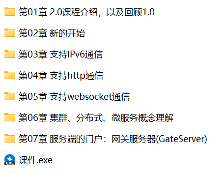

# 1 项目

最近一刷了随想录，随之进行了leetcode的Top200刷题。但往前看时，又一片迷茫。前路不清晰，遂花点时间好好规划一下近期的安排。

目前能想到需要纳入计划的点

1）一是新项目的学习。
    知识星球可供选择挺多的，操作系统，分布式，协程库等等。
    webserver、操作内核项目相对来说偏基础， 协程库 和 分布式存储 进阶一些。

    https://programmercarl.com/other/project_os.html#%E6%96%87%E6%A1%A3%E4%B8%8B%E8%BD%BD%E6%96%B9%E5%BC%8F

2）百度网盘上的

3）是工作上的项目，ATF自动化测试系统和XTS。
    3.1）ATF自动化测试系统，
    3.2）XTS，结合设计文档等来看，做思维导图

4）用于参考的学习方向

## 1.1 知识星球项目
    合集的星球链接：
    https://wx.zsxq.com/group/88511825151142
    
    webserver、操作内核项目相对来说偏基础， 协程库 和 分布式存储 进阶一些。

### 1.1.1 操作系统内核（240221）⭐⭐⭐
    https://wx.zsxq.com/group/88511825151142/topic/211154488488141

    含有操作系统接口、操作系统架构、页表、陷阱指令、中断和设备驱动、锁、调度、文件系统等章节。
    6.S081 Fall2020是麻省理工2020年秋季的操作系统课程，内容还是比较丰富的，但是并没有完整的代码仓库和代码讲解。
    但有相关lab的讲解和代码，还有B站上的原课程视频，有中文字幕。

    课程文字讲解页面
    https://xv6.dgs.zone/labs/answers/lab5.html
    B站视频讲解页面
    https://www.bilibili.com/video/BV19k4y1C7kA/?from=search&seid=5542820295808098475&vd_source=b7f051372dd04225017fd29781c556ba

    总的来说应该有些难度。推荐指数⭐⭐⭐

### 1.1.2 分布式存储项目（240111）⭐⭐⭐
    星球项目位置链接：
    https://wx.zsxq.com/group/88511825151142/topic/811424454184222

    由于作者后续多次更新，建议查看作者思无邪的星球空间：
    https://wx.zsxq.com/footprint/818584548188282?group_id=88511825151142

    录友SuycxZMZ的day76进行了优化，原作者24年3月份停更了。。
    https://wx.zsxq.com/footprint/218855484218111?group_id=88511825151142
    星球里的文档和6.824文档，先跑起来再看源码，raft整个流程看一下，b站上有那种两个小时左右的视频，不要上来就看源码。可以先抄一遍代码，吃透之后自己再改，抄和看不一样，只看是看不出门道的

    在当今大规模分布式系统的背景下，需要可靠、高可用性的分布式数据存储系统。
    传统的集中式数据库在面对大规模数据和高并发访问时可能面临单点故障和性能瓶颈的问题。
    为了解决这些问题，本项目致力于构建一种基于Raft一致性算法的分布式键值存储数据库，以确保数据的一致性、可用性和分区容错性。
    分布式式的共识算法（这里是Raft共识算法）实现本身是一个比较严谨的过程，因为其本身的存在是为了多个服务器之间通过共识算法达成一致性的状态，从而避免单个节点不可用而导致整个集群不可用，因此在学习过程中必须要考虑不同情况下节点宕机、断网情况下的影响。

    mit6.824课程，如果你已经学习过该课程，那么已经不需要本项目了，本项目的难度和内容小于该课程。

    RPC(Remote Procedure Call)：远程过程调用，它是一种通过网络从远程计算机程序上请求服务，而不需要了解底层网络技术的思想。
    《RPC简介》
    https://cloud.tencent.com/developer/article/2017599

    此项目有比较完整的代码库，录友的讲解分为了好几个帖子，需要自行翻看理解。
    有录友的改善代码库可以参考。
    没有相应的视频解析。
    综合推荐指数⭐⭐⭐

### 1.1.3 数据库-CMU15445（241009）⭐⭐
    星球项目位置链接：
    https://wx.zsxq.com/group/88511825151142/topic/8858284824281212
    语雀项目位置链接：ruq9，每个月会更新密码。。
    https://www.yuque.com/chengxuyuancarl/yeunll/anus77c0znzzg8p4#zhk9M

    技术栈：C++17、stl、git、cmake、gdb

    星球友友Lee：
    前几天刚做完23fall（p4，写到80分），给一些我的经验吧。
    1. github上的代码不要克隆，因为代码不断在更新。直接到release里面去下载；或者git拉取特定版本。
    2. 项目与课程不是强相关，可以不听课直接做项目。时间多的话可以听课，那个moody的课我不推荐，推荐去听cmu的课，会讲很多流行的数据库是怎么设计的。如果你没有时间的话，可以直接看ppt，或者知乎上去看别人整理的课程内容（推荐刘学一）
    3. 去看测试用例能加快完成速度，虽然有点投机取巧。
    4. 到了p3,你需要去读源码，不要着急上手写。最起码得搞清楚busTub中是如何表示一个表的。
    5. 23fall的mvcc我觉得也挺值得做的，非常有新意。缺点就是博客少。
    6. 我写这个之前，我只有刷题（随想录二刷完成）的经验，没做过项目。独立完成了80%吧。窗口函数和有些难点看了别人代码的情况下；折算一天花费八小时的话，我花了20多天做这个项目。
    7. 花了很多时间，也收获了不少。最明显的就是leetcode的debug能力大大提高，看代码的能力提升了不少。
    8. 总结：时间充足的话值得刷，对于debug和rtfsc(read the friendly source code)的能力有很大提高。如果你是对数据库的设计比较感兴趣的话，andy的课的价值是要大于这个项目的。

    lab1：缓存池  
    lab2：B+数索引  
    lab3：查询计划  
    lab4：并发控制（MVCC + Serializable）  

    项目B站有视频，但录友不推荐。未提供代码库，虽然github上是有的。而且是数据库方向的。应该后面学习SQL的时候，再做这个？
    综合推荐指数⭐⭐

### 1.1.4 协程库实现（231229）⭐⭐⭐⭐

知识星球位置：  
https://wx.zsxq.com/group/88511825151142/topic/211425484228181  

github链接：  
https://github.com/youngyangyang04/coroutine-lib  

项目概述：  
本项目是对sylar服务器框架的改编和简化，专注于协程库的部分。通过引入协程、调度器和定时器等核心模块，利用HOOK技术将Linux系统中的传统同步函数（如 sleep、read、write 等）转化为异步版本。此改造允许保持同步I/O的编程方式，同时享受异步执行的效率和响应速度提升。    

关键技术点：  
线程同步与互斥    
线程池管理  
epoll的事件驱动模型  
Linux网络编程  
泛型编程  
同步与异步I/O  
HOOK技术  

题主小白：
可以直接做本项目，但个人建议先做Webserver，就算不自己从头做一遍，至少也看一遍，弄明白原理和基本的网络编程知识，这样上手这个项目会快一些，理解也会更深入一些

和webserver项目可以联动，感觉可以做。
综合推荐指数⭐⭐⭐⭐

### 1.1.5 linux服务器项目-muduo

知识星球链接：  
https://wx.zsxq.com/group/88511825151142/topic/5122818848211424  

为什么要做muduo?

- 通过学习muduo网络库源码，一定程度上提升了linux网络编程能力;
- 熟悉了网络编程及其下的线程池，缓冲区等设计，学习了多线程编程;
- 通过深入了解muduo网络库源码，对经典的五种IO模型及Reactor模型有了更深的认识
- 掌握基于事件驱动和事件回调的epoll+线程池面向对象编程。

所需要的基础知识

- 熟悉最基本的TCP网络通信编程流程和API，比如socket、bind、listen、accept、recv、send
- 了解epoll相关函数的用法，比如epoll_create,epoll_wait
- 了解Reactor事件处理模式
- 了解C++11常见新特性，如智能指针，function和bind等

录友提问：  
muduo项目和Webserver项目的区别是什么？？？  

回答：
Muduo本身并不是一个应用程序，而是一个网络库，专注于高效的事件处理、线程池管理、定时器、异步I/O等。   
WebServer项目的目的是提供一个可以实际运行的HTTP服务器，用户可以通过浏览器或其他客户端访问它。  

和webserver二选一，配合线程池的项目。但似乎还有视频版本的。
综合推荐指数⭐⭐⭐⭐

## 1.2 网络项目资源

### 1.2.1 《C++ 百万并发网络通信引擎架构与实现》⭐⭐⭐  原价2398元  2018年

多游课堂的链接：    
https://study.163.com/course/introduction.htm?courseId=1004990020&_trace_c_p_k2_=932eec40e85d4c929d00351e1878727c  

课程简介：  

包含课程各章节的网站，第一季没有给目录分级，大杂烩。。  
https://www.92ydl.com/309.html   

### 1.2.2 《C++百万并发网络通信引擎架构与实现(服务端+客户端+跨平台)第2季》⭐⭐⭐⭐⭐

下面是这个项目一个介绍的比较好的链接，内容已经贴出：  
https://aistudy.baidu.com/okam/pages/article/index?articleId=100035662&ucid=n1D4rHDvrjm&categoryLv1=%E6%95%99%E8%82%B2%E5%9F%B9%E8%AE%AD&ch=54&srcid=10007&contentFrom=3

在现代网络通信应用中，实现**高并发、高可用、高性能的网络通信引擎**是至关重要的。C++作为一种高效、稳定的编程语言，被广泛应用于此类应用中。本文将详细阐述C++百万并发网络通信引擎的架构与实现。

首先，我们需要了解网络通信引擎的基本架构。它通常由以下几个关键部分组成：**网络模型、数据处理模块、并发处理模块、内存管理模块以及接口模块**。这些部分相互协作，共同支撑着整个通信引擎的运行。在并发处理方面，我们需要解决如何高效地处理**大量并发连接的问题**。在C++中，我们可以**利用多线程、异步IO等技术实现高并发**。通过使用线程池和事件驱动机制，可以更好地管理连接并提高处理效率。此外，我们还可以利用C++的协程特性，结合异步IO操作，实现更高效、更轻在量数级据的处并理发方处面理。我们需要解析网络协议，并对数据进行高效的处理。C++中的STL库和Boost库为我们提供了强大的数据处理能力。

我们可以利用这些库中的数据结构和算法，高效地处理各种网络协议和数据格式。内存管理方面，C++具有**自动内存管理和垃圾回收机制**，可以减少内存泄漏和程序崩溃的风险。同时，我们还可以使用**智能指针**等技术，避免手动内存管接理口带模来块的是错通误信。引擎与外部应用程序的桥梁。它提供了简单易用的API接口，让开发人员能够轻松地使用通信引擎。在C++中，我们可以利用RAII原则，封装接口代码，确保资源的正确释放和异常处理。

总之，C++百万并发网络通信引擎的架构与实现需要多方面的技术知识通和过丰合富理的的经设验计。和实现，我们可以实现高性能、高可用、高并发的网络通信引擎，为现代网络通信应用提供强有力的支持。

包含课程各章节的网站：  
https://www.92ydl.com/1335.html  

### 1.2.3 《C++从0实现百万并发Reactor服务器》  ⭐⭐⭐⭐⭐  

  

另外B站有出类似的课程视频，298元：    
https://www.bilibili.com/video/BV11Z4y157RY/?vd_source=b7f051372dd04225017fd29781c556ba  

包含课程各章节的网站：还有简介：  
https://www.shanxueit.com/4743/    
是否具备高并发、高性能、分布式、事件驱动框架设计能力，是优秀C中高级工程师的分水岭。本课程通过带大家纯手写一个Reactor服务器（ Reactor是大名鼎鼎的redis、nginx、rpc等框架核心模型），让你高效掌握三高框架设计思维，同时让你对C网络编程、线程、智能指针、C++11标准高阶技术等运用自如，最终倍增编程内功，突破进阶高级工程师技术瓶颈，提升职业核心竞争力。  

慕课网 299元  
https://coding.imooc.com/class/808.html  

### 1.2.4 《【零声】Linux C/C++高级全栈开发（后端/游戏/嵌入式/高性能网络/存储/基础架构）》⭐⭐⭐⭐⭐  原价8580元  

  

目录对学习路线很有指导意义，学完前面两个项目后，可以转到这里，把上下游各个组件的架构补充完整！！！  

原课程链接，但没有文字版目录，可以让ChatGPT帮忙生成：  
https://it.0voice.com/p/t_pc/goods_pc_detail/goods_detail/course_2f8FSqHXhhvUjYI4q8obTuOoX12  

涵盖手写代码实现：sdpk文件系统，dpdk用户态协议栈,异步网络库zvnet，协程，io_ uring，Nginx，bpf，线程池，内存池，连接池，原子操作, ringbuffer，定时器，死锁检测，分布式锁，日志，probuf，kafka，grpc，udp可靠传输。

### 1.2.5  《C/C++从入门到精通（高级程序员之路2期）》 奇牛学院  ⭐⭐⭐⭐⭐    

有用点在于介绍了C++的应用范围。
**网络通信**：C++用于实现网络功能和协议，包括服务器和高性能网络应用程序。  
**汽车、家用电器、医疗设备等的嵌入式软件**：C++在这些领域的应用也十分广泛。

其他摘要
**学习常用库和框架**：  
掌握一些常用的 C/C++ 库和框架，比如STL（C++标准模板库）、Boost（C++扩展库）、Qt（C++跨平台应用框架）等。
**学习调试和性能优化**：  
掌握调试技巧，能够有效地排除代码中的错误。了解性能优化的基本原理，以提高程序效率。

【超级会员V3】通过**百度网盘分享**的文件：奇牛学院  
链接:https://pan.baidu.com/s/1DCNJjISASQINZwtU2zvxtg   
提取码:7df6  
复制这段内容打开「百度网盘APP 即可获取」  

网站介绍链接1，有文字版本的各级目录！！！
https://vipc9.com/3917.html  

网站介绍链接2，也是文字版本，但观感更好:
https://caodada.com/510.html

网站介绍链接2，图片版本：
https://www.92ydl.com/1996.html

### 1.2.6  《C++企业级项目实战》

每个专题的内容显得比较单薄，暂时没必要看。  
设计模式，可以参考下面的常用几个，学习其他项目文件的资料，也不必看这里的。  

网盘地址：
https://pan.baidu.com/s/16FdfGgFNm6eEBADxloQcIw?pwd=9ra5#list/path=%2F&parentPath=%2Fsharelink1701261433-1097012601137100

### 1.2.7  《【零声】dpdk高性能专家之路推荐 高级》原价5480元网络存储虚拟化开发

数据面开发工具包 (DPDK) 是一个用于**快速数据包处理的用户态库**，能够绕过传统的Linux内核网络栈，提升数据包处理的效率。DPDK最初由Intel开发，现由Linux基金会管理，被广泛**应用于电信、云计算和5G网络等需要高性能网络的数据中心**。  

原项目网页：  
https://it.0voice.com/p/t_pc/goods_pc_detail/goods_detail/course_2UBsdzwC5myy9GfWcZ3lDW5gsGv

### 1.2.8 《【零声】C/C++/MySQL/Redis/操作系统/八股文/Leetcode/剑指Offer面试攻略》⭐⭐⭐⭐  原价3580元

项目做完后，可以参考下，先找资源下载。  
原网站地址：  
https://it.0voice.com/p/t_pc/goods_pc_detail/goods_detail/course_2UBwox1gzxk6PSTapVX3SdqOvDl  

### 1.2.9  《【易道云】C语言/C++零基础到大神全栈(后台开发/QT/Linux/实战项目/游戏)》 ⭐⭐ 7580元 2021年

网盘链接
https://www.aliyundrive.com/s/gER35LPiKLV

有将x86汇编。
但整体和其他教程类似，没必要看。

### 1.2.10  《【博览】C++性能优化高端培训专家授课》 2023 口碑 ⭐⭐⭐ 3200元

**以后有时间再看。**

官方链接  
https://boolan.com/workshop/10022

课程大纲
**概念篇**
计算机体系架构和性能
内存管理和对象的生命周期
测试篇

性能测试基础
性能测试方法
性能分析和性能优化

**C++篇**
函数、虚函数和函数对象
string
栈上对象、堆上对象和移动语义
标准容器
array
视图
智能指针
结构体的性能问题
编译期编程
并发
返回值优化和异常

**优化篇**
工程和构建
反汇编
循环优化
算术表达式优化
输入输出优化
多线程优化
内存优化
算法优化
模板技巧
不写无必要的优化
开源软件
其他性能调优手段

**课程收获**
性能相关的核心概念
C++ 程序的性能测试
C++ 跟性能相关的特性
C++ 程序的性能调优，包括内存优化，算法优化等等
实践 C++开发惯用模式
复刻一线实践专家经验

### 1.2.11  《侯捷老师C++全系列八部曲》⭐⭐⭐⭐

已经下载，后续学完项目后再学习。

### 1.2.12  

### 1.2.13  

#### 1.2.6 项目一览

1. 《C++ 百万并发网络通信引擎架构与实现》⭐⭐⭐  原价2398元  2018年
2. 《C++百万并发网络通信引擎架构与实现(服务端+客户端+跨平台)第2季》⭐⭐⭐⭐⭐
3. 《C++从0实现百万并发Reactor服务器》 ⭐⭐⭐⭐⭐
4. 《【零声】Linux C/C++高级全栈开发（后端/游戏/嵌入式/高性能网络/存储/基础架构）》⭐⭐⭐⭐⭐  原价8580元  
5. 《【奇牛学院】C/C++从入门到精通（高级程序员之路2期）》   ⭐⭐⭐⭐⭐ 7780元
6. 《【零声】C++企业级项目实战》 ⭐⭐  原价3358元
7. 《【零声】dpdk高性能专家之路推荐 高级》原价5480元网络存储虚拟化开发 ⭐⭐
8. 《【零声】C/C++/MySQL/Redis/操作系统/八股文/Leetcode/剑指Offer面试攻略》⭐⭐⭐⭐  原价3580元
9.  《【易道云】C语言/C++零基础到大神全栈(后台开发/QT/Linux/实战项目/游戏)》 ⭐⭐ 7580元 2021年
10. 《【博览】C++性能优化高端培训专家授课》 2023 口碑 ⭐⭐⭐ 3200元
11. 《侯捷老师C++全系列八部曲》⭐⭐⭐⭐
12. 《【施磊】git企业级项目开发工作流实战讲解-开发面试必备技能》⭐⭐
13. 《【施磊】百份面经构建C++开发工程师核心技术栈知识图谱》⭐⭐⭐⭐
14. 《【施磊】【高级】手写C++ Muduo网络库项目-掌握高性能网络库实现原理》⭐⭐⭐⭐
15. 《【施磊】C++socket网络编程大全实战http服务器(支持php)视频课程》⭐⭐⭐⭐
16. 《【施磊】【高级】C++项目-实现分布式网络通信框架-rpc通信原理》⭐⭐⭐
17. 《【施磊】【高级】手写线程池项目-经典死锁问题分析-简历项目输出指导》⭐⭐⭐
18. 《【施磊】【高级】C++项目-集群聊天服务器-软件分层设计和高性能服务开发》 ⭐⭐⭐
19. 《【施磊】【高级】MySQL核心讲解-深入索引、事务和锁，主从复制读写分离》 ⭐⭐⭐⭐
20. 《【施磊】【中级】C++项目-手写移植Nginx和SGI STL内存池源码》⭐⭐⭐
21. 《【施磊】【中级】手写数据库连接池-C++11代码实战经典-多线程和智能指针》⭐⭐⭐
22. 《【施磊】【中级】C++开发工程师高级进阶课程-提升C++面试和开发能力》⭐⭐⭐⭐
23. 《【施磊】Linux校招专题之-32位内核虚拟地址映射和内核源码解读》⭐⭐⭐
24. 《【施磊】NIO与高性能框架Netty从入门到源码剖析》⭐⭐⭐
25. 《【施磊】C++全套数据结构算法-进阶高级开发必备-大厂面试必备》⭐⭐⭐⭐

通过百度网盘分享的文件：施磊C++  【施磊】
链接：https://pan.baidu.com/s/1TUMhd4NvFea62SrV4SsoFw   
提取码：B833   
复制这段内容打开「百度网盘APP 即可获取」 

1.  《【夏曹俊】C++微服务架构及安全云盘项⽬实训推荐》 爆 项目
2.  《【夏曹俊】C++11 14 17 20 多线程从原理到线程池实战》
3.  《【夏曹俊】C++ 11 14 17 20内存管理-指针、智能指针和内存池基础与提升》
4.  《【夏曹俊】Libevent C＋＋高并发网络编程》 ⭐⭐⭐  298元  2019年前

网易云课堂的课程介绍地址（有评价夏曹俊上课不行。。）：  
https://study.163.com/course/introduction/1209264812.htm?inLoc=ss_ssjg_tjlb_%E5%B9%B6%E5%8F%91  

  

梵高说我脑子有病：  
说实话，并没有想象中的讲的那么清晰。感觉老师上课之前没有认真备课，课上有教案，但是完全就是照着简短的教案又念了一遍，也不知道念的是什么玩意儿，没头没尾的。说真的，这个老师还真的不适合上课，还是找个厂上班去吧。唉，真的浪费钱。不打一颗心是为了防止有人说我刷恶意评价，所以打了两颗心。平心而论，真想打一颗心
追评：夏曹俊啊，我求求你了，找个电子厂上班吧，别再浪费别人的时间和金钱了。青春真的很宝贵  

1.  《【夏曹俊】C++ 设计模式理论与实战大全》
2.  《【夏曹俊】数据结构实战完全手册视频课程》
3.  《【夏曹俊】C++Mysql8.0数据库跨平台编程实战》
4.  《【夏曹俊】C++QT5跨平台界面编程原理和实战大全视频课程》
5.  《【夏曹俊】零基础学习在Linux上编译调试C++项目视频课程》
6.  《【夏曹俊】C++与Lua联合编程实战》
7.  《【夏曹俊】C++ 模板技术与 STL实战开发》
8.  《【夏曹俊】CMake构建大型c++项目》 热门

github资源汇总页面：
https://github.com/ritianpig/-/blob/main/C%2B%2B%E8%AF%BE%E7%A8%8B%E8%B5%84%E6%BA%90.md

9. 学神Docker（K8S）容器架构师 - 中级+高级
介绍页面：
https://www.456jz.com/thread-30877-1-1.html

44_第十九章Jenkins+Gitlab+Harbor+K8S自动构建镜像DevOPS平台
45_综合项目:基于k8s搭建世界知名的wordpress博客

30. 《图灵java高薪扩展训练VIP系列179G》
介绍地址，目录
https://www.456jz.com/thread-30887-1-1.html

感觉很全面。

31. 前端全栈神技：网页秒变全平台app的Electron入门
https://www.456jz.com/thread-7456-1-2.html

32. 吾爱破解网站
    
https://www.52pojie.cn/

33. 11

阿秀的学习笔记：
https://github.com/forthespada/InterviewGuide/tree/main

## 5 跟踪最新需求
    boss上的看看，需要什么，补什么？

## 6 新帖子，别人的经验之谈
    在这里贴上链接
6.1）《奇N学院-C/C++从入门到就业二期》⭐⭐⭐⭐  原价8280元
https://vipc9.com/3917.html  价格链接
https://baijiahao.baidu.com/s?id=1789165048800962585&wfr=spider&for=pc
有用点在于介绍了C++的应用范围。
网络通信：C++用于实现网络功能和协议，包括服务器和高性能网络应用程序。
汽车、家用电器、医疗设备等的嵌入式软件：C++在这些领域的应用也十分广泛。

其他摘要
学习常用库和框架：  
掌握一些常用的 C/C++ 库和框架，比如STL（C++标准模板库）、Boost（C++扩展库）、Qt（C++跨平台应用框架）等。
学习调试和性能优化：  
掌握调试技巧，能够有效地排除代码中的错误。了解性能优化的基本原理，以提高程序效率。

6.2） 《这才是你需要的C语言、C++学习路线！》

基础四大件包括：**数据结构和算法**、**计算机网络**、**操作系统**、**设计模式**  
https://mp.weixin.qq.com/s/tXilzUzN7cDhnc3ztw4Vlw  

常见的几个如：**单例模式**、**工厂模式**、**代理模式**、**策略模式**、**模板方法模式**建议熟练于心。  

6.3） 《C++输麻了，C++后端开发还能学吗》

比较详细的介绍了C++求职的现状，对C++学习所需的跟模块内容也有很好的总结。
https://www.nowcoder.com/discuss/557342911868739584

6.4）
    配合下面的网站，有各类题目的讲解
    《labuladong 的算法笔记》
    https://labuladong.online/algo/home/#%E5%85%B3%E4%BA%8E%E6%9C%AC%E7%AB%99

## 97 今日简记（实际）

3.1 - 3.31
开始投简历

2.1 - 2.28  一周一个项目？还要加工作项目总结？
课外4个施磊项目（先做两个，看情况，把工作的部分，简历上写好，准备好，可能会提前收回工作代码权限！！！）
工作项目（自动化测试系统 + 整单项目 + 测试问题 + 发单工具）

1.10-1.31  剩21天。
简历更新
数据结构与算法（施磊）9天  到19号
随想录回顾 10  到29号
Top200  1天  30号
设计模式回顾+（有时间就看夏曹俊的课程，但只看主要的几个模式部分） 1天  31号

单例模式、工厂模式、代理模式、策略模式、模板方法模式，原型模式，中介者模式，责任链模式建议熟练于心

投资的学习路径整理，ChatGPT上的问答。
同时整理之前写下的一些内容。

C++的思维导图，把框架整理出来
先让ChatGPT再修改下？

看视频，把一些有用的图截下来，放到思维导图中。看到视屏截图会好回忆点！！！

0）确定下回顾的时间，以及怎么回顾，
    可以早上或者睡前、地铁上回顾。
不回顾的话，做思维导图也是浪费时间，短期内会忘记。。
 
1）将此前看的施磊数据结构视频笔记做好。
2）把每个函数代码放在思维导图的对应的上面，用注释！！！
3）将思维导图放在百度同步文件夹下
    方便在各个终端通过百度APP查看、回顾！
4）看完一个视频或者一部分之后，立即做笔记，完成思维导图，不然后续可能不知道要记录什么
    再花时间想，会浪费很多时间！

    
## 98 今日简记（计划）

定个面试时间
先面一下

做resu
刷题leetcode

任务项  
1）晚上把ChatGPT上的问答进行记录。  
2）确定近期的计划，时间节点  
3）   
4）BOSS等软件上多浏览，有助于方向的把握  
5）看书计划，《Effective C++》、《 More Effective C++》等等  
6）刷题的回顾！！！定期复习Top200，以及推进进度！！！
7）修改resu！逛逛BOSS和其他平台看看
8）把八股放手机里面吧？每天没事看看？  
9） 
10）
11）
12）

微信存储在C盘，需要更改
C:\Users\leonb\Documents\WeChat Files\wxid_x8prdhwbslh221\FileStorage

侯捷的视频下载
C++全面学习的规划
    设计下路线
    boost
    stl、源码剖析
    C++11/14/17/20
    泛型编程、模板元编程

## 100 面面规划

1）可以按照不同公司进行题目分类
https://codetop.cc/home

《【施磊】C++全套数据结构算法-进阶高级开发必备-大厂面试必备》⭐⭐⭐⭐                                   耗时1个月（数据结构与算法）  12月份完成
《设计模式》                                                                                          耗时0.5个月（设计模式）
《C++ 百万并发网络通信引擎架构与实现》                                                                  耗时1个月（项目1）
《C++百万并发网络通信引擎架构与实现(服务端+客户端+跨平台)第2季》                                          耗时1个月（项目2）
《【零声】Linux C/C++高级全栈开发（后端/游戏/嵌入式/高性能网络/存储/基础架构）》⭐⭐⭐⭐⭐  原价8580元   耗时1个月（整体架构和项目！！）
《【奇牛学院】C/C++从入门到精通（高级程序员之路2期）》   ⭐⭐⭐⭐⭐ 7780元                             耗时1个月（数据库+面试部分）
《工作的项目：ATF自动化测试系统 + XTS系统》                                                             耗时1个月（工作项目3、4）

以上6.5个月！！！

《C++基础与进阶---侯捷视频》                                                                           耗时1个月（C++基础与进阶）

计划1！！！
===========================================================================
12月份
1)数据结构与算法完成  剩4天
2)设计模式           剩10天
3)leetcode          剩3天
4)top200            剩2天
5)每天保持训练
===========================================================================
1、2月份
零声全部项目
===========================================================================
3月份修改简历并投递。
===========================================================================

多余时间（空闲、放假、睡前等等），不要想着学习新的东西，因为学了但不做笔记（这种时候也不会想着做笔记。。）很快就遗忘了，学了基本浪费时间。
所以有时间学习，不如用来回顾之前学过的东西，或者好好休息。。

计划2
==================================================
12月份设计模式和数据结构与算法完成。之后每天保持训练
1月份完成两季的百万并发项目
2月份完成零声全部项目
3月份修改简历并投递。
==================================================
12月份
1）施磊的数据结构与算法（2周）
共54个文件夹，1周看完的话，一天要看8个文件夹。

2）夏曹俊的设计模式（2周）

3）随想录+Top200复习与后续（跟随第1项完成，后续每日完成1题+复习）
==================================================

## 101 工具网盘链接
1，mindmaster：  
https://pan.quark.cn/s/f3b49cee2961#/list/share

## 102  资源网站链接

1）很多教程，云原生、python爬虫等等
https://linux.do/t/topic/171563/1
今天突然看到帖子点赞破百啦 哈哈哈哈 分享点资源站的教程资源

## 501  杂项
题单分类    

- [x]  shi

- [x]  shi
- [ ]  而

✅❌❌✅✅

你可以在 VSCode 中使用一些常见的 Unicode 字符来替代图片图标，以下是一些常用的符号：

- **完成/正确**: ✅ (U+2705)
- **未完成/错误**: ❌ (U+274C)
- **星星**: ⭐ (U+2B50)
- **时钟**: ⏰ (U+23F0)
- **勾**: ✔️ (U+2714)
- **叉**: ✖️ (U+2716)
- **心**: ❤️ (U+2764)
- **勺子**: 🍴 (U+1F374)
- **书本**: 📚 (U+1F4DA)

## 502 副业思考
1）副业做什么？
>做视频？
>学习爬虫
>学习人工智能AI，制作恋爱或者经营类的游戏？
>TG上的机器人结合AI，左信息的分类，资源整合
>开一个网盘店，收集资源！！！
>学习全栈后接私活，比如先学习骑牛的各方向的开发，还有面试教学、外包方面教学
>投资，炒股。。
>小点子： 
制作一个网站，能力雷达，记录各项能力的分数！
>开发一个数据整合的APP，日活多少算高？
APP排行榜，快速上升榜单，跟踪可能得热点，推荐股票
房子成交情况
租房价格，区域分布

## 503 股票学习

2，用同花顺的AI选股
    找那种100-300亿市值，日成交额10亿以上；
    根据王安石的表格，每个板块找几只；但要有所侧重，不是每个板块都费心思。。
    查查机构持股、散户等持股比例；最好能分析出这些比例和涨跌关系。

3，如何看融资余额？？？
    做空力量还是做多力量？

4，分析往年的妖股涨跌情况。

5，问下ChatGPT，如何给学习股票制定笔记结构。

    想系统性的学习炒股，应该学习哪些东西？

6，黄线：非权重  中证1000、2000
    白线： 权重

    平均股价指数

7，了解下怎么区分个票中的基金影响

    主动型基金
    被动型基金

8， 期货、现货、基金和股票，关于黄金的投资
    期货、现货不考虑，风险大。
    股票相关的似乎只有两三家
点子，
制作的个人笔记网页，每级目录都用颜色标注，不同颜色代表多长时间没看，以便提示复习时间。提供了接近的艾宾浩斯记忆曲线的学习规划。
问题点：
    各级子目录的颜色不同，那上层目录以最近还是最远的为标准？

50，操作方法

1）早上成交榜的高位股退潮后（核心票），自己的其他的票可以考虑走。

2）从来不抄底，为什么？
    找买点？
        找市场的恐慌极限。
            打开跌幅榜，跌幅数是多少
            妖股打开跌停了没？
            跌幅榜前几的是哪类票，最好能在早盘兑现。情绪集体退潮了。（卖点）
            早盘的核心票表现不佳的时候，考虑兑现。
            跌了9%以上的有60多支，在恐慌，不适合抄底。
            恐慌发泄的第一天不要抄底。

3）什么是底背离？
    第一类买点？
    第二类买点？

4）大盘好的时候再买股票，有量能，在上升趋势区间，个票的长势可能也随着大盘上涨

    对一只股票，仓位要控制，跌到一定程度再加点仓位，周期视情况，一周或两周逢低买入，没机会不买也罢。。
    模拟盘先试试吧。

5)把同花顺的分组搞一下，后续可以排序一键看到涨幅从大到小的排序了。

6）如何埋伏跨年妖股？

    提前布局多支股票。

    当前热点板块中
    热点题材
    市值百亿及以下
    前两年圣龙和九安

7)
    分析一段时间内消息面和大盘的行情
    可以找些相关博主的每日消息面分析（主要是影响当日行情的复盘）
        由此可知影响各个行业板块的消息面情况
        再根据当日的板块行情和消息面的间隔时间进行板块ETF的选取

        基本原则是要消息面多的，且整体向上趋势或者横盘的
        在下跌和消息面的利好时间沉寂了平均的时长之后，进行定投策略！

    今日期指空单，短期合约都减仓，长期合约都加仓！什么意思？这说明周一可能还要冲一冲，但是还当做反弹！
    

8)关注APP的下载排行榜，可以得知最新的可能上涨动态

比如中文在线的短句
字节的豆包APP

用ChatGP来实现一个实时跟踪的方法
    或者找到一个能跟着的APP，或者网站，网上搜索下。
    软件排名高没有，还要日活高才有用，或者付费排行榜有用？先调查以前的吧。

开发一个数据整合的APP

9）找个人开头丁利的证券账户，选股还是得看消息面才行。但要存1万进去。。
问思思？

10）一些思路

1、中证1000的空仓变多，且前期小盘股大涨情况下，说明小盘股可能迎来大跌，为了稳指数，gjd会拉权重？

2，模拟盘和实盘同时进行，方便对比操作？？？

3）换职中间，可以去外面搞一下银行账户
所以事先要了解清楚，哪里办好，后面要做些什么交易。

4）如何看隔夜封单，有什么用处？

5）让卢帮忙开个国金证券账户。

6）找大厂，员工多的，招人最近多的
科技类的
或者在自己行业龙头？
当前热点题材？