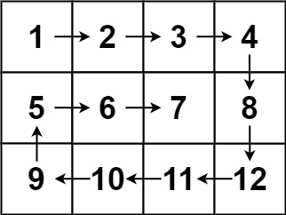

### 01、螺旋矩阵（20240924，54题，中等。25min）
<div style="border: 1px solid black; padding: 10px; background-color: SteelBlue;">

给你一个 m 行 n 列的矩阵 matrix ，请按照 顺时针螺旋顺序 ，返回矩阵中的所有元素。

 

示例 1：


- 输入：matrix = [[1,2,3],[4,5,6],[7,8,9]]
- 输出：[1,2,3,6,9,8,7,4,5]

示例 2：



- 输入：matrix = [[1,2,3,4],[5,6,7,8],[9,10,11,12]]
- 输出：[1,2,3,4,8,12,11,10,9,5,6,7]
 

提示：

- m == matrix.length
- n == matrix[i].length
- 1 <= m, n <= 10
- -100 <= matrix[i][j] <= 100

  </p>
</div>

<hr style="border-top: 5px solid #DC143C;">
<table>
  <tr>
    <td bgcolor="Yellow" style="padding: 5px; border: 0px solid black;">
      <span style="font-weight: bold; font-size: 20px;color: black;">
      自己答案（25min）
      </span>
    </td>
  </tr>
</table>
<div style="padding: 0px; border: 1.5px solid LightSalmon; margin-bottom: 10px;">

```C++ {.line-numbers}
/*
25min
思路：
使用vector<pair<int, int>> dir = {{0,1}, {1,0},{0,-1},{-1,0}}
    表示向右、下、左、上四个方向
每当遇到边界或者使用走过的格子，都要进行转向
    所以要用一个vector<vector<int>> used记录走过的格子
*/
class Solution {
public:
    vector<int> spiralOrder(vector<vector<int>>& matrix) {
        size_t rows = matrix.size();
        size_t columns = matrix[0].size(); 
        vector<vector<int>> used(rows, vector<int>(columns, 0));

        vector<pair<int, int>> dir = {{0,1}, {1,0},{0,-1},{-1,0}};
        int dir_count = 0;

        int counts = rows * columns-1;
        vector<int> result;
        int row = 0;
        int column = 0;
        result.push_back(matrix[row][column]);
        used[row][column] = 1;

        while(counts > 0){
            int new_row = row + dir[dir_count%4].first;
            int new_column = column + dir[dir_count%4].second;

            if(new_row < 0 || new_row >= rows || new_column < 0 || new_column >= columns || used[new_row][new_column] == 1){
                ++dir_count;  // 转向
                new_row = row + dir[dir_count%4].first;  // 并重新赋值x，y
                new_column = column + dir[dir_count%4].second;
            }
            used[new_row][new_column] = 1;
            result.push_back(matrix[new_row][new_column]);

            row = new_row;
            column = new_column;
            counts--;
        }
        return result;
    }
};
```

</div>


<table>
  <tr>
    <td bgcolor="Yellow" style="padding: 5px; border: 0px solid black;">
      <span style="font-weight: bold; font-size: 20px;color: black;">
      自己答案（通过！）
      </span>
    </td>
  </tr>
</table>

<div style="padding: 0px; border: 1.5px solid LightSalmon; margin-bottom: 10px">

```C++ {.line-numbers}


```
</div>

<hr style="border-top: 5px solid #DC143C;">

<table>
  <tr>
    <td bgcolor="Yellow" style="padding: 5px; border: 0px solid black;">
      <span style="font-weight: bold; font-size: 20px;color: black;">
      自己调试版本（通过！！！）
      </span>
    </td>
  </tr>
</table>

<div style="padding: 0px; border: 1.5px solid LightSalmon; margin-bottom: 10px">

```C++ {.line-numbers}


```
</div>

<table>
  <tr>
    <td bgcolor="Yellow" style="padding: 5px; border: 0px solid black;">
      <span style="font-weight: bold; font-size: 20px;color: black;">
      仿照答案版本v2（去注释）
      </span>
    </td>
  </tr>
</table>

<div style="padding: 0px; border: 1.5px solid LightSalmon; margin-bottom: 10px">

```C++ {.line-numbers}


```
</div>

<hr style="border-top: 5px solid #DC143C;">

<table>
  <tr>
    <td bgcolor="Yellow" style="padding: 5px; border: 0px solid black;">
      <span style="font-weight: bold; font-size: 20px;color: black;">
      仿照答案版本v2
      </span>
    </td>
  </tr>
</table>

<div style="padding: 0px; border: 1.5px solid LightSalmon; margin-bottom: 10px">

```C++ {.line-numbers}


```
</div>

<table>
  <tr>
    <td bgcolor="Yellow" style="padding: 5px; border: 0px solid black;">
      <span style="font-weight: bold; font-size: 20px;color: black;">
      leetcode
      </span>
    </td>
  </tr>
</table>

<div style="padding: 0px; border: 1.5px solid LightSalmon; margin-bottom: 10px">

```C++ {.line-numbers}
class Solution {
private:
    static constexpr int directions[4][2] = {{0, 1}, {1, 0}, {0, -1}, {-1, 0}};
public:
    vector<int> spiralOrder(vector<vector<int>>& matrix) {
        if (matrix.size() == 0 || matrix[0].size() == 0) {
            return {};
        }
        
        int rows = matrix.size(), columns = matrix[0].size();
        vector<vector<bool>> visited(rows, vector<bool>(columns));
        int total = rows * columns;
        vector<int> order(total);

        int row = 0, column = 0;
        int directionIndex = 0;
        for (int i = 0; i < total; i++) {
            order[i] = matrix[row][column];
            visited[row][column] = true;
            int nextRow = row + directions[directionIndex][0], nextColumn = column + directions[directionIndex][1];
            if (nextRow < 0 || nextRow >= rows || nextColumn < 0 || nextColumn >= columns || visited[nextRow][nextColumn]) {
                directionIndex = (directionIndex + 1) % 4;
            }
            row += directions[directionIndex][0];
            column += directions[directionIndex][1];
        }
        return order;
    }
};

复杂度分析
时间复杂度：O(mn)，其中 m 和 n 分别是输入矩阵的行数和列数。矩阵中的每个元素都要被访问一次。
空间复杂度：O(mn)。需要创建一个大小为 m×n 的矩阵 visited 记录每个位置是否被访问过。

作者：力扣官方题解
链接：https://leetcode.cn/problems/spiral-matrix/solutions/275393/luo-xuan-ju-zhen-by-leetcode-solution/
来源：力扣（LeetCode）
著作权归作者所有。商业转载请联系作者获得授权，非商业转载请注明出处。
```
</div>


