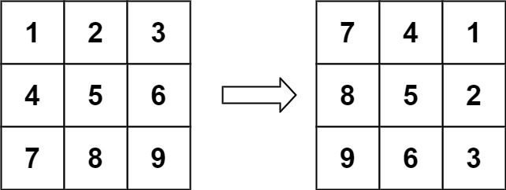
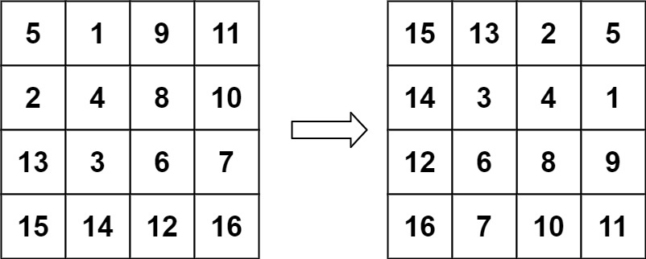

### 02、旋转图像（20241005，48题，中等）
<div style="border: 1px solid black; padding: 10px; background-color: SteelBlue;">

给定一个 n × n 的二维矩阵 matrix 表示一个图像。请你将图像顺时针旋转 90 度。

你必须在 原地 旋转图像，这意味着你需要直接修改输入的二维矩阵。请不要 使用另一个矩阵来旋转图像。

 

示例 1：



输入：matrix = [[1,2,3],[4,5,6],[7,8,9]]
输出：[[7,4,1],[8,5,2],[9,6,3]]

示例 2：



输入：matrix = [[5,1,9,11],[2,4,8,10],[13,3,6,7],[15,14,12,16]]
输出：[[15,13,2,5],[14,3,4,1],[12,6,8,9],[16,7,10,11]]
 

提示：

n == matrix.length == matrix[i].length
1 <= n <= 20
-1000 <= matrix[i][j] <= 1000

  </p>
</div>

<hr style="border-top: 5px solid #DC143C;">
<table>
  <tr>
    <td bgcolor="Yellow" style="padding: 5px; border: 0px solid black;">
      <span style="font-weight: bold; font-size: 20px;color: black;">
      自己答案（去注释，通过！）
      </span>
    </td>
  </tr>
</table>
<div style="padding: 0px; border: 1.5px solid LightSalmon; margin-bottom: 10px;">

```C++ {.line-numbers}


```

</div>

<table>
  <tr>
    <td bgcolor="Yellow" style="padding: 5px; border: 0px solid black;">
      <span style="font-weight: bold; font-size: 20px;color: black;">
      自己答案（通过！）
      </span>
    </td>
  </tr>
</table>

<div style="padding: 0px; border: 1.5px solid LightSalmon; margin-bottom: 10px">

```C++ {.line-numbers}
/*
设计一个函数，对当前的层的数字进行走相应的步数walkForward()
知道其实点位和边长，就知道了什么时候该转向了，也就是知道了x，y的范围
循环走当前边长减1的步数后，当前层就完成了旋转
然后依次处理各层即可

开始思路：
一层层的对矩阵中的元素进行swap
长为奇数，则最后不用交换
常为偶数，则最里层为2x2的矩阵

其实就是各层每个数字都顺时针旋转当前边长的步数减一
问题在于

每个数组都要往前走当前层数的边长的减1的步数，
则我们可以一步步的往前走，因为一下走太多不好在原矩阵上修改
*/
class Solution {
public:
    void walkForward(vector<vector<int>>& matrix, int side, int x, int y, int pre, int row, int column, int depth, int count){
        if(side == 1 || depth == (side-1)*4) return;  // 对于单数边长，最中间层数需要跳过

        // vectro<vector<int>> dir = {{0,1}, {1,0}, {0,-1}, {-1,0}};  // 右，下，左，上顺序。vectr拼写错误
        // int dir[2][2] = {{0,1}, {1,0}, {0,-1}, {-1,0}};  // 右，下，左，上顺序。维度错误，应该是int dir[4][2]
        vector<pair<int, int>> dir = {{0,1}, {1,0}, {0,-1}, {-1,0}};
        // int count = 0;

        int next_x = dir[count%4].first + x;
        int next_y = dir[count%4].second + y;
        // 各层的范围为，x：[row:row+side-1]，y：[column:column+side-1]，超过范围就转向
        if(next_x < row || next_x > row+side-1 || next_y < column || next_y > column+side-1){  // 对于单数边长，最中间层数需要跳过
            ++count;
            next_x = dir[count%4].first + x;
            next_y = dir[count%4].second + y;
        }
        // pre = matrix[next_x][next_y];  // 将下一个格子的数存起来，一边放入下下个格子！！！！
        int tmp = matrix[next_x][next_y];  // 将下一个格子的数存起来，一边放入下下个格子！！！！
        if(pre != INT32_MAX){
            matrix[next_x][next_y] = pre;
        }else{
            matrix[next_x][next_y] = matrix[x][y];
        }
        pre = tmp;  // 将下一个格子的数存起来，一边放入下下个格子！！！！
        walkForward(matrix, side, next_x, next_y, pre, row, column, depth+1, count);
    }
    void rotate(vector<vector<int>>& matrix) {
        int rows = matrix.size();
        int len = rows;

        for(int i = 0; i < rows/2; i++){
            // int circles = (len-1)*4-1;
            int circles = len-1;
            while(circles--){   // 循环走当前边长减1的步数后，当前层就完成了旋转
                walkForward(matrix, len, i, i, INT32_MAX, i, i, 0, 0);
            }
            // walkForward(matrix, len, i, i, INT32_MAX, i, i, 0, 0);
            len -= 2;
        }
        return;
    }
};
```
</div>


<hr style="border-top: 5px solid #DC143C;">

<table>
  <tr>
    <td bgcolor="Yellow" style="padding: 5px; border: 0px solid black;">
      <span style="font-weight: bold; font-size: 20px;color: black;">
      自己调试版本（通过！！！）
      </span>
    </td>
  </tr>
</table>

<div style="padding: 0px; border: 1.5px solid LightSalmon; margin-bottom: 10px">

```C++ {.line-numbers}


```
</div>

<table>
  <tr>
    <td bgcolor="Yellow" style="padding: 5px; border: 0px solid black;">
      <span style="font-weight: bold; font-size: 20px;color: black;">
      仿照答案版本v2（去注释）
      </span>
    </td>
  </tr>
</table>

<div style="padding: 0px; border: 1.5px solid LightSalmon; margin-bottom: 10px">

```C++ {.line-numbers}


```
</div>

<hr style="border-top: 5px solid #DC143C;">

<table>
  <tr>
    <td bgcolor="Yellow" style="padding: 5px; border: 0px solid black;">
      <span style="font-weight: bold; font-size: 20px;color: black;">
      仿照答案版本v2
      </span>
    </td>
  </tr>
</table>

<div style="padding: 0px; border: 1.5px solid LightSalmon; margin-bottom: 10px">

```C++ {.line-numbers}


```
</div>

<table>
  <tr>
    <td bgcolor="Yellow" style="padding: 5px; border: 0px solid black;">
      <span style="font-weight: bold; font-size: 20px;color: black;">
      ChatGPT
      </span>
    </td>
  </tr>
</table>

<div style="padding: 0px; border: 1.5px solid LightSalmon; margin-bottom: 10px">

```C++ {.line-numbers}


```
</div>
