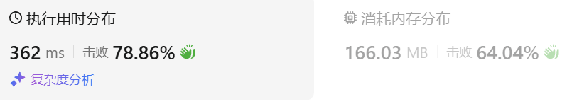

### 01、LRU 缓存（20240919，146题，中等）
<div style="border: 1px solid black; padding: 10px; background-color: SteelBlue;">

请你设计并实现一个满足  LRU (最近最少使用) 缓存 约束的数据结构。
实现 LRUCache 类：
- LRUCache(int capacity) 以 正整数 作为容量 capacity 初始化 LRU 缓存
- int get(int key) 如果关键字 key 存在于缓存中，则返回关键字的值，否则返回 -1 。
- void put(int key, int value) 如果关键字 key 已经存在，则变更其数据值 value ；  
  如果不存在，则向缓存中插入该组 key-value 。  
  如果插入操作导致关键字数量超过 capacity ，则应该 逐出 最久未使用的关键字。
函数 get 和 put 必须以 O(1) 的平均时间复杂度运行。

 

示例：

- 输入  
["LRUCache", "put", "put", "get", "put", "get", "put", "get", "get", "get"]  
[[2], [1, 1], [2, 2], [1], [3, 3], [2], [4, 4], [1], [3], [4]] 

- 输出  
[null, null, null, 1, null, -1, null, -1, 3, 4]  

- 解释
LRUCache lRUCache = new LRUCache(2);  
lRUCache.put(1, 1); // 缓存是 {1=1}  
lRUCache.put(2, 2); // 缓存是 {1=1, 2=2}  
lRUCache.get(1);    // 返回 1  
lRUCache.put(3, 3); // 该操作会使得关键字 2 作废，缓存是 {1=1, 3=3}  
lRUCache.get(2);    // 返回 -1 (未找到)  
lRUCache.put(4, 4); // 该操作会使得关键字 1 作废，缓存是 {4=4, 3=3}  
lRUCache.get(1);    // 返回 -1 (未找到)  
lRUCache.get(3);    // 返回 3  
lRUCache.get(4);    // 返回 4  
 

提示：

- 1 <= capacity <= 3000
- 0 <= key <= 10000
- 0 <= value <= 105
- 最多调用 2 * 105 次 get 和 put

  </p>
</div>

<hr style="border-top: 5px solid #DC143C;">
<table>
  <tr>
    <td bgcolor="Yellow" style="padding: 5px; border: 0px solid black;">
      <span style="font-weight: bold; font-size: 20px;color: black;">
      仿照答案（哈希表 + 自定义双向链表）
      </span>
    </td>
  </tr>
</table>
<div style="padding: 0px; border: 1.5px solid LightSalmon; margin-bottom: 10px;">

```C++ {.line-numbers}
/*
使用链表和unordered_map存储数据
    unordered_map数据主要用于查询链表节点
    list数据主要用于保持从高频到低频使用的顺序（其实是最近使用顺序，而不是频率顺序）
查询数据后，将数据放到开头去
链表是自己实现的双向链表

主要过程：
构建双向链表struct DoubleList，
get节点时，若节点存在，则返回这个节点的值，并将此节点移到链表的头部
    需要一个函数删除这个节点，void RemoveNode(DoubleList* node)
    还需要一个函数将节点插入头部void addToHead(DoubleList* node)
    (答案将这两个函数组合成void moveToHead(DLinkedNode* node)函数)

put节点时，
    节点若存在，找到这个节点，并更新其值；
    节点不存在，且链表的size < capacity，添加新节点到头部
    节点不存在，且链表的size = capacity，添加新节点到头部，并删除链表尾部节点
        void RemoveTailNode()  -->   DLinkedNode* RemoveTailNode()
        由于RemoveNode()函数也可能是将节点调到开头，不一定删除，所以删除就不放在RemoveNode()函数中
        可以让RemoveTailNode()函数删除这个节点，但是由于unordered_map需要删除这个节点的数据，
        所以让RemoveTailNode()函数返回这个待删除的节点，
        获取待删除节点的key，并在unordered_map删除这个节点的数据后，再删除这个链表节点！！！
*/
class LRUCache {
private:
    struct DoubleList{
        int key, value;
        DoubleList* pre;
        DoubleList* next;
        DoubleList() : key(0), value(0), pre(nullptr), next(nullptr) {}
        DoubleList(int i_key, int i_value) : key(i_key), value(i_value), pre(nullptr), next(nullptr) {}
    };
    DoubleList* head;
    DoubleList* tail;
    int m_capacity;
    int m_size;
    unordered_map<int, DoubleList*> m_map;
    
public:
    LRUCache(int capacity) : m_capacity(capacity), m_size(0) {
        head = new DoubleList();
        tail = new DoubleList();
        head->next = tail;
        tail->pre = head;
    }

    void RemoveNode(DoubleList* node){
        node->pre->next = node->next;
        node->next->pre = node->pre;
    }

    void addToHead(DoubleList* node){
        node->next = head->next;
        head->next->pre = node;

        head->next = node;
        node->pre = head; 
    }

    void moveToHead(DoubleList* node){
        RemoveNode(node);
        addToHead(node);
    }
    DoubleList* RemoveTailNode(){
        DoubleList* node = tail->pre;
        RemoveNode(node);
        // node->pre->next = tail;
        // tail->pre = node->pre;

        return node;
    }
    int get(int key) {
        auto it = m_map.find(key);
        if(it != m_map.end()){
            // 获取链表中的这个元素
            DoubleList* node = it->second;
            moveToHead(node);
            // 查找链表中的这个元素
            return node->value;
        }else{
            return -1;
        }
    }
    
    void put(int key, int value) {
        auto it = m_map.find(key);
        if(it != m_map.end()){  //找到节点，更新值，并将节点移至头部
            DoubleList* node = it->second;
            node->value = value;
            moveToHead(node);
        }else{  // 没找到数字
            DoubleList* node = new DoubleList(key, value);
            addToHead(node);  // 先将节点插入
            m_map[key] = node;
            ++m_size;

            if(m_size > m_capacity){ // 容量超了，就从尾部删除节点
                DoubleList* tail_node = RemoveTailNode();
                m_map.erase(tail_node->key);

                delete tail_node;

                --m_size;
            }
        }
    }
};
```

</div>



<hr style="border-top: 5px solid #DC143C;">

<table>
  <tr>
    <td bgcolor="Yellow" style="padding: 5px; border: 0px solid black;">
      <span style="font-weight: bold; font-size: 20px;color: black;">
      参考答案部分思路答案（哈希表 + 链表，超时）
      </span>
    </td>
  </tr>
</table>

<div style="padding: 0px; border: 1.5px solid LightSalmon; margin-bottom: 10px">

```C++ {.line-numbers}

/*
超出时间限制
使用链表和unordered_map存储数据
    unordered_map数据主要用于查询
    list数据主要用于保持从高频到低频使用的顺序
查询数据后，将数据放到开头去
*/
class LRUCache {
private:
    int m_capacity;
    unordered_map<int, int> m_map;
    list<pair<int, int>> m_list;
    int size = 0;
public:
    LRUCache(int capacity) : m_capacity(capacity) {

    }
    
    int get(int key) {
        auto it = m_map.find(key);
        if(it != m_map.end()){
            int ret = it->second;
            // 查找链表中的这个元素
            // auto that = m_list.find(m_list.begin(), m_list.end(), *it);
            // auto that = find(m_list.begin(), m_list.end(), *it);
            auto that = find_if(m_list.begin(), m_list.end(), [&](pair<int, int>& elem){
                return elem.first == key;
            });
            if(that != m_list.end()){
                m_list.splice(m_list.begin(), m_list, that);  // 将查询的元素移到链表头部
            }
            return ret;
        }else{
            return -1;
        }
    }
    
    void put(int key, int value) {
        auto it = m_map.find(key);
        if(it != m_map.end()){  //找到数字，更新即可，并累加使用次数
            it->second = value;

            // auto that = m_list.find(m_list.begin(), m_list.end(), *it);
            // auto that = find(m_list.begin(), m_list.end(), *it);
            auto that = find_if(m_list.begin(), m_list.end(), [&](pair<int, int>& elem){
                return elem.first == key;
            });
            if(that != m_list.end()){
                that->second = value;  // 更新链表元素的值
                m_list.splice(m_list.begin(), m_list, that);  // 将存在的元素移到链表头部
            }
        }else if(size < m_capacity){ //没找到数字，但可以插入
            m_map[key] = value;
            m_list.push_front({key, value});
            size++;
        }else{  //没找到数字，但容量不够，需要删除
            int last_key = m_list.back().first;
            m_map.erase(last_key);
            m_list.pop_back();

            m_list.push_front({key, value});
            m_map[key] = value;
        }
    }
};
```
</div>

<hr style="border-top: 5px solid #DC143C;">

<table>
  <tr>
    <td bgcolor="Yellow" style="padding: 5px; border: 0px solid black;">
      <span style="font-weight: bold; font-size: 20px;color: black;">
      自己答案（思路有问题）
      </span>
    </td>
  </tr>
</table>

<div style="padding: 0px; border: 1.5px solid LightSalmon; margin-bottom: 10px">

```C++ {.line-numbers}
/*
使用vector<pair<int, int>> count_vec记录不同键使用的频次，通过频次来决定删除使用次数最少的
但题目实际要求是按照使用过的顺序进行排序（用过就放最前面，没用过的自然就靠后了，所以使用链表存数据比较合适），而不是元素被使用的次数排序。。
*/
class LRUCache {
private:
    int m_capacity;
    unordered_map<int, int> m_map;
    vector<pair<int, int>> count_vec;  // {键：值}
    int size = 0;
public:
    LRUCache(int capacity) : m_capacity(capacity) {

    }
    
    int get(int key) {
        auto it = m_map.find(key);
        if(it != m_map.end()){
            int ret = it->second;
            for(auto& elem : count_vec){
                if(elem.first == key){
                    elem.second++;  // 增加关键字使用次数
                }
            }
            return ret;
        }else{
            return -1;
        }
    }
    
    void put(int key, int value) {
        auto it = m_map.find(key);
        if(it != m_map.end() ){  //找到数字，更新即可，并累加使用次数
            it->second = value;
            for(auto& elem : count_vec){
                if(elem.first == key){
                    elem.second++;  // 增加关键字使用次数
                }
            }
        }else if(it == m_map.end() && size < m_capacity){ //没找到数字，但可以插入
            m_map[key] = value;
            count_vec.push_back({key, 1});
            size++;
        }else{  //没找到数字，但容量不够，需要删除
            auto cmp = [&](pair<int, int>& a, pair<int, int>& b){
                return a.second > b.second;
            };
            sort(count_vec.begin(), count_vec.end(), cmp);  // 只在这里要删除元素时，重新排序

            int first_key = count_vec.rbegin()->first;
            count_vec.pop_back();  // 删除最后一个元素，因为按照从大到小排序的
            m_map.erase(first_key);
            m_map[key] = value;
            count_vec.push_back({key, 1});
        }
    }
};
```
</div>

<table>
  <tr>
    <td bgcolor="Yellow" style="padding: 5px; border: 0px solid black;">
      <span style="font-weight: bold; font-size: 20px;color: black;">
      自己答案（哈希表 + multimap）
      </span>
    </td>
  </tr>
</table>

<div style="padding: 0px; border: 1.5px solid LightSalmon; margin-bottom: 10px">

```C++ {.line-numbers}
/*
multimap的键不能被更改！！！用法有问题。。
*/
class LRUCache {
private:
    int m_capacity;
    unordered_map<int, int> m_map;
    multimap<int, int> count_map;
    int size = 0;
public:
    LRUCache(int capacity) : m_capacity(capacity) {
        auto cmp = [&](pair<int, int>& a, pair<int, int>& b){
            return a.first < b.first;
        };
        multimap<int, int, decltype(cmp)> count_map(cmp);  // {频次：键}

    }
    
    int get(int key) {
        auto it = m_map.find(key);
        if(it != m_map.end()){
            int ret = it->second;
            for(auto& elem : count_map){
                if(elem.second == key){
                    elem.first++;  // 增加关键字使用次数
                }
            }
            return ret;
        }else{
            return -1;
        }
    }
    
    void put(int key, int value) {
        auto it = m_map.find(key);
        if(it != m_map.end() ){  //找到数字，更新即可，并累加使用次数
            it->second = value;
            for(auto& elem : count_map){
                if(elem.second == key){
                    elem.first++;  // 增加关键字使用次数
                }
            }
        }else if(it == m_map.end() && size < m_capacity){ //没找到数字，但可以插入
            m_map[key] = value;
            count_map.insert({1, key});
            size++;
        }else{  //没找到数字，但容量不够，需要删除
            int first_key = count_map.begin()->second;
            count_map.erase(count_map.begin());  // 删除第一个元素，因为按照从小到大排序的
            m_map.erase(first_key);
            m_map[key] = value;
            count_map.insert({1, key});
        }
    }
};
```
</div>

<table>
  <tr>
    <td bgcolor="Yellow" style="padding: 5px; border: 0px solid black;">
      <span style="font-weight: bold; font-size: 20px;color: black;">
      自己答案（哈希表 + set）
      </span>
    </td>
  </tr>
</table>

<div style="padding: 0px; border: 1.5px solid LightSalmon; margin-bottom: 10px">

```C++ {.line-numbers}
/*
set的键不能被更改！！！用法有问题。。
*/

/*
思路：
get应该记录次数，用于存入超过容量时，判断删除哪个数字

存数据，如果使用unordered_map<int, int> map，是{键：值}的字典
get的时候，传入索引key，通过map返回value，
    使用另外的数据结果记录get的次数{键：次数}，并且是按照次数进行排序的
    是否可以使用set<pair<int, int>> m_set来存储，自定义排序算法？

*/
class LRUCache {
private:
    int m_capacity;
    unordered_map<int, int> m_map;
    set<pair<int, int>> m_set;
    int size = 0;
public:
    LRUCache(int capacity) : m_capacity(capacity) {
        auto cmp = [&](pair<int, int>& a, pair<int, int>& b){
            return a.second < b.second;
        };
        set<pair<int, int>, decltype(cmp)> m_set(cmp);
        // set<pair<int, int>, decltype(cmp)> cur_set(cmp);
        // m_set = cur_set;
    }
    
    int get(int key) {
        auto it = m_map.find(key);
        if(it != m_map.end()){
            int ret = it->second;
            for(auto& elem : m_set){
                if(elem.first == key){
                    elem.second++;  // 增加关键字使用次数
                }
            }
            return ret;
        }else{
            return -1;
        }
    }
    
    void put(int key, int value) {
        auto it = m_map.find(key);
        if(it != m_map.end() ){  //找到数字，更新即可，并累加使用次数
            it->second = value;
            for(auto& elem : m_set){
                if(elem.first == key){
                    elem.second++;  // 增加关键字使用次数
                }
            }
        }else if(it == m_map.end() && size < m_capacity){ //没找到数字，但可以插入
            m_map[key] = value;
            m_set.insert({key, 1});
            size++;
        }else{  //没找到数字，但容量不够，需要删除
            int first_key = m_set.begin()->first;
            m_set.erase(m_set.begin());  // 删除第一个元素，因为按照从小到大排序的
            m_map.erase(first_key);
            m_map[key] = value;
            m_set.insert({key, 1});
        }
    }
};

```
</div>

<hr style="border-top: 5px solid #DC143C;">

<table>
  <tr>
    <td bgcolor="Yellow" style="padding: 5px; border: 0px solid black;">
      <span style="font-weight: bold; font-size: 20px;color: black;">
      leetcode官方答案
      </span>
    </td>
  </tr>
</table>

<div style="padding: 0px; border: 1.5px solid LightSalmon; margin-bottom: 10px">

```C++ {.line-numbers}
struct DLinkedNode {
    int key, value;
    DLinkedNode* prev;
    DLinkedNode* next;
    DLinkedNode(): key(0), value(0), prev(nullptr), next(nullptr) {}
    DLinkedNode(int _key, int _value): key(_key), value(_value), prev(nullptr), next(nullptr) {}
};

class LRUCache {
private:
    unordered_map<int, DLinkedNode*> cache;
    DLinkedNode* head;
    DLinkedNode* tail;
    int size;
    int capacity;

public:
    LRUCache(int _capacity): capacity(_capacity), size(0) {
        // 使用伪头部和伪尾部节点
        head = new DLinkedNode();
        tail = new DLinkedNode();
        head->next = tail;
        tail->prev = head;
    }
    
    int get(int key) {
        if (!cache.count(key)) {
            return -1;
        }
        // 如果 key 存在，先通过哈希表定位，再移到头部
        DLinkedNode* node = cache[key];
        moveToHead(node);
        return node->value;
    }
    
    void put(int key, int value) {
        if (!cache.count(key)) {    // 这里使用了count()方法，学习下！！！
            // 如果 key 不存在，创建一个新的节点
            DLinkedNode* node = new DLinkedNode(key, value);
            // 添加进哈希表
            cache[key] = node;
            // 添加至双向链表的头部
            addToHead(node);
            ++size;
            if (size > capacity) {
                // 如果超出容量，删除双向链表的尾部节点
                DLinkedNode* removed = removeTail();
                // 删除哈希表中对应的项
                cache.erase(removed->key);
                // 防止内存泄漏
                delete removed;
                --size;
            }
        }
        else {
            // 如果 key 存在，先通过哈希表定位，再修改 value，并移到头部
            DLinkedNode* node = cache[key];
            node->value = value;
            moveToHead(node);
        }
    }

    void addToHead(DLinkedNode* node) {
        node->prev = head;
        node->next = head->next;
        head->next->prev = node;
        head->next = node;
    }
    
    void removeNode(DLinkedNode* node) {
        node->prev->next = node->next;
        node->next->prev = node->prev;
    }

    void moveToHead(DLinkedNode* node) {
        removeNode(node);
        addToHead(node);
    }

    DLinkedNode* removeTail() {
        DLinkedNode* node = tail->prev;
        removeNode(node);
        return node;
    }
};

作者：力扣官方题解
链接：https://leetcode.cn/problems/lru-cache/solutions/259678/lruhuan-cun-ji-zhi-by-leetcode-solution/
来源：力扣（LeetCode）
著作权归作者所有。商业转载请联系作者获得授权，非商业转载请注明出处。
```
</div>
