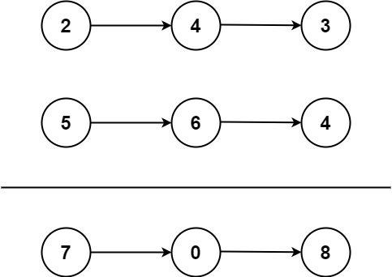

### 02、两数相加（20240920，2题，中等。32min）
<div style="border: 1px solid black; padding: 10px; background-color: SteelBlue;">

给你两个 非空 的链表，表示两个非负的整数。它们每位数字都是按照 逆序 的方式存储的，并且每个节点只能存储 一位 数字。

请你将两个数相加，并以相同形式返回一个表示和的链表。

你可以假设除了数字 0 之外，这两个数都不会以 0 开头。

 

示例 1：



- 输入：l1 = [2,4,3], l2 = [5,6,4]
- 输出：[7,0,8]
- 解释：342 + 465 = 807.

示例 2：

- 输入：l1 = [0], l2 = [0]
- 输出：[0]

示例 3：

- 输入：l1 = [9,9,9,9,9,9,9], l2 = [9,9,9,9]
- 输出：[8,9,9,9,0,0,0,1]
 

提示：

- 每个链表中的节点数在范围 [1, 100] 内
- 0 <= Node.val <= 9
- 题目数据保证列表表示的数字不含前导零

  </p>
</div>

<hr style="border-top: 5px solid #DC143C;">
<table>
  <tr>
    <td bgcolor="Yellow" style="padding: 5px; border: 0px solid black;">
      <span style="font-weight: bold; font-size: 20px;color: black;">
      自己答案（迭代法，32min）
      </span>
    </td>
  </tr>
</table>
<div style="padding: 0px; border: 1.5px solid LightSalmon; margin-bottom: 10px;">

```C++ {.line-numbers}
/*
32min
从个位数，即第一个节点开始，两个链表的节点依次相加
得到二者当前节点的和
    new新节点存这个节点
    可能有进位，使用 int over承接进位
当链表任一方还有，或者over不为0，都需要继续进行计算和
    并建立新节点
否则，退出计算，返回头结点
    所以头结点开始new的时候已经确定好了。
*/ 
class Solution {
public:
    ListNode* addTwoNumbers(ListNode* l1, ListNode* l2) {
        ListNode* tmp1 = l1;
        ListNode* tmp2 = l2;
        while(tmp1 && tmp2){
            if(tmp1->next == nullptr && tmp2->next != nullptr){
                swap(l1, l2);  // 保证了l1更长
                break;
            }
            tmp1 = tmp1->next;
            tmp2 = tmp2->next;
        }
        ListNode* dump = new ListNode();
        ListNode* travel = dump;
        int over = 0;
        while(l1 || over){
            int sum = 0;
            if(l2 != nullptr && l1 != nullptr){
                sum = l1->val + l2->val + over;
                l1 = l1->next;
                l2 = l2->next;
            }else if(l1 != nullptr){
                sum = l1->val + over;
                l1 = l1->next;
            }else{
                sum = over;
            }
            over = sum/10;
            int num = sum%10;
            ListNode* node = new ListNode(num);
            travel->next = node;
            travel = travel->next;
        }

        ListNode* ret = dump->next;
        delete dump;
        return ret;
    }
};
```

</div>


<table>
  <tr>
    <td bgcolor="Yellow" style="padding: 5px; border: 0px solid black;">
      <span style="font-weight: bold; font-size: 20px;color: black;">
      自己答案（通过！）
      </span>
    </td>
  </tr>
</table>

<div style="padding: 0px; border: 1.5px solid LightSalmon; margin-bottom: 10px">

```C++ {.line-numbers}


```
</div>

<hr style="border-top: 5px solid #DC143C;">

<table>
  <tr>
    <td bgcolor="Yellow" style="padding: 5px; border: 0px solid black;">
      <span style="font-weight: bold; font-size: 20px;color: black;">
      LeetCode（迭代法）
      </span>
    </td>
  </tr>
</table>

<div style="padding: 0px; border: 1.5px solid LightSalmon; margin-bottom: 10px">

```C++ {.line-numbers}
/*
使用三目运算符来确定l1和l2是否为空
  为空，当做0
  不为空，使用其val
*/
class Solution {
public:
    ListNode* addTwoNumbers(ListNode* l1, ListNode* l2) {
        ListNode dummy; // 哨兵节点
        ListNode* cur = &dummy;
        int carry = 0; // 进位
        while (l1 || l2 || carry) { // 有一个不是空节点，或者还有进位，就继续迭代
            int sum = carry + (l1 ? l1->val : 0) + (l2 ? l2->val : 0); // 节点值和进位加在一起
            cur = cur->next = new ListNode(sum % 10); // 每个节点保存一个数位
            carry = sum / 10; // 新的进位
            if (l1) l1 = l1->next; // 下一个节点
            if (l2) l2 = l2->next; // 下一个节点
        }
        return dummy.next; // 哨兵节点的下一个节点就是头节点
    }
};

作者：灵茶山艾府
链接：https://leetcode.cn/problems/add-two-numbers/solutions/2327008/dong-hua-jian-ji-xie-fa-cong-di-gui-dao-oe0di/
来源：力扣（LeetCode）
著作权归作者所有。商业转载请联系作者获得授权，非商业转载请注明出处。
```
</div>

<table>
  <tr>
    <td bgcolor="Yellow" style="padding: 5px; border: 0px solid black;">
      <span style="font-weight: bold; font-size: 20px;color: black;">
      LeetCode（递归法）
      </span>
    </td>
  </tr>
</table>

<div style="padding: 0px; border: 1.5px solid LightSalmon; margin-bottom: 10px">

```C++ {.line-numbers}
/*
递归函数返回新造的节点
在l1上存放每次计算的新值，不用新造节点
l1为空的时候，交换l1和l2，保证了l1更长
l1和l2都为空的时候，看进位carry是否为空
    不为空，还需要造一个新节点，结束递归
    为空，返回空节点，结束递归
*/
class Solution {
public:
    // l1 和 l2 为当前遍历的节点，carry 为进位
    ListNode* addTwoNumbers(ListNode* l1, ListNode* l2, int carry = 0) {
        if (l1 == nullptr && l2 == nullptr) { // 递归边界：l1 和 l2 都是空节点
            return carry ? new ListNode(carry) : nullptr; // 如果进位了，就额外创建一个节点
        }
        if (l1 == nullptr) { // 如果 l1 是空的，那么此时 l2 一定不是空节点
            swap(l1, l2); // 交换 l1 与 l2，保证 l1 非空，从而简化代码
        }
        int sum = carry + l1->val + (l2 ? l2->val : 0); // 节点值和进位加在一起
        l1->val = sum % 10; // 每个节点保存一个数位
        l1->next = addTwoNumbers(l1->next, (l2 ? l2->next : nullptr), sum / 10); // 进位
        return l1;
    }
};

作者：灵茶山艾府
链接：https://leetcode.cn/problems/add-two-numbers/solutions/2327008/dong-hua-jian-ji-xie-fa-cong-di-gui-dao-oe0di/
来源：力扣（LeetCode）
著作权归作者所有。商业转载请联系作者获得授权，非商业转载请注明出处。
```
</div>

<hr style="border-top: 5px solid #DC143C;">

<table>
  <tr>
    <td bgcolor="Yellow" style="padding: 5px; border: 0px solid black;">
      <span style="font-weight: bold; font-size: 20px;color: black;">
      仿照答案版本v2
      </span>
    </td>
  </tr>
</table>

<div style="padding: 0px; border: 1.5px solid LightSalmon; margin-bottom: 10px">

```C++ {.line-numbers}


```
</div>

<table>
  <tr>
    <td bgcolor="Yellow" style="padding: 5px; border: 0px solid black;">
      <span style="font-weight: bold; font-size: 20px;color: black;">
      ChatGPT
      </span>
    </td>
  </tr>
</table>

<div style="padding: 0px; border: 1.5px solid LightSalmon; margin-bottom: 10px">

```C++ {.line-numbers}


```
</div>
