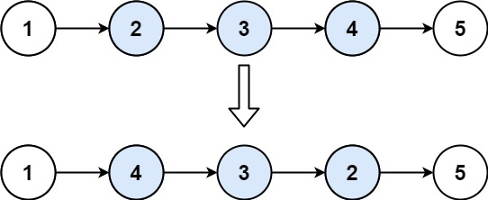
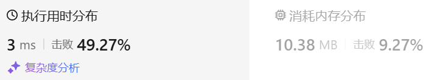

### 03、反转链表 II（20241010，92题，中等。25min）
<div style="border: 1px solid black; padding: 10px; background-color: SteelBlue;">

给你单链表的头指针 head 和两个整数 left 和 right ，其中 left <= right 。请你反转从位置 left 到位置 right 的链表节点，返回 反转后的链表 。
 

示例 1：



- 输入：head = [1,2,3,4,5], left = 2, right = 4
- 输出：[1,4,3,2,5]

示例 2：

- 输入：head = [5], left = 1, right = 1
- 输出：[5]
 

提示：

- 链表中节点数目为 n
- 1 <= n <= 500
- -500 <= Node.val <= 500
- 1 <= left <= right <= n
 

进阶： 你可以使用一趟扫描完成反转吗？

  </p>
</div>

<hr style="border-top: 5px solid #DC143C;">
<table>
  <tr>
    <td bgcolor="Yellow" style="padding: 5px; border: 0px solid black;">
      <span style="font-weight: bold; font-size: 20px;color: black;">
      自己答案（25min）
      </span>
    </td>
  </tr>
</table>
<div style="padding: 0px; border: 1.5px solid LightSalmon; margin-bottom: 10px;">

```C++ {.line-numbers}
/*
25min
思路：
使用递归
先递归存入从left到right的数据到vector<int> vec中
然后判断是否到了特定的索引，从而根据vec修改链表中的值
    递归需要传入depth，方便直到当前遍历深度

递归回溯过程要给节点重新赋值，知道当前深度depth，由此要推出使用vec中的哪个值，才是对称值
    vec范围是[0, right-left]，对应这链表[left, right]的节点值
    确定depth在[left, right]范围后，要确定在vec对称值的位置
    考虑到：
        0 -> right-left
        1 -> right-left-1
        .....

        而depth深度在vec中对应的是depth-left（考虑depth=left时，刚好在vec的索引0位置）
        所以depth深度的节点，应该使用vec中的right-left - (depth-left) = right - depth索引处的值，作为对称值
        即node->val = vec[right-depth]
*/
class Solution {
public:
    void travelList(ListNode* node, int left, int right, int depth, vector<int>& vec){
        if(node == nullptr) return;
        if(depth >= left && depth <= right){
            vec.push_back(node->val);
        }

        travelList(node->next, left, right, depth+1, vec);

        if(depth >= left && depth <= right){
            node->val = vec[right-depth];
        }
    }

    ListNode* reverseBetween(ListNode* head, int left, int right) {
        vector<int> vec;
        travelList(head, left, right, 1, vec);
        return head;
    }
};
```

</div>



<table>
  <tr>
    <td bgcolor="Yellow" style="padding: 5px; border: 0px solid black;">
      <span style="font-weight: bold; font-size: 20px;color: black;">
      自己答案（通过！）
      </span>
    </td>
  </tr>
</table>

<div style="padding: 0px; border: 1.5px solid LightSalmon; margin-bottom: 10px">

```C++ {.line-numbers}


```
</div>

<hr style="border-top: 5px solid #DC143C;">

<table>
  <tr>
    <td bgcolor="Yellow" style="padding: 5px; border: 0px solid black;">
      <span style="font-weight: bold; font-size: 20px;color: black;">
      自己调试版本（通过！！！）
      </span>
    </td>
  </tr>
</table>

<div style="padding: 0px; border: 1.5px solid LightSalmon; margin-bottom: 10px">

```C++ {.line-numbers}


```
</div>

<table>
  <tr>
    <td bgcolor="Yellow" style="padding: 5px; border: 0px solid black;">
      <span style="font-weight: bold; font-size: 20px;color: black;">
      仿照答案版本v2（去注释）
      </span>
    </td>
  </tr>
</table>

<div style="padding: 0px; border: 1.5px solid LightSalmon; margin-bottom: 10px">

```C++ {.line-numbers}


```
</div>

<hr style="border-top: 5px solid #DC143C;">

<table>
  <tr>
    <td bgcolor="Yellow" style="padding: 5px; border: 0px solid black;">
      <span style="font-weight: bold; font-size: 20px;color: black;">
      仿照答案版本v2
      </span>
    </td>
  </tr>
</table>

<div style="padding: 0px; border: 1.5px solid LightSalmon; margin-bottom: 10px">

```C++ {.line-numbers}


```
</div>

<table>
  <tr>
    <td bgcolor="Yellow" style="padding: 5px; border: 0px solid black;">
      <span style="font-weight: bold; font-size: 20px;color: black;">
      ChatGPT
      </span>
    </td>
  </tr>
</table>

<div style="padding: 0px; border: 1.5px solid LightSalmon; margin-bottom: 10px">

```C++ {.line-numbers}


```
</div>
