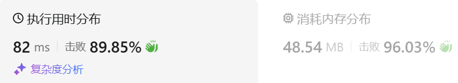
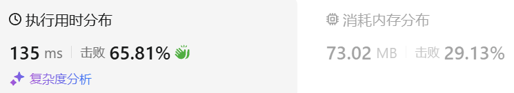
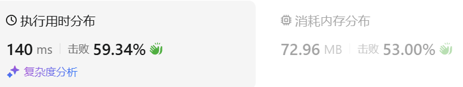

### 01、最长连续序列（20240924，128题，中等）
<div style="border: 1px solid black; padding: 10px; background-color: SteelBlue;">

给定一个未排序的整数数组 nums ，找出数字连续的最长序列（不要求序列元素在原数组中连续）的长度。

请你设计并实现时间复杂度为 O(n) 的算法解决此问题。

 

示例 1：

- 输入：nums = [100,4,200,1,3,2]
- 输出：4
- 解释：最长数字连续序列是 [1, 2, 3, 4]。它的长度为 4。

示例 2：

- 输入：nums = [0,3,7,2,5,8,4,6,0,1]
- 输出：9
 

提示：

- 0 <= nums.length <= 105
- -109 <= nums[i] <= 109

  </p>
</div>

<hr style="border-top: 5px solid #DC143C;">
<table>
  <tr>
    <td bgcolor="Yellow" style="padding: 5px; border: 0px solid black;">
      <span style="font-weight: bold; font-size: 20px;color: black;">
      自己答案（10min）
      </span>
    </td>
  </tr>
</table>
<div style="padding: 0px; border: 1.5px solid LightSalmon; margin-bottom: 10px;">

```C++ {.line-numbers}
/*
10min
思路：
首先排序，从小到大
遍历数组，举例当前的连续长度
*/
class Solution {
public:
    int longestConsecutive(vector<int>& nums) {
        size_t size = nums.size();
        if(size <= 1) return size;

        sort(nums.begin(), nums.end());

        int max_len = 1;
        int cur_len = 1;
        int pre_num = nums[0];

        for(int i = 1; i < size; i++){
            if(nums[i] == pre_num+1){  // 遇到连续数字
                ++cur_len;
            }else if(nums[i] == pre_num){  // 遇到相同数字
                continue;
            }else{  // 遇到不连续数字
                cur_len = 1;
            }

            if(cur_len > max_len){
                max_len = cur_len;
            }
            pre_num = nums[i];
        }
        return max_len;
    }
};
```

</div>



<table>
  <tr>
    <td bgcolor="Yellow" style="padding: 5px; border: 0px solid black;">
      <span style="font-weight: bold; font-size: 20px;color: black;">
      仿照答案 
      </span>
    </td>
  </tr>
</table>

<div style="padding: 0px; border: 1.5px solid LightSalmon; margin-bottom: 10px">

```C++ {.line-numbers}
/*
思路：
使用unordered_set进行去重
遍历去重后的数据
    当前遍历数字为num，找set中是否存在num-1，
        存在，说明num不可能是开头数字，跳过num并继续遍历
        不存在，num可能是开头数字
            则继续在set中依次找num+1，num+2，num+3...
            每找到一个数字，记录当前的长度cur_len
            当找不到下一个连续数字后，拿当前长度cur_len和最长长度max_len比较，更新max_len
最后返回max_len
*/
class Solution {
public:
    int longestConsecutive(vector<int>& nums) {
        unordered_set<int> set;
        int max_len = 0;

        for(auto num : nums){
            set.insert(num);
        }
        for(auto num : set){
            if(set.find(num-1) == set.end()){  // 没找到前一个数字，那可能是开头
                int cur_len = 1;
                int cur_num = num;
                while(set.find(cur_num+1) != set.end()){
                    cur_len++;
                    cur_num++;
                }
                if(cur_len > max_len){
                    max_len = cur_len;
                }
            }
        }
        return max_len;
    }
};
```
</div>



<hr style="border-top: 5px solid #DC143C;">

<table>
  <tr>
    <td bgcolor="Yellow" style="padding: 5px; border: 0px solid black;">
      <span style="font-weight: bold; font-size: 20px;color: black;">
      自己调试版本（通过！！！）
      </span>
    </td>
  </tr>
</table>

<div style="padding: 0px; border: 1.5px solid LightSalmon; margin-bottom: 10px">

```C++ {.line-numbers}


```
</div>

<table>
  <tr>
    <td bgcolor="Yellow" style="padding: 5px; border: 0px solid black;">
      <span style="font-weight: bold; font-size: 20px;color: black;">
      仿照答案版本v2（去注释）
      </span>
    </td>
  </tr>
</table>

<div style="padding: 0px; border: 1.5px solid LightSalmon; margin-bottom: 10px">

```C++ {.line-numbers}


```
</div>

<hr style="border-top: 5px solid #DC143C;">

<table>
  <tr>
    <td bgcolor="Yellow" style="padding: 5px; border: 0px solid black;">
      <span style="font-weight: bold; font-size: 20px;color: black;">
      仿照答案版本v2
      </span>
    </td>
  </tr>
</table>

<div style="padding: 0px; border: 1.5px solid LightSalmon; margin-bottom: 10px">

```C++ {.line-numbers}


```
</div>

<table>
  <tr>
    <td bgcolor="Yellow" style="padding: 5px; border: 0px solid black;">
      <span style="font-weight: bold; font-size: 20px;color: black;">
      leetcode
      </span>
    </td>
  </tr>
</table>

<div style="padding: 0px; border: 1.5px solid LightSalmon; margin-bottom: 10px">

```C++ {.line-numbers}
class Solution {
public:
    int longestConsecutive(vector<int>& nums) {
        unordered_set<int> num_set;
        for (const int& num : nums) {
            num_set.insert(num);
        }

        int longestStreak = 0;

        for (const int& num : num_set) {
            if (!num_set.count(num - 1)) {
                int currentNum = num;
                int currentStreak = 1;

                while (num_set.count(currentNum + 1)) {
                    currentNum += 1;
                    currentStreak += 1;
                }

                longestStreak = max(longestStreak, currentStreak);
            }
        }

        return longestStreak;           
    }
};

复杂度分析
时间复杂度：O(n)，其中 n 为数组的长度。具体分析已在上面正文中给出。
空间复杂度：O(n)。哈希表存储数组中所有的数需要 O(n) 的空间。

作者：力扣官方题解
链接：https://leetcode.cn/problems/longest-consecutive-sequence/solutions/276931/zui-chang-lian-xu-xu-lie-by-leetcode-solution/
来源：力扣（LeetCode）
著作权归作者所有。商业转载请联系作者获得授权，非商业转载请注明出处。
```
</div>



---

题解说的比较复杂，不太容易懂，简单来说就是每个数都判断一次这个数是不是连续序列的开头那个数。

- 怎么判断呢，就是用哈希表查找这个数前面一个数是否存在，即num-1在序列中是否存在。存在那这个数肯定不是开头，直接跳过。
- 因此只需要对每个开头的数进行循环，直到这个序列不再连续，因此复杂度是O(n)。 以题解中的序列举例:  
[100，4，200，1，3，4，2]  
去重后的哈希序列为：  
[100，4，200，1，3，2]  

按照上面逻辑进行判断：

1. 元素100是开头,因为没有99，且以100开头的序列长度为1  
2. 元素4不是开头，因为有3存在，过，  
3. 元素200是开头，因为没有199，且以200开头的序列长度为1  
4. 元素1是开头，因为没有0，且以1开头的序列长度为4，因为依次累加，2，3，4都存在。  
5. 元素3不是开头，因为2存在，过，  
6. 元素2不是开头，因为1存在，过。  
完

https://leetcode.cn/problems/longest-consecutive-sequence/solutions/276931/zui-chang-lian-xu-xu-lie-by-leetcode-solution/comments/2283513
