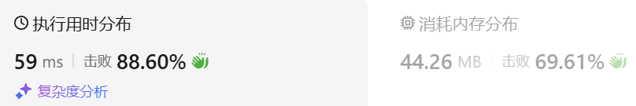

### 02、和为 K 的子数组（20241004，560题，中等）
<div style="border: 1px solid black; padding: 10px; background-color: SteelBlue;">

给你一个整数数组 nums 和一个整数 k ，请你统计并返回 该数组中和为 k 的子数组的个数 。

子数组是数组中元素的连续非空序列。

 

示例 1：

- 输入：nums = [1,1,1], k = 2
- 输出：2

示例 2：

- 输入：nums = [1,2,3], k = 3
- 输出：2
 

提示：

- 1 <= nums.length <= 2 * 104
- -1000 <= nums[i] <= 1000
- -107 <= k <= 107

  </p>
</div>

<hr style="border-top: 5px solid #DC143C;">
<table>
  <tr>
    <td bgcolor="Yellow" style="padding: 5px; border: 0px solid black;">
      <span style="font-weight: bold; font-size: 20px;color: black;">
      仿照答案 
      </span>
    </td>
  </tr>
</table>
<div style="padding: 0px; border: 1.5px solid LightSalmon; margin-bottom: 10px;">

```C++ {.line-numbers}
/*
思路：
一边遍历数组，一边记录前缀和。
记前缀和数组为vec_sum。
则vec_sum[i] - vec_sum[j]表示从索引i+1至索引j所有数的和，j > i
    若sum[m] = a，m > j > i
    若知道之前有sum[n] = a-k，m > n
    则索引n至m之间的子序列和就是k！！！
    且m之前有多少个a-k的前缀和，就有多少和为k的子序列
    例如有如下的前缀和序列：
    ... a-k  b  c  a-k  d  e  a-k  e  a  f  g  ...
    对于最后的前缀和a，之前的所有前缀和a-k到这个a的子序列和都为k！！！因为a-(a-k)=k！！！
所以可以在计算前缀的的同时，使用哈希表map记录前缀和出现的次数
    遍历过程中，在map中查找a-k，map中其值为多少，counts计数累加多少！！！
另外由于初始累加到vec_sum[i] = k时，map[0]是没有数据的
    但此时应该累加counts，因为此时找到了一个答案，
    为了记录答案，初始化map[0] = 1！！！

mp里记录的是和为key的子串有value个，初始就有一个和为0的子串（即最开始的空串）leetcode水友说法。
*/

class Solution {
public:
    int subarraySum(vector<int>& nums, int k) {
        size_t size = nums.size();
        unordered_map<int, int> map;
        map[0] = 1;
        int cur_sum = 0;
        int counts = 0;

        for(int i = 0; i < size; i++){
            cur_sum += nums[i];
            if(map.find(cur_sum-k) != map.end()){
                counts += map[cur_sum-k];
            }
            map[cur_sum]++;
        }
        return counts;
    }
};

```

</div>



<hr style="border-top: 5px solid #DC143C;">
<table>
  <tr>
    <td bgcolor="Yellow" style="padding: 5px; border: 0px solid black;">
      <span style="font-weight: bold; font-size: 20px;color: black;">
      仿照答案（超时，O(n^2)时间复杂度）
      </span>
    </td>
  </tr>
</table>
<div style="padding: 0px; border: 1.5px solid LightSalmon; margin-bottom: 10px;">

```C++ {.line-numbers}
/*
思路：
遍历数组，当前数为cur
则从cur开始往前进行累加，只要和为k，将计数counts累加
遍历至数组最后，counts就是连续非空和为k子序列的个数！
*/
class Solution {
public:
    int subarraySum(vector<int>& nums, int k) {
        size_t size = nums.size();
        int counts = 0;

        for(int i = 0; i < size; i++){
            int sum = 0;
            for(int j = i; j >= 0; j--){
                sum += nums[j];
                if(sum == k){
                    ++counts;
                }
            }
        }
        return counts;
    }
};
```

</div>

<table>
  <tr>
    <td bgcolor="Yellow" style="padding: 5px; border: 0px solid black;">
      <span style="font-weight: bold; font-size: 20px;color: black;">
      自己答案（未通过）
      </span>
    </td>
  </tr>
</table>

<div style="padding: 0px; border: 1.5px solid LightSalmon; margin-bottom: 10px">

```C++ {.line-numbers}
/*
思路：
先求累加和
然后从右往前遍历，找大于k的数字cur
    cur连续减去从自己开始的往前面的数，直到差值等于或者小于k
        等于k，说明找到了连续序列
        小于k，说明以当前索引的原数字结尾的数，不可能与前面若干数字累加和为k
            此时，需要往前继续找cur，
            如此循环，一直到cur遍历到开头，或者cur小于k

*/
class Solution {
public:
    int subarraySum(vector<int>& nums, int k) {
        size_t size = nums.size();
        vector<int> sum_vec(size, 0);
        sum_vec[0] = nums[0];
        int counts = 0;

        for(int i = 1; i < size; i++){
            sum_vec[i] = sum_vec[i-1] + nums[i];
        }

        for(int j = size-1; j >= 0; j--){  // 每个数连续减去自己以及前面数，直到
            if(sum_vec[j] == k){
                ++counts;
                break;
            }
            // if(sum_vec[j] < k){
            //     break;
            // }
            for(int m = j-1; m >= 0; m--){
                int cur_diff = sum_vec[j] - sum_vec[m];
                if(cur_diff == k){  // 找到了
                    ++counts;
                    break;
                }
                // if(cur_diff > k){
                //     break;
                // }
            }
            
        }
        return counts;
    }
};
```
</div>

<hr style="border-top: 5px solid #DC143C;">

<table>
  <tr>
    <td bgcolor="Yellow" style="padding: 5px; border: 0px solid black;">
      <span style="font-weight: bold; font-size: 20px;color: black;">
      自己调试版本（通过！！！）
      </span>
    </td>
  </tr>
</table>

<div style="padding: 0px; border: 1.5px solid LightSalmon; margin-bottom: 10px">

```C++ {.line-numbers}


```
</div>

<table>
  <tr>
    <td bgcolor="Yellow" style="padding: 5px; border: 0px solid black;">
      <span style="font-weight: bold; font-size: 20px;color: black;">
      仿照答案版本v2（去注释）
      </span>
    </td>
  </tr>
</table>

<div style="padding: 0px; border: 1.5px solid LightSalmon; margin-bottom: 10px">

```C++ {.line-numbers}


```
</div>

<hr style="border-top: 5px solid #DC143C;">

<table>
  <tr>
    <td bgcolor="Yellow" style="padding: 5px; border: 0px solid black;">
      <span style="font-weight: bold; font-size: 20px;color: black;">
      仿照答案版本v2
      </span>
    </td>
  </tr>
</table>

<div style="padding: 0px; border: 1.5px solid LightSalmon; margin-bottom: 10px">

```C++ {.line-numbers}


```
</div>

<table>
  <tr>
    <td bgcolor="Yellow" style="padding: 5px; border: 0px solid black;">
      <span style="font-weight: bold; font-size: 20px;color: black;">
      ChatGPT
      </span>
    </td>
  </tr>
</table>

<div style="padding: 0px; border: 1.5px solid LightSalmon; margin-bottom: 10px">

```C++ {.line-numbers}


```
</div>
