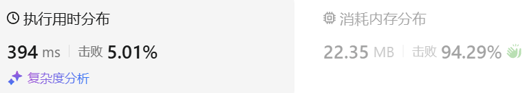
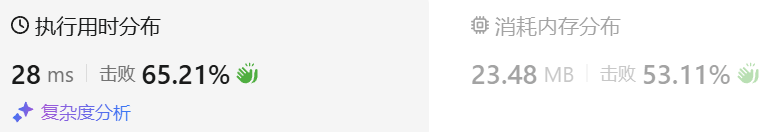

### 01、字母异位词分组（20240923，49题，中等。89min）
<div style="border: 1px solid black; padding: 10px; background-color: SteelBlue;">

给你一个字符串数组，请你将 字母异位词 组合在一起。可以按任意顺序返回结果列表。

字母异位词 是由重新排列源单词的所有字母得到的一个新单词。

 

示例 1:

- 输入: strs = ["eat", "tea", "tan", "ate", "nat", "bat"]
- 输出: [["bat"],["nat","tan"],["ate","eat","tea"]]

示例 2:

- 输入: strs = [""]
- 输出: [[""]]

示例 3:

- 输入: strs = ["a"]
- 输出: [["a"]]
 

提示：

- 1 <= strs.length <= 104
- 0 <= strs[i].length <= 100
- strs[i] 仅包含小写字母

  </p>
</div>

<hr style="border-top: 5px solid #DC143C;">
<table>
  <tr>
    <td bgcolor="Yellow" style="padding: 5px; border: 0px solid black;">
      <span style="font-weight: bold; font-size: 20px;color: black;">
      自己答案（去注释，通过！）
      </span>
    </td>
  </tr>
</table>
<div style="padding: 0px; border: 1.5px solid LightSalmon; margin-bottom: 10px;">

```C++ {.line-numbers}
/*
89min
思路：
先将字符串按照长度进行分类，因为只有长度相同的才有可能是字母异位词
然后使用函数将不同的长度的一组组字符串进行比较
    使用一个函数，比较两个字符串是否为异位词
    将异位词分为一组，存入结果中

开始思路：
先将字符串按照长度进行分类，因为只有长度相同的才有可能是字母异位词
    遍历字符串数组，使用multimap存储{长度，字符串}数据m_map
    遍历m_map，对于键相同的所有单词进行比较，
        是异位词的，放在一起，存入结果vector<vector<string>> results中
    需要一个函数判断是否为异位词
*/
class Solution {
public:
    bool compareStr(string& str1, string& str2){
        size_t size = str1.size();
        int array[26] = {0};

        for(int i = 0; i < size; i++){
            array[str1[i] - 'a']++;
        }
        for(int j = 0; j < size; j++){
            array[str2[j] - 'a']--;
            if(array[str2[j] - 'a'] < 0){
                return false;
            }
        }
        return true;
    }
    void dealStrs(vector<string>& str, vector<vector<string>>& results){
        vector<int> used(str.size(), 0);
        vector<string> tmp;

        for(int i = 0; i < str.size(); i++){
            if(used[i] == 1) continue;  // 处理过的字符串，跳过
            tmp.push_back(str[i]);
            for(int j = i+1; j < str.size(); j++){
                if(used[j] == 1) continue;
                if(compareStr(str[i], str[j])){  // 判断是否为异位词
                    tmp.push_back(str[j]);  // 异位词暂存
                    used[j] = 1;
                }
                // if(j == str.size()-1){  // 相同长度异位词一轮遍历后，存入结果
                //     results.push_back(tmp);
                //     tmp.clear();
                //     tmp.resize(0);
                // }
            }
            results.push_back(tmp);  // i是最后一个索引时，j的循环不会进入，那就这最后的字符串不会存入result中了
            tmp.clear();   // 所以要将存入data的语句放在第二层循环的外面！！！
            tmp.resize(0);
        }
    }
    vector<vector<string>> groupAnagrams(vector<string>& strs) {
        sort(strs.begin(), strs.end(), [&](string& a, string& b){
            return a.size() < b.size();
        });  // 将字符串按照长度从小到大排序

        int pre_len = strs[0].size();
        vector<string> same_len;
        vector<vector<string>> data;  // 按照长度存放各组字符串
        same_len.push_back(strs[0]);  // 第一个字符别忘了暂存！！！

        if(strs.size() == 1) data.push_back(same_len);  // 若长度为1，则数据不会存入data，需要这里判断性！！！

        for(int i = 1; i < strs.size(); i++){
            if(strs[i].size() == pre_len){  // 遍历到和前一个字符串长度相同，则先暂存到same_len
                same_len.push_back(strs[i]);
            }else{  // 注意遍历到最后字符串的情况
                data.push_back(same_len);  // 将相同长度字符串放一起

                same_len.clear();
                same_len.resize(0);

                pre_len = strs[i].size();  // 更新新的长度
                same_len.push_back(strs[i]);
            }

            if(i == strs.size()-1){
                data.push_back(same_len);
            }
        }

        vector<vector<string>> results;
        for(int i = 0; i < data.size(); i++){
            dealStrs(data[i], results);
        }
        return results;
    }
};
```

</div>



<hr style="border-top: 5px solid #DC143C;">

<table>
  <tr>
    <td bgcolor="Yellow" style="padding: 5px; border: 0px solid black;">
      <span style="font-weight: bold; font-size: 20px;color: black;">
      仿照答案（排序法）
      </span>
    </td>
  </tr>
</table>

<div style="padding: 0px; border: 1.5px solid LightSalmon; margin-bottom: 10px">

```C++ {.line-numbers}
/*
思路：
异位词排序后，作为键是相同的，由此可以归到一起
unordered_map<string, vector<string>> map
*/
class Solution {
public:
    vector<vector<string>> groupAnagrams(vector<string>& strs) {
        unordered_map<string, vector<string>> map;
        for(auto& str : strs){
            string tmp = str;
            sort(tmp.begin(), tmp.end());
            map[tmp].emplace_back(str);
        }
        vector<vector<string>> results;
        for(auto& elem : map){
            results.push_back(elem.second);
        }
        return results;
    }
};
```
</div>




<table>
  <tr>
    <td bgcolor="Yellow" style="padding: 5px; border: 0px solid black;">
      <span style="font-weight: bold; font-size: 20px;color: black;">
      自己调试版本（通过！！！）
      </span>
    </td>
  </tr>
</table>

<div style="padding: 0px; border: 1.5px solid LightSalmon; margin-bottom: 10px">

```C++ {.line-numbers}


```
</div>

<table>
  <tr>
    <td bgcolor="Yellow" style="padding: 5px; border: 0px solid black;">
      <span style="font-weight: bold; font-size: 20px;color: black;">
      仿照答案版本v2（去注释）
      </span>
    </td>
  </tr>
</table>

<div style="padding: 0px; border: 1.5px solid LightSalmon; margin-bottom: 10px">

```C++ {.line-numbers}


```
</div>

<hr style="border-top: 5px solid #DC143C;">

<table>
  <tr>
    <td bgcolor="Yellow" style="padding: 5px; border: 0px solid black;">
      <span style="font-weight: bold; font-size: 20px;color: black;">
      仿照答案版本v2
      </span>
    </td>
  </tr>
</table>

<div style="padding: 0px; border: 1.5px solid LightSalmon; margin-bottom: 10px">

```C++ {.line-numbers}


```
</div>

<table>
  <tr>
    <td bgcolor="Yellow" style="padding: 5px; border: 0px solid black;">
      <span style="font-weight: bold; font-size: 20px;color: black;">
      leetcode（计数法）
      </span>
    </td>
  </tr>
</table>

<div style="padding: 0px; border: 1.5px solid LightSalmon; margin-bottom: 10px">

```C++ {.line-numbers}
class Solution {
public:
    vector<vector<string>> groupAnagrams(vector<string>& strs) {
        // 自定义对 array<int, 26> 类型的哈希函数
        auto arrayHash = [fn = hash<int>{}] (const array<int, 26>& arr) -> size_t {
            return accumulate(arr.begin(), arr.end(), 0u, [&](size_t acc, int num) {
                return (acc << 1) ^ fn(num);
            });
        };

        unordered_map<array<int, 26>, vector<string>, decltype(arrayHash)> mp(0, arrayHash);
        for (string& str: strs) {
            array<int, 26> counts{};
            int length = str.length();
            for (int i = 0; i < length; ++i) {
                counts[str[i] - 'a'] ++;
            }
            mp[counts].emplace_back(str);
        }
        vector<vector<string>> ans;
        for (auto it = mp.begin(); it != mp.end(); ++it) {
            ans.emplace_back(it->second);
        }
        return ans;
    }
};

作者：力扣官方题解
链接：https://leetcode.cn/problems/group-anagrams/solutions/520469/zi-mu-yi-wei-ci-fen-zu-by-leetcode-solut-gyoc/
来源：力扣（LeetCode）
著作权归作者所有。商业转载请联系作者获得授权，非商业转载请注明出处。
```
</div>

<h5>代码分析：</h5>

这段代码用于将字符串数组中的字母异位词分组。字母异位词是指由相同字符组成但顺序不同的字符串。例如，`"eat"` 和 `"tea"`。

1. **自定义哈希函数**：
   - 使用 `array<int, 26>` 作为键，表示每个字母的计数。
   - 自定义的哈希函数 `arrayHash` 使用 `accumulate` 来计算哈希值，以便在 `unordered_map` 中使用。它通过将计数值进行位移和异或操作，来生成唯一的哈希值。

2. **字符计数**：
   - 使用 `array<int, 26> counts{}` 初始化字母计数数组。每个索引对应一个字母（`'a'` 到 `'z'`），通过 `counts[str[i] - 'a']++` 来增加字符计数。

3. **分组存储**：
   - 利用 `unordered_map` 来存储结果，其中键为字符计数数组，值为对应的字母异位词列表。
   - 使用 `mp[counts].emplace_back(str)` 将字符串添加到对应的分组中。

4. **结果转换**：
   - 遍历哈希表，将每个值（即字母异位词列表）添加到最终的结果 `ans` 中。

<h5>关键知识点示例：</h5>

1. **自定义哈希函数**：
   - 用于处理复杂类型作为哈希表的键。在这里，使用字符计数的数组作为键，避免了对字符串的排序，提高了效率。

   ```cpp
   auto arrayHash = [fn = hash<int>{}] (const array<int, 26>& arr) -> size_t {
       return accumulate(arr.begin(), arr.end(), 0u, [&](size_t acc, int num) {
           return (acc << 1) ^ fn(num);
       });
   };
   ```

2. **字符计数法**：
   - 使用 `array<int, 26>` 来记录每个字母的出现次数，避免了使用 `string` 排序的方法，减少了时间复杂度。
   
   ```cpp
   array<int, 26> counts{};
   ```

3. **`unordered_map` 的使用**：
   - 提供高效的存储和查找。通过字符计数数组来分组异位词，避免了比较字符串的开销。
   
   ```cpp
   unordered_map<array<int, 26>, vector<string>, decltype(arrayHash)> mp(0, arrayHash);
   ```

4. **`emplace_back` 方法**：
   - 用于向 `vector` 中添加元素，避免了额外的拷贝，提高了性能。
   
   ```cpp
   mp[counts].emplace_back(str);
   ```

5. **`accumulate` 的使用**：
   - 用于在哈希函数中累加字符计数值，减少了代码的复杂性。
   
   ```cpp
   return accumulate(arr.begin(), arr.end(), 0u, [&](size_t acc, int num) {
       return (acc << 1) ^ fn(num);
   });
   ```

<h5>时间和空间复杂度：</h5>

1. **时间复杂度**：`O(n * k)`，其中 `n` 是字符串数组的长度，`k` 是字符串的平均长度。对于每个字符串，遍历其字符并更新计数。
2. **空间复杂度**：`O(n * k)`，用于存储所有字母异位词分组的结果。

==================

**这里自定义哈希函数的用法再详细拆解，介绍下其用法，举例子说明，并指出易错用法**

<h5>自定义哈希函数详细拆解</h5>

自定义哈希函数是为了让我们能够使用复杂类型（如 `array<int, 26>`）作为哈希表（`unordered_map`）的键。在 C++ 中，`unordered_map` 默认的哈希函数只能处理基本数据类型，因此我们需要自己定义一个。

<h5>用法</h5>

1. **定义哈希函数**：
   - 我们可以使用一个 lambda 表达式来定义自定义哈希函数。
   - 该哈希函数接收一个 `array<int, 26>` 类型的参数，并返回一个 `size_t` 类型的哈希值。

   ```cpp
   auto arrayHash = [fn = hash<int>{}] (const array<int, 26>& arr) -> size_t {
       // 使用 std::accumulate 来计算哈希值
       return accumulate(arr.begin(), arr.end(), 0u, [&](size_t acc, int num) {
           return (acc << 1) ^ fn(num);
       });
   };
   ```

2. **哈希值的计算**：
   - `accumulate` 从 `arr` 的开始到结束累加每个元素的哈希值。
   - `acc << 1` 将当前的累加值左移一位，这有助于确保每个哈希值的唯一性，避免碰撞。
   - `^` 操作符用于异或，进一步混合哈希值。

3. **在 `unordered_map` 中使用**：
   - 我们将自定义的哈希函数作为 `unordered_map` 的第三个模板参数。
   - 这样可以保证在插入和查找时使用我们的哈希函数，而不是默认的哈希函数。

   ```cpp
   unordered_map<array<int, 26>, vector<string>, decltype(arrayHash)> mp(0, arrayHash);
   ```

<h5>举例说明</h5>

假设我们有两个字符串 `"abc"` 和 `"cba"`，它们都是字母异位词。

1. **字符计数**：
   - 对于 `"abc"`，字符计数数组为 `[1, 1, 1, 0, ..., 0]`（对应字母 `'a'`, `'b'`, `'c'`）。
   - 对于 `"cba"`，字符计数数组同样为 `[1, 1, 1, 0, ..., 0]`。

2. **哈希值计算**：
   - 哈希函数会为这两个相同的字符计数数组计算相同的哈希值，因此它们会被放在同一个桶中，从而被归为一组。

<h5>易错用法</h5>

1. **没有处理所有字符**：
   - 如果哈希函数没有考虑到所有可能的字符（如大小写字母），可能导致不同的字符计数返回相同的哈希值，造成哈希碰撞。

2. **哈希函数效率**：
   - 哈希函数应尽量简洁高效。如果使用复杂的运算，会影响性能。使用位运算和简单的累加通常是较好的选择。

3. **返回类型**：
   - 确保返回类型为 `size_t`，因为这是标准库对哈希值的要求。如果返回类型不匹配，会导致编译错误或未定义行为。

4. **初始值选择**：
   - 在 `accumulate` 中，初始值选择不当可能影响最终结果。使用 `0u` 可以确保与后续计算兼容（避免符号问题）。

5. **处理负数**：
   - 由于字符计数为非负值，确保在计算哈希值时，所有操作都基于非负数，以防止意外的负值导致哈希错误。

通过这些细节和示例，可以更好地理解如何使用自定义哈希函数，并避免常见错误。

====================

**自定义哈希函数的写法有哪些，格式有何要求，并举例子详细说明常见的几种写法**

<h5>自定义哈希函数的写法</h5>

自定义哈希函数的写法通常有几种不同的形式，包括普通函数、结构体中的成员函数和 Lambda 表达式。以下是这些写法的格式、要求及示例。

<h5>1. 普通函数</h5>

这种方式最为直接，定义一个普通的函数并返回哈希值。

```cpp
#include <iostream>
#include <unordered_map>

size_t customHash(int key) {
    return std::hash<int>()(key) ^ (key << 1);  // 示例：简单的位运算
}

int main() {
    std::unordered_map<int, std::string> myMap;
    myMap[1] = "one";
    myMap[2] = "two";
    
    std::cout << "Hash of 1: " << customHash(1) << std::endl;
    return 0;
}
```

**要求**：
- 函数必须接受一个参数，并返回 `size_t` 类型。
- 可以使用标准库提供的哈希函数（如 `std::hash`）作为基础。

<h5>2. 结构体中的成员函数</h5>

可以将哈希函数作为结构体的成员函数，这样便于将状态与哈希函数结合。

```cpp
#include <iostream>
#include <unordered_map>

struct MyHash {
    size_t operator()(const std::pair<int, int>& p) const {
        return std::hash<int>()(p.first) ^ std::hash<int>()(p.second);
    }
};

int main() {
    std::unordered_map<std::pair<int, int>, std::string, MyHash> myMap;
    myMap[{1, 2}] = "one-two";
    
    std::cout << "Hash of (1, 2): " << MyHash()({1, 2}) << std::endl;
    return 0;
}
```

**要求**：
- 使用 `operator()` 来重载函数调用运算符。
- 支持多个参数类型的哈希。

<h5>3. Lambda 表达式</h5>

使用 Lambda 表达式可以灵活地定义哈希函数，通常用于局部使用。

```cpp
#include <iostream>
#include <unordered_map>

int main() {
    auto customHash = [](const std::string& str) {
        size_t hashValue = 0;
        for (char c : str) {
            hashValue ^= std::hash<char>()(c) + 0x9e3779b9 + (hashValue << 6) + (hashValue >> 2);
        }
        return hashValue;
    };

    std::unordered_map<std::string, std::string, decltype(customHash)> myMap(0, customHash);
    myMap["hello"] = "world";
    
    std::cout << "Hash of 'hello': " << customHash("hello") << std::endl;
    return 0;
}
```

**要求**：
- 定义 Lambda 时必须指定返回类型（可选）。
- 使用 `decltype` 来将自定义哈希函数传递给 `unordered_map`。

<h5>常见的写法总结</h5>

1. **普通函数**：
   - 简单易读，适合无状态的哈希计算。

2. **结构体成员函数**：
   - 适合需要维护状态或组合多种属性的情况。

3. **Lambda 表达式**：
   - 灵活高效，便于局部定义和使用，适合临时需要的哈希函数。

<h5>易错点</h5>

1. **返回类型**：
   - 确保返回 `size_t`，不匹配会导致错误。

2. **处理负数**：
   - 哈希函数应处理非负值，避免符号位影响结果。

3. **性能**：
   - 哈希函数应尽量高效，复杂的计算可能导致性能下降。

4. **碰撞处理**：
   - 确保哈希函数足够分散，以减少碰撞的发生。

这些写法及注意事项将帮助你在 C++ 中高效地实现自定义哈希函数。