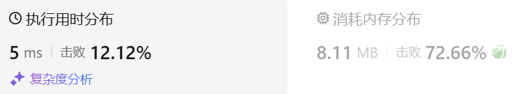

### 02、整数反转（20241009，7题，中等）
<div style="border: 1px solid black; padding: 10px; background-color: SteelBlue;">

给你一个 32 位的有符号整数 x ，返回将 x 中的数字部分反转后的结果。

如果反转后整数超过 32 位的有符号整数的范围 [−231,  231 − 1] ，就返回 0。

**假设环境不允许存储 64 位整数（有符号或无符号）。**
 

示例 1：

- 输入：x = 123
- 输出：321

示例 2：

- 输入：x = -123
- 输出：-321

示例 3：

- 输入：x = 120
- 输出：21

示例 4：

- 输入：x = 0
- 输出：0
 

提示：

- -231 <= x <= 231 - 1

  </p>
</div>

<hr style="border-top: 5px solid #DC143C;">
<table>
  <tr>
    <td bgcolor="Yellow" style="padding: 5px; border: 0px solid black;">
      <span style="font-weight: bold; font-size: 20px;color: black;">
      自己答案 
      </span>
    </td>
  </tr>
</table>
<div style="padding: 0px; border: 1.5px solid LightSalmon; margin-bottom: 10px;">

```C++ {.line-numbers}
/*
思路：
先将数字转为字符串
再看长度大于等于整型最长长度，且首字符大于2，等于2的话，要依次检查各数字大小，以防超出范围（排除首位为0的情况）
    可以专门使用一个函数做这个检查
-2147483648到2147483647
string str1 = "2147483648"  负数不能超过这个
string str1 = "2147483647"  正数不能超过这个
长度为10

2147483412

2143847421
*/

class Solution {
public:
    bool judgeNum(string& str, bool isUp){  // 判断是否越界
        string tmp = "2147483648";
        for(int i = 0; i < str.size(); i++){
            if(str[i] - '0' == tmp[i] - '0' && i != str.size()-1){
                continue;
            }else if(str[i] - '0' < tmp[i] - '0'){
                return true;
            }else if(str[i] - '0' > tmp[i] - '0'){
                return false;
            }
            if(isUp && str[str.size()-1] - '0' > '7' - '0'){
                return false;
            }
        }
        return false;
    }

    int changeNum(string& str){
        int ret = 0;
        int count = 1;
        for(int i = str.size()-1; i >= 0; i--){
            ret += (str[i] - '0') * count;
            if(i != 0){
                count = count*10;  // 防止整数溢出！！！
            }
        }
        return ret;
    }
    int reverse(int x) {
        string str1;
        bool isUp = true;
        int tmp = x;
        if(x < 0) isUp = false;
        int ret = 1;
        int count = 1;

        while(tmp){
            int num = tmp%10;
            if(num < 0) num = -num;
            str1 += to_string(num);
            tmp = tmp/10;  // 注意循环跳出的必要条件!!!
        }
        if(str1.size() == 10 && str1[0] != '0'){  // 对于可能超出界限的数字
            if(!judgeNum(str1, isUp)){  
                return 0;
            }
        }
        ret = changeNum(str1);  // 正常的进行数字转换即可
        if(isUp){
            return ret;
        }else{
            return -ret;
        }
    }
};


class Solution {
public:
    bool judgeNum(string& str, bool isUp){  // 判断是否越界
        string tmp = "2147483648";
        for(int i = 0; i < str.size(); i++){
            if(str[i] - '0' == tmp[i] - '0' && i != str.size()-1){
                continue;
            }else if(str[i] - '0' < tmp[i] - '0'){
                return true;
            }else if(str[i] - '0' > tmp[i] - '0'){
                return false;
            }
            if(isUp && str[str.size()-1] - '0' > '7' - '0'){
                return false;
            }
        }

        // for(int i = 0; i < str.size(); i++){
        //     if(str[i] - '0' < str1[i] - '0'){
        //         return true;
        //     }else  if(str[i] - '0' > str1[i] - '0'){
        //         return false;
        //     }
        // }
        // if(isUp && str[9] - '0' > '7' - '0'){
        //     return false;
        // }
        return false;
    }

    int changeNum(string& str){
        int ret = 0;
        int count = 1;
        for(int i = str.size()-1; i >= 0; i--){
            // ret += stoi(str1[i])*count;
            // ret += atoi(str1[i])*count;
            // ret += std::stoi(str1[i]) * count;
            ret += (str[i] - '0') * count;
            if(i != 0){
                count = count*10;
            }
            // count = count*10;
        }
        return ret;
    }
    int reverse(int x) {
        string str1;
        bool isUp = true;
        int tmp = x;
        if(x < 0) isUp = false;
        int ret = 1;
        int count = 1;

        while(tmp){
            int num = tmp%10;
            if(num < 0) num = -num;
            // str1 += itos(num);
            str1 += to_string(num);
            tmp = tmp/10;  // 注意循环跳出的必要条件
        }
        if(str1.size() == 10 && str1[0] != '0'){  // 对于可能超出界限的数字
            if(!judgeNum(str1, isUp)){  // 正常的进行数字转换即可
                return 0;
            }
        }
        // else{
        //     ret = changeNum(str1);
        // }
        ret = changeNum(str1);
        if(isUp){
            return ret;
        }else{
            return -ret;
        }
    }
};
```

</div>


<table>
  <tr>
    <td bgcolor="Yellow" style="padding: 5px; border: 0px solid black;">
      <span style="font-weight: bold; font-size: 20px;color: black;">
      仿照答案 
      </span>
    </td>
  </tr>
</table>

<div style="padding: 0px; border: 1.5px solid LightSalmon; margin-bottom: 10px">

```C++ {.line-numbers}
/*
思路：
记rev为翻转后的数字,digits为x每次取的末尾数字
digits = x % 10
x = x/10
则rev = rev*10 + digits
每次运算需要判断INT32_MIN <= rev*10 + digits <= INT32_MAX

INT32_MAX = 2147483647 = floor(INT32_MAX/10)*10 + (INT32_MAX mod 10) = floor(INT32_MAX/10)*10 + 7
当x > 0时，
    rev*10 + digits <= INT32_MAX = floor(INT32_MAX/10)*10 + 7
    即(rev - floor(INT32_MAX/10)) * 10 <= 7 - digits

    当rev - floor(INT32_MAX/10) > 0，由于digits大于0，而左边大于10，右边小于10，所以等式不可能成立
    当rev - floor(INT32_MAX/10) = 0，当digits <= 7时，等式成立
    当rev - floor(INT32_MAX/10) < 0，左边至少-10，右边最小在digi=9时，为-2，此时等式恒成立

    另外，由于当rev - floor(INT32_MAX/10) = 0，若rev加入这个digits达到最长位数，即digits为x的最高位，
        且此时可能造成溢出时，但由于x没溢出，此时digits <= 2，即此时等式也恒成立
    
    总结这部分，不等式简化为
        rev - floor(INT32_MAX/10) <= 0,即rev <= floor(INT32_MAX/10)

x < 0时，分析过程与上面类似

综合可知,INT32_MIN <= rev*10 + digits <= INT32_MAX的判断可以转为下式：
    ceil(INT32_MIN/10) <= rev <= floor(INT32_MAX/10)
*/
class Solution {
public:
    int reverse(int x) {
        int rev = 0;

        while(x){
            // int digits = x % 10;  应该先检查是否溢出，再计算rev。所以这段注释的内容要放在下面if判断的后面！！！
            // x = x/10;
            // rev = rev*10 + digits;
            if(rev < INT32_MIN/10 || rev > INT32_MAX/10) return 0;
            int digits = x % 10;
            x = x/10;
            rev = rev*10 + digits;
        }
        return rev;
    }
};
```
</div>



<hr style="border-top: 5px solid #DC143C;">

<table>
  <tr>
    <td bgcolor="Yellow" style="padding: 5px; border: 0px solid black;">
      <span style="font-weight: bold; font-size: 20px;color: black;">
      自己调试版本（通过！！！）
      </span>
    </td>
  </tr>
</table>

<div style="padding: 0px; border: 1.5px solid LightSalmon; margin-bottom: 10px">

```C++ {.line-numbers}


```
</div>

<table>
  <tr>
    <td bgcolor="Yellow" style="padding: 5px; border: 0px solid black;">
      <span style="font-weight: bold; font-size: 20px;color: black;">
      仿照答案版本v2（去注释）
      </span>
    </td>
  </tr>
</table>

<div style="padding: 0px; border: 1.5px solid LightSalmon; margin-bottom: 10px">

```C++ {.line-numbers}


```
</div>

<hr style="border-top: 5px solid #DC143C;">

<table>
  <tr>
    <td bgcolor="Yellow" style="padding: 5px; border: 0px solid black;">
      <span style="font-weight: bold; font-size: 20px;color: black;">
      仿照答案版本v2
      </span>
    </td>
  </tr>
</table>

<div style="padding: 0px; border: 1.5px solid LightSalmon; margin-bottom: 10px">

```C++ {.line-numbers}


```
</div>

<table>
  <tr>
    <td bgcolor="Yellow" style="padding: 5px; border: 0px solid black;">
      <span style="font-weight: bold; font-size: 20px;color: black;">
      ChatGPT
      </span>
    </td>
  </tr>
</table>

<div style="padding: 0px; border: 1.5px solid LightSalmon; margin-bottom: 10px">

```C++ {.line-numbers}


```
</div>
