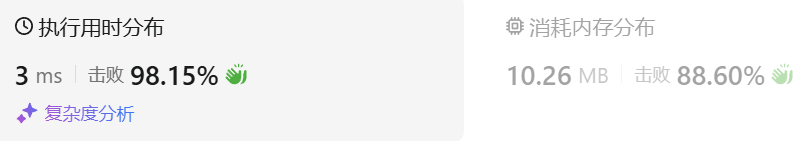

### 01、无重复字符的最长子串（20240911，3题，中等）
<div style="border: 1px solid black; padding: 10px; background-color: SteelBlue;">

给定一个字符串 s ，请你找出其中不含有重复字符的 最长 
子串
 的长度。

 

示例 1:

- 输入: s = "abcabcbb"
- 输出: 3 
- 解释: 因为无重复字符的最长子串是 "abc"，所以其长度为 3。

示例 2:

- 输入: s = "bbbbb"
- 输出: 1
- 解释: 因为无重复字符的最长子串是 "b"，所以其长度为 1。

示例 3:

- 输入: s = "pwwkew"
- 输出: 3
- 解释: 因为无重复字符的最长子串是 "wke"，所以其长度为 3。  
     请注意，你的答案必须是 子串 的长度，"pwke" 是一个子序列，不是子串。  
 

提示：

- 0 <= s.length <= 5 * 104
- s 由英文字母、数字、符号和空格组成

  </p>
</div>

<hr style="border-top: 5px solid #DC143C;">
<table>
  <tr>
    <td bgcolor="Yellow" style="padding: 5px; border: 0px solid black;">
      <span style="font-weight: bold; font-size: 20px;color: black;">
      瞄过题解思路（滑动窗口 + unordered_map）
      </span>
    </td>
  </tr>
</table>
<div style="padding: 0px; border: 1.5px solid LightSalmon; margin-bottom: 10px;">

```C++ {.line-numbers}
/*
滑动窗口
先出去字符串中的空格，但是答案不需要。。
使用max_len记录最长不重复子串长度
使用unordered_map记录当前窗口中的字符
left和right指向窗口两端
right向右遍历
    检查s[right]是否出现在窗口
        出现，计算当前的最长不重复子串的长度，即right-1 - left + 1，然后left指向左边重复字符的下一个位置
        没出现，则继续向后遍历
*/

// 去注释
class Solution {
public:
    int lengthOfLongestSubstring(string s) {
        size_t new_size = s.size();
        int left = 0;
        int right = 1;

        if(new_size <= 1) return new_size;
        int max_len = 1;
        left = 0;
        unordered_map<char, int> map;
        map[s[0]] = 0;

        while(right < new_size){
            auto it = map.find(s[right]);
            if(it == map.end()){  // 新的字符没出现在map中，继续遍历，但要注意遍历到结尾的情况
                map[s[right]] = right;
                ++right;
                if(right == new_size){  // 上面条件遍历到结尾，但没重复的情况
                    int len = right - 1 - left + 1;
                    if(len > max_len) max_len = len;
                    right++;
                }
            }else{  // it != map.end() 新的字符出现在map中，计算当前的长度，并移动left和right指针
                int index = it->second;  // 左边重复字符的索引
                int len = right - 1 - left + 1;
                if(len > max_len) max_len = len;
                for(int i = left; i <= index; i++){
                    map.erase(s[i]);
                }

                map[s[right]] = right;

                left = index + 1;
                right++;
            }
        }
        return max_len;
    }
};

// 初始
class Solution {
public:
    int lengthOfLongestSubstring(string s) {
        // size_t size = s.size();
        size_t new_size = s.size();
        int left = 0;
        int right = 1;

        // for(int i = 0; i < size; i++){
        //     if(s[i] != ' '){
        //         s[left] = s[i];
        //         left++;
        //     }
        // }
        // s.resize(left);
        // size_t new_size = left;

        if(new_size <= 1) return new_size;
        int max_len = 1;
        left = 0;
        unordered_map<char, int> map;
        map[s[0]] = 0;

        while(right < new_size){
            auto it = map.find(s[right]);
            if(it == map.end()){  // 新的字符没出现在map中，继续遍历，但要注意遍历到结尾的情况
                map[s[right]] = right;
                ++right;
                if(right == new_size){  // 上面条件遍历到结尾，但没重复的情况
                    int len = right - 1 - left + 1;
                    if(len > max_len) max_len = len;
                    right++;
                }
            }
            // }else if(right == new_size){  // 上面条件遍历到结尾，但没重复的情况
            //     int len = right - 1 - left + 1;
            //     if(len > max_len) max_len = len;
            //     right++;
            else{  // it != map.end() 新的字符出现在map中，计算当前的长度，并移动left和right指针
                
                int index = it->second;  // 左边重复字符的索引
                int len = right - 1 - left + 1;
                if(len > max_len) max_len = len;
                for(int i = left; i <= index; i++){
                    map.erase(s[i]);
                }

                map[s[right]] = right;

                left = index + 1;
                right++;
            }
        }
        return max_len;
    }
};
```

</div>


<table>
  <tr>
    <td bgcolor="Yellow" style="padding: 5px; border: 0px solid black;">
      <span style="font-weight: bold; font-size: 20px;color: black;">
      瞄过题解思路2（滑动窗口 + 哈希表）
      </span>
    </td>
  </tr>
</table>

<div style="padding: 0px; border: 1.5px solid LightSalmon; margin-bottom: 10px">

```C++ {.line-numbers}

/*
滑动窗口
使用max_len记录最长不重复子串长度
使用vector<int> asci(128, -1)记录当前窗口中的字符是否出现过
left和right指向窗口两端
right向右遍历
    检查s[right]是否出现在窗口
        出现，
            出现在窗口左边，更新asci表中它的索引
            出现在窗口中，计算当前的最长不重复子串的长度，即right-1 - left + 1，然后left指向左边重复字符的下一个位置
        没出现，则继续向后遍历
            注意遍历到最后字符的情况
*/
class Solution {
public:
    int lengthOfLongestSubstring(string s) {
        size_t new_size = s.size();
        int left = 0;
        int right = 1;
        // int asci[128] = {-1};
        vector<int> asci(128, -1);

        if(new_size <= 1) return new_size;
        int max_len = 1;
        left = 0;
        asci[s[0]] = 0;

        while(right < new_size){
            int cur = asci[s[right]];
            if(cur == -1){  // 新的字符没出现在map中，继续遍历，但要注意遍历到结尾的情况
                asci[s[right]] = right;
                ++right;
                if(right == new_size){  // 上面条件遍历到结尾，但没重复的情况
                    int len = right - 1 - left + 1;
                    if(len > max_len) max_len = len;
                    right++;
                }
            }else{  // 新的字符出现在map中，计算当前的长度，并移动left和right指针
                int index = asci[s[right]];
                if(index < left){
                    asci[s[right]] = right;
                    ++right;
                    if(right == new_size){  // 上面条件遍历到结尾，但没重复的情况
                        int len = right - 1 - left + 1;
                        if(len > max_len) max_len = len;
                    }
                }else{
                    int len = right - 1 - left + 1;
                    if(len > max_len) max_len = len;
                    asci[s[right]] = right;
                    left = index + 1;
                    right++;
                }
            }
        }
        return max_len;
    } 
};
```
</div>



<table>
  <tr>
    <td bgcolor="Yellow" style="padding: 5px; border: 0px solid black;">
      <span style="font-weight: bold; font-size: 20px;color: black;">
      仿照答案（滑动窗口 + unordered_map）
      </span>
    </td>
  </tr>
</table>

<div style="padding: 0px; border: 1.5px solid LightSalmon; margin-bottom: 10px">

```C++ {.line-numbers}

/*
滑动窗口 + unordered_map
abcabcab
left为窗口的左边界偏左一位，初始化为-1.方便计算当前窗口的长度
right用于遍历数组
遍历过程中，保证窗口中无重复字符，并计算当前的窗口长度len，并记录max_len
    记录不同字符和其索引，vector<int> asci(128, -1)或者unordered_map<char, int> map都可以
当遇到相同字符时，
    更新左边界left，并更新当前相同字符在asci中的索引!!!，同时计算当前的窗口长度
*/
class Solution {
public:
    int lengthOfLongestSubstring(string s) {
        size_t size = s.size();
        unordered_map<char, int> map;
        int left = -1;
        int max_len = 0;

        for(int right = 0; right < size; right++){
            auto it = map.find(s[right]);
            if(it != map.end()){  // 重复了，更新left
                left = max(left, it->second);
            }
            map[s[right]] = right;
            max_len = max(max_len, right-left);
        }
        return max_len;
    } 
};
```
</div>


<table>
  <tr>
    <td bgcolor="Yellow" style="padding: 5px; border: 0px solid black;">
      <span style="font-weight: bold; font-size: 20px;color: black;">
      仿照答案（滑动窗口 + 哈希表）
      </span>
    </td>
  </tr>
</table>

<div style="padding: 0px; border: 1.5px solid LightSalmon; margin-bottom: 10px">

```C++ {.line-numbers}
/*
滑动窗口 + 哈希表
abcabcab
left为窗口的左边界偏左一位，初始化为-1.方便计算当前窗口的长度
right用于遍历数组
遍历过程中，保证窗口中无重复字符，并计算当前的窗口长度len，并记录max_len
    记录不同字符和其索引，vector<int> asci(128, -1)或者unordered_map<char, int> map都可以
当遇到相同字符时，
    更新左边界left，并更新当前相同字符在asci中的索引!!!，同时计算当前的窗口长度
*/
class Solution {
public:
    int lengthOfLongestSubstring(string s) {
        size_t size = s.size();
        // unordered_map<char, int> map;
        vector<int> asci(128, -1);
        int left = -1;
        int max_len = 0;

        for(int right = 0; right < size; right++){
            // auto it = map.find(s[right]);
            int index = asci[s[right]];
            if(index != -1){  // 重复了，更新left
                left = max(left, index);
            }
            asci[s[right]] = right;
            max_len = max(max_len, right-left);
        }
        return max_len;
    } 
};
```
</div>


<table>
  <tr>
    <td bgcolor="Yellow" style="padding: 5px; border: 0px solid black;">
      <span style="font-weight: bold; font-size: 20px;color: black;">
      自己答案（未通过，动态规划）
      </span>
    </td>
  </tr>
</table>

<div style="padding: 0px; border: 1.5px solid LightSalmon; margin-bottom: 10px">

```C++ {.line-numbers}
/*
即dp[i][j]为以i-1开始至j-1结尾的字符串最长不重复子串长度
    当i-1和j-1字符相同时，dp[i][j] = max(dp[i+1][j],dp[i][j-1])
    当i-1和j-1字符不相同时，
        若这两索引相差不大于1，j-1 - (i-1) <= 1，dp[i][j] = j-1 - (i-1) + 1 = j-i+1。为1或者2
        当这两索引相差大于1，
            若dp[i+1][j-1] 的值等于其间距（j-i+1），说明中间都不等，现在就是dp[i][j] = dp[i+1][j-1]+2
            若dp[i+1][j-1] 的值不等于其间距（j-i+1），说明中间有重复子串，dp[i][j] = max(dp[i+1][j],dp[i][j-1])

初始化
    初始化为0
    dp[1][1]

遍历顺序
    i要从大往小遍历
    j从小往大遍历
*/
class Solution {
public:
    int lengthOfLongestSubstring(string s) {
        size_t size = s.size();

        vector<vector<int>> dp(size+1, vector<int>(size+1, 0));
        for(int i = size; i >= 0; --i){
            dp[i][i] = 1;
        }
        for(int i = size-1; i >= 1; --i){
            for(int j = i+1; j <= size; ++j){
                if(s[i-1] == s[j-1]){
                    dp[i][j] = max(dp[i+1][j],dp[i][j-1]);
                }else{
                    if(i - j == 1){
                        dp[i][j] = 2;
                    }else{
                        if(dp[i+1][j-1] == j-i+1-2){
                            dp[i][j] = dp[i+1][j-1]+2;
                        }else{
                            dp[i][j] = max(dp[i+1][j],dp[i][j-1]);
                        }
                    }
                }
            }
        }
        return dp[1][size];
    }
};
```
</div>

<hr style="border-top: 5px solid #DC143C;">

<table>
  <tr>
    <td bgcolor="Yellow" style="padding: 5px; border: 0px solid black;">
      <span style="font-weight: bold; font-size: 20px;color: black;">
      LeetCode（滑动窗口 + unordered_map））
      </span>
    </td>
  </tr>
</table>

<div style="padding: 0px; border: 1.5px solid LightSalmon; margin-bottom: 10px">

```C++ {.line-numbers}
class Solution {
public:
    int lengthOfLongestSubstring(string s) {
        unordered_map<char, int> dic;
        int i = -1, res = 0, len = s.size();
        for(int j = 0; j < len; j++) {
            if (dic.find(s[j]) != dic.end())
                i = max(i, dic.find(s[j])->second); // 更新左指针
            dic[s[j]] = j; // 哈希表记录
            res = max(res, j - i); // 更新结果
        }
        return res;
    }
};

作者：Krahets
链接：https://leetcode.cn/problems/longest-substring-without-repeating-characters/solutions/2361797/3-wu-zhong-fu-zi-fu-de-zui-chang-zi-chua-26i5/
来源：力扣（LeetCode）
著作权归作者所有。商业转载请联系作者获得授权，非商业转载请注明出处。
```
</div>

<table>
  <tr>
    <td bgcolor="Yellow" style="padding: 5px; border: 0px solid black;">
      <span style="font-weight: bold; font-size: 20px;color: black;">
      ChatGPT（动态规划）
      </span>
    </td>
  </tr>
</table>

<div style="padding: 0px; border: 1.5px solid LightSalmon; margin-bottom: 10px">

```C++ {.line-numbers}
class Solution {
public:
    int lengthOfLongestSubstring(string s) {
        vector<int> dp(s.size(), 0);  // dp数组
        unordered_map<char, int> lastPosition;  // 记录字符上次出现的位置
        int maxLength = 0;

        for (int i = 0; i < s.size(); ++i) {
            if (lastPosition.find(s[i]) == lastPosition.end()) {
                // 如果字符没有出现过
                dp[i] = (i == 0) ? 1 : dp[i-1] + 1;
            } else {
                // 如果字符出现过，计算与上次出现位置的距离
                int distance = i - lastPosition[s[i]];
                dp[i] = min(dp[i-1] + 1, distance);
            }
            lastPosition[s[i]] = i;  // 更新字符的最新出现位置
            maxLength = max(maxLength, dp[i]);  // 更新最大长度
        }
        return maxLength;
    }
};

```
</div>


<h5>一维动态规划思路讲解：</h5>

1. **定义dp数组**：
   我们用`dp[i]`来表示从字符串开头到位置`i`的最长不重复子串的长度。动态规划的转移需要考虑当前字符与之前的重复情况。

2. **处理逻辑**：
   对每个字符`i`，如果该字符之前没有出现，则`dp[i]`等于`dp[i-1] + 1`。如果字符出现过，计算与上次出现的位置的距离，并更新`dp[i]`为最小的值。

3. **优化思路**：
   使用一个哈希表`lastPosition`记录每个字符最后出现的位置，以帮助快速查找上一次出现位置。

<h5>代码：</h5>

```cpp
class Solution {
public:
    int lengthOfLongestSubstring(string s) {
        vector<int> dp(s.size(), 0);
        unordered_map<char, int> lastPosition;  // 记录字符上次出现的位置
        int maxLength = 0;

        for (int i = 0; i < s.size(); ++i) {
            if (lastPosition.find(s[i]) == lastPosition.end()) {
                // 如果字符没有出现过
                dp[i] = (i == 0) ? 1 : dp[i-1] + 1;
            } else {
                // 如果字符出现过，计算与上次出现位置的距离
                int distance = i - lastPosition[s[i]];
                dp[i] = min(dp[i-1] + 1, distance);
            }
            lastPosition[s[i]] = i;  // 更新字符的最新出现位置
            maxLength = max(maxLength, dp[i]);  // 更新最大长度
        }
        return maxLength;
    }
};
```

<h5>时间和空间复杂度：</h5>

1. **时间复杂度**：`O(n)`，因为我们遍历了一次字符串，并对每个字符进行了常数操作。
2. **空间复杂度**：`O(n)`，使用了dp数组和哈希表来存储信息。
   
   
