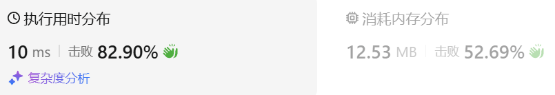
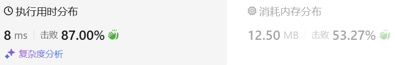
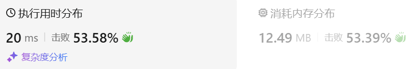

### 01、从中序与后序遍历序列构造二叉树（20240620，112题，中等。240702整理）
<div style="border: 1px solid black; padding: 10px; background-color: SteelBlue;">


  </p>
</div>

<hr style="border-top: 5px solid #DC143C;">
<table>
  <tr>
    <td bgcolor="Yellow" style="padding: 5px; border: 0px solid black;">
      <span style="font-weight: bold; font-size: 20px;color: black;">
      瞄过题解思路
      </span>
    </td>
  </tr>
</table>
<div style="padding: 0px; border: 1.5px solid LightSalmon; margin-bottom: 10px;">

```C++ {.line-numbers}
/*
滑动窗口
先出去字符串中的空格，但是答案不需要。。
使用max_len记录最长不重复子串长度
使用unordered_map记录当前窗口中的字符
left和right指向窗口两端
right向右遍历
    检查s[right]是否出现在窗口
        出现，计算当前的最长不重复子串的长度，即right-1 - left + 1，然后left指向左边重复字符的下一个位置
        没出现，则继续向后遍历
*/

// 去注释
class Solution {
public:
    int lengthOfLongestSubstring(string s) {
        size_t new_size = s.size();
        int left = 0;
        int right = 1;

        if(new_size <= 1) return new_size;
        int max_len = 1;
        left = 0;
        unordered_map<char, int> map;
        map[s[0]] = 0;

        while(right < new_size){
            auto it = map.find(s[right]);
            if(it == map.end()){  // 新的字符没出现在map中，继续遍历，但要注意遍历到结尾的情况
                map[s[right]] = right;
                ++right;
                if(right == new_size){  // 上面条件遍历到结尾，但没重复的情况
                    int len = right - 1 - left + 1;
                    if(len > max_len) max_len = len;
                    right++;
                }
            }else{  // it != map.end() 新的字符出现在map中，计算当前的长度，并移动left和right指针
                int index = it->second;  // 左边重复字符的索引
                int len = right - 1 - left + 1;
                if(len > max_len) max_len = len;
                for(int i = left; i <= index; i++){
                    map.erase(s[i]);
                }

                map[s[right]] = right;

                left = index + 1;
                right++;
            }
        }
        return max_len;
    }
};

// 初始
class Solution {
public:
    int lengthOfLongestSubstring(string s) {
        // size_t size = s.size();
        size_t new_size = s.size();
        int left = 0;
        int right = 1;

        // for(int i = 0; i < size; i++){
        //     if(s[i] != ' '){
        //         s[left] = s[i];
        //         left++;
        //     }
        // }
        // s.resize(left);
        // size_t new_size = left;

        if(new_size <= 1) return new_size;
        int max_len = 1;
        left = 0;
        unordered_map<char, int> map;
        map[s[0]] = 0;

        while(right < new_size){
            auto it = map.find(s[right]);
            if(it == map.end()){  // 新的字符没出现在map中，继续遍历，但要注意遍历到结尾的情况
                map[s[right]] = right;
                ++right;
                if(right == new_size){  // 上面条件遍历到结尾，但没重复的情况
                    int len = right - 1 - left + 1;
                    if(len > max_len) max_len = len;
                    right++;
                }
            }
            // }else if(right == new_size){  // 上面条件遍历到结尾，但没重复的情况
            //     int len = right - 1 - left + 1;
            //     if(len > max_len) max_len = len;
            //     right++;
            else{  // it != map.end() 新的字符出现在map中，计算当前的长度，并移动left和right指针
                
                int index = it->second;  // 左边重复字符的索引
                int len = right - 1 - left + 1;
                if(len > max_len) max_len = len;
                for(int i = left; i <= index; i++){
                    map.erase(s[i]);
                }

                map[s[right]] = right;

                left = index + 1;
                right++;
            }
        }
        return max_len;
    }
};
```

</div>


<table>
  <tr>
    <td bgcolor="Yellow" style="padding: 5px; border: 0px solid black;">
      <span style="font-weight: bold; font-size: 20px;color: black;">
      自己答案（未通过，动态规划）
      </span>
    </td>
  </tr>
</table>

<div style="padding: 0px; border: 1.5px solid LightSalmon; margin-bottom: 10px">

```C++ {.line-numbers}
/*
即dp[i][j]为以i-1开始至j-1结尾的字符串最长不重复子串长度
    当i-1和j-1字符相同时，dp[i][j] = max(dp[i+1][j],dp[i][j-1])
    当i-1和j-1字符不相同时，
        若这两索引相差不大于1，j-1 - (i-1) <= 1，dp[i][j] = j-1 - (i-1) + 1 = j-i+1。为1或者2
        当这两索引相差大于1，
            若dp[i+1][j-1] 的值等于其间距（j-i+1），说明中间都不等，现在就是dp[i][j] = dp[i+1][j-1]+2
            若dp[i+1][j-1] 的值不等于其间距（j-i+1），说明中间有重复子串，dp[i][j] = max(dp[i+1][j],dp[i][j-1])

初始化
    初始化为0
    dp[1][1]

遍历顺序
    i要从大往小遍历
    j从小往大遍历
*/
class Solution {
public:
    int lengthOfLongestSubstring(string s) {
        size_t size = s.size();

        vector<vector<int>> dp(size+1, vector<int>(size+1, 0));
        for(int i = size; i >= 0; --i){
            dp[i][i] = 1;
        }
        for(int i = size-1; i >= 1; --i){
            for(int j = i+1; j <= size; ++j){
                if(s[i-1] == s[j-1]){
                    dp[i][j] = max(dp[i+1][j],dp[i][j-1]);
                }else{
                    if(i - j == 1){
                        dp[i][j] = 2;
                    }else{
                        if(dp[i+1][j-1] == j-i+1-2){
                            dp[i][j] = dp[i+1][j-1]+2;
                        }else{
                            dp[i][j] = max(dp[i+1][j],dp[i][j-1]);
                        }
                    }
                }
            }
        }
        return dp[1][size];
    }
};
```
</div>

<hr style="border-top: 5px solid #DC143C;">

<table>
  <tr>
    <td bgcolor="Yellow" style="padding: 5px; border: 0px solid black;">
      <span style="font-weight: bold; font-size: 20px;color: black;">
      自己调试版本（通过！！！）
      </span>
    </td>
  </tr>
</table>

<div style="padding: 0px; border: 1.5px solid LightSalmon; margin-bottom: 10px">

```C++ {.line-numbers}


```
</div>

<table>
  <tr>
    <td bgcolor="Yellow" style="padding: 5px; border: 0px solid black;">
      <span style="font-weight: bold; font-size: 20px;color: black;">
      ChatGPT（动态规划）
      </span>
    </td>
  </tr>
</table>

<div style="padding: 0px; border: 1.5px solid LightSalmon; margin-bottom: 10px">

```C++ {.line-numbers}
class Solution {
public:
    int lengthOfLongestSubstring(string s) {
        vector<int> dp(s.size(), 0);  // dp数组
        unordered_map<char, int> lastPosition;  // 记录字符上次出现的位置
        int maxLength = 0;

        for (int i = 0; i < s.size(); ++i) {
            if (lastPosition.find(s[i]) == lastPosition.end()) {
                // 如果字符没有出现过
                dp[i] = (i == 0) ? 1 : dp[i-1] + 1;
            } else {
                // 如果字符出现过，计算与上次出现位置的距离
                int distance = i - lastPosition[s[i]];
                dp[i] = min(dp[i-1] + 1, distance);
            }
            lastPosition[s[i]] = i;  // 更新字符的最新出现位置
            maxLength = max(maxLength, dp[i]);  // 更新最大长度
        }
        return maxLength;
    }
};

```
</div>



<hr style="border-top: 5px solid #DC143C;">

<table>
  <tr>
    <td bgcolor="Yellow" style="padding: 5px; border: 0px solid black;">
      <span style="font-weight: bold; font-size: 20px;color: black;">
      ChatGPT（动态规划，最后有讲解）
      </span>
    </td>
  </tr>
</table>

<div style="padding: 0px; border: 1.5px solid LightSalmon; margin-bottom: 10px">

```C++ {.line-numbers}
class Solution {
public:
    int lengthOfLongestSubstring(string s) {
        if (s.empty()) return 0;  // 边界情况处理

        vector<int> dp(s.size(), 0);  // dp数组，用于记录以每个字符结尾的最长无重复子串的长度
        unordered_map<char, int> lastPosition;  // 哈希表，记录每个字符上次出现的位置
        int maxLength = 0;

        for (int i = 0; i < s.size(); ++i) {
            if (lastPosition.find(s[i]) == lastPosition.end()) {
                // 如果字符没有出现过
                dp[i] = (i == 0) ? 1 : dp[i-1] + 1;
            } else {
                // 如果字符出现过，计算距离上次出现的距离
                int distance = i - lastPosition[s[i]];
                dp[i] = min(dp[i-1] + 1, distance);
            }
            lastPosition[s[i]] = i;  // 更新字符的最新出现位置
            maxLength = max(maxLength, dp[i]);  // 更新最大长度
        }
        return maxLength;
    }
};

```
</div>



<table>
  <tr>
    <td bgcolor="Yellow" style="padding: 5px; border: 0px solid black;">
      <span style="font-weight: bold; font-size: 20px;color: black;">
      随想录答案
      </span>
    </td>
  </tr>
</table>

<div style="padding: 0px; border: 1.5px solid LightSalmon; margin-bottom: 10px">

```C++ {.line-numbers}


```
</div>

要使用动态规划来解决 LeetCode 第 3 题“无重复字符的最长子串”，确实可以实现，不过需要采用一维动态规划的思路，而不是二维的方式。

### 修改后的动态规划方法：

1. 定义一个 `dp[i]` 表示以第 `i` 个字符为结尾的最长无重复子串的长度。
2. 我们需要一个哈希表（或数组）来记录每个字符的最近出现位置。

### 动态规划核心思想：
- 遍历字符串的每个字符 `s[i]`，检查它在前面是否出现过。
- 如果未出现过，当前的最长无重复子串长度 `dp[i] = dp[i-1] + 1`。
- 如果出现过，则要更新为当前字符距离上次出现的距离 `i - last_position`，与 `dp[i-1] + 1` 中较小的一个。

### 代码实现：

```cpp
class Solution {
public:
    int lengthOfLongestSubstring(string s) {
        vector<int> dp(s.size(), 0);  // dp数组
        unordered_map<char, int> lastPosition;  // 记录字符上次出现的位置
        int maxLength = 0;

        for (int i = 0; i < s.size(); ++i) {
            if (lastPosition.find(s[i]) == lastPosition.end()) {
                // 如果字符没有出现过
                dp[i] = (i == 0) ? 1 : dp[i-1] + 1;
            } else {
                // 如果字符出现过，计算与上次出现位置的距离
                int distance = i - lastPosition[s[i]];
                dp[i] = min(dp[i-1] + 1, distance);
            }
            lastPosition[s[i]] = i;  // 更新字符的最新出现位置
            maxLength = max(maxLength, dp[i]);  // 更新最大长度
        }
        return maxLength;
    }
};
```

### 复杂度分析：
- **时间复杂度**：O(n)，因为我们仅需遍历字符串一次。
- **空间复杂度**：O(n)，需要存储 `dp` 数组和字符的最近出现位置。


### 一维 `dp` 思路讲解

为了找到字符串中最长无重复子串的长度，我们可以使用一维动态规划 (`dp`) 进行求解。思路是基于跟踪每个字符的上一次出现位置，以及计算无重复子串的长度。

#### 1. 核心思路
- 使用 `dp[i]` 表示以第 `i` 个字符结尾的最长无重复子串的长度。
- 使用一个哈希表（`unordered_map<char, int>`）来记录每个字符的上一次出现的位置。
- 遍历字符串时，每当遇到一个字符时：
  - 如果字符没有出现过，`dp[i]` 直接等于前一个位置的子串长度加 1。
  - 如果字符出现过，则计算上次出现位置到当前的距离，更新 `dp[i]` 的值为 **最小值**，确保子串无重复。

#### 2. 动态规划状态转移方程
对于每个字符 `s[i]`：
- 如果 `s[i]` 没有出现过，则 `dp[i] = dp[i-1] + 1`。
- 如果 `s[i]` 出现过，设它上次出现的位置为 `lastPosition[s[i]]`，计算 `distance = i - lastPosition[s[i]]`。
  - 此时，`dp[i] = min(dp[i-1] + 1, distance)`。

最后，遍历所有的 `dp[i]`，找出最大的值即为答案。

#### 3. 初始化
- `dp[0] = 1`，即第一个字符本身为长度为 1 的子串。
- 需要初始化哈希表为空。

#### 4. 代码实现

```cpp
class Solution {
public:
    int lengthOfLongestSubstring(string s) {
        if (s.empty()) return 0;  // 边界情况处理

        vector<int> dp(s.size(), 0);  // dp数组，用于记录以每个字符结尾的最长无重复子串的长度
        unordered_map<char, int> lastPosition;  // 哈希表，记录每个字符上次出现的位置
        int maxLength = 0;

        for (int i = 0; i < s.size(); ++i) {
            if (lastPosition.find(s[i]) == lastPosition.end()) {
                // 如果字符没有出现过
                dp[i] = (i == 0) ? 1 : dp[i-1] + 1;
            } else {
                // 如果字符出现过，计算距离上次出现的距离
                int distance = i - lastPosition[s[i]];
                dp[i] = min(dp[i-1] + 1, distance);
            }
            lastPosition[s[i]] = i;  // 更新字符的最新出现位置
            maxLength = max(maxLength, dp[i]);  // 更新最大长度
        }
        return maxLength;
    }
};
```

#### 5. 复杂度分析
- **时间复杂度**：O(n)，我们遍历字符串一次，且每次操作哈希表查询和更新的时间复杂度均为 O(1)。
- **空间复杂度**：O(n)，需要存储 `dp` 数组以及哈希表来记录每个字符的上一次出现位置。

### 总结
这个一维 `dp` 方法高效地解决了寻找最长无重复子串的问题，通过使用哈希表跟踪字符的上一次出现位置，动态规划状态转移确保了我们能够正确地计算出无重复子串的长度。


======================

<h5>一维动态规划思路讲解：</h5>

1. **定义dp数组**：
   我们用`dp[i]`来表示从字符串开头到位置`i`的最长不重复子串的长度。动态规划的转移需要考虑当前字符与之前的重复情况。

2. **处理逻辑**：
   对每个字符`i`，如果该字符之前没有出现，则`dp[i]`等于`dp[i-1] + 1`。如果字符出现过，计算与上次出现的位置的距离，并更新`dp[i]`为最小的值。

3. **优化思路**：
   使用一个哈希表`lastPosition`记录每个字符最后出现的位置，以帮助快速查找上一次出现位置。

<h5>代码：</h5>

```cpp
class Solution {
public:
    int lengthOfLongestSubstring(string s) {
        vector<int> dp(s.size(), 0);
        unordered_map<char, int> lastPosition;
        int maxLength = 0;

        for (int i = 0; i < s.size(); ++i) {
            if (lastPosition.find(s[i]) == lastPosition.end()) {
                dp[i] = (i == 0) ? 1 : dp[i-1] + 1;
            } else {
                int distance = i - lastPosition[s[i]];
                dp[i] = min(dp[i-1] + 1, distance);
            }
            lastPosition[s[i]] = i;
            maxLength = max(maxLength, dp[i]);
        }
        return maxLength;
    }
};
```

<h5>时间和空间复杂度：</h5>

1. **时间复杂度**：`O(n)`，因为我们遍历了一次字符串，并对每个字符进行了常数操作。
2. **空间复杂度**：`O(n)`，使用了dp数组和哈希表来存储信息。
   
   
