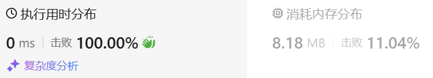

### 01、字符串解码（20241015，394题，中等）
<div style="border: 1px solid black; padding: 10px; background-color: SteelBlue;">

给定一个经过编码的字符串，返回它解码后的字符串。

编码规则为: k[encoded_string]，表示其中方括号内部的 encoded_string 正好重复 k 次。注意 k 保证为正整数。

你可以认为输入字符串总是有效的；输入字符串中没有额外的空格，且输入的方括号总是符合格式要求的。

此外，你可以认为原始数据不包含数字，所有的数字只表示重复的次数 k ，例如不会出现像 3a 或 2[4] 的输入。

 

示例 1：

- 输入：s = "3[a]2[bc]"
- 输出："aaabcbc"

示例 2：

- 输入：s = "3[a2[c]]"
- 输出："accaccacc"

示例 3：

- 输入：s = "2[abc]3[cd]ef"
- 输出："abcabccdcdcdef"

示例 4：

- 输入：s = "abc3[cd]xyz"
- 输出："abccdcdcdxyz"
 

提示：

- 1 <= s.length <= 30
- s 由小写英文字母、数字和方括号 '[]' 组成
- s 保证是一个 有效 的输入。
- s 中所有整数的取值范围为 [1, 300]

  </p>
</div>

<hr style="border-top: 5px solid #DC143C;">
<table>
  <tr>
    <td bgcolor="Yellow" style="padding: 5px; border: 0px solid black;">
      <span style="font-weight: bold; font-size: 20px;color: black;">
      仿照答案 
      </span>
    </td>
  </tr>
</table>
<div style="padding: 0px; border: 1.5px solid LightSalmon; margin-bottom: 10px;">

```C++ {.line-numbers}
/*
vector<string> stk
"3[a2[c]]"
遇到字母，依次存入stk中
遇到数字，使用getNum(),取数字串，存入stk中
遇到"["，存入stk中
遇到"]"，取出stk上面的一个个字符，存入string sub中，直到遇到"["，并对sub反转
    然后取出stk最上面数字串，这就是sub要重复的次数
    拼接后，再次放入stk中
最后将stk中字符串拼接在一起就是结果！
*/
class Solution {
public:
    string getStr(vector<string>& sub){
        string tmp;
        for(auto& str : sub){
            tmp += str;
        }
        return tmp;
    }
    string decodeString(string s) {
        size_t size = s.size();
        int index = 0;
        vector<string> stk;

        while(index < size){
            if(s[index] >= 'a' && s[index] <= 'z'){  // 当前开头遇到字符串序列，一个个存入stk
                while(s[index] >= 'a' && s[index] <= 'z'){
                    stk.push_back(string(1, s[index]));
                    ++index;
                }
            }else if(s[index] >= '0' && s[index] <= '9'){  // 当前开头遇到数字，组合出数字串存入stk
                string str_num; 
                while(s[index] >= '0' && s[index] <= '9'){  
                    str_num += s[index];
                    ++index;
                }
                stk.push_back(str_num);
            }else if(s[index] == '['){  // 遇到"["，存入stk中
                stk.push_back(string(1, s[index]));
                ++index;
            }else{  // 遇到"]"，"3[a2[c]]"，读取stk中的字符串
                ++index;  // 跳过"]"
                // string sub;  // 得用vector<string> sub，否则"3[a2[cd]]"中的重复后组成的“cdcd”会被反转为“dcdc”
                vector<string> sub;  // 得用vector<string> sub，否则"3[a2[cd]]"中的重复后组成的“cdcd”会被反转为“dcdc”
                while(stk.back() != "["){
                    // sub += stk.back();
                    sub.push_back(stk.back());
                    stk.pop_back();
                }
                reverse(sub.begin(), sub.end());  //把cc,a转为 a,cc
                string str = getStr(sub);  //把a,cc拼接为acc

                stk.pop_back();  // 弹出"["
                int times = stoi(stk.back());  // 重复次数
                stk.pop_back();  // 弹出重复次数

                string tmp;
                while(times--){
                    tmp = tmp + str;
                }
                stk.push_back(tmp);
            }
        }
        string ret = getStr(stk);
        // for(auto& str : stk){
        //     ret += str;
        // }
        return ret;
    }
};

```

</div>



<table>
  <tr>
    <td bgcolor="Yellow" style="padding: 5px; border: 0px solid black;">
      <span style="font-weight: bold; font-size: 20px;color: black;">
      自己答案 
      </span>
    </td>
  </tr>
</table>

<div style="padding: 0px; border: 1.5px solid LightSalmon; margin-bottom: 10px">

```C++ {.line-numbers}

/*
stack<int> stk1, stk2
string result

遍历s
遇到字符，将这部分字符直接存入结果中
遇到数字
    stk2存储存储数字
    stk1存储"["后的字符串，直到遇到数字或者"]"
        遇到数字就继续入栈stk2
        遇到"]"就开始出栈组装字符串
            这里组装的字符串可能是多重"[]"中的，需要和外层字符串拼接
            所以应该有个pre_string记录上次的字符串
            直到stk1中字符为空，说明已经是最外层的括号结束，需要将结果存入result中
*/
class Solution {
public:
    string decodeString(string s) {
        size_t size = s.size();
        int index = 0;
        string result;

        while(index < size){
            if(s[index] >= 'a' && s[index] <= 'z'){  // 当前开头遇到字符串序列，直接存入结果
                while(s[index] >= 'a' && s[index] <= 'z'){
                    result += s[index];
                    ++index;
                }
            }
            if(s[index] >= '1' && s[index] <= '9'){  // 当前开头遇到数字，
                string str_num; 
                while(s[index] >= '1' && s[index] <= '9'){  // 先取数字
                    str_num += s[index];
                    ++index;
                }

                stk2.push(stoi(str_num));  // 将字符串转为数字存入
                if(s[index] == '['){

                }

            }
        }
    }
};
```
</div>

<hr style="border-top: 5px solid #DC143C;">

<table>
  <tr>
    <td bgcolor="Yellow" style="padding: 5px; border: 0px solid black;">
      <span style="font-weight: bold; font-size: 20px;color: black;">
      自己调试版本（通过！！！）
      </span>
    </td>
  </tr>
</table>

<div style="padding: 0px; border: 1.5px solid LightSalmon; margin-bottom: 10px">

```C++ {.line-numbers}


```
</div>

<table>
  <tr>
    <td bgcolor="Yellow" style="padding: 5px; border: 0px solid black;">
      <span style="font-weight: bold; font-size: 20px;color: black;">
      仿照答案版本v2（去注释）
      </span>
    </td>
  </tr>
</table>

<div style="padding: 0px; border: 1.5px solid LightSalmon; margin-bottom: 10px">

```C++ {.line-numbers}


```
</div>

<hr style="border-top: 5px solid #DC143C;">

<table>
  <tr>
    <td bgcolor="Yellow" style="padding: 5px; border: 0px solid black;">
      <span style="font-weight: bold; font-size: 20px;color: black;">
      仿照答案版本v2
      </span>
    </td>
  </tr>
</table>

<div style="padding: 0px; border: 1.5px solid LightSalmon; margin-bottom: 10px">

```C++ {.line-numbers}


```
</div>

<table>
  <tr>
    <td bgcolor="Yellow" style="padding: 5px; border: 0px solid black;">
      <span style="font-weight: bold; font-size: 20px;color: black;">
      ChatGPT
      </span>
    </td>
  </tr>
</table>

<div style="padding: 0px; border: 1.5px solid LightSalmon; margin-bottom: 10px">

```C++ {.line-numbers}


```
</div>
