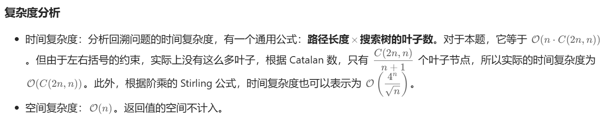

### 01、括号生成（20241002，22题，中等）
<div style="border: 1px solid black; padding: 10px; background-color: SteelBlue;">

数字 n 代表生成括号的对数，请你设计一个函数，用于能够生成所有可能的并且 有效的 括号组合。

 

示例 1：

- 输入：n = 3
- 输出：["((()))","(()())","(())()","()(())","()()()"]

示例 2：

- 输入：n = 1
- 输出：["()"]
 

提示：

- 1 <= n <= 8

  </p>
</div>

<hr style="border-top: 5px solid #DC143C;">
<table>
  <tr>
    <td bgcolor="Yellow" style="padding: 5px; border: 0px solid black;">
      <span style="font-weight: bold; font-size: 20px;color: black;">
      仿照答案 
      </span>
    </td>
  </tr>
</table>
<div style="padding: 0px; border: 1.5px solid LightSalmon; margin-bottom: 10px;">

```C++ {.line-numbers}
/*
n个括号，总共是2n个字符
可在递归中枚举出所有可能
    记left为左括号的数量，total = 2n为总括号数，counts为当前已经填写的括号数
    则counts-left为已经填写的右括号数

    关于左括号的填写，一方面，只要left < n，就可以一直填左括号
    关于右括号填写，仅当counts-left < left的时候才能填写右括号，因为要保证括号有效
        右括号不能比左括号多

    当counts等于total的时候，找到一种答案，记录结果
*/

class Solution {
public:
    vector<string> generateParenthesis(int n) {
        vector<string> result;
        int total = 2*n;

        // vector<char> path(total, 0);
        string path(total, 0);   // 结果集中需要的是string，所以path是string类型的，不要使用其他类型。。
        // vector<string> path(total, 0);
        // vector<string> path(total);

        auto dfs = [&](auto&& dfs, int left, int counts){
            int right = counts - left;

            if(counts == total){
                result.push_back(path);
                return;
            }
            if(left < n){
                path[counts] = '(';   
                dfs(dfs, left+1, counts+1);
            }
            if(left > right){
                path[counts] = ')';   
                dfs(dfs, left, counts+1);
            }
            // dfs(dfs, 0, 0);
        };
        dfs(dfs, 0, 0);
        return result;
    }
};
```

</div>


<table>
  <tr>
    <td bgcolor="Yellow" style="padding: 5px; border: 0px solid black;">
      <span style="font-weight: bold; font-size: 20px;color: black;">
      自己答案（通过！）
      </span>
    </td>
  </tr>
</table>

<div style="padding: 0px; border: 1.5px solid LightSalmon; margin-bottom: 10px">

```C++ {.line-numbers}


```
</div>

<hr style="border-top: 5px solid #DC143C;">

<table>
  <tr>
    <td bgcolor="Yellow" style="padding: 5px; border: 0px solid black;">
      <span style="font-weight: bold; font-size: 20px;color: black;">
      自己调试版本（通过！！！）
      </span>
    </td>
  </tr>
</table>

<div style="padding: 0px; border: 1.5px solid LightSalmon; margin-bottom: 10px">

```C++ {.line-numbers}


```
</div>

<table>
  <tr>
    <td bgcolor="Yellow" style="padding: 5px; border: 0px solid black;">
      <span style="font-weight: bold; font-size: 20px;color: black;">
      仿照答案版本v2（去注释）
      </span>
    </td>
  </tr>
</table>

<div style="padding: 0px; border: 1.5px solid LightSalmon; margin-bottom: 10px">

```C++ {.line-numbers}


```
</div>

<hr style="border-top: 5px solid #DC143C;">

<table>
  <tr>
    <td bgcolor="Yellow" style="padding: 5px; border: 0px solid black;">
      <span style="font-weight: bold; font-size: 20px;color: black;">
      leetcode1
      </span>
    </td>
  </tr>
</table>

<div style="padding: 0px; border: 1.5px solid LightSalmon; margin-bottom: 10px">

```C++ {.line-numbers}
class Solution {
public:
    vector<string> generateParenthesis(int n) {
        int m = n * 2; // 括号长度
        vector<string> ans;
        string path(m, 0); // 所有括号长度都是一样的 m
        // i=目前填了多少个括号
        // open=左括号个数，i-open=右括号个数
        auto dfs = [&](auto&& dfs, int i, int open) {
            if (i == m) { // 括号构造完毕
                ans.emplace_back(path); // 加入答案
                return;
            }
            if (open < n) { // 可以填左括号
                path[i] = '('; // 直接覆盖
                dfs(dfs, i + 1, open + 1); // 多了一个左括号
            }
            if (i - open < open) { // 可以填右括号
                path[i] = ')'; // 直接覆盖
                dfs(dfs, i + 1, open);
            }
        };
        dfs(dfs, 0, 0);
        return ans;
    }
};

作者：灵茶山艾府
链接：https://leetcode.cn/problems/generate-parentheses/solutions/2071015/hui-su-bu-hui-xie-tao-lu-zai-ci-pythonja-wcdw/
来源：力扣（LeetCode）
著作权归作者所有。商业转载请联系作者获得授权，非商业转载请注明出处。
```
</div>



<table>
  <tr>
    <td bgcolor="Yellow" style="padding: 5px; border: 0px solid black;">
      <span style="font-weight: bold; font-size: 20px;color: black;">
      leetcode2
      </span>
    </td>
  </tr>
</table>

<div style="padding: 0px; border: 1.5px solid LightSalmon; margin-bottom: 10px">

```C++ {.line-numbers}
class Solution {
public:
    vector<string> generateParenthesis(int n) {
        vector<string> ans;
        vector<int> path;
        // balance = 左括号个数 - 右括号个数
        auto dfs = [&](auto&& dfs, int i, int balance) {
            if (path.size() == n) {
                string s(n * 2, ')');
                for (int j : path) {
                    s[j] = '(';
                }
                ans.emplace_back(s);
                return;
            }
            // 可以填 0 到 balance 个右括号
            for (int close = 0; close <= balance; close++) { // 填 close 个右括号
                path.push_back(i + close); // 填 1 个左括号
                dfs(dfs, i + close + 1, balance - close + 1);
                path.pop_back();
            }
        };
        dfs(dfs, 0, 0);
        return ans;
    }
};

作者：灵茶山艾府
链接：https://leetcode.cn/problems/generate-parentheses/
来源：力扣（LeetCode）
著作权归作者所有。商业转载请联系作者获得授权，非商业转载请注明出处。
```
</div>


<h5>思路分析</h5>

LeetCode第22题要求生成有效的括号组合。解题思路采用深度优先搜索（DFS）递归方法，主要步骤如下：

1. **状态定义**：
   - `path`：当前已生成的括号位置，用于记录括号的放置。
   - `balance`：表示当前的括号状态，计算方式为“左括号个数 - 右括号个数”。有效组合的条件是 `balance` 始终非负，且最终要为零。

2. **递归终止条件**：
   - 当 `path` 的大小达到 `n` 时，说明已经放置完 `n` 个左括号和 `n` 个右括号，构建出一个有效组合。此时，生成对应的字符串并添加到结果集中。

3. **递归过程**：
   - 每次递归中，尝试放置右括号的个数（`close`），其范围是 `0` 到当前 `balance` 的值，保证在放置左括号后，右括号的数量不会超过左括号。
   - 更新 `path`，并进行递归调用。递归完成后，回溯，移除最后放置的括号。

<h5>递归流程举例</h5>

假设 `n = 2`，我们需要生成两个括号的组合：

1. **初始状态**：`path = []`, `balance = 0`
2. **第一层递归**（放置左括号）：
   - `path = [0]`, `balance = 1`
3. **第二层递归**（放置右括号）：
   - `close = 0`: `path = [0]`（当前只有左括号）
   - `close = 1`: `path = [0, 1]`（有效组合：`(())`）
   - 记录 `path` 生成的字符串，结果为 `["(())"]`。
   - 回溯到状态 `path = [0]`，继续循环。
4. **第二层继续**：
   - 选择放置一个右括号：
   - `path = [0]`，`balance = 1`（放一个右括号）
   - `close = 0`: `path = [0, 1]`（有效组合：`(())`）
   - 记录，`path = [0]` 继续。
5. **回到初始状态**：
   - `close = 1`: `path = [1]`（有效组合：`()()`）
   - 完成所有组合。

最终生成的有效组合为 `["(())", "()()"]`。

<h5>总结</h5>

1. 使用 DFS 递归深入探索每种可能的括号组合。
2. 控制左、右括号的数量，确保生成的组合是有效的。
3. 通过回溯的方法，探索所有可能的状态，最终得到结果。

这种思路灵活且有效地利用了递归与回溯技术，能够高效地生成所有有效的括号组合。

```python
class Solution:
    # 整体思路：path中存放左括号的下标，for循环中枚举当前可以放置的右括号个数
    def generateParenthesis(self, n: int) -> List[str]:
        
        # i表示当前可以放左括号的边界，即可供选择的左括号下标应满足>=i
        # balance表示当前可以放的至多右括号个数
        def dfs(i, balance):
            if len(path) == n:
                # 初始化为全为右括号
                tmp = [')'] * (n * 2)
                # path中为左括号的位置
                for j in range(n):
                    tmp[path[j]] = '('
                ans.append("".join(tmp))
                return
            
            # 可以放0到balance个右括号
            for close in range(balance+1):
                # 结果中的[i:i+close]都放右括号，鉴于最后生成结果时是初始化为全为右括号所以这里省略了放右括号的步骤
                path.append(i+close)
                # [:i+close]都放好了，所以下一层的下标边界时i+close+1
                # balance-close表示至多放balance个右括号，已经放了close个右括号
                # balance-close再加1是因为当前放了一个左括号，所以可以再放1个右括号
                dfs(i+close+1, balance - close + 1)
                path.pop()

        ans, path = [], []
        dfs(0, 0)
        return ans
```