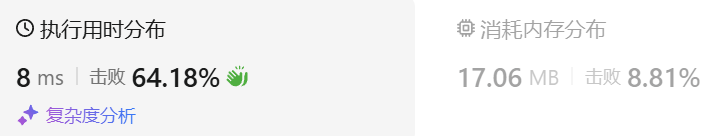

### 01、最大数（20241016，179题，中等）
<div style="border: 1px solid black; padding: 10px; background-color: SteelBlue;">

给定一组非负整数 nums，重新排列每个数的顺序（每个数不可拆分）使之组成一个最大的整数。

注意：输出结果可能非常大，所以你需要返回一个字符串而不是整数。

 

示例 1：

- 输入：nums = [10,2]
- 输出："210"

示例 2：

- 输入：nums = [3,30,34,5,9]
- 输出："9534330"
 

提示：

- 1 <= nums.length <= 100
- 0 <= nums[i] <= 109

  </p>
</div>

<hr style="border-top: 5px solid #DC143C;">
<table>
  <tr>
    <td bgcolor="Yellow" style="padding: 5px; border: 0px solid black;">
      <span style="font-weight: bold; font-size: 20px;color: black;">
      自己答案（去注释，通过！）
      </span>
    </td>
  </tr>
</table>
<div style="padding: 0px; border: 1.5px solid LightSalmon; margin-bottom: 10px;">

```C++ {.line-numbers}
/*
思路：
简单粗暴的将两个字符串拼接在一起比较
谁在前头更大，谁就排前面
65668  65   65621   
*/
class Solution {
public:
    string largestNumber(vector<int>& nums) {
        vector<string> vec;
        for(auto& num : nums){
            vec.push_back(to_string(num));
        }
        auto cmp = [](string& a, string& b){
            return a+b > b+a;
        };
        sort(vec.begin(), vec.end(), cmp);  // 按照首字符从大到小排序
        if(vec[0][0] == '0') return "0";
        string ret;
        for(auto& str : vec){
            ret += str;
        }
        return ret;
    }
};
```

</div>



<table>
  <tr>
    <td bgcolor="Yellow" style="padding: 5px; border: 0px solid black;">
      <span style="font-weight: bold; font-size: 20px;color: black;">
      自己答案（通过！）
      </span>
    </td>
  </tr>
</table>

<div style="padding: 0px; border: 1.5px solid LightSalmon; margin-bottom: 10px">

```C++ {.line-numbers}

/*
思路：
大的数尽量放在前面，但要分情况
9,63,6,65,7  这种需要考虑下两位数的十位和多个各位数的摆放顺序

选数字必然从每个数的最高位中选取最大的
    不同位数的数字，最高位可能相同，则取？较短的？
    后续都会转为最高位相同的要如何处理，因为不同的容易判断顺序

对于最高位相同的数字
    先按照从高到低排序，选择大的
    长度不同的情况下，看长度，从多余那位开始，是否大于当前的最高位（直接用一个函数处理吧）
*/
class Solution {
public:
    string largestNumber(vector<int>& nums) {
        vector<string> vec;
        for(auto& num : nums){
            vec.push_back(to_string(num));
        }
        auto cmp = [&](string& a, string& b){
            return a[0] > b[0];
        };
        sort(vec.begin(), vec.end(), cmp);  // 按照首字符从大到小排序

    }
};
```
</div>

<hr style="border-top: 5px solid #DC143C;">

<table>
  <tr>
    <td bgcolor="Yellow" style="padding: 5px; border: 0px solid black;">
      <span style="font-weight: bold; font-size: 20px;color: black;">
      自己调试版本（通过！！！）
      </span>
    </td>
  </tr>
</table>

<div style="padding: 0px; border: 1.5px solid LightSalmon; margin-bottom: 10px">

```C++ {.line-numbers}


```
</div>

<table>
  <tr>
    <td bgcolor="Yellow" style="padding: 5px; border: 0px solid black;">
      <span style="font-weight: bold; font-size: 20px;color: black;">
      仿照答案版本v2（去注释）
      </span>
    </td>
  </tr>
</table>

<div style="padding: 0px; border: 1.5px solid LightSalmon; margin-bottom: 10px">

```C++ {.line-numbers}


```
</div>

<hr style="border-top: 5px solid #DC143C;">

<table>
  <tr>
    <td bgcolor="Yellow" style="padding: 5px; border: 0px solid black;">
      <span style="font-weight: bold; font-size: 20px;color: black;">
      仿照答案版本v2
      </span>
    </td>
  </tr>
</table>

<div style="padding: 0px; border: 1.5px solid LightSalmon; margin-bottom: 10px">

```C++ {.line-numbers}


```
</div>

<table>
  <tr>
    <td bgcolor="Yellow" style="padding: 5px; border: 0px solid black;">
      <span style="font-weight: bold; font-size: 20px;color: black;">
      LeetCode
      </span>
    </td>
  </tr>
</table>

<div style="padding: 0px; border: 1.5px solid LightSalmon; margin-bottom: 10px">

```C++ {.line-numbers}
class Solution {
public:
    string largestNumber(vector<int> &nums) {
        sort(nums.begin(), nums.end(), [](const int &x, const int &y) {
            return to_string(x) + to_string(y) > to_string(y) + to_string(x);
        });
        if (nums[0] == 0) {
            return "0";
        }
        string ret;
        for (int &x : nums) {
            ret += to_string(x);
        }
        return ret;
    }
};

作者：力扣官方题解
链接：https://leetcode.cn/problems/largest-number/solutions/715680/zui-da-shu-by-leetcode-solution-sid5/
来源：力扣（LeetCode）
著作权归作者所有。商业转载请联系作者获得授权，非商业转载请注明出处。
```
</div>

复杂度分析

**时间复杂度**：$O(nlognlogm)$，其中 n 是给定序列的长度，m 是 32 位整数的最大值，每个数转化为字符串后的长度是 $O(logm)$ 的数量级。排序比较函数的时间复杂度为 $O(logm)$，共需要进行 $O(nlogn)$ 次比较。同时我们需要对字符串序列进行拼接，时间复杂度为 $O(nlogm)$，在渐进意义上小于 $O(nlognlogm)$。

我们也可以对排序比较函数进行优化，如预处理出数组每一个数的大于它的最小的十的整次幂，这样可用将时间复杂度降低到 $O(nlogn)$，但这样会使得空间复杂度上升到 $O(n)$。我们也可以使用数学方法加速计算整次幂，如二分计算等，但这种优化常数较大，最终耗时不一定更短。  

**空间复杂度**：$O(logn)$，排序需要 $O(logn)$ 的栈空间。


<table>
  <tr>
    <td bgcolor="Yellow" style="padding: 5px; border: 0px solid black;">
      <span style="font-weight: bold; font-size: 20px;color: black;">
      问答
      </span>
    </td>
  </tr>
</table>

分析下面代码复杂度
```C++
class Solution {
public:
    string largestNumber(vector<int>& nums) {
        vector<string> vec;
        for(auto& num : nums){
            vec.push_back(to_string(num));
        }
        auto cmp = [](string& a, string& b){
            return a+b > b+a;
        };
        sort(vec.begin(), vec.end(), cmp);  // 按照首字符从大到小排序
        if(vec[0][0] == '0') return "0";
        string ret;
        for(auto& str : vec){
            ret += str;
        }
        return ret;
    }
};
```
<h5>1. 算法流程</h5>

该算法的主要流程如下：

1. 将 `nums` 中的每个数字转换为字符串，并存储到 `vec` 中。
2. 使用自定义比较器 `cmp` 对 `vec` 进行排序，规则是字符串 `a+b` 是否大于 `b+a`。这样确保更大的组合排列优先。
3. 排序后检查 `vec[0][0]` 是否为 `'0'`，如果是，则返回 `"0"`（意味着所有数字为零）。
4. 否则，将所有字符串拼接为最终结果。

<h5>2. 时间复杂度分析</h5>

1. **字符串转换**：
   - 每个整数转换为字符串的时间复杂度是 $O(k)$，其中 $k$ 是数字的位数。
   - 总共需要处理 $n$ 个数字，时间复杂度为 $O(nk)$。

2. **排序**：
   - 使用自定义比较器对字符串数组进行排序，排序的复杂度为 $O(n \log n)$。
   - 比较两个字符串的复杂度为 $O(k)$，因为要比较整个字符串拼接后的结果。
   - 因此排序的总体复杂度为 $O(nk \log n)$。

3. **字符串拼接**：
   - 将排序后的字符串数组拼接为最终结果，时间复杂度为 $O(nk)$。

<h5>3. 总复杂度</h5>

该算法的总时间复杂度为 $O(nk \log n)$，其中 $n$ 是数字的个数，$k$ 是每个数字的最大位数。