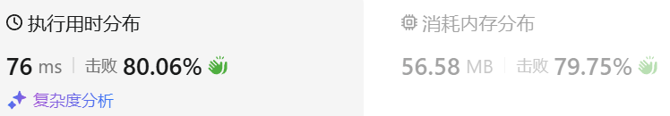
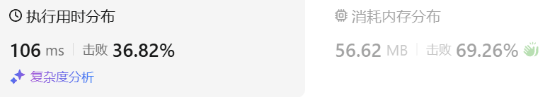

### 01、数组中的第K个最大元素（20240925，215题，中等，18min）
<div style="border: 1px solid black; padding: 10px; background-color: SteelBlue;">

给定整数数组 nums 和整数 k，请返回数组中第 k 个最大的元素。

请注意，你需要找的是数组排序后的第 k 个最大的元素，而不是第 k 个不同的元素。

你必须设计并实现时间复杂度为 O(n) 的算法解决此问题。

 

示例 1:

- 输入: [3,2,1,5,6,4], k = 2
- 输出: 5

示例 2:

- 输入: [3,2,3,1,2,4,5,5,6], k = 4
- 输出: 4
 

提示：

- 1 <= k <= nums.length <= 105
- -104 <= nums[i] <= 104

  </p>
</div>

<hr style="border-top: 5px solid #DC143C;">
<table>
  <tr>
    <td bgcolor="Yellow" style="padding: 5px; border: 0px solid black;">
      <span style="font-weight: bold; font-size: 20px;color: black;">
      自己答案（18min）
      </span>
    </td>
  </tr>
</table>
<div style="padding: 0px; border: 1.5px solid LightSalmon; margin-bottom: 10px;">

```C++ {.line-numbers}
/*
18min
思路：
维护一个长度为k的最小堆
先存入k个元素
遍历后续元素，则只有当大于对顶才能入栈，并且出栈堆顶

返回堆顶
*/

class Solution {
public:
    int findKthLargest(vector<int>& nums, int k) {
        auto cmp = [&](int a, int b){
            return a > b;
        };
        priority_queue<int, vector<int>, decltype(cmp)> que(cmp);
        size_t size = nums.size();

        for(int i = 0; i < k; i++){
            que.push(nums[i]);
        }
        for(int j = k; j < size; j++){
            if(nums[j] > que.top()){
                que.pop();
                que.push(nums[j]);
            }
        }
        return que.top();
    }
};
```

</div>


<table>
  <tr>
    <td bgcolor="Yellow" style="padding: 5px; border: 0px solid black;">
      <span style="font-weight: bold; font-size: 20px;color: black;">
      按照自己的思路修改答案
      </span>
    </td>
  </tr>
</table>

<div style="padding: 0px; border: 1.5px solid LightSalmon; margin-bottom: 10px">

```C++ {.line-numbers}
/*
思路：
将数组定在区间[begin, end]内，令left和right指向两端
取begin这第一个数作为分割点partition，
    分别从左边和右边遍历数组
    左边定位小于partition的数，右边定位大于partition
    然后交换二者位置
    直到left > right
一轮后，数组被分为了[大于等于partition的部分，小于等于partition的部分]
由于此时right指向的是大于等于partition的部分的最后一个数字
    求取的是第k大的，若k-1 <= right，说明第k大的数字在左边部分
        右边虽然未排序，已经不重要，继续递归搜寻左边区间[begin, right]
    若，k-1 > right，同理递归右边区间，即[right + 1, end]
递归最后将区间缩小至begin=end处，找到索引为k-1的数字，返回nums[k-1]  

下面代码中quickselect()函数已经将k转为k-1
*/

class Solution {
public:
    int quickselect(vector<int> &nums, int begin, int end, int k) {  // 这里k是需要找的数的索引！！！最好换成m，m=k-1，更好理解
        if (begin == end) return nums[k];

        int left = begin;
        int right = end;
        int partition = nums[left];
        while (left <= right) {  // 保留等于，是因为当交换后left=right时，需要判断这最后的中间数字是否大于partition，来决定是否移位right，使得right指向大于等于partition的数!!!
            while (nums[left] > partition){  // 跳过大于partition的数，小于partition的数放右边去
                ++left;
            }  
            while (nums[right] < partition){
                --right;
            } 
            if (left < right){
                swap(nums[left], nums[right]);     // 只是将当前区间分为了[大于等于partition的部分，小于等于partition的部分]
                ++left;
                --right;
            }else{
                break;  // left = right时，此轮遍历结束，退出循环！！！
            }
        }
        if (k <= right)return quickselect(nums, begin, right, k); 
        else return quickselect(nums, right + 1, end, k); 
    }

    int findKthLargest(vector<int> &nums, int k) {
        int n = nums.size();
        return quickselect(nums, 0, n - 1, k-1);  // 第k个数的索引为k-1！！！
    } 
};  
```
</div>



<table>
  <tr>
    <td bgcolor="Yellow" style="padding: 5px; border: 0px solid black;">
      <span style="font-weight: bold; font-size: 20px;color: black;">
      修改答案（正向找到第k个数）
      </span>
    </td>
  </tr>
</table>

<div style="padding: 0px; border: 1.5px solid LightSalmon; margin-bottom: 10px">

```C++ {.line-numbers}
/*
思路：

*/

class Solution {
public:
    int quickselect(vector<int> &nums, int l, int r, int k) {  // 这里k是需要找的数的索引！！！
        if (l == r)
            return nums[k];
        int partition = nums[l], i = l - 1, j = r + 1;
        while (i < j) {  // 这里将当前区间的第一个数作为比较数partition，小于它的放左边，大于的放右边
            do i++; while (nums[i] > partition);  // 跳过大于partition的数，小于partition的数放右边去
            do j--; while (nums[j] < partition);  
            if (i < j)
                swap(nums[i], nums[j]);     // 只是将当前区间分为了[大于partition的部分，小于等于partition的部分]
        }  
        if (k <= j)return quickselect(nums, l, j, k); 
        else return quickselect(nums, j + 1, r, k); 
    }

    int findKthLargest(vector<int> &nums, int k) {
        int n = nums.size();
        return quickselect(nums, 0, n - 1, k-1);  // 第k个数的索引为k-1！！！
    } 
};  
```
</div>



<hr style="border-top: 5px solid #DC143C;">

<table>
  <tr>
    <td bgcolor="Yellow" style="padding: 5px; border: 0px solid black;">
      <span style="font-weight: bold; font-size: 20px;color: black;">
      leetcode版本（反向找到第n-k个数）
      </span>
    </td>
  </tr>
</table>

<div style="padding: 0px; border: 1.5px solid LightSalmon; margin-bottom: 10px">

```C++ {.line-numbers}
class Solution {
public:
    int quickselect(vector<int> &nums, int l, int r, int k) {  // 这里k是需要找的数的索引，要理解好怎么来的！！！
        if (l == r)
            return nums[k];
        int partition = nums[l], i = l - 1, j = r + 1;
        while (i < j) {  // 这里将当前区间的第一个数作为比较数partition，小于它的放左边，大于的放右边
            do i++; while (nums[i] < partition);  // 比较数放右边去了
            do j--; while (nums[j] > partition);  // 但因为do语句，partition放右边并不是实际位置
            if (i < j)
                swap(nums[i], nums[j]);     // 只是将当前区间分为了[小于partition的部分，大于等于partition的部分]
        }  // 交换完两边的数后，j应该指向了从右数第一个小于partition的（i指向了第一个从左数大于partition的），且i > j，跳出循环了
        if (k <= j)return quickselect(nums, l, j, k);  // 小于partition的个数大于等于k时，继续处理左边
        else return quickselect(nums, j + 1, r, k);   // 大于等于partition的个数小于k，j < k, 即j <= k-1。为什么j=k-1会到右边寻找呢？左边不是已经有了k个数了吗？？？
    }

    int findKthLargest(vector<int> &nums, int k) {
        int n = nums.size();
        return quickselect(nums, 0, n - 1, n - k);  // 找从大到小数第k个数字，但由于排序是将小的放左边，所以从左往右，即从小到大是第n-k个数？？是第n-k+1个数！！！
    }  // 从小到大是第n-k+1个数，n-k在quickselect()函数中被即为k，则应该是第k+1个数，索引是k。即需要找到索引为k的数（原索引为n-k）
};  //  例如{2,2,1,3,3,4,5,5,6}中，找第6大的是3,而3是从小到大的第4个数（总数9减去6再加1），索引是4-1为3，即索引3的位置。遍历后j在索引2的位置，所以要去j+1之后再遍历。
```
</div>

<table>
  <tr>
    <td bgcolor="Yellow" style="padding: 5px; border: 0px solid black;">
      <span style="font-weight: bold; font-size: 20px;color: black;">
      仿照答案版本v2（去注释）
      </span>
    </td>
  </tr>
</table>

<div style="padding: 0px; border: 1.5px solid LightSalmon; margin-bottom: 10px">

```C++ {.line-numbers}


```
</div>

<hr style="border-top: 5px solid #DC143C;">

<table>
  <tr>
    <td bgcolor="Yellow" style="padding: 5px; border: 0px solid black;">
      <span style="font-weight: bold; font-size: 20px;color: black;">
      仿照答案版本v2
      </span>
    </td>
  </tr>
</table>

<div style="padding: 0px; border: 1.5px solid LightSalmon; margin-bottom: 10px">

```C++ {.line-numbers}


```
</div>

<table>
  <tr>
    <td bgcolor="Yellow" style="padding: 5px; border: 0px solid black;">
      <span style="font-weight: bold; font-size: 20px;color: black;">
      leetcode（基于堆排序的选择方法）
      </span>
    </td>
  </tr>
</table>

<div style="padding: 0px; border: 1.5px solid LightSalmon; margin-bottom: 10px">

```C++ {.line-numbers}
class Solution {
public:
    void maxHeapify(vector<int>& a, int i, int heapSize) {
        int l = i * 2 + 1, r = i * 2 + 2, largest = i;
        if (l < heapSize && a[l] > a[largest]) {
            largest = l;
        } 
        if (r < heapSize && a[r] > a[largest]) {
            largest = r;
        }
        if (largest != i) {
            swap(a[i], a[largest]);
            maxHeapify(a, largest, heapSize);
        }
    }

    void buildMaxHeap(vector<int>& a, int heapSize) {
        for (int i = heapSize / 2 - 1; i >= 0; --i) {
            maxHeapify(a, i, heapSize);
        } 
    }

    int findKthLargest(vector<int>& nums, int k) {
        int heapSize = nums.size();
        buildMaxHeap(nums, heapSize);
        for (int i = nums.size() - 1; i >= nums.size() - k + 1; --i) {
            swap(nums[0], nums[i]);
            --heapSize;
            maxHeapify(nums, 0, heapSize);
        }
        return nums[0];
    }
};

作者：力扣官方题解
链接：https://leetcode.cn/problems/kth-largest-element-in-an-array/solutions/307351/shu-zu-zhong-de-di-kge-zui-da-yuan-su-by-leetcod-2/
来源：力扣（LeetCode）
著作权归作者所有。商业转载请联系作者获得授权，非商业转载请注明出处。
```
</div>
