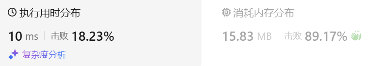

### 02、在排序数组中查找元素的第一个和最后一个位置（20241009，34题，中等。50min）
<div style="border: 1px solid black; padding: 10px; background-color: SteelBlue;">

给你一个按照非递减顺序排列的整数数组 nums，和一个目标值 target。请你找出给定目标值在数组中的开始位置和结束位置。

如果数组中不存在目标值 target，返回 [-1, -1]。

你必须设计并实现时间复杂度为 O(log n) 的算法解决此问题。

 

示例 1：

- 输入：nums = [5,7,7,8,8,10], target = 8
- 输出：[3,4]

示例 2：

- 输入：nums = [5,7,7,8,8,10], target = 6
- 输出：[-1,-1]

示例 3：

- 输入：nums = [], target = 0
- 输出：[-1,-1]
 

提示：

- 0 <= nums.length <= 105
- -109 <= nums[i] <= 109
- nums 是一个非递减数组
- -109 <= target <= 109

  </p>
</div>

<hr style="border-top: 5px solid #DC143C;">
<table>
  <tr>
    <td bgcolor="Yellow" style="padding: 5px; border: 0px solid black;">
      <span style="font-weight: bold; font-size: 20px;color: black;">
      自己答案 
      </span>
    </td>
  </tr>
</table>
<div style="padding: 0px; border: 1.5px solid LightSalmon; margin-bottom: 10px;">

```C++ {.line-numbers}
/*
从中间开始找，区间为[begin,end]
大于target的话，就往左边找，否则去右边找
找到后，在[begin,mid]、[mid,end]两个区间再缩小范围找左右边界
*/
class Solution {
public:
    vector<int> searchRange(vector<int>& nums, int target) {
        size_t size = nums.size();
        int begin = 0;
        int end = size-1;

        int mid = (begin+end)/2;
        while(begin <= end){
            if(nums[mid] > target){
                end = mid-1;
                mid = (begin+end)/2;
            }else if(nums[mid] < target){
                begin = mid+1;
                mid = (begin+end)/2;
            }else{
                break;
            }
        }
        if(begin > end) return{-1,-1};  // 没找到

        int mid_find = mid;
        int index = (begin+mid)/2;
        while(begin <= mid){  // begin最后指向了第一个target？
            if(nums[index] == target){  // 在左边又找到一个target
                mid = index-1;
                index = (begin+mid)/2;
            }else if(nums[index] < target){  // 在左边又找到一个target
                begin = index+1;
                index = (begin+mid)/2;
            }else{
                printf("path2");
            }
        }
        
        mid = mid_find;
        index = (end+mid)/2;
        while(mid <= end){  // begin最后指向了第一个target？
            if(nums[index] == target){  // 在左边又找到一个target
                mid = index+1;
                index = (end+mid)/2;
            }else if(nums[index] > target){  // 在左边又找到一个target
                end = index-1;
                index = (end+mid)/2;
            }else{
                printf("path1");
            }
        }
        return {begin, end};
    }
};
```

</div>



<table>
  <tr>
    <td bgcolor="Yellow" style="padding: 5px; border: 0px solid black;">
      <span style="font-weight: bold; font-size: 20px;color: black;">
      自己答案（通过！）
      </span>
    </td>
  </tr>
</table>

<div style="padding: 0px; border: 1.5px solid LightSalmon; margin-bottom: 10px">

```C++ {.line-numbers}


```
</div>

<hr style="border-top: 5px solid #DC143C;">

<table>
  <tr>
    <td bgcolor="Yellow" style="padding: 5px; border: 0px solid black;">
      <span style="font-weight: bold; font-size: 20px;color: black;">
      自己调试版本（通过！！！）
      </span>
    </td>
  </tr>
</table>

<div style="padding: 0px; border: 1.5px solid LightSalmon; margin-bottom: 10px">

```C++ {.line-numbers}


```
</div>

<table>
  <tr>
    <td bgcolor="Yellow" style="padding: 5px; border: 0px solid black;">
      <span style="font-weight: bold; font-size: 20px;color: black;">
      仿照答案版本v2（去注释）
      </span>
    </td>
  </tr>
</table>

<div style="padding: 0px; border: 1.5px solid LightSalmon; margin-bottom: 10px">

```C++ {.line-numbers}


```
</div>

<hr style="border-top: 5px solid #DC143C;">

<table>
  <tr>
    <td bgcolor="Yellow" style="padding: 5px; border: 0px solid black;">
      <span style="font-weight: bold; font-size: 20px;color: black;">
      仿照答案版本v2
      </span>
    </td>
  </tr>
</table>

<div style="padding: 0px; border: 1.5px solid LightSalmon; margin-bottom: 10px">

```C++ {.line-numbers}


```
</div>

<table>
  <tr>
    <td bgcolor="Yellow" style="padding: 5px; border: 0px solid black;">
      <span style="font-weight: bold; font-size: 20px;color: black;">
      leetcode水友
      </span>
    </td>
  </tr>
</table>

<div style="padding: 0px; border: 1.5px solid LightSalmon; margin-bottom: 10px">

```C++ {.line-numbers}
 
 // 两次二分查找，分开查找第一个和最后一个
  // 时间复杂度 O(log n), 空间复杂度 O(1)
  // [1,2,3,3,3,3,4,5,9]
  public int[] searchRange2(int[] nums, int target) {
    int left = 0;
    int right = nums.length - 1;
    int first = -1;
    int last = -1;
    // 找第一个等于target的位置
    while (left <= right) {
      int middle = (left + right) / 2;
      if (nums[middle] == target) {
        first = middle;
        right = middle - 1; //重点
      } else if (nums[middle] > target) {
        right = middle - 1;
      } else {
        left = middle + 1;
      }
    }

    // 最后一个等于target的位置
    left = 0;
    right = nums.length - 1;
    while (left <= right) {
      int middle = (left + right) / 2;
      if (nums[middle] == target) {
        last = middle;
        left = middle + 1; //重点
      } else if (nums[middle] > target) {
        right = middle - 1;
      } else {
        left = middle + 1;
      }
    }

    return new int[]{first, last};
  }
```
</div>
