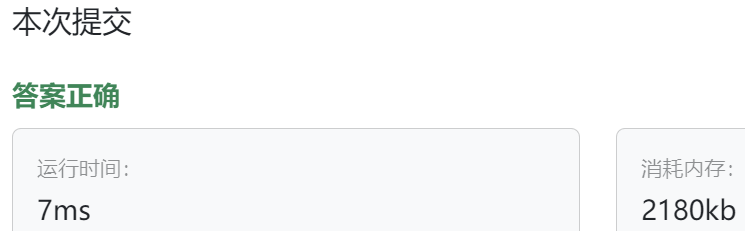

### 5、矩形原型（20240419）
>**题目描述**  
- 公司正在开发一个图形设计软件，其中有一个常用的图形元素是矩形。设计师在工作时可能需要频繁地创建相似的矩形，而这些矩形的基本属性是相同的（颜色、宽度、高度），为了提高设计师的工作效率，请你使用原型模式设计一个矩形对象的原型。使用该原型可以快速克隆生成新的矩形对象。 

>**输入描述**  
- 首先输入一个字符串，表示矩形的基本属性信息，包括颜色、长度和宽度，用空格分隔，例如 "Red 10 5"。 

- 然后输入一个整数 N（1 ≤ N ≤ 100），表示使用原型创建的矩形数量。

>**输出描述**  
对于每个矩形，输出一行字符串表示矩形的详细信息，如 "Color: Red, Width: 10,Height: 5"。

>**输入示例**  
Red 10 5  
3
  
>**输出示例**  
Color: Red, Width: 10, Height: 5  
Color: Red, Width: 10, Height: 5  
Color: Red, Width: 10, Height: 5  
  
>**提示信息**  
- 使用原型模式中的克隆方法实现矩形对象的创建。。

>自己答案（通过!!!）
```C++
#include <iostream>
#include <string>

using namespace std;

class Rectangle {
public:
    Rectangle(string color, int width, int height) : m_color(color),m_width(width),m_height(height){}
    
    Rectangle* clone() {
        return new Rectangle(*this);
    }
    
    void showInfo() {
        cout << "Color: " << m_color << ", Width: " << m_width << ", Height: " << m_height << endl;
    }
private:
    string m_color;
    int m_width;
    int m_height;
};

int main() {
    int quantity;
    
    string i_color;
    int i_width;
    int i_height;
    
    cin >> i_color >> i_width >> i_height;
    cin >> quantity;
    
    Rectangle origin_rect(i_color, i_width, i_height);
    for(int i = 0; i < quantity; i++) {
        Rectangle* new_rect = origin_rect.clone();
        new_rect->showInfo();
        
        delete new_rect;
    }
    
}

```



>看过答案（增加了一层抽象）
```C++
#include <iostream>
#include <string>

using namespace std;

class Prototype {
public:
    virtual Prototype* clone() const = 0;
    virtual string showInfo() = 0;
    virtual ~Prototype(){}
};

class Rectangle : public Prototype {
public:
    Rectangle(string color, int width, int height) : m_color(color),m_width(width),m_height(height){}
    
    Prototype* clone() const override {  // Rectangle* clone() override 
        return new Rectangle(*this);
    }
    
    string showInfo() {
        // cout << "Color: " << m_color << ", Width: " << m_width << ", Height: " << m_height << endl;
        // return "Color: " + m_color + ", Width: " + m_width + ", Height: " + m_height;
        return "Color: " + m_color + ", Width: " + to_string(m_width) + ", Height: " + to_string(m_height);
    }
private:
    string m_color;
    int m_width;
    int m_height;
};

int main() {
    int quantity;
    
    string i_color;
    int i_width;
    int i_height;
    
    cin >> i_color >> i_width >> i_height;
    cin >> quantity;
    
    Rectangle origin_rect(i_color, i_width, i_height);
    for(int i = 0; i < quantity; i++) {
        Prototype* new_rect = origin_rect.clone();
        string info = new_rect->showInfo();  // info = new_rect->showInfo();
        cout << info << endl;
        
        delete new_rect;
    }
    
}
```


>卡玛网相关代码
```C++
#include <iostream>
#include <string>
#include <vector>
 
// 抽象原型类
class Prototype {
public:
    virtual Prototype* clone() const = 0;
    virtual std::string getDetails() const = 0;
    virtual ~Prototype() {}
};
 
// 具体矩形原型类
class RectanglePrototype : public Prototype {
private:
    std::string color;
    int width;
    int height;
 
public:
    // 构造方法
    RectanglePrototype(std::string color, int width, int height) : color(color), width(width), height(height) {}
 
    // 克隆方法
    Prototype* clone() const override {
        return new RectanglePrototype(*this);
    }
 
    // 获取矩形的详细信息
    std::string getDetails() const override {
        return "Color: " + color + ", Width: " + std::to_string(width) + ", Height: " + std::to_string(height);
    }
};
 
// 客户端程序
int main() {
    std::vector<Prototype*> rectangles;
 
    // 读取需要创建的矩形数量
    int N;
    std::cin >> N;
 
    // 读取每个矩形的属性信息并创建矩形对象
    for (int i = 0; i < N; i++) {
        std::string color;
        int width, height;
 
        std::cin >> color >> width >> height;
 
        // 创建原型对象
        Prototype* originalRectangle = new RectanglePrototype(color, width, height);
 
        // 将原型对象保存到向量中
        rectangles.push_back(originalRectangle);
    }
 
    // 克隆对象并输出详细信息
    for (const auto& rectangle : rectangles) {
        Prototype* clonedRectangle = rectangle->clone();
        std::cout << clonedRectangle->getDetails() << std::endl;
 
        // 释放克隆对象的内存
        delete clonedRectangle;
    }
 
    // 释放原型对象的内存
    for (const auto& rectangle : rectangles) {
        delete rectangle;
    }
 
    return 0;
}
```