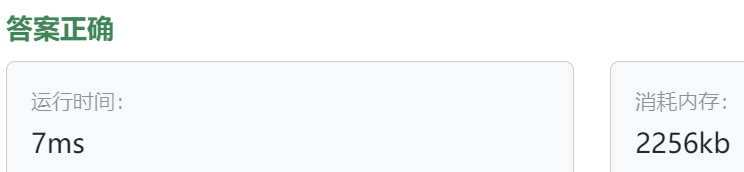

### 10、万能遥控器（202400520）
>**题目描述**  
- 小明家有一个万能遥控器，能够支持多个品牌的电视。每个电视可以执行开机、关机和切换频道的操作，请你使用桥接模式模拟这个操作。 

>**输入描述**  
- 第一行是一个整数 N（1 <= N <= 100），表示后面有 N 行输入。

- 接下来的 N 行，每行包含两个数字。第一个数字表示创建某个品牌的遥控和电视，第二个数字表示执行的操作。

- 其中，0 表示创建 Sony 品牌的电视，1 表示创建 TCL 品牌的遥控和电视；2 表示开启电视、3表示关闭电视，4表示切换频道。

>**输出描述**  
对于每个操作，输出相应的执行结果。

>**输入示例**  
6  
0 2  
1 2  
0 4  
0 3  
1 4  
1 3  
  
>**输出示例**  
Sony TV is ON  
TCL TV is ON  
Switching Sony TV channel  
Sony TV is OFF  
Switching TCL TV channel  
TCL TV is OFF  
  
>自己答案（调试后，通过!!!）
```C++
# include <iostream>

using namespace std;

class ITV {
public:
    virtual void on() = 0;
    virtual void off() = 0;
    virtual void switching() = 0;
    
    // virtual ~ITV() = 0;  虚析构函数写法错误！！！！！
    virtual ~ITV() {};
};

class SonyTV : public ITV {
public:
    void on() override {
        cout << "Sony TV is ON" << endl;
    }
    
    void off() override {
        cout << "Sony TV is OFF" << endl;
    }
    
    void switching() override {
        cout << "Switching Sony TV channel" << endl;
    }
};

class TCLTV : public ITV {
public:
    void on() override {
        cout << "TCL TV is ON" << endl;
    }
    
    void off() override {
        cout << "TCL TV is OFF" << endl;
    }
    
    void switching() override {
        cout << "Switching TCL TV channel" << endl;
    }
};

class IControlor {
public:
    ITV* m_tv;
    
public:
    IControlor(ITV* tv) : m_tv(tv) {}  // 必须显示的写出赋值构造函数，不然子类IControlor(tv)这里报错
    virtual void controlTV(int num) = 0;  // virtual controlTV(int num) = 0;忘记写函数返回类型
    virtual ~IControlor() {};  // 虚析构函数
};

class MultiFunctionControl : public IControlor {
public:
    MultiFunctionControl(ITV* tv) : IControlor(tv) {}
    
    void controlTV(int num) override {
        if(num == 2){
            m_tv->on();
        }else if(num == 3){
            m_tv->off();
        }else if(num == 4){
            m_tv->switching();
        }else{
            printf("Wrong operateNum!!!");
        }
    }
};

int main(){
    int count;
    int TVTypeNum;
    int operateNum;
    
    cin >> count ;
    
    for(int i = 0; i < count; i++){
        cin >> TVTypeNum >> operateNum;
        if(TVTypeNum == 0){
            SonyTV* stv = new SonyTV();
            // MultiFunctionControl* mfc = new MultiFunctionControl(stv);  // MultiFunctionControl mfc = new MultiFunctionControl(stv);忘记写指针*号
            IControlor* mfc = new MultiFunctionControl(stv);
            mfc->controlTV(operateNum);
            
            delete stv;
            delete mfc;
        }else if(TVTypeNum == 1){
            TCLTV* ttv = new TCLTV();
            // MultiFunctionControl* mfc = new MultiFunctionControl(ttv);
            IControlor* mfc = new MultiFunctionControl(ttv);
            mfc->controlTV(operateNum);
            
            delete ttv;
            delete mfc;
        }else{
            printf("Wrong TVTypeNum!!!");
        }
    }
    
    return 0; 
}
```


> **卡码网答案**
```C++
#include <iostream>
#include <sstream>
#include <vector>

// 步骤1: 创建实现化接口
class TV {
public:
    virtual void turnOn() = 0;
    virtual void turnOff() = 0;
    virtual void switchChannel() = 0;
};

// 步骤2: 创建具体实现化类
class SonyTV : public TV {
public:
    void turnOn() override {
        std::cout << "Sony TV is ON" << std::endl;
    }

    void turnOff() override {
        std::cout << "Sony TV is OFF" << std::endl;
    }

    void switchChannel() override {
        std::cout << "Switching Sony TV channel" << std::endl;
    }
};

class TCLTV : public TV {
public:
    void turnOn() override {
        std::cout << "TCL TV is ON" << std::endl;
    }

    void turnOff() override {
        std::cout << "TCL TV is OFF" << std::endl;
    }

    void switchChannel() override {
        std::cout << "Switching TCL TV channel" << std::endl;
    }
};

// 步骤3: 创建抽象化接口
class RemoteControl {
protected:
    TV* tv;

public:
    RemoteControl(TV* tv) : tv(tv) {}

    virtual void performOperation() = 0;
};

// 步骤4: 创建扩充抽象化类
class PowerOperation : public RemoteControl {
public:
    PowerOperation(TV* tv) : RemoteControl(tv) {}

    void performOperation() override {
        tv->turnOn();
    }
};

class OffOperation : public RemoteControl {
public:
    OffOperation(TV* tv) : RemoteControl(tv) {}

    void performOperation() override {
        tv->turnOff();
    }
};

class ChannelSwitchOperation : public RemoteControl {
public:
    ChannelSwitchOperation(TV* tv) : RemoteControl(tv) {}

    void performOperation() override {
        tv->switchChannel();
    }
};

// 步骤5: 客户端代码
int main() {
    int N;
    std::cin >> N;
    std::cin.ignore();   // 忽略换行符，不然下面getline不能正确获取输入信息

    for (int i = 0; i < N; i++) {
        std::string input;
        std::getline(std::cin, input);  // 获取一行输入信息
        std::istringstream iss(input);  // 分词处理
        
        int brand, operation;
        iss >> brand >> operation;  // 分词处理

        TV* tv;
        if (brand == 0) {
            tv = new SonyTV();
        } else {
            tv = new TCLTV();
        }

        RemoteControl* remoteControl;
        if (operation == 2) {
            remoteControl = new PowerOperation(tv);
        } else if (operation == 3) {
            remoteControl = new OffOperation(tv);
        } else {
            remoteControl = new ChannelSwitchOperation(tv);
        }

        remoteControl->performOperation();

        delete tv;
        delete remoteControl;
    }

    return 0;
}
```
