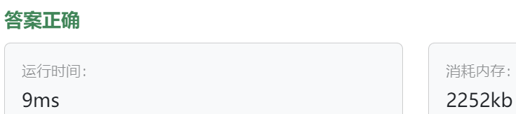

### 12、图形编辑器（202400523）
>**题目描述**  
- 在一个图形编辑器中，用户可以绘制不同类型的图形，包括圆形（CIRCLE）、矩形（RECTANGLE）、三角形（TRIANGLE）等。现在，请你实现一个图形绘制程序，要求能够共享相同类型的图形对象，以减少内存占用。 

>**输入描述**  
- 输入包含多行，每行表示一个绘制命令。每个命令包括两部分： 

- 图形类型（Circle、Rectangle 或 Triangle） 

- 绘制的坐标位置（两个整数，分别表示 x 和 y）。

>**输出描述**  
对于每个绘制命令，输出相应图形被绘制的位置信息。如果图形是首次绘制，输出 "drawn at"，否则输出 "shared at"。

>**输入示例**  
CIRCLE 10 20  
RECTANGLE 30 40  
CIRCLE 15 25  
TRIANGLE 5 15  
CIRCLE 10 20  
RECTANGLE 30 40   
  
>**输出示例**  
CIRCLE drawn at (10, 20)  
RECTANGLE drawn at (30, 40)  
CIRCLE shared at (15, 25)  
TRIANGLE drawn at (5, 15)  
CIRCLE shared at (10, 20)  
RECTANGLE shared at (30, 40)  
  
>自己答案（调试后，通过!!!）
```C++
#include <iostream>
#include <unordered_map>  // 头文件
#include <memory>  // 智能指针的头文件！！！
#include <sstream>  // istringstream类型需要的头文件！！！

using namespace std;  // 忘记写了！！！

class BaseShape {
public:
    virtual void drawShape(int x, int y) = 0;
    
    virtual ~BaseShape() = default;
};

class ConcreteDraw : public BaseShape {  // class ConcreteDraw{ 忘记了继承
private:  // 应该是private的？？？但设置成私有，FlyWeightFactory中就不能修改first_flag了，怎么办？？？
    string m_shape;
    // int first_flag;
    bool first_flag;

public:
    ConcreteDraw(string shape) : m_shape(shape), first_flag(true) {}
    
    void drawShape(int x, int y) override {
        if(first_flag == true) {
            cout << m_shape << " drawn at (" << x << ", " << y << ")" << endl;
        }else{
            cout << m_shape << " shared at (" << x << ", " << y << ")" << endl;
        }
    }
    
    void setFirstFlag(int flag) {
        first_flag = flag;
    }
};

class FlyWeightFactory {
private:
    unordered_map<string, shared_ptr<ConcreteDraw>> shape_map;
public:
    shared_ptr<ConcreteDraw> operation(string shape) {
        if(shape_map.find(shape) == shape_map.end()) {
            shape_map[shape] = make_shared<ConcreteDraw>(shape);
        }else{
            // shape_map[shape]->first_flag = 1;
            shape_map[shape]->setFirstFlag(false);
        }
        return shape_map[shape];
    }
};

int main() {
    string shape;
    string input;
    int x;
    int y;
    
    FlyWeightFactory fwf;
    
    while(getline(cin, input)){
        istringstream iss(input);
        iss >> shape >> x >> y;
        
        shared_ptr<ConcreteDraw> drawer = fwf.operation(shape);
        drawer->drawShape(x, y);
    }
    return 0;
}
```


> **卡码网答案**
```C++
#include <iostream>
#include <unordered_map>
#include <sstream>
#include <string>

enum ShapeType {
    CIRCLE, RECTANGLE, TRIANGLE
};

std::string shapeTypeToString(ShapeType type) {
    switch (type) {
        case CIRCLE:
            return "CIRCLE";
        case RECTANGLE:
            return "RECTANGLE";
        case TRIANGLE:
            return "TRIANGLE";
        default:
            return "UNKNOWN";
    }
}

class Position {
private:
    int x;
    int y;

public:
    Position(int x, int y) : x(x), y(y) {}

    int getX() const {
        return x;
    }

    int getY() const {
        return y;
    }
};

class Shape {
public:
    virtual void draw(const Position &position) = 0;
    virtual ~Shape() {}
};

class ConcreteShape : public Shape {
private:
    ShapeType shapeType;
    bool isFirstTime;

public:
    ConcreteShape(ShapeType shapeType) : shapeType(shapeType), isFirstTime(true) {}

    void draw(const Position &position) override {
        std::cout << shapeTypeToString(shapeType) << (isFirstTime ? " drawn" : " shared") << " at (" << position.getX() << ", " << position.getY() << ")\n";
    }

    void setFirstTime(bool firstTime) {  // 使用一个函数来让外界调用并改变private成员！！！
        isFirstTime = firstTime;
    }
};

class ShapeFactory {
private:
    std::unordered_map<ShapeType, Shape *> shapes;

public:
    Shape *getShape(ShapeType type) {
        if (shapes.find(type) == shapes.end()) {
            shapes[type] = new ConcreteShape(type);
        }
        return shapes[type];
    }

    ~ShapeFactory() {
        for (const auto &entry : shapes) {
            delete entry.second;
        }
    }
};

void processCommand(ShapeFactory &factory, const std::string &command);

int main() {
    ShapeFactory factory;
    std::string command;

    while (std::getline(std::cin, command)) {
        processCommand(factory, command);
    }

    return 0;
}

void processCommand(ShapeFactory &factory, const std::string &command) {
    std::istringstream iss(command);
    std::string shapeTypeStr;
    int x, y;

    iss >> shapeTypeStr >> x >> y;

    ShapeType type;
    if (shapeTypeStr == "CIRCLE") {
        type = CIRCLE;
    } else if (shapeTypeStr == "RECTANGLE") {
        type = RECTANGLE;
    } else if (shapeTypeStr == "TRIANGLE") {
        type = TRIANGLE;
    } else {
        std::cerr << "Invalid shape type: " << shapeTypeStr << std::endl;
        return;
    }

    Shape *shape = factory.getShape(type);
    shape->draw(Position(x, y));
    dynamic_cast<ConcreteShape *>(shape)->setFirstTime(false);  // dynamic_cast<>用来转换指针类型！！！
}
```