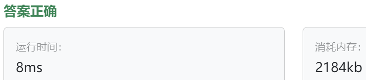

### 13、时间观察者（202400524）
>**题目描述**  
- 小明所在的学校有一个时钟（主题），每到整点时，它就会通知所有的学生（观察者）当前的时间，请你使用观察者模式实现这个时钟通知系统。

- 注意点：时间从 0 开始，并每隔一个小时更新一次。 

>**输入描述**  
- 输入的第一行是一个整数 N（1 ≤ N ≤ 20），表示学生的数量。 

- 接下来的 N 行，每行包含一个字符串，表示学生的姓名。 

- 最后一行是一个整数，表示时钟更新的次数。

>**输出描述**  
对于每一次时钟更新，输出每个学生的姓名和当前的时间。

>**输入示例**  
2  
Alice  
Bob  
3   
  
>**输出示例**  
Alice 1  
Bob 1  
Alice 2  
Bob 2  
Alice 3  
Bob 3  

>**提示信息**   

初始时钟时间为0（12:00 AM）。  
第一次更新后，时钟变为1（1:00 AM），然后通知每个学生，输出学生名称和时钟点数。  
第二次更新后，时钟变为2（2:00 AM），然后再次通知每个学生，输出学生名称和时钟点数。  
第三次更新后，时钟变为3（3:00 AM），然后再次通知每个学生，输出学生名称和时钟点数。

>自己答案（调试后，通过!!!）
```C++
#include <iostream>
#include <memory>
#include <vector>
#include <algorithm>  // remove()方法需要！！！

using namespace std;

class Observer {
public:
    virtual void updateTime(int time) = 0;
    
    ~Observer() = default;
};

class Student : public Observer {
private:
    string m_name;

public:
    Student(string name) : m_name(name) {}  // 不写这个构造函数，后面带name实例化Student会出问题！！！
    void updateTime(int time) override {
        cout << m_name << " " << time << endl;
    }
};

class Subscriber {
public:
    virtual void attach(shared_ptr<Observer> stu) = 0;
    virtual void detach(shared_ptr<Observer> stu) = 0;
    virtual void notify() = 0;
    virtual void setTime(int time) = 0;  // 基类中没有时间成员，这个函数可以不要，在子类中实现即可。
    
    ~Subscriber() = default;
};

class ConcreteSubscriber : public Subscriber{   // class ConcreteSubscriber { 忘记了继承
private:
    int m_time;
    std::vector<shared_ptr<Observer>> observers;

public:
    ConcreteSubscriber(int time): m_time(time) {}
    
    void attach(shared_ptr<Observer> stu) override {
        observers.push_back(stu);
    }
    
    void detach(shared_ptr<Observer> stu) override {
        observers.erase(remove(observers.begin(), observers.end(), stu), observers.end());  // observers.eraser() 方法名写错了
    }

    void notify() override {
        for(auto observer : observers){  // for(auto observer : obserevers) 单词拼写错误！！！
            observer->updateTime(m_time);
        }
    }
    
    void setTime(int time) override {
        m_time = time;
        notify();
    }
};

int main(){
    int student_count;
    string name;
    int refresh_count;
    
    cin >> student_count;
    
    ConcreteSubscriber time_publisher(0);
    
    while(student_count--){
        cin >> name;
        shared_ptr<Observer> stu = make_shared<Student>(name);
        time_publisher.attach(stu);
    }
    
    cin >> refresh_count;
    
    for(int i = 0; i < refresh_count; i++){
        time_publisher.setTime(i+1);
    }
    return 0;
}

```


> **卡码网答案**
```C++
#include <iostream>
#include <vector>
#include <algorithm> 

// 观察者接口
class Observer {
public:
    virtual void update(int hour) = 0;
    virtual ~Observer() = default; // 添加虚析构函数
};

// 主题接口
class Subject {
public:
    virtual void registerObserver(Observer* observer) = 0;
    virtual void removeObserver(Observer* observer) = 0;
    virtual void notifyObservers() = 0;
    virtual ~Subject() = default; // 添加虚析构函数
};

// 具体主题实现
class Clock : public Subject {
private:
    std::vector<Observer*> observers;
    int hour;

public:
    Clock() : hour(0) {}

    void registerObserver(Observer* observer) override {
        observers.push_back(observer);
    }

    void removeObserver(Observer* observer) override {
        auto it = std::find(observers.begin(), observers.end(), observer);
        if (it != observers.end()) {
            observers.erase(it);
        }
    }

    void notifyObservers() override {
        for (Observer* observer : observers) {
            observer->update(hour);
        }
    }

    // 添加获取观察者的函数
    const std::vector<Observer*>& getObservers() const {
        return observers;
    }

    void tick() {
        hour = (hour + 1) % 24; // 模拟时间的推移
        notifyObservers();
    }
};

// 具体观察者实现
class Student : public Observer {
private:
    std::string name;

public:
    Student(const std::string& name) : name(name) {}

    void update(int hour) override {
        std::cout << name << " " << hour << std::endl;
    }
};

int main() {
    // 读取学生数量
    int N;
    std::cin >> N;

    // 创建时钟
    Clock clock;

    // 注册学生观察者
    for (int i = 0; i < N; i++) {
        std::string studentName;
        std::cin >> studentName;
        clock.registerObserver(new Student(studentName));
    }

    // 读取时钟更新次数
    int updates;
    std::cin >> updates;

    // 模拟时钟每隔一个小时更新一次
    for (int i = 0; i < updates; i++) {
        clock.tick();
    }

    // 释放动态分配的观察者对象
    for (Observer* observer : clock.getObservers()) {
        delete observer;
    }

    return 0;
}

```