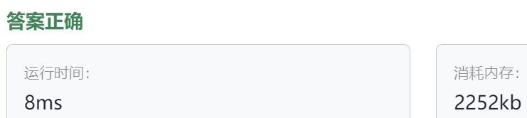

### 14、超市打折（202400527）
>**题目描述**  
- 小明家的超市推出了不同的购物优惠策略，你可以根据自己的需求选择不同的优惠方式。其中，有两种主要的优惠策略： 

- 1. 九折优惠策略：原价的90%。 

- 2. 满减优惠策略：购物满一定金额时，可以享受相应的减免优惠。

- 具体的满减规则如下： 

- 满100元减5元 

- 满150元减15元 

- 满200元减25元 

- 满300元减40元

- 请你设计一个购物优惠系统，用户输入商品的原价和选择的优惠策略编号，系统输出计算后的价格。 

>**输入描述**  
- 输入的第一行是一个整数 N（1 ≤ N ≤ 20），表示需要计算优惠的次数。 

- 接下来的 N 行，每行输入两个整数，第一个整数M( 0 < M < 400) 表示商品的价格, 第二个整数表示优惠策略，1表示九折优惠策略，2表示满减优惠策略。

>**输出描述**  
每行输出一个数字，表示优惠后商品的价格。

>**输入示例**  
4  
100 1  
200 2  
300 1  
300 2   
  
>**输出示例**  
90  
175  
270  
260  


>自己答案（调试后，通过!!!）
```C++
#include <iostream>
#include <sstream>
#include <string>
#include <memory>


using namespace std;

class DiscountStrategy {
public:
    virtual int countPrice(int prc) = 0;   // int countPrice(int prc) = 0; 忘记写纯虚函数前缀virtual
    
    ~DiscountStrategy() = default;
};

class TenPercentOff : public DiscountStrategy {
public:
    int countPrice(int prc) {
        return prc * 0.9;
    }
};

class SpecialOffDiscount : public DiscountStrategy {
public:
    int countPrice(int prc) {
        if(prc >= 300){
            return prc - 40;
        }else if(prc >= 200){
            return prc - 25;
        }else if(prc >= 150){
            return prc - 15;
        }else if(prc >= 100){
            return prc - 5;
        }else{
            return prc;
        }
    }
};


int main(){
    int count;
    cin >> count;
    cin.ignore();
    
    int price;
    int strategy_num;
    
    while(count--){
        string input;
        getline(cin, input);
        // istringstream iss;  // 创建了 std::istringstream 对象，但没有将输入字符串赋值给它!!!
        istringstream iss(input);
        
        iss >> price >> strategy_num;
        
        shared_ptr<DiscountStrategy> ds;
        if(strategy_num == 1){
            // shared_ptr<DiscountStrategy> ds = make_unique<TenPercentOff>();
            ds = make_shared<TenPercentOff>();
        }else if(strategy_num == 2){
            // shared_ptr<DiscountStrategy> ds = make_unique<SpecialOffDiscount>();
            // ds = make_unique<SpecialOffDiscount>();
            ds = make_shared<SpecialOffDiscount>();
        }
        int discount_prc = ds->countPrice(price);  // error: 'ds' was not declared in this scope
        cout << discount_prc << endl;
    }
}
```


> **卡码网答案**
```C++
#include <iostream>
#include <vector>
#include <cmath>

// 抽象购物优惠策略接口
class DiscountStrategy {
public:
    virtual int applyDiscount(int originalPrice) = 0;
    virtual ~DiscountStrategy() = default; // 添加虚析构函数
};

// 九折优惠策略
class DiscountStrategy1 : public DiscountStrategy {
public:
    int applyDiscount(int originalPrice) override {
        return static_cast<int>(std::round(originalPrice * 0.9));
    }
};

// 满减优惠策略
class DiscountStrategy2 : public DiscountStrategy {
private:
    int thresholds[4] = {100, 150, 200, 300};
    int discounts[4] = {5, 15, 25, 40};

public:
    int applyDiscount(int originalPrice) override {
        for (int i = sizeof(thresholds) / sizeof(thresholds[0]) - 1; i >= 0; i--) {
            if (originalPrice >= thresholds[i]) {
                return originalPrice - discounts[i];
            }
        }
        return originalPrice;
    }
};

// 上下文类
class DiscountContext {         //  注意上下文类的使用！！！！！
private:
    DiscountStrategy* discountStrategy;

public:
    void setDiscountStrategy(DiscountStrategy* discountStrategy) {
        this->discountStrategy = discountStrategy;
    }

    int applyDiscount(int originalPrice) {
        return discountStrategy->applyDiscount(originalPrice);
    }
};

int main() {
    // 读取需要计算优惠的次数
    int N;
    std::cin >> N;
    std::cin.ignore(); // 忽略换行符

    for (int i = 0; i < N; i++) {
        // 读取商品价格和优惠策略
        int M, strategyType;
        std::cin >> M >> strategyType;

        // 根据优惠策略设置相应的打折策略
        DiscountStrategy* discountStrategy;
        switch (strategyType) {
            case 1:
                discountStrategy = new DiscountStrategy1();
                break;
            case 2:
                discountStrategy = new DiscountStrategy2();
                break;
            default:
                // 处理未知策略类型
                std::cout << "Unknown strategy type" << std::endl;
                return 1;
        }

        // 设置打折策略
        DiscountContext context;
        context.setDiscountStrategy(discountStrategy);

        // 应用打折策略并输出优惠后的价格
        int discountedPrice = context.applyDiscount(M);
        std::cout << discountedPrice << std::endl;

        // 释放动态分配的打折策略对象
        delete discountStrategy;
    }

    return 0;
}
```