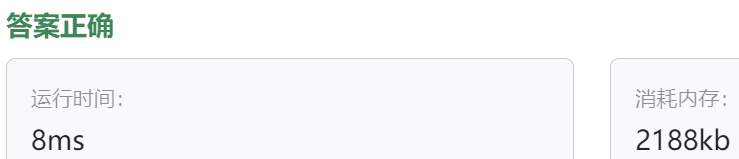

### 17、redo计数器应用（202400602）
>**题目描述**  
- 小明正在设计一个简单的计数器应用，支持增加（Increment）和减少（Decrement）操作，以及撤销（Undo）和重做（Redo）操作，请你使用备忘录模式帮他实现。 

>**输入描述**  
- 输入包含若干行，每行包含一个字符串，表示计数器应用的操作，操作包括 "Increment"、"Decrement"、"Undo" 和 "Redo"。

>**输出描述**  
- 对于每个 "Increment" 和 "Decrement" 操作，输出当前计数器的值，计数器数值从0开始 对于每个 "Undo" 操作，输出撤销后的计数器值。 对于每个 "Redo" 操作，输出重做后的计数器值。

>**输入示例**  
Increment  
Increment  
Decrement  
Undo  
Redo  
Increment  
  
>**输出示例**  
1  
2  
1  
2  
1  
2  

>自己答案（去注释）
```C++
#include <iostream>
#include <stack>
#include <string>
#include <memory>

using namespace std;

class Mementor {
private:
    int state;
    
public:
    Mementor(int state) : state(state) {}
    
    int getState() {
        return state;
    }
};

class Caculator {
private:
    int result;

public:
    Caculator(int state) : result(state) {}
    
    void Incretement() {  
        result += 1;    
    }
    
    void Decrement() {
        result -= 1;    
    }
    
    void setResult(shared_ptr<Mementor> mem) {
        result = mem->getState(); 
    }
    
    shared_ptr<Mementor> save() {
        return make_shared<Mementor>(result); 
    }
    
    int retResult(){
        return result;
    }
};

class CareTaker {
private:
    std::stack<shared_ptr<Mementor>> undo;
    std::stack<shared_ptr<Mementor>> redo;
    shared_ptr<Caculator> caculator;
    
public:
    CareTaker(shared_ptr<Caculator> caculator) : caculator(caculator){}
    
    void ExecIncretement(){
        undo.push(caculator->save());  
        caculator->Incretement();
        redo = std::stack<shared_ptr<Mementor>>();  
        
        cout << caculator->retResult() << endl;
    }
    
    void ExecDecrement(){
        undo.push(caculator->save());  
        caculator->Decrement();
        redo = std::stack<shared_ptr<Mementor>>(); 
        
        cout << caculator->retResult() << endl;
    }
    
    void ExecUndo(){
        if(! undo.empty()){
            redo.push(caculator->save());  
            caculator->setResult(undo.top());  
            undo.pop();
        }else{
            cout << "undo stack is empty." << endl;
        }
        cout << caculator->retResult() << endl;
    }
    
    void ExecRedo(){
        if(! redo.empty()){
            caculator->setResult(redo.top());
            redo.pop();
        }else{
            cout << "redo stack is empty." << endl;
        }
        cout << caculator->retResult() << endl;
    }
};

int main(){
    string operation;
    shared_ptr<Caculator> cacul = make_shared<Caculator>(0);
    CareTaker ct(cacul);
    
    while(cin >> operation){
        if(operation == "Increment"){
            ct.ExecIncretement();  
        }else if(operation == "Decrement"){
            ct.ExecDecrement();
        }else if(operation == "Undo"){
            ct.ExecUndo();
        }else if(operation == "Redo"){
            ct.ExecRedo();
        }else{
            cout << "Wrong operation." << endl;
        }
    }
    return 0;
}
```

>自己答案（调试后，通过!!!）
```C++
// 之前的保存操作相当于现在的增加操作，只是需要另外增加减少操作
#include <iostream>
#include <stack>
#include <string>
#include <memory>


using namespace std;

class Mementor {
private:
    int state;
    
public:
    Mementor(int state) : state(state) {}
    
    int getState() {
        return state;
    }
};

class Caculator {
private:
    int result;

public:
    Caculator(int state) : result(state) {}
    
    // shared_ptr<Mementor> Incretement() {  // 这里不需要返回指针？
    //     result += 1;    // result -= 1;  运算符写错了！！！
    //     return make_shared<Mementor>(result);
    // }
    
    // shared_ptr<Mementor> Decrement() {
    //     result -= 1;    // result += 1;  运算符写错了！！！
    //     return make_shared<Mementor>(result);
    // }
    
    void Incretement() {  // 这里不需要返回指针？
        result += 1;    // result -= 1;  运算符写错了！！！
    }
    
    void Decrement() {
        result -= 1;    // result += 1;  运算符写错了！！！
    }
    
    void setResult(shared_ptr<Mementor> mem) {
        result = mem->getState(); 
    }
    
    shared_ptr<Mementor> save() {
        return make_shared<Mementor>(result); 
    }
    
    int retResult(){
        return result;
    }
};

class CareTaker {
private:
    std::stack<shared_ptr<Mementor>> undo;
    std::stack<shared_ptr<Mementor>> redo;
    shared_ptr<Caculator> caculator;
    
public:
    CareTaker(shared_ptr<Caculator> caculator) : caculator(caculator){}
    
    void ExecIncretement(){
        // undo.push(make_shared<Mementor>(caculator->retResult()));  // undo存储未操作前的状态
        undo.push(caculator->save());  // CareTaker和Caculator各司其职！
        
        caculator->Incretement();
        
        // while(!redo.empty()){    // 有新操作则需重置redo！
        //     redo.pop();
        // }
        // redo = std::stack<Mementor>();  // 有新操作则需重置redo！stack<Mementor>和定义的stack<shared_ptr<Mementor>>不一样啊，看清楚。。
        redo = std::stack<shared_ptr<Mementor>>();  // 有新操作则需重置redo！
        
        cout << caculator->retResult() << endl;
    }
    
    void ExecDecrement(){
        // undo.push(make_shared<Mementor>(caculator->retResult()));  // undo.push_back(),stack的存入栈顶的操作方法是undo.push()!!!
        undo.push(caculator->save());  // CareTaker和Caculator各司其职！

        caculator->Decrement();
        
        // while(!redo.empty()){    // 有新操作则需重置redo！
        //     redo.pop();
        // }
        redo = std::stack<shared_ptr<Mementor>>();  // 有新操作则需重置redo！
        
        cout << caculator->retResult() << endl;
    }
    
    void ExecUndo(){
        if(! undo.empty()){
            // redo.push(make_shared<Mementor>(caculator->retResult()));  // 撤销做前，先把状态记录在redo里面
            redo.push(caculator->save());  // 撤销做前，先把状态记录在redo里面
            
            // caculator(undo.top());  // 利用undo的top还原状态。不是初始化，别用构造函数修改成员。新增了成员函数来修改成员
            caculator->setResult(undo.top());  // caculator->setResult(undo.top())); 多了个括号，为什么。。。
            
            undo.pop();
        }else{
            cout << "undo stack is empty." << endl;
        }
        cout << caculator->retResult() << endl;
    }
    
    void ExecRedo(){
        if(! redo.empty()){
            // undo.push(make_shared<Mementor>(caculator.retResult()));
            // caculator(redo.top());  // 利用undo的top还原状态
            caculator->setResult(redo.top());
            redo.pop();
        }else{
            cout << "redo stack is empty." << endl;
        }
        cout << caculator->retResult() << endl;
    }
};

int main(){
    string operation;
    shared_ptr<Caculator> cacul = make_shared<Caculator>(0);
    CareTaker ct(cacul);
    
    while(cin >> operation){
        if(operation == "Increment"){
            ct.ExecIncretement();  // ct.ExecIncrement();  // 名字错了
        }else if(operation == "Decrement"){
            ct.ExecDecrement();
        }else if(operation == "Undo"){
            ct.ExecUndo();
        }else if(operation == "Redo"){
            ct.ExecRedo();
        }else{
            cout << "Wrong operation." << endl;
        }
    }
    return 0;
}
```



> **卡码网答案**
```C++
#include <iostream>
#include <stack>
 
// 备忘录
class Memento {
private:
    int value;
 
public:
    Memento(int val) : value(val) {}
 
    int getValue() const {
        return value;
    }
};
 
// 发起人（Originator）
class Counter {
private:
    int value;
    std::stack<Memento> undoStack;
    std::stack<Memento> redoStack;
 
public:
    void increment() {
        redoStack = std::stack<Memento>(); // 清空 redoStack
        undoStack.push(Memento(value));
        value++;
    }
 
    void decrement() {
        redoStack = std::stack<Memento>(); // 清空 redoStack
        undoStack.push(Memento(value));
        value--;
    }
 
    void undo() {
        if (!undoStack.empty()) {
            redoStack.push(Memento(value));
            value = undoStack.top().getValue();
            undoStack.pop();
        }
    }
 
    void redo() {
        if (!redoStack.empty()) {
            undoStack.push(Memento(value));
            value = redoStack.top().getValue();
            redoStack.pop();
        }
    }
 
    int getValue() const {
        return value;
    }
};
 
int main() {
    Counter counter;
 
    // 处理计数器应用的输入
    std::string operation;
    while (std::cin >> operation) {
        if (operation == "Increment") {
            counter.increment();
        } else if (operation == "Decrement") {
            counter.decrement();
        } else if (operation == "Undo") {
            counter.undo();
        } else if (operation == "Redo") {
            counter.redo();
        }
 
        // 输出当前计数器的值
        std::cout << counter.getValue() << std::endl;
    }
 
    return 0;
}
```