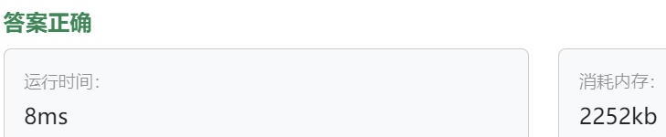

### 19、学生名单（202400604）
>**题目描述**  
- 小明是一位老师，在进行班级点名时，希望有一个学生名单系统，请你实现迭代器模式提供一个迭代器使得可以按顺序遍历学生列表。

>**输入描述**  
- 第一行是一个整数 N （1 <= N <= 100), 表示学生的数量。

- 接下来的 N 行，每行包含一个学生的信息，格式为 姓名 学号

>**输出描述**  
- 输出班级点名的结果，即按顺序遍历学生列表，输出学生的姓名和学号。

>**输入示例**  
3  
Alice 1001  
Bob 1002  
Charlie 1003    
  
>**输出示例**  
Alice 1001  
Bob 1002  
Charlie 1003   


>自己答案（调试后，通过!!!）
```C++
#include <iostream>
#include <string>
#include <vector>
#include <sstream>

using namespace std;

template <typename T>
class Iterator {
public:
    virtual bool hasNext() = 0;
    virtual T next() = 0;
    
    virtual ~Iterator() = default;
};

class Student {
private:
    string m_name;
    // int m_num;
    string m_num;
    
public:
    string getName(){
        return m_name;
    }
    
    string getNum(){
        return m_num;
    }
    
    // Student(string name, int num) : m_name(name), m_num(num); 构造函数最后是花括号{}，而不是分号；
    Student(string name, string num) : m_name(name), m_num(num) {}
};

class StudentIterator : public Iterator<Student>{
private:
    vector<Student> m_students;
    size_t position;
    
public:
    bool hasNext() override {
        return position < m_students.size();
    }
    
    Student next() override {
        return m_students[position++];
    }
    
    StudentIterator(vector<Student> students) : m_students(students), position(0){}
};

template <typename T>
class Manager {  // class Manger 拼写错误！！！
// protected:
//     vector<T> elment;
    
public:
    virtual Iterator<T>* createrIterator() = 0;  // 子类修改了，父类别忘记修改：virtual Iterator<T> createrIterator(vector<T>) = 0;
    
    virtual ~Manager() = default;
};

class StudentManager : public Manager<Student>{
private:
    vector<Student> m_students;
    
public:

    void addStudents(Student student){
        m_students.push_back(student);
    }
    
    // Iterator<Student> createrIterator() override {  // Iterator类中有虚函数，这样类似于实例化有虚函数的类！
    //     return StudentIterator(m_students);
    // }
    
    Iterator<Student>* createrIterator() override {
        return new StudentIterator(m_students);
    }

};


int main(){
    int count;
    cin >> count;
    cin.ignore();
    
    StudentManager manager;
    
    string input;
    while(count--){
        string student_name;
        string student_num;
        
        getline(cin, input);
        istringstream oss(input);
        
        oss >> student_name >> student_num;
        manager.addStudents(Student(student_name, student_num));
    }
    
    // StudentIterator stu_iterator = manager.createrIterator();  // 跟随createrIterator的修改
    Iterator<Student>* stu_iterator = manager.createrIterator();  // Iterator* stu_iterator = manager.createrIterator();
    while(stu_iterator->hasNext()) {  // if(stu_iterator->hasNext()) if必须修改为while，if只执行一次。。
        Student stu = stu_iterator->next();
        cout << stu.getName() << " " << stu.getNum() << endl;
    }
    
    delete stu_iterator;
    return 0;
}
```


> **卡码网答案**
```C++
#include <iostream>
#include <vector>
 
// 学生类
class Student {
public:
    // 形参可以设定为const的
    Student(const std::string& name, const std::string& studentId) : name(name), studentId(studentId) {}
 
    std::string getName() const {  // 函数可以设定为const的
        return name;
    }
 
    std::string getStudentId() const {
        return studentId;
    }
 
private:
    std::string name;
    std::string studentId;
};
 
// 可迭代对象接口
class StudentCollection {
public:
    virtual ~StudentCollection() = default;
 
    virtual std::vector<Student>::iterator begin() = 0;
    virtual std::vector<Student>::iterator end() = 0;
};
 
// 具体可迭代对象
class ConcreteStudentCollection : public StudentCollection {
public:
    void addStudent(const Student& student) {
        students.push_back(student);
    }
 
    std::vector<Student>::iterator begin() override {
        return students.begin();
    }
 
    std::vector<Student>::iterator end() override {
        return students.end();
    }
 
private:
    std::vector<Student> students;
};
 
int main() {
    int n;
    std::cin >> n;
    std::cin.ignore(); // 忽略换行符
 
    ConcreteStudentCollection studentCollection;
 
    for (int i = 0; i < n; ++i) {
        std::string name, studentId;
        std::cin >> name >> studentId;
        studentCollection.addStudent(Student(name, studentId));
    }
 
    // 使用迭代器遍历学生集合
    for (auto it = studentCollection.begin(); it != studentCollection.end(); ++it) {
        const Student& student = *it;
        std::cout << student.getName() << " " << student.getStudentId() << std::endl;
    }
 
    return 0;
}
```