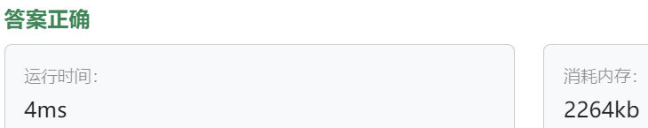

### 22、数学表达式（202400611）
>**题目描述**  
- 小明正在设计一个计算器，用于解释用户输入的简单数学表达式，每个表达式都是由整数、加法操作符+、乘法操作符组成的，表达式中的元素之间用空格分隔，请你使用解释器模式帮他实现这个系统。

>**输入描述**  
- 每行包含一个数学表达式，表达式中包含整数、加法操作符（+）和乘法操作符（*）。 表达式中的元素之间用空格分隔。

>**输出描述**  
- 对于每个输入的数学表达式，每行输出一个整数，表示对应表达式的计算结果。

>**输入示例**  
2 + 3  
5 * 2  
3 + 4 * 2      
  
>**输出示例**  
5  
10  
11   


>自己答案（去掉注释）
```C++
#include <iostream>
#include <memory>
#include <stack>
#include <string>
#include <sstream>   
#include <stdexcept> 

using namespace std;

class Expression {
public:
    virtual double interpret() = 0;

    virtual ~Expression() = default;
};

class NumberExpression : public Expression{
private:
    double value;
    
public:
    double interpret() override{
        return value;
    }
    
    NumberExpression(double val) : value(val){}
};

class BinaryExpression : public Expression{
protected:
    shared_ptr<Expression> left;     
    shared_ptr<Expression> right;    
    
public:
    BinaryExpression(shared_ptr<Expression> left, shared_ptr<Expression> right) : left(left), right(right){}
};  

class AddExpression : public BinaryExpression {
public:
    using BinaryExpression::BinaryExpression;
    
    double interpret() override{
        return left->interpret() + right->interpret();  
    }
};

class SubExpression : public BinaryExpression {
public:
    using BinaryExpression::BinaryExpression;
    
    double interpret() override{
        return left->interpret() - right->interpret();
    }
};

class MultExpression : public BinaryExpression {
public:
    using BinaryExpression::BinaryExpression;
    
    double interpret() override{
        return left->interpret() * right->interpret();
    }
};

class DivExpression : public BinaryExpression {
public:
    using BinaryExpression::BinaryExpression;
    
    double interpret() override{
        return left->interpret() / right->interpret(); 
    }
};

class Evaluator{
public:
    stack<shared_ptr<Expression>> exps;
    stack<char> ops;
    shared_ptr<Expression> styx_tree;
    
    string tokenize(const string& str);   
    void expressDeal(const string& input);   
    
    double interpret(){
        return styx_tree->interpret();
    }

    Evaluator(){}  
};

int priority(char op){
    if(op == '+' || op == '-') { return 1; }
    if(op == '*' || op == '/') { return 2; }
    return 0;
}

string Evaluator::tokenize(const string& str){  
    string result;
    
    for(auto ch : str){
        if(isspace(ch)){ continue; }
        if(isdigit(ch) || ch == '.'){
            result += ch;    
        }else{
            result = result + ' ' + ch + ' ';  
        }
    }
    return result;
}

void Evaluator::expressDeal(const string& input){ 
    string dealed; 
    dealed = tokenize(input); 
    istringstream iss(dealed);
    string str;
    
    auto applyOps = [&] (char op) {
        auto right = exps.top(); exps.pop();
        auto left = exps.top(); exps.pop();
        
        if(op == '+') { exps.push(make_shared<AddExpression>(left, right)); }
        else if(op == '-') { exps.push(make_shared<SubExpression>(left, right)); }
        else if(op == '*') { exps.push(make_shared<MultExpression>(left, right)); }
        else if(op == '/') { exps.push(make_shared<DivExpression>(left, right)); }
    };
    
    while(iss >> str){
        if(isdigit(str[0])){ 
            exps.push(make_shared<NumberExpression>(stod(str)));
        }else if(str == "("){  
            ops.push('(');
        }else if(str == ")"){
            while(!ops.empty() && ops.top() != '('){
                applyOps(ops.top());
                ops.pop();
            }  
            ops.pop(); 
        }else if(str == "+" || str == "-" || str == "*" || str == "/"){ 
            while(!ops.empty() && priority(ops.top()) >= priority(str[0])){ 
                applyOps(ops.top());
                ops.pop();
            }
            ops.push(str[0]);
        }
    }
    while(!ops.empty()){
        applyOps(ops.top());
        ops.pop();
    }
    styx_tree =  exps.top();
}

int main(){
    string input;
    
    Evaluator caculator;
    try{
        while(getline(cin, input)){
        caculator.expressDeal(input);
        cout << caculator.interpret() << endl;
    }
    }catch(const std::exception& ex){
        cerr << "Exception: " << ex.what() << endl;
    }
}
```

>自己答案（调试后，通过!!!）
```C++
#include <iostream>
#include <memory>
#include <stack>
#include <string>
#include <sstream>  // 使用istringstream需要的头文件
#include <stdexcept> 

using namespace std;

class Expression {
public:
    virtual double interpret() = 0;

    virtual ~Expression() = default;
};

class NumberExpression : public Expression{
private:
    double value;
    
public:
    double interpret() override{
        return value;
    }
    
    NumberExpression(double val) : value(val){}
};

class BinaryExpression : public Expression{
protected:
    shared_ptr<Expression> left;     // shared<Expression> left;  shared_ptr<>名字写错。。
    shared_ptr<Expression> right;    // shared<Expression> right;
    
public:
    // shared<Expression> left
    BinaryExpression(shared_ptr<Expression> left, shared_ptr<Expression> right) : left(left), right(right){}
};  // 忘记了分号！

class AddExpression : public BinaryExpression {
public:
    using BinaryExpression::BinaryExpression;
    
    double interpret() override{
        return left->interpret() + right->interpret();  // return left->interpret + right->interpret;方法名少了括号。。
    }
};

class SubExpression : public BinaryExpression {
public:
    using BinaryExpression::BinaryExpression;
    
    double interpret() override{
        return left->interpret() - right->interpret();
    }
};

class MultExpression : public BinaryExpression {
public:
    using BinaryExpression::BinaryExpression;
    
    double interpret() override{
        return left->interpret() * right->interpret();
    }
};

class DivExpression : public BinaryExpression {
public:
    using BinaryExpression::BinaryExpression;
    
    double interpret() override{
        return left->interpret() / right->interpret();  // 如何避免除以零？
    }
};

class Evaluator{
public:
    stack<shared_ptr<Expression>> exps;
    stack<char> ops;
    shared_ptr<Expression> styx_tree;
    
    string tokenize(const string& str);   // 使用引用和const
    // shared_ptr<Expression> expressDeal(string input);
    void expressDeal(const string& input);   // 使用引用和const
    
    double interpret(){
        return styx_tree->interpret();
    }
    // Evaluator(const string context){
    //     string dealed = tokenize(context);  // 将输入处理为规范的表达式
    //     istringstream iss(dealed);
    //     styx_tree = expressDeal(iss);
    // }
    Evaluator(){}  // 这里要改？
};

int priority(char op){
    if(op == '+' || op == '-') { return 1; }
    // else if(op == '*' || op == '/') { return 2; }  
    // else{ cout << "Wrong op." << endl; return 0;}  // 可能会遇到括号，不一定都是运算符，所以else写法不对
    if(op == '*' || op == '/') { return 2; }
    return 0;  // 非运算符返回0！！！也就是不运算，因为可能是“(2+”这种情况！！
}

string Evaluator::tokenize(const string& str){  // 使用引用和const!!!
    string result;
    
    for(auto ch : str){
        if(isspace(ch)){ continue; }
        if(isdigit(ch) || ch == '.'){
            result += ch;    // 数字拼凑在一起
        }else{
            // result = result + ' ' + ch + ' ';  // 符号与数字隔开
            result += ' ';   
            result += ch ;
            result += ' ';
        }
    }
    return result;
}

// shared<Expression> Evaluator::expressDeal(istringstream input){
// shared_ptr<Expression> Evaluator::expressDeal(string input){
void Evaluator::expressDeal(const string& input){  // 使用引用和const!!!
    // string dealed = tokenize(input);  // 将输入处理为规范的表达式
    string dealed; 
    dealed = tokenize(input); 
    istringstream iss(dealed);
    // styx_tree = expressDeal(iss);
    string str;
    
    auto applyOps = [&] (char op) {
        // auto left = exps.top(); exps.pop();
        // auto right = exps.top(); exps.pop();   这里应该先把栈头上的数据给right。。
        auto right = exps.top(); exps.pop();
        auto left = exps.top(); exps.pop();
        
        if(op == '+') { exps.push(make_shared<AddExpression>(left, right)); }
        else if(op == '-') { exps.push(make_shared<SubExpression>(left, right)); }
        else if(op == '*') { exps.push(make_shared<MultExpression>(left, right)); }
        else if(op == '/') { exps.push(make_shared<DivExpression>(left, right)); }
    };  // 这里需要一个分号，lambda表达式算一个语句！！！
    
    while(iss >> str){
        if(isdigit(str[0])){  // if(isdigit[str[0]])方法使用错误，不是方括号，而是圆括号
            exps.push(make_shared<NumberExpression>(stod(str)));  // exps.push(stod(str));  exps存的是数字表达式类，而不是纯粹数值。。
        }else if(str == "("){  // else if(str == '(' string不能和字符char比较。。
            // ops.push(str[0]);  // ops.push(str); ops是字符栈，不能放字符串。。
            ops.push('(');
        }else if(str == ")"){       // 当前的右括号中最多只有一个低阶运算加一个高阶运算（1+2*3）
            while(!ops.empty() && ops.top() != '('){  // 将当前括号运算完. !ops.empty()条件漏了
                applyOps(ops.top());
                ops.pop();            // 将括号中当前的运算符去掉，因为已经运算过了
            }  
            ops.pop();  // 将左括号去掉，当前括号运算完成！
        }else if(str == "+" || str == "-" || str == "*" || str == "/"){
            // if(!ops.empty() && priority(ops.top()) >= priority(str[0])){   // 栈中运算符大于当前读取的运算符，则进行运算
            //     applyOps(ops.top());
            //     ops.pop();
            //     ops.push(str[0]);  // ops.push(str);  这样写，第一次遇到运算符时不会将其进栈
            // }
            // ops.push(str[0]);  // 这样放到外边就可以了！！！
            while(!ops.empty() && priority(ops.top()) >= priority(str[0])){   // 改为了while！！！有何区别？
                applyOps(ops.top());
                ops.pop();
            }
            ops.push(str[0]);
        }
    }
    while(!ops.empty()){  // 最后应该是无括号情况，且最多只有一个低阶运算加一个高阶运算1+2*3
        applyOps(ops.top());
        ops.pop();
    }
    styx_tree =  exps.top();
}


int main(){
    string input;
    
    Evaluator caculator;
    try{
        while(getline(cin, input)){
        // shared_ptr<Expression> styx_tree = caculator.expressDeal(input);  // ChatGPT是把styx_tree作为了Evaluator的成员，再提供函数interpret访问styx_tree
        // double value = styx_tree->interpret();
        caculator.expressDeal(input);
        // caculator.interpret();
        cout << caculator.interpret() << endl;
    }
    }catch(const std::exception& ex){
        cerr << "Exception: " << ex.what() << endl;
    }
}
```



> **卡码网答案**
```C++
#include <iostream>
#include <sstream>
#include <stack>
#include <vector>
#include <stdexcept>
#include <iterator>
#include <regex>

// 抽象表达式类
class Expression {
public:
    virtual int interpret() = 0;
    virtual ~Expression() {}
};

// 终结符表达式类 - 数字
class NumberExpression : public Expression {
private:
    int value;

public:
    NumberExpression(int val) : value(val) {}

    int interpret() override {
        return value;
    }
};

// 非终结符表达式类 - 加法操作
class AddExpression : public Expression {
private:
    Expression* left;
    Expression* right;

public:
    AddExpression(Expression* l, Expression* r) : left(l), right(r) {}

    int interpret() override {
        return left->interpret() + right->interpret();
    }
};

// 非终结符表达式类 - 乘法操作
class MultiplyExpression : public Expression {
private:
    Expression* left;
    Expression* right;

public:
    MultiplyExpression(Expression* l, Expression* r) : left(l), right(r) {}

    int interpret() override {
        return left->interpret() * right->interpret();
    }
};

// 非终结符表达式类 - 操作符
class OperatorExpression : public Expression {
private:
    std::string oper;

public:
    OperatorExpression(const std::string& op) : oper(op) {}

    int interpret() override {
        throw std::runtime_error("OperatorExpression does not support interpretation");
    }

    std::string getOperator() const {
        return oper;
    }
};

// 解析表达式字符串
int parseExpression(const std::string& expressionStr) {
    std::istringstream iss(expressionStr);
    std::vector<std::string> elements(std::istream_iterator<std::string>{iss}, std::istream_iterator<std::string>());

    std::stack<Expression*> stack;

    for (const auto& element : elements) {
        if (std::regex_match(element, std::regex("\\d+"))) {
            stack.push(new NumberExpression(std::stoi(element)));
        } else if (element == "+" || element == "*") {
            stack.push(new OperatorExpression(element));
        } else {
            throw std::invalid_argument("Invalid element in expression: " + element);
        }
    }

    while (stack.size() > 1) {
        Expression* right = stack.top();
        stack.pop();
        Expression* operatorExp = stack.top();
        stack.pop();
        Expression* left = stack.top();
        stack.pop();

        if (auto* opExp = dynamic_cast<OperatorExpression*>(operatorExp)) {
            std::string op = opExp->getOperator();
            if (op == "+") {
                stack.push(new AddExpression(left, right));
            } else if (op == "*") {
                stack.push(new MultiplyExpression(left, right));
            }
        } else {
            throw std::invalid_argument("Invalid operator type in expression");
        }
    }

    int result = stack.top()->interpret();
    delete stack.top(); 
    return result;
}

int main() {
    std::vector<std::string> input_lines;
    std::string line;

    while (std::getline(std::cin, line) && !line.empty()) {
        input_lines.push_back(line);
    }

    for (size_t i = 0; i < input_lines.size(); ++i) {
        try {
            int result = parseExpression(input_lines[i]);
            std::cout << result << std::endl;
        } catch (const std::exception& e) {
            std::cout << "Error - " << e.what() << std::endl;
        }
    }

    return 0;
}
```