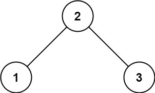
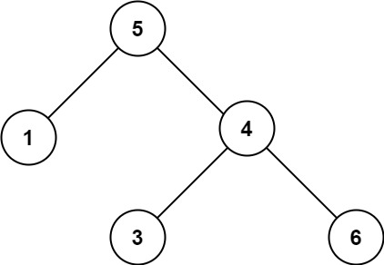

# Markdown 使用文档

## 1. 介绍
   - 什么是Markdown？
   - Markdown 的优点和用途
   - Markdown 的历史和发展


## 2. 基本语法
### 2.1 标题

随着“#”号个数增加，标题级别逐级下降。其中，“#”与文字间存在一个空格。
<div style="border: 1px solid black; padding: 10px; background-color: #FFFF00;">
  <p style="color: black; margin: 0; font-weight: bold; line-height: 1.2; font-size: 20px;margin-left: 1px;">
    <b># 一级标题</b><br/>
    <b>## 二级标题</b><br/>
    <b>### 三级标题</b><br/>
    <b>#### 四级标题</b><br/>
    <b>##### 五级标题</b><br/>
    <b>###### 六级标题</b><br/>
  </p>
</div>

<br/>
效果如下：
<div style="border: 1px solid black; padding: 10px; background-color: #FFFF00;">
  <h1 style="color: black; margin-left: 1px;">一级标题</h1>
  <h2 style="color: black; margin-left: 1px;">二级标题</h2>
  <h3 style="color: black; margin-left: 1px;">三级标题</h3>
  <h4 style="color: black; margin-left: 1px;">四级标题</h4>
  <h5 style="color: black; margin-left: 1px;">五级标题</h5>
  <h6 style="color: black; margin-left: 1px;">六级标题</h6>
</div>

### 2.2 段落和换行
分割线
<div style="border: 1px solid black; padding: 10px; background-color: #FFFF00;">
  <p style="color: black; margin: 0; font-weight: bold; line-height: 1.2; font-size: 20px;margin-left: 1px;">
    <b>***</b><br/>
    <b>*****</b><br/>
    <b>----------</b><br/>
  </p>
</div>

效果如下：

<div style="border: 1px solid black; padding: 10px; background-color: #FFFF00;">

***
*****
----------
</div>

            


### 2.3 粗体和斜体
斜体和粗体111
<div style="border: 1px solid black; padding: 10px; background-color: #FFFF00;">
  <p style="color: black; margin: 0; line-height: 1.2; font-size: 20px;margin-left: 1px;">
    *斜体文本*<br/>
    _斜体文本_<br/>
    <b>**粗体文本**</b><br/>
    <b>__粗体文本__</b><br/>
    <b>***粗斜体文本***</b><br/>
    <b>___粗斜体文本___</b><br/>
  </p>
</div>

<br/>
效果如下：
<div style="border: 1px solid black; padding: 0px; background-color: #FFFF00;">
  <p style="color: black; margin: 0;margin-top: 10px;margin-bottom: 10px;font-size:20px;margin-left: 10px;line-height: 1.2;">
    <i>斜体文本 (使用 *)</i><br/>
    <i>斜体文本 (使用 _)</i><br/>
    <b>粗体文本 (使用 **)</b><br/>
    <b>粗体文本 (使用 __)</b><br/>
    <b><i>粗斜体文本 (使用 ***)</i></b><br/>
    <b><i>粗斜体文本 (使用 ___)</i></b><br/>
  </p>
</div>

### 2.4 列表
#### 2.4.1 有序列表
#### 2.4.2 无序列表
#### 2.4.3 嵌套列表

### 2.5 引用块（Blockquotes）

### 2.6 分隔线 

### 2.7 字体、颜色、大小 

<font face="黑体">黑体字</font>  
<font face="微软雅黑">微软雅黑</font>  
<font face="STCAIYUN">华文彩云</font>  
<font color=blue>蓝色</font>  
<font color=#008000>绿色</font>  
<font color=Red>红色</font>  
<font size=5>尺寸</font>  

## 3. 链接与图片
### 3.1 插入链接
#### 3.1.1  内部链接
#### 3.1.2  外部链接

### 3.2 锚点链接

### 3.3 插入图片
#### 3.3.1 图片链接
#### 3.3.2 图片属性设置

## 4. 表格
### 4.1 创建表格
### 4.2 表格对齐和格式化
### 4.3 表头和内容单元格
### 4.4 表格的合并和拆分

## 5. 代码块与语法高亮
### 5.1 插入行内代码
### 5.2 插入代码块
#### 5.2.1 语法高亮显示
#### 5.2.2 代码块的行号显示

## 6. 扩展语法
### 6.1 任务列表
### 6.2 删除线
### 6.3 脚注
### 6.4 表情符号（Emoji）
### 6.5 注释

## 7. 高级技巧
### 7.1 数学公式（LaTeX）
### 7.2 自动编号
### 7.3 自动生成目录
### 7.4 嵌入HTML和其他格式

哪些颜色同时适合做黑色和白色字体的背景？  
MediumTurquoise	#48D1CC  
DeepSkyBlue	#00BFFF !!!!!!!  
DodgerBlue	#1E90FF ！！！  
LightSalmon	#FFA07A  

### 7.5 多语言支持

## 8. 编辑器与工具
### 8.1 推荐Markdown编辑器
### 8.2 插件与扩展

## 9. Markdown 与其他格式的比较
### 9.1 Markdown 与HTML的区别
### 9.2 Markdown 与其他标记语言的比较

## 10. 常见问题与注意事项

## 11. 资源与进阶阅读

## 12. 总结


<div style="border: 1px solid black; padding: 10px; background-color: #E0FFFF; color: black;">
    <p>假设你是一位很棒的家长，想要给你的孩子们一些小饼干。但是，每个孩子最多只能给一块饼干。</p>
    <p>对每个孩子 i，都有一个胃口值 g[i]，这是能让孩子们满足胃口的饼干的最小尺寸；并且每块饼干 j，都有一个尺寸 s[j] 。如果 s[j] >= g[i]，我们可以将这个饼干 j 分配给孩子 i ，这个孩子会得到满足。你的目标是尽可能满足越多数量的孩子，并输出这个最大数值。</p>
    <p>示例 1:</p>
    <ul>
        <li>输入: g = [1,2,3], s = [1,1]</li>
        <li>输出: 1</li>
        <li>解释: 你有三个孩子和两块小饼干，3个孩子的胃口值分别是：1,2,3。虽然你有两块小饼干，由于他们的尺寸都是1，你只能让胃口值是1的孩子满足。所以你应该输出1。</li>
    </ul>
</div>


<table>
  <tr>
    <td bgcolor="Yellow" style="padding: 5px; border: 0px solid black;">
      <span style="font-weight: bold; font-size: 20px; color: black; line-height: 1.2;">
        <b># 一级标题</b><br/>
        <b>## 二级标题</b><br/>
        <b>### 三级标题</b><br/>
        <b>#### 四级标题</b><br/>
        <b>##### 五级标题</b><br/>
        <b>###### 六级标题</b><br/>
      </span>
    </td>
  </tr>
</table>


#f8f8f8
Red #FF0000
Black #000000
DodgerBlue	#1E90FF
SpringGreen	#00FF7F
Aqua	#00FFFF
Gold	#FFD700
Yellow #FFFF00

<table>
  <tr>
    <td bgcolor="Yellow" style="padding: 5px; border: 0px solid black;">
      <span style="font-weight: bold; font-size: 20px;color: black;">
# 一级标题<br/>
## 二级标题<br/>
### 三级标题<br/>
#### 四级标题<br/>
##### 五级标题<br/>
###### 六级标题<br/>
      </span>
    </td>
  </tr>
</table>
  
<div style="background-color: Yellow; padding: 10px 0px; border: 1px solid black;">
  <h2 style="text-align: left; margin: 0; padding: 0;color: black;">自己调试版本（lambda表达式中参数使用引用）</h2>
</div>

<hr style="border-top: 5px solid #00FA9A;">

<div style="background-color: Yellow; padding: 0px; border: 1px solid black;">
  <h2 style="text-align: left;color: black;">自己调试版本（lambda表达式中参数使用引用）</h2>
</div>

<hr style="border-top: 5px solid #DC143C;">

<table>
  <tr>
    <td bgcolor="Yellow" style="padding: 5px; border: 0px solid black;">
      <span style="font-weight: bold; font-size: 20px;color: black;">自己调试版本（lambda表达式中参数使用引用）</span>
    </td>
  </tr>
</table>


<h1>想要放大的字体</h1>
<h2>想要放大的字体</h2>
<h3>想要放大的字 体</h3>
<h4>想要放大的字体</h4>
<h5>想要放大的字体</h5>

---

<h2>用在提问的问题上</h2>


<h3>用在回答的小标题上</h3>

<hr style="border-top: 20px solid #333;">

<font face="黑体">黑体字</font>  
<font face="微软雅黑">微软雅黑</font>  
<font face="STCAIYUN">华文彩云</font>  
<font color=blue>蓝色</font>  
<font color=#008000>绿色</font>  
<font color=Red>红色</font>  
<font size=5>尺寸</font>  

<font face="黑体" color=red size=6>黑体，绿色，尺寸为5（任意内容）</font>

<table><tr><td bgcolor=DarkSeaGreen>这里的背景色是：DarkSeaGreen，此处输入任意想输入的内容</td></tr></table>

<table><tr><td bgcolor=Beige>这里的背景色是：Beige，此处输入任意想输入的内容</td></tr></table>

<table><tr><td bgcolor=DeepPink>这里的背景色是：Beige，此处输入任意想输入的内容</td></tr></table>

MistyRose

<table><tr><td bgcolor=Yellow><b><h3>自己调试版本（lambda表达式中参数使用引用）</h3></b></td></tr></table>

<table>
  <tr>
    <td bgcolor="Yellow" style="padding: 5px;">
      <span style="font-weight: bold; font-size: 22px;">自己调试版本（lambda表达式中参数使用引用）</span>
    </td>
  </tr>
</table>


<table style="width: 100%; border-collapse: collapse;">
  <tr>
    <td bgcolor="Yellow" style="padding: 5px; text-align: center;">
      <span style="font-weight: bold; font-size: 20px;">自己调试版本（lambda表达式中参数使用引用）</span>
    </td>
  </tr>
</table>

<p style="color: blue; font-size: 16px; text-align: center;">
  这是一个居中的段落，文本颜色为蓝色，字体大小为16px。
</p>


<div style="background-color: Yellow; padding: 0px; border: 1px solid black;">
  <h2 style="text-align: left;">自己调试版本（lambda表达式中参数使用引用）</h2>
</div>

<p>
  你可以使用 <b>加粗</b>、<i>斜体</i>、<u>下划线</u> 和 <strike>删除线</strike> 等样式。
</p>

<p style="margin-top: 20px;">
  这个段落顶部有20px的外边距。
</p>

<p>
  换行示例：<br>
  这是第二行。
</p>

<div style="background-color: lightgray; padding: 1px; border: 2px solid black;">
  <p>这是另外一个带有背景颜色和边框的容器。</p>
</div>

<div style="background-color: lightgray; padding: 10px; border: 1px solid black;">
  <h2 style="text-align: left;">标题 2</h2>
  <p>这是一个带有背景颜色和边框的<div。>容器。</p>
</div>


```C++
#include <iostream>

using namespace std;

int main(){
    cout << "Hello! " << endl;
    system("pause");
}

```

SaddleBrown ！！！
#006400
ADFF2F
778899
FF8C00
4B0082  
000080  ！！！
8B4513
CD5C5C
2E8B57
DodgerBlue !!!
DarkSlateGray !!!

<div style="border: 1px solid black; padding: 10px; background-color: #2E8B57;">

给你一个二叉树的根节点 root ，判断其是否是一个有效的二叉搜索树。

有效 二叉搜索树定义如下：

- 节点的左子树只包含 小于 当前节点的数。
- 节点的右子树只包含 大于 当前节点的数。
- 所有左子树和右子树自身必须也是二叉搜索树。
 

示例 1：  


- 输入：root = [2,1,3]
- 输出：true

示例 2：  


- 输入：root = [5,1,4,null,null,3,6]
- 输出：false
- 解释：根节点的值是 5 ，但是右子节点的值是 4 。
 

提示：

- 树中节点数目范围在[1, 104] 内
- -231 <= Node.val <= 231 - 1

  </p>
</div>


<div style="border: 1px solid black; padding: 10px; background-color: #006400;">

```C++
#include <iostream>

using namespace std;

int main(){
    cout << "Hello! " << endl;
    system("pause");
}

```
</div>

>自己调试版本（lambda表达式中参数使用引用）

>自己调试版本（lambda表达式中参数使用引用）


<table><tr><td bgcolor=Gold>自己调试版本（lambda表达式中参数使用引用）</td></tr></table>

<table><tr><td bgcolor=Aqua>自己调试版本（lambda表达式中参数使用引用）</td></tr></table>

<table><tr><td bgcolor=DarkTurquoise>自己调试版本（lambda表达式中参数使用引用）</td></tr></table>

<table><tr><td bgcolor=RoyalBlue>自己调试版本1（lambda表达式中参数使用引用）</td></tr></table>

<table><tr><td bgcolor=Yellow><b>自己调试版本（lambda表达式中参数使用引用）</b></td></tr></table>

<table><tr><td bgcolor=Silver>给出你推荐的颜色</td></tr></table>

<table><tr><td bgcolor=SkyBlue>自己调试版本（lambda表达式中参数使用引用）</td></tr></table>


<h3>在Markdown中，可以使用LaTeX语法来编写公式和数学表达式。以下是一些常见的格式和例子：</h3>

<table><tr><td bgcolor=LightGray>LightGray</td></tr></table>
<table><tr><td bgcolor=Gray>Gray</td></tr></table>
<table><tr><td bgcolor=DimGray>DimGray</td></tr></table>
<table><tr><td bgcolor=SlateGray>SlateGray</td></tr></table>
<table><tr><td bgcolor=DarkSlateGray>DarkSlateGray</td></tr></table>
<table><tr><td bgcolor=DarkGray>DarkGray</td></tr></table>
<table><tr><td bgcolor=Gainsboro>Gainsboro</td></tr></table>
<table><tr><td bgcolor=WhiteSmoke>WhiteSmoke</td></tr></table>
<table><tr><td bgcolor=LightSlateGray>LightSlateGray</td></tr></table>
<table><tr><td bgcolor=DarkSlateBlue>DarkSlateBlue</td></tr></table>
<table><tr><td bgcolor=RoyalBlue>RoyalBlue</td></tr></table>
<table><tr><td bgcolor=LightSteelBlue>LightSteelBlue</td></tr></table>
<table><tr><td bgcolor=CadetBlue>CadetBlue</td></tr></table>
<table><tr><td bgcolor=DarkSeaGreen>DarkSeaGreen</td></tr></table>
<table><tr><td bgcolor=MediumAquamarine>MediumAquamarine</td></tr></table>
<table><tr><td bgcolor=DarkKhaki>DarkKhaki</td></tr></table>
<table><tr><td bgcolor=Tan>Tan</td></tr></table>
<table><tr><td bgcolor=BurlyWood>BurlyWood</td></tr></table>
<table><tr><td bgcolor=RosyBrown>RosyBrown</td></tr></table>
<table><tr><td bgcolor=MistyRose>MistyRose</td></tr></table>


<table><tr><td bgcolor=LightGray>这是使用 LightGray 背景色的文本。这个颜色较浅，适合在黑色主题下使用，提供良好的可读性。</td></tr></table>
<table><tr><td bgcolor=Gray>这是使用 Gray 背景色的文本。这个颜色中等，不会太刺眼，非常适合阅读。</td></tr></table>
<table><tr><td bgcolor=DimGray>这是使用 DimGray 背景色的文本。这个颜色更深一些，但依然保留了很好的可读性。</td></tr></table>
<table><tr><td bgcolor=SlateGray>这是使用 SlateGray 背景色的文本。它给人一种冷静和稳重的感觉，适合正式的文档。</td></tr></table>
<table><tr><td bgcolor=DarkSlateGray>这是使用 DarkSlateGray 背景色的文本。深色调让它在黑色主题下显得非常高端。</td></tr></table>
<table><tr><td bgcolor=DarkGray>这是使用 DarkGray 背景色的文本。这个颜色深而不失优雅，适合多种用途。</td></tr></table>
<table><tr><td bgcolor=Gainsboro>这是使用 Gainsboro 背景色的文本。它是一个非常浅的颜色，可以营造出轻松的阅读体验。</td></tr></table>
<table><tr><td bgcolor=WhiteSmoke>这是使用 WhiteSmoke 背景色的文本。此颜色非常柔和，适合长时间阅读。</td></tr></table>
<table><tr><td bgcolor=LightSlateGray>这是使用 LightSlateGray 背景色的文本。它带有轻微的蓝色调，看起来很清新。</td></tr></table>
<table><tr><td bgcolor=DarkSlateBlue>这是使用 DarkSlateBlue 背景色的文本。这个颜色独特，适合需要一些创意的文档。</td></tr></table>
<table><tr><td bgcolor=RoyalBlue>这是使用 RoyalBlue 背景色的文本。鲜艳的蓝色非常引人注目，适合突出重点。</td></tr></table>
<table><tr><td bgcolor=LightSteelBlue>这是使用 LightSteelBlue 背景色的文本。这个颜色清新而现代，非常适合科技主题的内容。</td></tr></table>
<table><tr><td bgcolor=CadetBlue>这是使用 CadetBlue 背景色的文本。带有绿蓝色调，给人一种安静的感觉，适合正式场合。</td></tr></table>
<table><tr><td bgcolor=DarkSeaGreen>这是使用 DarkSeaGreen 背景色的文本。这个颜色自然舒适，非常适合自然主题的内容。</td></tr></table>
<table><tr><td bgcolor=MediumAquamarine>这是使用 MediumAquamarine 背景色的文本。这个颜色明亮而生动，适合传达活力。</td></tr></table>
<table><tr><td bgcolor=DarkKhaki>这是使用 DarkKhaki 背景色的文本。它是一个温暖的颜色，非常适合柔和的主题。</td></tr></table>
<table><tr><td bgcolor=Tan>这是使用 Tan 背景色的文本。这个颜色温暖而平静，适合家庭或个人内容。</td></tr></table>
<table><tr><td bgcolor=BurlyWood>这是使用 BurlyWood 背景色的文本。这个颜色自然且质朴，适合传达舒适的感觉。</td></tr></table>
<table><tr><td bgcolor=RosyBrown>这是使用 RosyBrown 背景色的文本。这个颜色柔和而温暖，适合带有感情色彩的内容。</td></tr></table>
<table><tr><td bgcolor=MistyRose>这是使用 MistyRose 背景色的文本。这个颜色非常柔和，给人一种轻松愉悦的感觉，适合温馨的主题。</td></tr></table>


<table><tr><td bgcolor=LightGray>这是一个测试文本，背景颜色是LightGray。请查看效果是否符合你的预期。</td></tr></table>
<table><tr><td bgcolor=Gray>这是一个测试文本，背景颜色是Gray。请查看效果是否符合你的预期。</td></tr></table>
<table><tr><td bgcolor=DimGray>这是一个测试文本，背景颜色是DimGray。请查看效果是否符合你的预期。</td></tr></table>
<table><tr><td bgcolor=SlateGray>这是一个测试文本，背景颜色是SlateGray。请查看效果是否符合你的预期。</td></tr></table>
<table><tr><td bgcolor=DarkSlateGray>这是一个测试文本，背景颜色是DarkSlateGray。请查看效果是否符合你的预期。</td></tr></table>
<table><tr><td bgcolor=DarkGray>这是一个测试文本，背景颜色是DarkGray。请查看效果是否符合你的预期。</td></tr></table>
<table><tr><td bgcolor=Gainsboro>这是一个测试文本，背景颜色是Gainsboro。请查看效果是否符合你的预期。</td></tr></table>
<table><tr><td bgcolor=WhiteSmoke>这是一个测试文本，背景颜色是WhiteSmoke。请查看效果是否符合你的预期。</td></tr></table>
<table><tr><td bgcolor=LightSlateGray>这是一个测试文本，背景颜色是LightSlateGray。请查看效果是否符合你的预期。</td></tr></table>
<table><tr><td bgcolor=DarkSlateBlue>这是一个测试文本，背景颜色是DarkSlateBlue。请查看效果是否符合你的预期。</td></tr></table>
<table><tr><td bgcolor=RoyalBlue>这是一个测试文本，背景颜色是RoyalBlue。请查看效果是否符合你的预期。</td></tr></table>
<table><tr><td bgcolor=LightSteelBlue>这是一个测试文本，背景颜色是LightSteelBlue。请查看效果是否符合你的预期。</td></tr></table>
<table><tr><td bgcolor=CadetBlue>这是一个测试文本，背景颜色是CadetBlue。请查看效果是否符合你的预期。</td></tr></table>
<table><tr><td bgcolor=DarkSeaGreen>这是一个测试文本，背景颜色是DarkSeaGreen。请查看效果是否符合你的预期。</td></tr></table>
<table><tr><td bgcolor=MediumAquamarine>这是一个测试文本，背景颜色是MediumAquamarine。请查看效果是否符合你的预期。</td></tr></table>
<table><tr><td bgcolor=DarkKhaki>这是一个测试文本，背景颜色是DarkKhaki。请查看效果是否符合你的预期。</td></tr></table>
<table><tr><td bgcolor=Tan>这是一个测试文本，背景颜色是Tan。请查看效果是否符合你的预期。</td></tr></table>
<table><tr><td bgcolor=BurlyWood>这是一个测试文本，背景颜色是BurlyWood。请查看效果是否符合你的预期。</td></tr></table>
<table><tr><td bgcolor=RosyBrown>这是一个测试文本，背景颜色是RosyBrown。请查看效果是否符合你的预期。</td></tr></table>
<table><tr><td bgcolor=MistyRose>这是一个测试文本，背景颜色是MistyRose。请查看效果是否符合你的预期。</td></tr></table>


### 内联公式

使用单个美元符号 `$` 将公式包裹起来，这种方式适用于短的、内联的公式。例如：

```markdown
这是一个内联公式：$E = mc^2$。
```

结果：

这是一个内联公式：$E = mc^2$。

### 块级公式

使用双美元符号 `$$` 将公式包裹起来，这种方式适用于较长的、块级的公式。例如：

```markdown
这是一个块级公式：
$$
\frac{a}{b} = \frac{c}{d}
$$
```

结果：

这是一个块级公式：
$$
\frac{a}{b} = \frac{c}{d}
$$

### 常见公式示例

#### 分数

```markdown
内联分数：$ \frac{a}{b} $
```

结果：

内联分数：$ \frac{a}{b} $

#### 幂和下标

```markdown
幂：$ a^2 $

下标：$ a_i $
```

结果：

幂：$ a^2 $

下标：$ a_i $

#### 求和符号

```markdown
$$
\sum_{i=1}^n i = \frac{n(n+1)}{2}
$$
```

结果：

$$
\sum_{i=1}^n i = \frac{n(n+1)}{2}
$$

#### 积分符号

```markdown
$$
\int_a^b f(x) \, dx
$$
```

结果：

$$
\int_a^b f(x) \, dx
$$

#### 极限符号

```markdown
$$
\lim_{x \to \infty} \frac{1}{x} = 0
$$
```

结果：

$$
\lim_{x \to \infty} \frac{1}{x} = 0
$$

### 复杂示例

这是一个包含多个部分的复杂公式示例：

```markdown
$$
\begin{aligned}
a^2 + b^2 &= c^2 \\
e^{i\pi} + 1 &= 0
\end{aligned}
$$
```

结果：

$$
\begin{aligned}
a^2 + b^2 &= c^2 \\
e^{i\pi} + 1 &= 0
\end{aligned}
$$

通过以上示例，你可以在Markdown文档中优雅地展示各种数学公式。

---

<h3>当然，可以继续介绍如何在Markdown中表示复杂的数学公式和表达式，特别是关于大O表示法等内容:</h3>


### 大O表示法

大O表示法用于描述算法的时间和空间复杂度。可以在Markdown中使用LaTeX语法来表示。例如：

```markdown
时间复杂度为 $O(N \times M)$
```

结果：

时间复杂度为 $O(N \times M)$

### 常见的数学表达

#### 矩阵表示

```markdown
$$
\begin{pmatrix}
a & b \\
c & d
\end{pmatrix}
$$
```

结果：

$$
\begin{pmatrix}
a & b \\
c & d
\end{pmatrix}
$$

#### 方程组

```markdown
$$
\begin{cases}
x + y = 1 \\
x - y = 0
\end{cases}
$$
```

结果：

$$
\begin{cases}
x + y = 1 \\
x - y = 0
\end{cases}
$$

#### 复杂表达式

例如，描述算法复杂度时可以这样写：

```markdown
对于DFS函数，最坏情况下时间复杂度为 $O(N \times M)$。对于findWaterFlowCells函数，总时间复杂度为 $O((N + M) \times (N \times M))$，可以简化为 $O(N^2 \times M + N \times M^2)$。
```

结果：

对于DFS函数，最坏情况下时间复杂度为 $O(N \times M)$。对于findWaterFlowCells函数，总时间复杂度为 $O((N + M) \times (N \times M))$，可以简化为 $O(N^2 \times M + N \times M^2)$。

### 数学符号汇总

以下是一些常见数学符号的Markdown表示法：

- **求和符号**：
  ```markdown
  $ \sum_{i=1}^n i = \frac{n(n+1)}{2} $
  ```

  结果：$ \sum_{i=1}^n i = \frac{n(n+1)}{2} $

- **积分符号**：
  ```markdown
  $ \int_a^b f(x) \, dx $
  ```

  结果：$ \int_a^b f(x) \, dx $

- **极限符号**：
  ```markdown
  $ \lim_{x \to \infty} \frac{1}{x} = 0 $
  ```

  结果：$ \lim_{x \to \infty} \frac{1}{x} = 0 $

- **微分符号**：
  ```markdown
  $ \frac{d}{dx} (x^2) = 2x $
  ```

  结果：$ \frac{d}{dx} (x^2) = 2x $

通过这些示例和说明，你可以在Markdown文档中高效地表示各种数学公式和表达式。

<hr style="border-top: 20px solid #333;">


<div style="background-color: #333; height: 20px;"></div>


# 我的文档

## 目录
<!-- TOC -->
- [章节一](#章节一)
- [章节二](#章节二)
  <details>
    <summary>问答</summary>
    - [问题1](#问题1)
    - [问题2](#问题2)
  </details>
<!-- /TOC -->

## 章节一
这里是章节一的内容。

## 章节二
这里是章节二的内容。

### 问答部分
<details>
  <summary>问题1</summary>
  这里是问题1的内容。
</details>

<details>
  <summary>问题2</summary>
  这里是问题2的内容。
</details>


| 颜色名称 | 十六进制 | RGB值 |
| --- | --- | --- |
| <span style="color:#F08080">LightCoral</span> | <span style="color:#F08080">#F08080</span> | rgb(240, 128, 128) |
| <span style="color:#FA8072">Salmon</span> | <span style="color:#FA8072">#FA8072</span> | rgb(250, 128, 114) |
| <span style="color:#E9967A">DarkSalmon</span> | <span style="color:#E9967A">#E9967A</span> | rgb(233, 150, 122) |
| <span style="color:#FFA07A">LightSalmon</span> | <span style="color:#FFA07A">#FFA07A</span> | rgb(255, 160, 122) |
| <span style="color:#FF7F50">Coral</span> | <span style="color:#FF7F50">#FF7F50</span> | rgb(255, 127, 80) |
| <span style="color:#FF6347">Tomato</span> | <span style="color:#FF6347">#FF6347</span> | rgb(255, 99, 71) |
| <span style="color:#FF4500">OrangeRed</span> | <span style="color:#FF4500">#FF4500</span> | rgb(255, 69, 0) |
| <span style="color:#FF0000">Red</span> | <span style="color:#FF0000">#FF0000</span> | rgb(255, 0, 0) |
| <span style="color:#DC143C">Crimson</span> | <span style="color:#DC143C">#DC143C</span> | rgb(220, 20, 60) |
| <span style="color:#B22222">FireBrick</span> | <span style="color:#B22222">#B22222</span> | rgb(178, 34, 34) |
| <span style="color:#8B0000">DarkRed</span> | <span style="color:#8B0000">#8B0000</span> | rgb(139, 0, 0) |
| <span style="color:#CD5C5C">IndianRed</span> | <span style="color:#CD5C5C">#CD5C5C</span> | rgb(205, 92, 92) |
| <span style="color:#FF8C00">Darkorange</span> | <span style="color:#FF8C00">#FF8C00</span> | rgb(255, 140, 0) |
| <span style="color:#FFA500">Orange</span> | <span style="color:#FFA500">#FFA500</span> | rgb(255, 165, 0) |
| <span style="color:#FFDAB9">PeachPuff</span> | <span style="color:#FFDAB9">#FFDAB9</span> | rgb(255, 218, 185) |
| <span style="color:#FFE4B5">Moccasin</span> | <span style="color:#FFE4B5">#FFE4B5</span> | rgb(255, 228, 181) |
| <span style="color:#FFEFD5">PapayaWhip</span> | <span style="color:#FFEFD5">#FFEFD5</span> | rgb(255, 239, 213) |
| <span style="color:#FFFFE0">LightYellow</span> | <span style="color:#FFFFE0">#FFFFE0</span> | rgb(255, 255, 224) |
| <span style="color:#FFFACD">LemonChiffon</span> | <span style="color:#FFFACD">#FFFACD</span> | rgb(255, 250, 205) |
| <span style="color:#FAFAD2">LightGoldenRodYellow</span> | <span style="color:#FAFAD2">#FAFAD2</span> | rgb(250, 250, 210) |
| <span style="color:#FFEFD5">PapayaWhip</span> | <span style="color:#FFEFD5">#FFEFD5</span> | rgb(255, 239, 213) |
| <span style="color:#FFE4B5">Moccasin</span> | <span style="color:#FFE4B5">#FFE4B5</span> | rgb(255, 228, 181) |
| <span style="color:#FFDAB9">PeachPuff</span> | <span style="color:#FFDAB9">#FFDAB9</span> | rgb(255, 218, 185) |
| <span style="color:#EEE8AA">PaleGoldenRod</span> | <span style="color:#EEE8AA">#EEE8AA</span> | rgb(238, 232, 170) |
| <span style="color:#F0E68C">Khaki</span> | <span style="color:#F0E68C">#F0E68C</span> | rgb(240, 230, 140) |
| <span style="color:#BDB76B">DarkKhaki</span> | <span style="color:#BDB76B">#BDB76B</span> | rgb(189, 183, 107) |
| <span style="color:#FFFF00">Yellow</span> | <span style="color:#FFFF00">#FFFF00</span> | rgb(255, 255, 0) |
| <span style="color:#FFD700">Gold</span> | <span style="color:#FFD700">#FFD700</span> | rgb(255, 215, 0) |
| <span style="color:#FFA500">Orange</span> | <span style="color:#FFA500">#FFA500</span> | rgb(255, 165, 0) |
| <span style="color:#FF8C00">Darkorange</span> | <span style="color:#FF8C00">#FF8C00</span> | rgb(255, 140, 0) |
| <span style="color:#DAA520">GoldenRod</span> | <span style="color:#DAA520">#DAA520</span> | rgb(218, 165, 32) |
| <span style="color:#B8860B">DarkGoldenRod</span> | <span style="color:#B8860B">#B8860B</span> | rgb(184, 134, 11) |
| <span style="color:#ADFF2F">GreenYellow</span> | <span style="color:#ADFF2F">#ADFF2F</span> | rgb(173, 255, 47) |
| <span style="color:#7FFF00">Chartreuse</span> | <span style="color:#7FFF00">#7FFF00</span> | rgb(127, 255, 0) |
| <span style="color:#7CFC00">LawnGreen</span> | <span style="color:#7CFC00">#7CFC00</span> | rgb(124, 252, 0) |
| <span style="color:#00FF00">Lime</span> | <span style="color:#00FF00">#00FF00</span> | rgb(0, 255, 0) |
| <span style="color:#32CD32">LimeGreen</span> | <span style="color:#32CD32">#32CD32</span> | rgb(50, 205, 50) |
| <span style="color:#98FB98">PaleGreen</span> | <span style="color:#98FB98">#98FB98</span> | rgb(152, 251, 152) |
| <span style="color:#90EE90">LightGreen</span> | <span style="color:#90EE90">#90EE90</span> | rgb(144, 238, 144) |
| <span style="color:#00FA9A">MediumSpringGreen</span> | <span style="color:#00FA9A">#00FA9A</span> | rgb(0, 250, 154) |
| <span style="color:#00FF7F">SpringGreen</span> | <span style="color:#00FF7F">#00FF7F</span> | rgb(0, 255, 127) |
| <span style="color:#3CB371">MediumSeaGreen</span> | <span style="color:#3CB371">#3CB371</span> | rgb(60, 179, 113) |
| <span style="color:#2E8B57">SeaGreen</span> | <span style="color:#2E8B57">#2E8B57</span> | rgb(46, 139, 87) |
| <span style="color:#228B22">ForestGreen</span> | <span style="color:#228B22">#228B22</span> | rgb(34, 139, 34) |
| <span style="color:#008000">Green</span> | <span style="color:#008000">#008000</span> | rgb(0, 128, 0) |
| <span style="color:#006400">DarkGreen</span> | <span style="color:#006400">#006400</span> | rgb(0, 100, 0) |
| <span style="color:#9ACD32">YellowGreen</span> | <span style="color:#9ACD32">#9ACD32</span> | rgb(154, 205, 50) |
| <span style="color:#6B8E23">OliveDrab</span> | <span style="color:#6B8E23">#6B8E23</span> | rgb(107, 142, 35) |
| <span style="color:#E0FFFF">LightCyan</span> | <span style="color:#E0FFFF">#E0FFFF</span> | rgb(224, 255, 255) |
| <span style="color:#00FFFF">Cyan</span> | <span style="color:#00FFFF">#00FFFF</span> | rgb(0, 255, 255) |
| <span style="color:#00FFFF">Aqua</span> | <span style="color:#00FFFF">#00FFFF</span> | rgb(0, 255, 255) |
| <span style="color:#7FFFD4">Aquamarine</span> | <span style="color:#7FFFD4">#7FFFD4</span> | rgb(127, 255, 212) |
| <span style="color:#40E0D0">Turquoise</span> | <span style="color:#40E0D0">#40E0D0</span> | rgb(64, 224, 208) |
| <span style="color:#48D1CC">MediumTurquoise</span> | <span style="color:#48D1CC">#48D1CC</span> | rgb(72, 209, 204) |
| <span style="color:#00CED1">DarkTurquoise</span> | <span style="color:#00CED1">#00CED1</span> | rgb(0, 206, 209) |
| <span style="color:#5F9EA0">CadetBlue</span> | <span style="color:#5F9EA0">#5F9EA0</span> | rgb(95, 158, 160) |
| <span style="color:#ADD8E6">LightBlue</span> | <span style="color:#ADD8E6">#ADD8E6</span> | rgb(173, 216, 230) |
| <span style="color:#B0E0E6">PowderBlue</span> | <span style="color:#B0E0E6">#B0E0E6</span> | rgb(176, 224, 230) |
| <span style="color:#87CEFA">LightSkyBlue</span> | <span style="color:#87CEFA">#87CEFA</span> | rgb(135, 206, 250) |
| <span style="color:#87CEEB">SkyBlue</span> | <span style="color:#87CEEB">#87CEEB</span> | rgb(135, 206, 235) |
| <span style="color:#00BFFF">DeepSkyBlue</span> | <span style="color:#00BFFF">#00BFFF</span> | rgb(0, 191, 255) |
| <span style="color:#1E90FF">DodgerBlue</span> | <span style="color:#1E90FF">#1E90FF</span> | rgb(30, 144, 255) |
| <span style="color:#6495ED">CornflowerBlue</span> | <span style="color:#6495ED">#6495ED</span> | rgb(100, 149, 237) |
| <span style="color:#4682B4">SteelBlue</span> | <span style="color:#4682B4">#4682B4</span> | rgb(70, 130, 180) |
| <span style="color:#B0C4DE">LightSteelBlue</span> | <span style="color:#B0C4DE">#B0C4DE</span> | rgb(176, 196, 222) |
| <span style="color:#4169E1">RoyalBlue</span> | <span style="color:#4169E1">#4169E1</span> | rgb(65, 105, 225) |
| <span style="color:#0000FF">Blue</span> | <span style="color:#0000FF">#0000FF</span> | rgb(0, 0, 255) |
| <span style="color:#0000CD">MediumBlue</span> | <span style="color:#0000CD">#0000CD</span> | rgb(0, 0, 205) |
| <span style="color:#00008B">DarkBlue</span> | <span style="color:#00008B">#00008B</span> | rgb(0, 0, 139) |
| <span style="color:#000080">Navy</span> | <span style="color:#000080">#000080</span> | rgb(0, 0, 128) |
| <span style="color:#191970">MidnightBlue</span> | <span style="color:#191970">#191970</span> | rgb(25, 25, 112) |
| <span style="color:#483D8B">DarkSlateBlue</span> | <span style="color:#483D8B">#483D8B</span> | rgb(72, 61, 139) |
| <span style="color:#6A5ACD">SlateBlue</span> | <span style="color:#6A5ACD">#6A5ACD</span> | rgb(106, 90, 205) |
| <span style="color:#7B68EE">MediumSlateBlue</span> | <span style="color:#7B68EE">#7B68EE</span> | rgb(123, 104, 238) |
| <span style="color:#8470FF">LightSlateBlue</span> | <span style="color:#8470FF">#8470FF</span> | rgb(132, 112, 255) |
| <span style="color:#E6E6FA">Lavender</span> | <span style="color:#E6E6FA">#E6E6FA</span> | rgb(230, 230, 250) |
| <span style="color:#D8BFD8">Thistle</span> | <span style="color:#D8BFD8">#D8BFD8</span> | rgb(216, 191, 216) |
| <span style="color:#DDA0DD">Plum</span> | <span style="color:#DDA0DD">#DDA0DD</span> | rgb(221, 160, 221) |
| <span style="color:#EE82EE">Violet</span> | <span style="color:#EE82EE">#EE82EE</span> | rgb(238, 130, 238) |
| <span style="color:#DA70D6">Orchid</span> | <span style="color:#DA70D6">#DA70D6</span> | rgb(218, 112, 214) |
| <span style="color:#BA55D3">MediumOrchid</span> | <span style="color:#BA55D3">#BA55D3</span> | rgb(186, 85, 211) |
| <span style="color:#9370DB">MediumPurple</span> | <span style="color:#9370DB">#9370DB</span> | rgb(147, 112, 219) |
| <span style="color:#8A2BE2">BlueViolet</span> | <span style="color:#8A2BE2">#8A2BE2</span> | rgb(138, 43, 226) |
| <span style="color:#9400D3">DarkViolet</span> | <span style="color:#9400D3">#9400D3</span> | rgb(148, 0, 211) |
| <span style="color:#9932CC">DarkOrchid</span> | <span style="color:#9932CC">#9932CC</span> | rgb(153, 50, 204) |
| <span style="color:#8B008B">DarkMagenta</span> | <span style="color:#8B008B">#8B008B</span> | rgb(139, 0, 139) |
| <span style="color:#800080">Purple</span> | <span style="color:#800080">#800080</span> | rgb(128, 0, 128) |
| <span style="color:#4B0082">Indigo</span> | <span style="color:#4B0082">#4B0082</span> | rgb(75, 0, 130) |
| <span style="color:#D02090">VioletRed</span> | <span style="color:#D02090">#D02090</span> | rgb(208, 32, 144) |
| <span style="color:#FFC0CB">Pink</span> | <span style="color:#FFC0CB">#FFC0CB</span> | rgb(255, 192, 203) |
| <span style="color:#FFB6C1">LightPink</span> | <span style="color:#FFB6C1">#FFB6C1</span> | rgb(255, 182, 193) |
| <span style="color:#FF69B4">HotPink</span> | <span style="color:#FF69B4">#FF69B4</span> | rgb(255, 105, 180) |
| <span style="color:#FF1493">DeepPink</span> | <span style="color:#FF1493">#FF1493</span> | rgb(255, 20, 147) |
| <span style="color:#C71585">MediumVioletRed</span> | <span style="color:#C71585">#C71585</span> | rgb(199, 21, 133) |
| <span style="color:#DB7093">PaleVioletRed</span> | <span style="color:#DB7093">#DB7093</span> | rgb(219, 112, 147) |
| <span style="color:#FFE4E1">MistyRose</span> | <span style="color:#FFE4E1">#FFE4E1</span> | rgb(255, 228, 225) |
| <span style="color:#FFEBCD">BlanchedAlmond</span> | <span style="color:#FFEBCD">#FFEBCD</span> | rgb(255, 235, 205) |
| <span style="color:#FFE4C4">Bisque</span> | <span style="color:#FFE4C4">#FFE4C4</span> | rgb(255, 228, 196) |
| <span style="color:#FFDEAD">NavajoWhite</span> | <span style="color:#FFDEAD">#FFDEAD</span> | rgb(255, 222, 173) |
| <span style="color:#F5DEB3">Wheat</span> | <span style="color:#F5DEB3">#F5DEB3</span> | rgb(245, 222, 179) |
| <span style="color:#DEB887">BurlyWood</span> | <span style="color:#DEB887">#DEB887</span> | rgb(222, 184, 135) |
| <span style="color:#D2B48C">Tan</span> | <span style="color:#D2B48C">#D2B48C</span> | rgb(210, 180, 140) |
| <span style="color:#F4A460">SandyBrown</span> | <span style="color:#F4A460">#F4A460</span> | rgb(244, 164, 96) |
| <span style="color:#CD853F">Peru</span> | <span style="color:#CD853F">#CD853F</span> | rgb(205, 133, 63) |
| <span style="color:#BC8F8F">RosyBrown</span> | <span style="color:#BC8F8F">#BC8F8F</span> | rgb(188, 143, 143) |
| <span style="color:#A0522D">Sienna</span> | <span style="color:#A0522D">#A0522D</span> | rgb(160, 82, 45) |
| <span style="color:#A52A2A">Brown</span> | <span style="color:#A52A2A">#A52A2A</span> | rgb(165, 42, 42) |
| <span style="color:#800000">Maroon</span> | <span style="color:#800000">#800000</span> | rgb(128, 0, 0) |
| <span style="color:#8B4513">SaddleBrown</span> | <span style="color:#8B4513">#8B4513</span> | rgb(139, 69, 19) |
| <span style="color:#D19275">Feldspar</span> | <span style="color:#D19275">#D19275</span> | rgb(209, 146, 117) |
| <span style="color:#D2691E">Chocolate</span> | <span style="color:#D2691E">#D2691E</span> | rgb(210, 105, 30) |
| <span style="color:#FFFFFF">White</span> | <span style="color:#FFFFFF">#FFFFFF</span> | rgb(255, 255, 255) |
| <span style="color:#FFFAFA">Snow</span> | <span style="color:#FFFAFA">#FFFAFA</span> | rgb(255, 250, 250) |
| <span style="color:#F0FFF0">HoneyDew</span> | <span style="color:#F0FFF0">#F0FFF0</span> | rgb(240, 255, 240) |
| <span style="color:#F5FFFA">MintCream</span> | <span style="color:#F5FFFA">#F5FFFA</span> | rgb(245, 255, 250) |
| <span style="color:#F0FFFF">Azure</span> | <span style="color:#F0FFFF">#F0FFFF</span> | rgb(240, 255, 255) |
| <span style="color:#F0F8FF">AliceBlue</span> | <span style="color:#F0F8FF">#F0F8FF</span> | rgb(240, 248, 255) |
| <span style="color:#F8F8FF">GhostWhite</span> | <span style="color:#F8F8FF">#F8F8FF</span> | rgb(248, 248, 255) |
| <span style="color:#F5F5F5">WhiteSmoke</span> | <span style="color:#F5F5F5">#F5F5F5</span> | rgb(245, 245, 245) |
| <span style="color:#FFF5EE">Seashell</span> | <span style="color:#FFF5EE">#FFF5EE</span> | rgb(255, 245, 238) |
| <span style="color:#FFFAF0">FloralWhite</span> | <span style="color:#FFFAF0">#FFFAF0</span> | rgb(255, 250, 240) |
| <span style="color:#FFFFF0">Ivory</span> | <span style="color:#FFFFF0">#FFFFF0</span> | rgb(255, 255, 240) |
| <span style="color:#FAEBD7">AntiqueWhite</span> | <span style="color:#FAEBD7">#FAEBD7</span> | rgb(250, 235, 215) |
| <span style="color:#FAF0E6">Linen</span> | <span style="color:#FAF0E6">#FAF0E6</span> | rgb(250, 240, 230) |
| <span style="color:#FDF5E6">OldLace</span> | <span style="color:#FDF5E6">#FDF5E6</span> | rgb(253, 245, 230) |
| <span style="color:#FFF8DC">Cornsilk</span> | <span style="color:#FFF8DC">#FFF8DC</span> | rgb(255, 248, 220) |
| <span style="color:#F5F5DC">Beige</span> | <span style="color:#F5F5DC">#F5F5DC</span> | rgb(245, 245, 220) |
| <span style="color:#FAFAD2">LightGoldenRodYellow</span> | <span style="color:#FAFAD2">#FAFAD2</span> | rgb(250, 250, 210) |
| <span style="color:#FFFFE0">LightYellow</span> | <span style="color:#FFFFE0">#FFFFE0</span> | rgb(255, 255, 224) |
| <span style="color:#FFFACD">LemonChiffon</span> | <span style="color:#FFFACD">#FFFACD</span> | rgb(255, 250, 205) |
| <span style="color:#D3D3D3">LightGray</span> | <span style="color:#D3D3D3">#D3D3D3</span> | rgb(211, 211, 211) |
| <span style="color:#DCDCDC">Gainsboro</span> | <span style="color:#DCDCDC">#DCDCDC</span> | rgb(220, 220, 220) |
| <span style="color:#C0C0C0">Silver</span> | <span style="color:#C0C0C0">#C0C0C0</span> | rgb(192, 192, 192) |
| <span style="color:#A9A9A9">DarkGray</span> | <span style="color:#A9A9A9">#A9A9A9</span> | rgb(169, 169, 169) |
| <span style="color:#808080">Gray</span> | <span style="color:#808080">#808080</span> | rgb(128, 128, 128) |
| <span style="color:#696969">DimGray</span> | <span style="color:#696969">#696969</span> | rgb(105, 105, 105) |
| <span style="color:#778899">LightSlateGray</span> | <span style="color:#778899">#778899</span> | rgb(119, 136, 153) |
| <span style="color:#708090">SlateGray</span> | <span style="color:#708090">#708090</span> | rgb(112, 128, 144) |
| <span style="color:#2F4F4F">DarkSlateGray</span> | <span style="color:#2F4F4F">#2F4F4F</span> | rgb(47, 79, 79) |
| <span style="color:#000000">Black</span> | <span style="color:#000000">#000000</span> | rgb(0, 0, 0) |


<table>
  <tr><td bgcolor=#D2691E>
这个段落的背景颜色是Chocolate，非常适合在黑色主题中使用。<br>
长句子可以帮助我们更好地测试背景颜色的视觉效果。<br>
Markdown文档中的颜色设置对于提高阅读体验至关重要。<br>
选择合适的背景颜色可以使文本更加清晰易读。<br>
请注意不同颜色在不同设备上的显示效果可能会有所不同。<br>
这是一个测试文本，旨在展示背景颜色的效果。<br>
希望这些颜色能帮助你找到最适合的选项。<br>
</td></tr>
</table>

<table>
  <tr><td bgcolor=SaddleBrown>
这个段落的背景颜色是SaddleBrown，非常适合在黑色主题中使用。<br>
长句子可以帮助我们更好地测试背景颜色的视觉效果。<br>
Markdown文档中的颜色设置对于提高阅读体验至关重要。<br>
选择合适的背景颜色可以使文本更加清晰易读。<br>
请注意不同颜色在不同设备上的显示效果可能会有所不同。<br>
这是一个测试文本，旨在展示背景颜色的效果。<br>
希望这些颜色能帮助你找到最适合的选项。<br>
</td></tr>
</table>

<table>
  <tr><td bgcolor=#2F4F4F>
这个段落的背景颜色是DarkSlateGray，非常适合在黑色主题中使用。<br>
长句子可以帮助我们更好地测试背景颜色的视觉效果。<br>
Markdown文档中的颜色设置对于提高阅读体验至关重要。<br>
选择合适的背景颜色可以使文本更加清晰易读。<br>
请注意不同颜色在不同设备上的显示效果可能会有所不同。<br>
这是一个测试文本，旨在展示背景颜色的效果。<br>
希望这些颜色能帮助你找到最适合的选项。<br>
</td></tr>
</table>

<table>
  <tr><td bgcolor=#4169E1>
这个段落的背景颜色是RoyalBlue，非常适合在黑色主题中使用。<br>
长句子可以帮助我们更好地测试背景颜色的视觉效果。<br>
Markdown文档中的颜色设置对于提高阅读体验至关重要。<br>
选择合适的背景颜色可以使文本更加清晰易读。<br>
请注意不同颜色在不同设备上的显示效果可能会有所不同。<br>
这是一个测试文本，旨在展示背景颜色的效果。<br>
希望这些颜色能帮助你找到最适合的选项。<br>
</td></tr>
</table>

<table>
  <tr><td bgcolor=#B22222>
这个段落的背景颜色是FireBrick，非常适合在黑色主题中使用。<br>
长句子可以帮助我们更好地测试背景颜色的视觉效果。<br>
Markdown文档中的颜色设置对于提高阅读体验至关重要。<br>
选择合适的背景颜色可以使文本更加清晰易读。<br>
请注意不同颜色在不同设备上的显示效果可能会有所不同。<br>
这是一个测试文本，旨在展示背景颜色的效果。<br>
希望这些颜色能帮助你找到最适合的选项。<br>
</td></tr>
</table>


<table>
  <tr><td bgcolor=#CD5C5C>
这个段落的背景颜色是IndianRed，非常适合在黑色主题中使用。<br>
长句子可以帮助我们更好地测试背景颜色的视觉效果。<br>
Markdown文档中的颜色设置对于提高阅读体验至关重要。<br>
选择合适的背景颜色可以使文本更加清晰易读。<br>
请注意不同颜色在不同设备上的显示效果可能会有所不同。<br>
这是一个测试文本，旨在展示背景颜色的效果。<br>
希望这些颜色能帮助你找到最适合的选项。<br>
</td></tr>
</table>

<table>
  <tr><td bgcolor=#B8860B>
这个段落的背景颜色是DarkGoldenRod，看起来非常有质感。<br>
长句子的使用可以使测试文本看起来更加真实。<br>
在Markdown文档中设置背景颜色是一项有用的技巧。<br>
确保颜色对比度足够高以提高可读性是很重要的。<br>
不同的颜色可以传达不同的情感和信息。<br>
这是一个展示不同背景颜色的测试段落。<br>
希望这些示例能帮助你做出最佳选择。<br>
</td></tr>
</table>

<table>
  <tr><td bgcolor=#2E8B57>
这个段落的背景颜色是SeaGreen，非常适合在黑色主题中使用。<br>
长句子可以帮助我们更好地测试背景颜色的视觉效果。<br>
Markdown文档中的颜色设置对于提高阅读体验至关重要。<br>
选择合适的背景颜色可以使文本更加清晰易读。<br>
请注意不同颜色在不同设备上的显示效果可能会有所不同。<br>
这是一个测试文本，旨在展示背景颜色的效果。<br>
希望这些颜色能帮助你找到最适合的选项。<br>
</td></tr>
</table>

<table>
  <tr><td bgcolor=#228B22>
这个段落的背景颜色是ForestGreen，非常适合在黑色主题中使用。<br>
长句子可以帮助我们更好地测试背景颜色的视觉效果。<br>
Markdown文档中的颜色设置对于提高阅读体验至关重要。<br>
选择合适的背景颜色可以使文本更加清晰易读。<br>
请注意不同颜色在不同设备上的显示效果可能会有所不同。<br>
这是一个测试文本，旨在展示背景颜色的效果。<br>
希望这些颜色能帮助你找到最适合的选项。<br>
</td></tr>
</table>

<table>
  <tr><td bgcolor=#008000>
这个段落的背景颜色是Green，非常适合在黑色主题中使用。<br>
长句子可以帮助我们更好地测试背景颜色的视觉效果。<br>
Markdown文档中的颜色设置对于提高阅读体验至关重要。<br>
选择合适的背景颜色可以使文本更加清晰易读。<br>
请注意不同颜色在不同设备上的显示效果可能会有所不同。<br>
这是一个测试文本，旨在展示背景颜色的效果。<br>
希望这些颜色能帮助你找到最适合的选项。<br>
</td></tr>
</table>

<table>
  <tr><td bgcolor=#006400>
这个段落的背景颜色是DarkGreen，非常适合在黑色主题中使用。<br>
长句子可以帮助我们更好地测试背景颜色的视觉效果。<br>
Markdown文档中的颜色设置对于提高阅读体验至关重要。<br>
选择合适的背景颜色可以使文本更加清晰易读。<br>
请注意不同颜色在不同设备上的显示效果可能会有所不同。<br>
这是一个测试文本，旨在展示背景颜色的效果。<br>
希望这些颜色能帮助你找到最适合的选项。<br>
</td></tr>
</table>

<table>
  <tr><td bgcolor=#6B8E23>
这个段落的背景颜色是OliveDrab，非常适合在黑色主题中使用。<br>
长句子可以帮助我们更好地测试背景颜色的视觉效果。<br>
Markdown文档中的颜色设置对于提高阅读体验至关重要。<br>
选择合适的背景颜色可以使文本更加清晰易读。<br>
请注意不同颜色在不同设备上的显示效果可能会有所不同。<br>
这是一个测试文本，旨在展示背景颜色的效果。<br>
希望这些颜色能帮助你找到最适合的选项。<br>
</td></tr>
</table>

<table>
  <tr><td bgcolor=#4682B4>
这个段落的背景颜色是SteelBlue，非常适合在黑色主题中使用。<br>
长句子可以帮助我们更好地测试背景颜色的视觉效果。<br>
Markdown文档中的颜色设置对于提高阅读体验至关重要。<br>
选择合适的背景颜色可以使文本更加清晰易读。<br>
请注意不同颜色在不同设备上的显示效果可能会有所不同。<br>
这是一个测试文本，旨在展示背景颜色的效果。<br>
希望这些颜色能帮助你找到最适合的选项。<br>
</td></tr>
</table>

<table>
  <tr><td bgcolor=#483D8B>
这个段落的背景颜色是DarkSlateBlue，非常适合在黑色主题中使用。<br>
长句子可以帮助我们更好地测试背景颜色的视觉效果。<br>
Markdown文档中的颜色设置对于提高阅读体验至关重要。<br>
选择合适的背景颜色可以使文本更加清晰易读。<br>
请注意不同颜色在不同设备上的显示效果可能会有所不同。<br>
这是一个测试文本，旨在展示背景颜色的效果。<br>
希望这些颜色能帮助你找到最适合的选项。<br>
</td></tr>
</table>

<table>
  <tr><td bgcolor=#000000>
这个段落的背景颜色是Black，非常适合在黑色主题中使用。<br>
长句子可以帮助我们更好地测试背景颜色的视觉效果。<br>
Markdown文档中的颜色设置对于提高阅读体验至关重要。<br>
选择合适的背景颜色可以使文本更加清晰易读。<br>
请注意不同颜色在不同设备上的显示效果可能会有所不同。<br>
这是一个测试文本，旨在展示背景颜色的效果。<br>
希望这些颜色能帮助你找到最适合的选项。<br>
</td></tr>
</table>

<table>
  <tr><td bgcolor=#DB7093>
这个段落的背景颜色是PaleVioletRed，非常适合在黑色主题中使用。<br>
长句子可以帮助我们更好地测试背景颜色的视觉效果。<br>
Markdown文档中的颜色设置对于提高阅读体验至关重要。<br>
选择合适的背景颜色可以使文本更加清晰易读。<br>
请注意不同颜色在不同设备上的显示效果可能会有所不同。<br>
这是一个测试文本，旨在展示背景颜色的效果。<br>
希望这些颜色能帮助你找到最适合的选项。<br>
</td></tr>
</table>


SteelBlue
#00BFFF