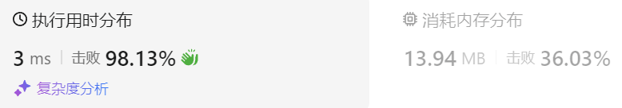
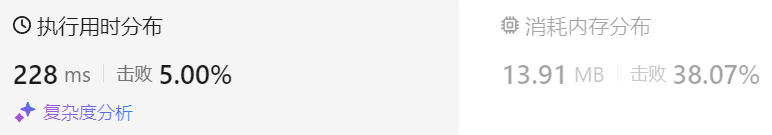

### 04、两数之和（20240828，1题，简单。12min）
<div style="border: 1px solid black; padding: 10px; background-color: SteelBlue;">

给定一个整数数组 nums 和一个整数目标值 target，请你在该数组中找出 和为目标值 target  的那 两个 整数，并返回它们的数组下标。

你可以假设每种输入只会对应一个答案，并且你不能使用两次相同的元素。

你可以按任意顺序返回答案。

 

示例 1：

- 输入：nums = [2,7,11,15], target = 9
- 输出：[0,1]
- 解释：因为 nums[0] + nums[1] == 9 ，返回 [0, 1] 。

示例 2：

- 输入：nums = [3,2,4], target = 6
- 输出：[1,2]

示例 3：

- 输入：nums = [3,3], target = 6
- 输出：[0,1]
 

提示：

- 2 <= nums.length <= 104
- -109 <= nums[i] <= 109
- -109 <= target <= 109
- 只会存在一个有效答案
 

进阶：你可以想出一个时间复杂度小于 O(n2) 的算法吗？

  </p>
</div>

<hr style="border-top: 5px solid #DC143C;">
<table>
  <tr>
    <td bgcolor="Yellow" style="padding: 5px; border: 0px solid black;">
      <span style="font-weight: bold; font-size: 20px;color: black;">
      根据答案改善（将nums[i]作为键）
      </span>
    </td>
  </tr>
</table>
<div style="padding: 0px; border: 1.5px solid LightSalmon; margin-bottom: 10px;">

```C++ {.line-numbers}
/*
这道题 我们需要 给出一个元素，判断这个元素是否出现过，如果出现过，返回这个元素的下标。
那么判断元素是否出现，这个元素就要作为key，所以数组中的元素作为key，有key对应的就是value，value用来存下标。
所以 map中的存储结构为 {key：数据元素，value：数组元素对应的下标}。

需要搜索的是，是否存在target - nums[i]这个数，所以要将nums[i]作为键，其索引作为值！！！
*/
class Solution {
public:
    vector<int> twoSum(vector<int>& nums, int target) {
        size_t size = nums.size();
        unordered_map<int, int> map;  // unordered_map<int> map;
        vector<int> result;

        for(int i = 0; i < size; i++){
            auto it = map.find(target - nums[i]);
            if( it != map.end()){
                result.push_back(it->second);  // result.push_back(it.second) it迭代器是个指针！！！
                result.push_back(i);
                return result;  // 可以直接返回{it->second, i} ！！！
            }
            map[nums[i]] = i;
        }
        return result;
    }
};
```

</div>



<table>
  <tr>
    <td bgcolor="Yellow" style="padding: 5px; border: 0px solid black;">
      <span style="font-weight: bold; font-size: 20px;color: black;">
      自己答案（将nums[i]的索引i作为键）
      </span>
    </td>
  </tr>
</table>

<div style="padding: 0px; border: 1.5px solid LightSalmon; margin-bottom: 10px">

```C++ {.line-numbers}
/*
12min
遍历数组的同时，将数值存入map中，键为其索引
每遍历一个数，都要取map中找是否存在target - nums[i]的数
存在，则返回当前数的索引和找到的这个数的索引
*/
class Solution {
public:
    vector<int> twoSum(vector<int>& nums, int target) {
        size_t size = nums.size();
        unordered_map<int, int> map;  // unordered_map<int> map;
        vector<int> result;

        for(int i = 0; i < size; i++){
            for(auto elem : map){
                if(elem.second == target - nums[i]){
                    result.push_back(elem.first);
                    result.push_back(i);
                    return result;
                }
            }
            // if(map.find(target - nums[i]) != )
            map[i] = nums[i];
        }
        return result;
    }
};
```
</div>



<hr style="border-top: 5px solid #DC143C;">

<table>
  <tr>
    <td bgcolor="Yellow" style="padding: 5px; border: 0px solid black;">
      <span style="font-weight: bold; font-size: 20px;color: black;">
      随想录答案
      </span>
    </td>
  </tr>
</table>

<div style="padding: 0px; border: 1.5px solid LightSalmon; margin-bottom: 10px">

```C++ {.line-numbers}
class Solution {
public:
    vector<int> twoSum(vector<int>& nums, int target) {
        std::unordered_map <int,int> map;
        for(int i = 0; i < nums.size(); i++) {
            // 遍历当前元素，并在map中寻找是否有匹配的key
            auto iter = map.find(target - nums[i]); 
            if(iter != map.end()) {
                return {iter->second, i};
            }
            // 如果没找到匹配对，就把访问过的元素和下标加入到map中
            map.insert(pair<int, int>(nums[i], i)); 
        }
        return {};
    }
};
```
</div>

时间复杂度: O(n)  
空间复杂度: O(n)