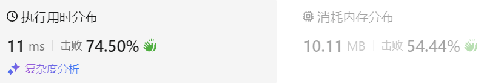

### 06、赎金信（20240828，383题，简单。6min）
<div style="border: 1px solid black; padding: 10px; background-color: SteelBlue;">

给你两个字符串：ransomNote 和 magazine ，判断 ransomNote 能不能由 magazine 里面的字符构成。

如果可以，返回 true ；否则返回 false 。

magazine 中的每个字符只能在 ransomNote 中使用一次。

 

示例 1：

- 输入：ransomNote = "a", magazine = "b"
- 输出：false

示例 2：

- 输入：ransomNote = "aa", magazine = "ab"
- 输出：false

示例 3：

- 输入：ransomNote = "aa", magazine = "aab"
- 输出：true
 

提示：

- 1 <= ransomNote.length, magazine.length <= 105
- ransomNote 和 magazine 由小写英文字母组成

  </p>
</div>

<hr style="border-top: 5px solid #DC143C;">
<table>
  <tr>
    <td bgcolor="Yellow" style="padding: 5px; border: 0px solid black;">
      <span style="font-weight: bold; font-size: 20px;color: black;">
      自己答案（去注释，通过！）
      </span>
    </td>
  </tr>
</table>
<div style="padding: 0px; border: 1.5px solid LightSalmon; margin-bottom: 10px;">

```C++ {.line-numbers}
/*
6min
思路：
先用一个数组记录magazine中所有字符出现次数
再遍历ransomNote，每遍历一个字母，将当前字母的次数减1，若减为负数，则返回false
最后返回true
*/
class Solution {
public:
    bool canConstruct(string ransomNote, string magazine) {
        int words[26] = {0};
        size_t size = magazine.size();
        size_t size2 = ransomNote.size();
        
        // 可以增加判断size是否小于size2，来剪枝！！
        for(int i = 0; i < size; i++){
            words[magazine[i] - 'a'] += 1;
        }
        for(int i = 0; i < size2; i++){
            if(words[ransomNote[i] - 'a'] > 0){
                words[ransomNote[i] - 'a'] -= 1;
            }else{
                return false;
            }
        }
        return true;
    }
};
```

</div>



<hr style="border-top: 5px solid #DC143C;">

<table>
  <tr>
    <td bgcolor="Yellow" style="padding: 5px; border: 0px solid black;">
      <span style="font-weight: bold; font-size: 20px;color: black;">
      随想录答案（哈希解法）
      </span>
    </td>
  </tr>
</table>

<div style="padding: 0px; border: 1.5px solid LightSalmon; margin-bottom: 10px">

```C++ {.line-numbers}
class Solution {
public:
    bool canConstruct(string ransomNote, string magazine) {
        int record[26] = {0};
        //add
        if (ransomNote.size() > magazine.size()) {
            return false;
        }
        for (int i = 0; i < magazine.length(); i++) {
            // 通过record数据记录 magazine里各个字符出现次数
            record[magazine[i]-'a'] ++;
        }
        for (int j = 0; j < ransomNote.length(); j++) {
            // 遍历ransomNote，在record里对应的字符个数做--操作
            record[ransomNote[j]-'a']--;
            // 如果小于零说明ransomNote里出现的字符，magazine没有
            if(record[ransomNote[j]-'a'] < 0) {
                return false;
            }
        }
        return true;
    }
};
```
</div>

时间复杂度: O(n)  
空间复杂度: O(1)

<table>
  <tr>
    <td bgcolor="Yellow" style="padding: 5px; border: 0px solid black;">
      <span style="font-weight: bold; font-size: 20px;color: black;">
      随想录答案（暴力解法）
      </span>
    </td>
  </tr>
</table>

<div style="padding: 0px; border: 1.5px solid LightSalmon; margin-bottom: 10px">

```C++ {.line-numbers}
class Solution {
public:
    bool canConstruct(string ransomNote, string magazine) {
        for (int i = 0; i < magazine.length(); i++) {
            for (int j = 0; j < ransomNote.length(); j++) {
                // 在ransomNote中找到和magazine相同的字符
                if (magazine[i] == ransomNote[j]) {
                    ransomNote.erase(ransomNote.begin() + j); // ransomNote删除这个字符
                    break;
                }
            }
        }
        // 如果ransomNote为空，则说明magazine的字符可以组成ransomNote
        if (ransomNote.length() == 0) {
            return true;
        }
        return false;
    }
};
```
</div>

时间复杂度: O(n^2)  
空间复杂度: O(1)