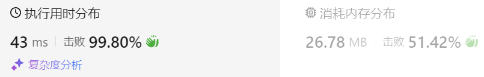

### 07、三数之和（20240829，15题，中等）
<div style="border: 1px solid black; padding: 10px; background-color: SteelBlue;">

给你一个整数数组 nums ，判断是否存在三元组 [nums[i], nums[j], nums[k]] 满足 i != j、i != k 且 j != k ，同时还满足 nums[i] + nums[j] + nums[k] == 0 。请你返回所有和为 0 且不重复的三元组。

注意：答案中不可以包含重复的三元组。

 

 

示例 1：

- 输入：nums = [-1,0,1,2,-1,-4]
- 输出：[[-1,-1,2],[-1,0,1]]
- 解释：  
nums[0] + nums[1] + nums[2] = (-1) + 0 + 1 = 0 。  
nums[1] + nums[2] + nums[4] = 0 + 1 + (-1) = 0 。  
nums[0] + nums[3] + nums[4] = (-1) + 2 + (-1) = 0 。  
不同的三元组是 [-1,0,1] 和 [-1,-1,2] 。  
注意，输出的顺序和三元组的顺序并不重要。  

示例 2：

- 输入：nums = [0,1,1]
- 输出：[]
- 解释：唯一可能的三元组和不为 0 。

示例 3：

- 输入：nums = [0,0,0]
- 输出：[[0,0,0]]
- 解释：唯一可能的三元组和为 0 。
 

提示：

- 3 <= nums.length <= 3000
- -105 <= nums[i] <= 105

  </p>
</div>

<hr style="border-top: 5px solid #DC143C;">
<table>
  <tr>
    <td bgcolor="Yellow" style="padding: 5px; border: 0px solid black;">
      <span style="font-weight: bold; font-size: 20px;color: black;">
      仿照答案 
      </span>
    </td>
  </tr>
</table>
<div style="padding: 0px; border: 1.5px solid LightSalmon; margin-bottom: 10px;">

```C++ {.line-numbers}
/*
思路：
对数字排序，从小到大
先用一个i循环遍历数组
在循环中使用left和right指针，指向数组的[i:size-1]元素的两端
    i循环中需要去重，不能取与之前相同的数字
    再根据三个索引的对应数字的和与target=0的大小，
        视情况将left和right向右或者向左移动，以更加靠近target
        当和等于target，记录三个值到结果result中
        随后对left和right的指向去重，不能和刚刚的结果对应的数字相同
        同时注意left < right，以及left和right在[0：size-1]内
最后返回result
*/
class Solution {
public:
    vector<vector<int>> threeSum(vector<int>& nums) {
        size_t size = nums.size();
        sort(nums.begin(), nums.end());
        vector<vector<int>> result;

        for(int i = 0; i < size; i++){
            if(nums[i] > 0){
                break;
            }
            if(i > 0 && nums[i] == nums[i-1]){  // 对i去重，不取上次取过的数字
                continue;
            }
            int left = i+1;
            int right = size-1;
            while(left < size-1 && right > 0 && left < right){
                if(nums[i] > -nums[left] - nums[right]){
                    right--;
                    continue;
                }else if(nums[i] < -nums[left] - nums[right]){
                    left++;
                    continue;
                }else{
                    result.push_back({nums[i], nums[left], nums[right]});
                }
                while(right > 0 && nums[right] == nums[right-1]){
                    right--;
                }
                while(left < size-1 && nums[left] == nums[left+1]){
                    left++;
                }
                right--;
                left++;
            }
        }
        return result;
    }
};

// 判断条件根据答案优化下
class Solution {
public:
    vector<vector<int>> threeSum(vector<int>& nums) {
        size_t size = nums.size();
        sort(nums.begin(), nums.end());
        vector<vector<int>> result;

        for(int i = 0; i < size; i++){
            if(nums[i] > 0){
                break;
            }
            if(i > 0 && nums[i] == nums[i-1]){  // 对i去重，不取上次取过的数字
                continue;
            }
            int left = i+1;
            int right = size-1;
            while(left < right){   // while(left < size-1 && right > 0 && left < right)
                if(nums[i] > -nums[left] - nums[right]){
                    right--;
                    continue;
                }else if(nums[i] < -nums[left] - nums[right]){
                    left++;
                    continue;
                }else{
                    result.push_back({nums[i], nums[left], nums[right]});
                }
                while(left < right && nums[right] == nums[right-1]){  //while(right > 0 && nums[right] == nums[right-1])
                    right--;
                }
                while(left < right && nums[left] == nums[left+1]){  // while(left < size-1 && nums[left] == nums[left+1])
                    left++;
                }
                right--;
                left++;
            }
        }
        return result;
    }
};
```

</div>



<table>
  <tr>
    <td bgcolor="Yellow" style="padding: 5px; border: 0px solid black;">
      <span style="font-weight: bold; font-size: 20px;color: black;">
      自己答案（超时）
      </span>
    </td>
  </tr>
</table>

<div style="padding: 0px; border: 1.5px solid LightSalmon; margin-bottom: 10px">

```C++ {.line-numbers}
/*
思路：
对数组排序后，使用三重循环找到符合要求的组合
    找到组合后时，将当前组合与结果集进行比较，重复则不加入结果集

这样复杂度太高，超时
nums = [4,-2,-9,9,7,9,10,-15,4,-9,-9,8,-6,7,-7,-2,4,-9,-7,-11,13,9,5,-8,10,8,-6,-1,-2,-6,6,-12,7,4,4,-9,-1,-1,-8,10,5,-10,-5,7,12,4,12,
-6,10,-10,-2,8,7,10,7,2,-5,9,-14,9,-12,-1,4,2,11,-15,9,-13,-1,-14,4,12,-9,-15,-4,10,4,-7,-11,-9,-1,-6,14,-9,-10,-1,0,-8,-7,-6,8,-12,0,-3,
5,-4,-11,-1,-10,4,-8,10,-7,-10,2,4,-14]
*/
class Solution {
public:
    vector<vector<int>> threeSum(vector<int>& nums) {
        size_t size = nums.size();
        sort(nums.begin(), nums.end());

        // unordered_set<vector<int>> set1;
        // unordered_map<vector<int>, int> map;
        vector<vector<int>> result;
        int count = 0;

        for(int i = 0; i < size; i++){
            for(int j = i+1; j < size; j++){
                for(int k = j+1; k < size; k++){
                    if(nums[i] + nums[j] + nums[k] == 0){
                        vector<int> tmp;
                        tmp.push_back(nums[i]);
                        tmp.push_back(nums[j]);
                        tmp.push_back(nums[k]);
                        if(result.size() == 0){
                            result.push_back(tmp);
                            continue;
                        }
                        bool isHave = false;
                        for(auto elem : result){
                            if(elem == tmp){
                                isHave = true;
                            }
                        }
                        if(!isHave){
                            result.push_back(tmp);
                        }
                        // if(result.size() == 0 || tmp != result.back()){
                        //     result.push_back(tmp);
                        // }
                        // set.insert(tmp);
                        // if(map.find(tmp) == map.end()){
                        //     map[tmp]
                        // }
                        // result.push_back(tmp);
                    }
                }
            }
        }
        // for(auto elem : set){
        //     result.push_back(elem);
        // }
        return result;
    }
};
```
</div>

<hr style="border-top: 5px solid #DC143C;">

<table>
  <tr>
    <td bgcolor="Yellow" style="padding: 5px; border: 0px solid black;">
      <span style="font-weight: bold; font-size: 20px;color: black;">
      仿照答案版本v2（双指针法）
      </span>
    </td>
  </tr>
</table>

<div style="padding: 0px; border: 1.5px solid LightSalmon; margin-bottom: 10px">

```C++ {.line-numbers}
class Solution {
public:
    vector<vector<int>> threeSum(vector<int>& nums) {
        vector<vector<int>> result;
        sort(nums.begin(), nums.end());
        // 找出a + b + c = 0
        // a = nums[i], b = nums[left], c = nums[right]
        for (int i = 0; i < nums.size(); i++) {
            // 排序之后如果第一个元素已经大于零，那么无论如何组合都不可能凑成三元组，直接返回结果就可以了
            if (nums[i] > 0) {
                return result;
            }
            // 错误去重a方法，将会漏掉-1,-1,2 这种情况
            /*
            if (nums[i] == nums[i + 1]) {
                continue;
            }
            */
            // 正确去重a方法
            if (i > 0 && nums[i] == nums[i - 1]) {
                continue;
            }
            int left = i + 1;
            int right = nums.size() - 1;
            while (right > left) {
                // 去重复逻辑如果放在这里，0，0，0 的情况，可能直接导致 right<=left 了，从而漏掉了 0,0,0 这种三元组
                /*
                while (right > left && nums[right] == nums[right - 1]) right--;
                while (right > left && nums[left] == nums[left + 1]) left++;
                */
                if (nums[i] + nums[left] + nums[right] > 0) right--;
                else if (nums[i] + nums[left] + nums[right] < 0) left++;
                else {
                    result.push_back(vector<int>{nums[i], nums[left], nums[right]});
                    // 去重逻辑应该放在找到一个三元组之后，对b 和 c去重
                    while (right > left && nums[right] == nums[right - 1]) right--;
                    while (right > left && nums[left] == nums[left + 1]) left++;

                    // 找到答案时，双指针同时收缩
                    right--;
                    left++;
                }
            }

        }
        return result;
    }
};
```
</div>

<table>
  <tr>
    <td bgcolor="Yellow" style="padding: 5px; border: 0px solid black;">
      <span style="font-weight: bold; font-size: 20px;color: black;">
      随想录答案（哈希解法）
      </span>
    </td>
  </tr>
</table>

<div style="padding: 0px; border: 1.5px solid LightSalmon; margin-bottom: 10px">

```C++ {.line-numbers}
class Solution {
public:
    vector<vector<int>> threeSum(vector<int>& nums) {
        vector<vector<int>> result;
        sort(nums.begin(), nums.end());
        // 找出a + b + c = 0
        // a = nums[i], b = nums[j], c = -(a + b)
        for (int i = 0; i < nums.size(); i++) {
            // 排序之后如果第一个元素已经大于零，那么不可能凑成三元组
            if (nums[i] > 0) {
                break;
            }
            if (i > 0 && nums[i] == nums[i - 1]) { //三元组元素a去重
                continue;
            }
            unordered_set<int> set;
            for (int j = i + 1; j < nums.size(); j++) {
                if (j > i + 2
                        && nums[j] == nums[j-1]
                        && nums[j-1] == nums[j-2]) { // 三元组元素b去重
                    continue;
                }
                int c = 0 - (nums[i] + nums[j]);   // j 遍历过程中，去set找满足要求的数字，没有就将当前数字放入set
                if (set.find(c) != set.end()) {     // 这就类似使用nlogn复杂度去找区间[j:n]中满足nums[a]+nums[b] = target的两个数！！！
                    result.push_back({nums[i], nums[j], c});
                    set.erase(c);// 三元组元素c去重
                } else {
                    set.insert(nums[j]);
                }
            }
        }
        return result;
    }
};
```
</div>
