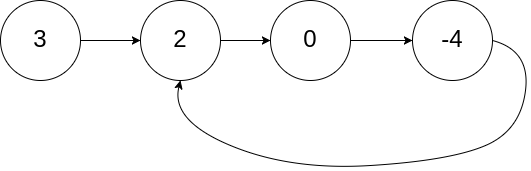
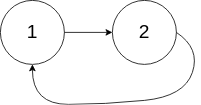
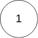
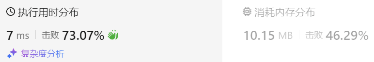

### 07、环形链表 II（20240820，142题，中等）
<div style="border: 1px solid black; padding: 10px; background-color: SteelBlue;">

给定一个链表的头节点  head ，返回链表开始入环的第一个节点。 如果链表无环，则返回 null。

如果链表中有某个节点，可以通过连续跟踪 next 指针再次到达，则链表中存在环。 为了表示给定链表中的环，评测系统内部使用整数 pos 来表示链表尾连接到链表中的位置（索引从 0 开始）。如果 pos 是 -1，则在该链表中没有环。注意：pos 不作为参数进行传递，仅仅是为了标识链表的实际情况。

不允许修改 链表。

 

示例 1：



- 输入：head = [3,2,0,-4], pos = 1
- 输出：返回索引为 1 的链表节点
- 解释：链表中有一个环，其尾部连接到第二个节点。

示例 2：



- 输入：head = [1,2], pos = 0
- 输出：返回索引为 0 的链表节点
- 解释：链表中有一个环，其尾部连接到第一个节点。

示例 3：



- 输入：head = [1], pos = -1
- 输出：返回 null
- 解释：链表中没有环。
 

提示：

- 链表中节点的数目范围在范围 [0, 104] 内
- -105 <= Node.val <= 105
- pos 的值为 -1 或者链表中的一个有效索引
 

进阶：你是否可以使用 O(1) 空间解决此题？

  </p>
</div>

<hr style="border-top: 5px solid #DC143C;">
<table>
  <tr>
    <td bgcolor="Yellow" style="padding: 5px; border: 0px solid black;">
      <span style="font-weight: bold; font-size: 20px;color: black;">
      仿照答案 
      </span>
    </td>
  </tr>
</table>
<div style="padding: 0px; border: 1.5px solid LightSalmon; margin-bottom: 10px;">

```C++ {.line-numbers}
/**
思路：
使用快慢指针，
开始快慢指针都从head开始遍历，
但slow指针每次走1个节点，fast隔一个节点走，即fast比slow速度快1格。
记从head节点位置a，到环的入口位置b的节点个数为x，再到相遇位置c节点个数未y
    环的另一段，由c到b的这一段节点个数记为z
则根据相遇时快慢指针走的路程，有如下方程(快指针走的是慢指针路程的两倍)：
    2(x+y) = x + n(y+z) + y
    需要知道x的大小来方便找到换的开头位置，则
    x = n(y+z) - y = (n-1)(y+z) + z
        这个式子表明，走一定圈数加上z个节点数，就和x一样大了。
        从相遇的节点c到环入口位置b的节点数为z
        则从c点开始，走一定圈数，再加上z，就能到环入口处b位置！！！
        但是由于不知道具体是第几圈，所以需要从head位置a和位置c一起走（一个一个走）
        当二者走到一起，就知道是环的入口了！！！
 */
class Solution {
public:
    ListNode *detectCycle(ListNode *head) {
        if(head == NULL || head->next == NULL) return NULL;

        ListNode *slow = head;
        ListNode *fast = head;
        ListNode *meet = NULL;

        // 考虑[1,2]无环的情况
        while(fast != NULL && fast->next != NULL){  // while(fast->next != NULL)、while(fast != NULL || fast->next != NULL)
            slow = slow->next;
            fast = fast->next->next;  // 上面判断必须是&&，而不能是||，否则fast->next为null的时候，这里就出错了！！！

            if(fast == slow){
                meet = fast;
                break;
            }
        }
        // 无环的情况要返回空！！！
        if(fast == NULL || fast->next == NULL){  // if(fast->next == NULL)
            return NULL;
        }

        // 有环的情况再继续处理
        ListNode *tmp = head;
        while(meet->next != NULL){
            if(meet == tmp){
                return meet;
            }
            meet = meet->next;
            tmp = tmp->next;
        }
        return NULL;
    }
};
```

</div>



<table>
  <tr>
    <td bgcolor="Yellow" style="padding: 5px; border: 0px solid black;">
      <span style="font-weight: bold; font-size: 20px;color: black;">
      自己答案（未通过）
      </span>
    </td>
  </tr>
</table>

<div style="padding: 0px; border: 1.5px solid LightSalmon; margin-bottom: 10px">

```C++ {.line-numbers}
/**
思路：
使用快慢指针，
但是最后怎么得到环的入口，不知道。。
 */
class Solution {
public:
    ListNode *detectCycle(ListNode *head) {
        if(head == NULL || head->next == NULL) return NULL;

        ListNode *slow = head;
        ListNode *fast = head->next;
        int count = 0;

        while(fast->next && slow){
            ++count;
            fast = fast->next->next;
            slow = slow->next;
            if(slow == fast){
                int index = count-1;  // int index = count;
                ListNode *tmp = head;
                while(index--){
                    tmp = tmp->next;
                }
                return tmp;
            }
        }
        return NULL;    
    }
};
```
</div>

<hr style="border-top: 5px solid #DC143C;">

<table>
  <tr>
    <td bgcolor="Yellow" style="padding: 5px; border: 0px solid black;">
      <span style="font-weight: bold; font-size: 20px;color: black;">
      随想录答案
      </span>
    </td>
  </tr>
</table>

<div style="padding: 0px; border: 1.5px solid LightSalmon; margin-bottom: 10px">

```C++ {.line-numbers}
class Solution {
public:
    ListNode *detectCycle(ListNode *head) {
        ListNode* fast = head;
        ListNode* slow = head;
        while(fast != NULL && fast->next != NULL) {
            slow = slow->next;
            fast = fast->next->next;
            // 快慢指针相遇，此时从head 和 相遇点，同时查找直至相遇
            if (slow == fast) {
                ListNode* index1 = fast;
                ListNode* index2 = head;
                while (index1 != index2) {
                    index1 = index1->next;
                    index2 = index2->next;
                }
                return index2; // 返回环的入口
            }
        }
        return NULL;
    }
};
```
</div>

时间复杂度: O(n)，快慢指针相遇前，指针走的次数小于链表长度，快慢指针相遇后，两个index指针走的次数也小于链表长度，总体为走的次数小于 2n  
空间复杂度: O(1)