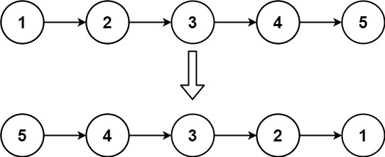
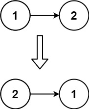
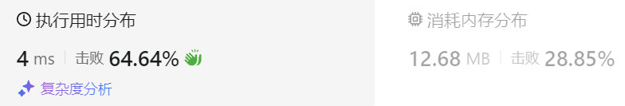
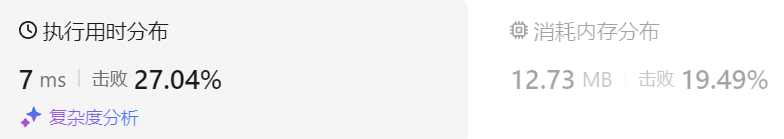
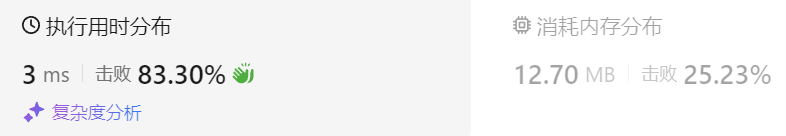
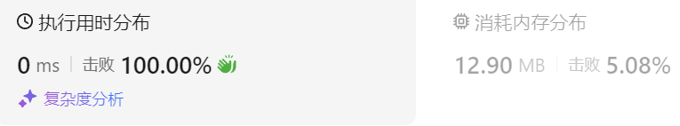

### 03、反转链表（20240811，206题，简单。6min）
<div style="border: 1px solid black; padding: 10px; background-color: SteelBlue;">

给你单链表的头节点 head ，请你反转链表，并返回反转后的链表。
 

示例 1：



- 输入：head = [1,2,3,4,5]
- 输出：[5,4,3,2,1]

示例 2：



- 输入：head = [1,2]
- 输出：[2,1]

示例 3：

- 输入：head = []
- 输出：[]
 

提示：

- 链表中节点的数目范围是 [0, 5000]
- -5000 <= Node.val <= 5000
 

进阶：链表可以选用迭代或递归方式完成反转。你能否用两种方法解决这道题？

  </p>
</div>

<hr style="border-top: 5px solid #DC143C;">
<table>
  <tr>
    <td bgcolor="Yellow" style="padding: 5px; border: 0px solid black;">
      <span style="font-weight: bold; font-size: 20px;color: black;">
      自己答案（存储链表的所有值，再从新赋值）
      </span>
    </td>
  </tr>
</table>
<div style="padding: 0px; border: 1.5px solid LightSalmon; margin-bottom: 10px;">

```C++ {.line-numbers}

/*
6min
思路：
先遍历一遍链表，记录所有的val到vector<int> tmp_vec中；
再次遍历链表，按照tmp_vec的从尾至头的顺序赋值。
最后返回head。
*/
class Solution {
public:
    ListNode* reverseList(ListNode* head) {
        vector<int> tmp_vec;

        ListNode* tmp_node = head;
        while(tmp_node){
            tmp_vec.push_back(tmp_node->val);
            tmp_node = tmp_node->next;
        }
        // ListNode* tmp_node = head;
        tmp_node = head;
        for(int i = tmp_vec.size()-1; i >= 0; i--){
            tmp_node->val = tmp_vec[i];
            tmp_node = tmp_node->next;
        }
        return head;
    }
};
```

</div>



<hr style="border-top: 5px solid #DC143C;">

<table>
  <tr>
    <td bgcolor="Yellow" style="padding: 5px; border: 0px solid black;">
      <span style="font-weight: bold; font-size: 20px;color: black;">
      仿照答案（双指针法）
      </span>
    </td>
  </tr>
</table>

<div style="padding: 0px; border: 1.5px solid LightSalmon; margin-bottom: 10px">

```C++ {.line-numbers}
/*
3min
思路：
使用pre和cur指针分别指向相邻节点
    tmp记录cur的下一个节点
    交换pre和cur的指向
    将pre和cur往后移动指向新的相邻两节点
    直到cur为空节点
到最后返回pre节点（新头结点）

*/
class Solution {
public:
    ListNode* reverseList(ListNode* head) {

        ListNode* pre = nullptr;
        ListNode* cur = head;

        while(cur != nullptr){
            ListNode* tmp = cur->next;
            cur->next = pre;
            pre = cur;
            cur = tmp;
        }
        return pre;
    }
};
```
</div>



<hr style="border-top: 5px solid #DC143C;">

<table>
  <tr>
    <td bgcolor="Yellow" style="padding: 5px; border: 0px solid black;">
      <span style="font-weight: bold; font-size: 20px;color: black;">
      仿照答案（递归法，从前往后处理节点）
      </span>
    </td>
  </tr>
</table>

<div style="padding: 0px; border: 1.5px solid LightSalmon; margin-bottom: 10px">

```C++ {.line-numbers}
/*
思路：
与双指针法类似
每层递归改变相邻两节点的指向
    到最后遇到空节点，返回pre节点（新头结点）
*/
class Solution {
public:
    ListNode* dealList(ListNode* pre, ListNode* cur){
        if(cur == nullptr) return pre;

        ListNode* tmp = cur->next;
        cur->next = pre;
        pre = cur;
        cur = tmp;

        return dealList(pre, cur);
    }

    ListNode* reverseList(ListNode* head) {
        if(head == nullptr) return nullptr;

        return dealList(NULL, head);
    }
};


/*
（自己递归法，从后往前处理节点）
自己的递归思路，未通过。。
递归不一定要一下递归到末尾再处理，
    这里递归到末尾处理节点，最后返回的不是头结点。。

递归也可从头开始处理，每次处理一部分，从前往后
    只要每次递归将相应的后续参数传入递归函数即可
    最后处理到末尾，返回所需的结果

但从后往前处理节点也是可以的，看后面代码。只要递归返回最后头结点，中间处理过程不改变它即可
*/
class Solution {
public:
    ListNode* dealList(ListNode* cur, ListNode* next){
        if(next == nullptr) return cur;

        ListNode* ret = dealList(next, next->next);
        ret->next = cur;
        return cur;
    }

    ListNode* reverseList(ListNode* head) {
        if(head == nullptr) return nullptr;

        ListNode* ret = dealList(head, head->next);

        return ret;
    }
};
```
</div>



<table>
  <tr>
    <td bgcolor="Yellow" style="padding: 5px; border: 0px solid black;">
      <span style="font-weight: bold; font-size: 20px;color: black;">
      仿照答案(递归法，从后往前处理节点)
      </span>
    </td>
  </tr>
</table>

<div style="padding: 0px; border: 1.5px solid LightSalmon; margin-bottom: 10px">

```C++ {.line-numbers}
/*
思路：
从尾部往前处理
    遇到next为空，说明到了尾结点，返回尾结点
    递归函数一方面将尾结点返回
    另一方面递归中只处理相邻节点指向，不动返回的尾结点
最后返回传上来的尾结点即可。

由于原来头结点要指向空节点，所以初始传入的参数是dealList(nullptr, head)！！！

*/
class Solution {
public:
    ListNode* dealList(ListNode* cur, ListNode* next){
        if(next == nullptr) return cur;

        ListNode* ret = dealList(next, next->next);
        // ret->next = cur;
        next->next = cur;
        return ret;
    }

    ListNode* reverseList(ListNode* head) {
        if(head == nullptr) return nullptr;

        ListNode* ret = dealList(nullptr, head);

        return ret;
    }
};
```
</div>



<hr style="border-top: 5px solid #DC143C;">

<table>
  <tr>
    <td bgcolor="Yellow" style="padding: 5px; border: 0px solid black;">
      <span style="font-weight: bold; font-size: 20px;color: black;">
      随想录答案(双指针法)
      </span>
    </td>
  </tr>
</table>

<div style="padding: 0px; border: 1.5px solid LightSalmon; margin-bottom: 10px">

```C++ {.line-numbers}
class Solution {
public:
    ListNode* reverseList(ListNode* head) {
        ListNode* temp; // 保存cur的下一个节点
        ListNode* cur = head;
        ListNode* pre = NULL;
        while(cur) {
            temp = cur->next;  // 保存一下 cur的下一个节点，因为接下来要改变cur->next
            cur->next = pre; // 翻转操作
            // 更新pre 和 cur指针
            pre = cur;
            cur = temp;
        }
        return pre;
    }
};
```
</div>

时间复杂度: O(n)  
空间复杂度: O(1)

<table>
  <tr>
    <td bgcolor="Yellow" style="padding: 5px; border: 0px solid black;">
      <span style="font-weight: bold; font-size: 20px;color: black;">
      随想录答案(递归法，从前往后处理节点)
      </span>
    </td>
  </tr>
</table>

<div style="padding: 0px; border: 1.5px solid LightSalmon; margin-bottom: 10px">

```C++ {.line-numbers}
class Solution {
public:
    ListNode* reverse(ListNode* pre,ListNode* cur){
        if(cur == NULL) return pre;
        ListNode* temp = cur->next;
        cur->next = pre;
        // 可以和双指针法的代码进行对比，如下递归的写法，其实就是做了这两步
        // pre = cur;
        // cur = temp;
        return reverse(cur,temp);
    }
    ListNode* reverseList(ListNode* head) {
        // 和双指针法初始化是一样的逻辑
        // ListNode* cur = head;
        // ListNode* pre = NULL;
        return reverse(NULL, head);
    }

};
```
</div>

时间复杂度: O(n), 要递归处理链表的每个节点  
空间复杂度: O(n), 递归调用了 n 层栈空间

<table>
  <tr>
    <td bgcolor="Yellow" style="padding: 5px; border: 0px solid black;">
      <span style="font-weight: bold; font-size: 20px;color: black;">
      随想录答案(递归法，从后往前处理节点)
      </span>
    </td>
  </tr>
</table>

<div style="padding: 0px; border: 1.5px solid LightSalmon; margin-bottom: 10px">

```C++ {.line-numbers}
class Solution {
public:
    ListNode* reverseList(ListNode* head) {
        // 边缘条件判断
        if(head == NULL) return NULL;
        if (head->next == NULL) return head;
        
        // 递归调用，翻转第二个节点开始往后的链表
        ListNode *last = reverseList(head->next);
        // 翻转头节点与第二个节点的指向
        head->next->next = head;
        // 此时的 head 节点为尾节点，next 需要指向 NULL
        head->next = NULL;
        return last;
    }
}; 
```
</div>