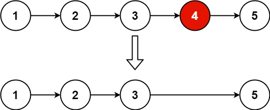

### 05、删除链表的倒数第 N 个结点（20240814，19题，中等。22min）
<div style="border: 1px solid black; padding: 10px; background-color: SteelBlue;">

给你一个链表，删除链表的倒数第 n 个结点，并且返回链表的头结点。

 

示例 1：



输入：head = [1,2,3,4,5], n = 2
输出：[1,2,3,5]
示例 2：

输入：head = [1], n = 1
输出：[]
示例 3：

输入：head = [1,2], n = 1
输出：[1]
 

提示：

链表中结点的数目为 sz
1 <= sz <= 30
0 <= Node.val <= 100
1 <= n <= sz
 

进阶：你能尝试使用一趟扫描实现吗？

  </p>
</div>

<hr style="border-top: 5px solid #DC143C;">
<table>
  <tr>
    <td bgcolor="Yellow" style="padding: 5px; border: 0px solid black;">
      <span style="font-weight: bold; font-size: 20px;color: black;">
      自己答案（去注释，通过！）
      </span>
    </td>
  </tr>
</table>
<div style="padding: 0px; border: 1.5px solid LightSalmon; margin-bottom: 10px;">

```C++ {.line-numbers}
/*
22min
思路
递归法
遍历到链表末尾
    中途记录链表的长度len
    递归返回当前的节点，用于最后返回头结点
    返回过程中，等倒数第n个节点时，进行删除。
*/
class Solution {
public:
    int len;
    void dealList(ListNode* cur_node, int n, int pos){
        if(cur_node == nullptr){
            return ;
        }
        if(pos > len) len = pos;

        dealList(cur_node->next, n, pos+1);
        if(pos < len && pos + n == len){
            ListNode* tmp_node = cur_node->next;
            cur_node->next = cur_node->next->next;
            delete tmp_node;
        }
        return ;
    }

    ListNode* removeNthFromEnd(ListNode* head, int n) {
        len = 0;

        ListNode* tmp_head = new ListNode(0);
        tmp_head->next = head;

        dealList(tmp_head, n, 0);

        ListNode* result = tmp_head->next;

        delete tmp_head;
        return result;
    }
};

// 初始版本，递归函数有返回值的情况
class Solution {
public:
    int len;
    ListNode* dealList(ListNode* cur_node, int n, int pos){
        if(cur_node == nullptr){
            return cur_node;
        }
        if(pos > len) len = pos;

        dealList(cur_node->next, n, pos+1);
        if(pos < len && pos + n == len){
            ListNode* tmp_node = cur_node->next;
            cur_node->next = cur_node->next->next;
            delete tmp_node;
        }
        return cur_node;
    }

    ListNode* removeNthFromEnd(ListNode* head, int n) {
        len = 0;

        ListNode* tmp_head = new ListNode(0);
        tmp_head->next = head;

        dealList(tmp_head, n, 0);

        ListNode* result = tmp_head->next;

        delete tmp_head;
        return result;
    }
};
```

</div>


<hr style="border-top: 5px solid #DC143C;">

<table>
  <tr>
    <td bgcolor="Yellow" style="padding: 5px; border: 0px solid black;">
      <span style="font-weight: bold; font-size: 20px;color: black;">
      随想录答案
      </span>
    </td>
  </tr>
</table>

<div style="padding: 0px; border: 1.5px solid LightSalmon; margin-bottom: 10px">

```C++ {.line-numbers}
class Solution {
public:
    ListNode* removeNthFromEnd(ListNode* head, int n) {
        ListNode* dummyHead = new ListNode(0);
        dummyHead->next = head;
        ListNode* slow = dummyHead;
        ListNode* fast = dummyHead;
        while(n-- && fast != NULL) {
            fast = fast->next;
        }
        fast = fast->next; // fast再提前走一步，因为需要让slow指向删除节点的上一个节点
        while (fast != NULL) {
            fast = fast->next;
            slow = slow->next;
        }
        slow->next = slow->next->next; 
        
        // ListNode *tmp = slow->next;  C++释放内存的逻辑
        // slow->next = tmp->next;
        // delete tmp;
        
        return dummyHead->next;
    }
};
```
</div>

时间复杂度: O(n)  
空间复杂度: O(1)