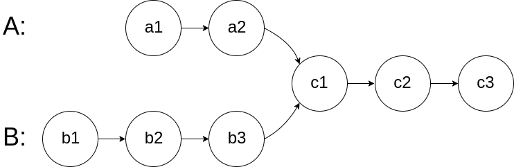
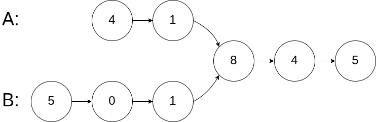
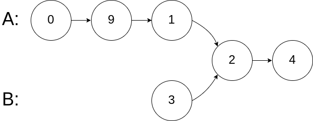
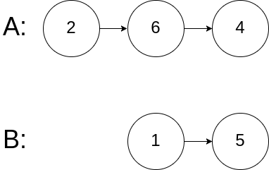

### 06、相交链表（20240820，160题，简单。23min）
<div style="border: 1px solid black; padding: 10px; background-color: SteelBlue;">

给你两个单链表的头节点 headA 和 headB ，请你找出并返回两个单链表相交的起始节点。如果两个链表没有交点，返回 null 。

图示两个链表在节点 c1 开始相交：




题目数据 保证 **整个链式结构中不存在环**。

注意，函数返回结果后，链表必须 **保持其原始结构** 。

 

示例 1：



- 输入：intersectVal = 8, listA = [4,1,8,4,5], listB = [5,0,1,8,4,5], skipA = 2, skipB = 3
- 输出：Intersected at '8'
- 解释：相交节点的值为 8 （注意，如果两个链表相交则不能为 0）。  
从各自的表头开始算起，链表 A 为 [4,1,8,4,5]，链表 B 为 [5,0,1,8,4,5]。  
在 A 中，相交节点前有 2 个节点；在 B 中，相交节点前有 3 个节点。  

示例 2：



- 输入：intersectVal = 2, listA = [0,9,1,2,4], listB = [3,2,4], skipA = 3, skipB = 1
- 输出：Intersected at '2'
- 解释：相交节点的值为 2 （注意，如果两个链表相交则不能为 0）。  
从各自的表头开始算起，链表 A 为 [0,9,1,2,4]，链表 B 为 [3,2,4]。  
在 A 中，相交节点前有 3 个节点；在 B 中，相交节点前有 1 个节点。  

示例 3：



- 输入：intersectVal = 0, listA = [2,6,4], listB = [1,5], skipA = 3, skipB = 2
- 输出：null
- 解释：从各自的表头开始算起，链表 A 为 [2,6,4]，链表 B 为 [1,5]。  
由于这两个链表不相交，所以 intersectVal 必须为 0，而 skipA 和 skipB 可以是任意值。  
这两个链表不相交，因此返回 null 。
 

提示：

- listA 中节点数目为 m
- listB 中节点数目为 n
- 0 <= m, n <= 3 * 104
- 1 <= Node.val <= 105
- 0 <= skipA <= m
- 0 <= skipB <= n
- 如果 listA 和 listB 没有交点，intersectVal 为 0
- 如果 listA 和 listB 有交点，intersectVal == listA[skipA + 1] == listB[skipB + 1]
 

进阶：你能否设计一个时间复杂度 O(n) 、仅用 O(1) 内存的解决方案？

代码提交实际在：面试题 02.07. 链表相交

  </p>
</div>

<hr style="border-top: 5px solid #DC143C;">
<table>
  <tr>
    <td bgcolor="Yellow" style="padding: 5px; border: 0px solid black;">
      <span style="font-weight: bold; font-size: 20px;color: black;">
      自己答案（去注释，通过！）
      </span>
    </td>
  </tr>
</table>
<div style="padding: 0px; border: 1.5px solid LightSalmon; margin-bottom: 10px;">

```C++ {.line-numbers}
/*
23min
思路：
是否有交点，看二者尾结点是否相同即可知
但关键是要知道交点在哪？

先遍历两个链表，记录二者的长度，以及最后的节点tail_node
    tail_node相同，则说明有交点
        计算俩链表长度差diff，令长的链表先走这么长，
        然后二者开始一起往后遍历，直到相同的节点，并返回相同节点
    tail_node不同，返回null
*/
// 去注释
class Solution {
public:
    ListNode *getIntersectionNode(ListNode *headA, ListNode *headB) {
        if(headA == headB) return headA;
        if(headA == NULL || headB == NULL) return NULL;

        ListNode * tmpA = headA;
        ListNode * tmpB = headB;
        int countA = 0;
        int countB = 0;

        while(tmpA->next){
            tmpA = tmpA->next;
            ++countA;
        }
        while(tmpB->next){
            tmpB = tmpB->next;
            ++countB;
        }
        if(tmpA == tmpB){
            // 找到交点
            tmpA = headA;
            tmpB = headB;
            int diff = abs(countA - countB);
            if(countA >= countB){
                while(diff--){
                    tmpA = tmpA->next;
                }
            }else{
                while(diff--){
                    tmpB = tmpB->next;
                }
            }
            while(tmpA && tmpB){
                if(tmpA == tmpB){  // [3]、[2,3]
                    return tmpA;
                }
                tmpA = tmpA->next;
                tmpB = tmpB->next;
            }
        }else{
            return NULL;
        }
        return NULL;
    }
};

// 未去注释
class Solution {
public:
    ListNode *getIntersectionNode(ListNode *headA, ListNode *headB) {
        if(headA == headB) return headA;
        if(headA == NULL || headB == NULL) return NULL;

        ListNode * tmpA = headA;
        ListNode * tmpB = headB;
        int countA = 0;
        int countB = 0;

        while(tmpA->next){
            tmpA = tmpA->next;
            ++countA;
        }
        while(tmpB->next){
            tmpB = tmpB->next;
            ++countB;
        }
        if(tmpA == tmpB){
            // 找到交点
            tmpA = headA;
            tmpB = headB;
            int diff = abs(countA - countB);
            if(countA >= countB){
                while(diff--){
                    tmpA = tmpA->next;
                }
                // while(tmpA && tmpB){
                //     tmpA = tmpA->next;
                //     tmpB = tmpB->next;
                //     if(tmpA == tmpB){
                //         return tmpA;
                //     }
                // }
            }else{
                while(diff--){
                    tmpB = tmpB->next;
                }
                // while(tmpA && tmpB){
                //     tmpA = tmpA->next;
                //     tmpB = tmpB->next;
                //     if(tmpA == tmpB){
                //         return tmpA;
                //     }
                // }
            }
            while(tmpA && tmpB){
                if(tmpA == tmpB){  // [3]、[2,3]
                    return tmpA;
                }
                tmpA = tmpA->next;
                tmpB = tmpB->next;
                // if(tmpA == tmpB){
                //     return tmpA;
                // }
            }
        }else{
            return NULL;
        }
        return NULL;
    }
};
```

</div>


<hr style="border-top: 5px solid #DC143C;">

<table>
  <tr>
    <td bgcolor="Yellow" style="padding: 5px; border: 0px solid black;">
      <span style="font-weight: bold; font-size: 20px;color: black;">
      随想录答案
      </span>
    </td>
  </tr>
</table>

<div style="padding: 0px; border: 1.5px solid LightSalmon; margin-bottom: 10px">

```C++ {.line-numbers}
class Solution {
public:
    ListNode *getIntersectionNode(ListNode *headA, ListNode *headB) {
        ListNode* curA = headA;
        ListNode* curB = headB;
        int lenA = 0, lenB = 0;
        while (curA != NULL) { // 求链表A的长度
            lenA++;
            curA = curA->next;
        }
        while (curB != NULL) { // 求链表B的长度
            lenB++;
            curB = curB->next;
        }
        curA = headA;
        curB = headB;
        // 让curA为最长链表的头，lenA为其长度
        if (lenB > lenA) {
            swap (lenA, lenB);
            swap (curA, curB);
        }
        // 求长度差
        int gap = lenA - lenB;
        // 让curA和curB在同一起点上（末尾位置对齐）
        while (gap--) {
            curA = curA->next;
        }
        // 遍历curA 和 curB，遇到相同则直接返回
        while (curA != NULL) {
            if (curA == curB) {
                return curA;
            }
            curA = curA->next;
            curB = curB->next;
        }
        return NULL;
    }
};
```
</div>

时间复杂度：O(n + m)  
空间复杂度：O(1)