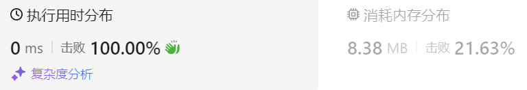

### 02、用队列实现栈（20240830，225题，简单。48min）
<div style="border: 1px solid black; padding: 10px; background-color: SteelBlue;">

请你仅使用两个队列实现一个后入先出（LIFO）的栈，并支持普通栈的全部四种操作（push、top、pop 和 empty）。

实现 MyStack 类：

- void push(int x) 将元素 x 压入栈顶。
- int pop() 移除并返回栈顶元素。
- int top() 返回栈顶元素。
- boolean empty() 如果栈是空的，返回 true ；否则，返回 false 。
 

注意：

- 你只能使用队列的标准操作 —— 也就是 push to back、peek/pop from front、size 和 is empty 这些操作。
- 你所使用的语言也许不支持队列。 你可以使用 list （列表）或者 deque（双端队列）来模拟一个队列 , 只要是标准的队列操作即可。
 

示例：

- 输入：  
["MyStack", "push", "push", "top", "pop", "empty"]  
[[], [1], [2], [], [], []]  
- 输出：  
[null, null, null, 2, 2, false]  

- 解释：  
MyStack myStack = new MyStack();  
myStack.push(1);  
myStack.push(2);  
myStack.top(); // 返回 2  
myStack.pop(); // 返回 2  
myStack.empty(); // 返回 False  
 

提示：

- 1 <= x <= 9
- 最多调用100 次 push、pop、top 和 empty
- 每次调用 pop 和 top 都保证栈不为空
 

进阶：你能否仅用一个队列来实现栈。

  </p>
</div>

<hr style="border-top: 5px solid #DC143C;">
<table>
  <tr>
    <td bgcolor="Yellow" style="padding: 5px; border: 0px solid black;">
      <span style="font-weight: bold; font-size: 20px;color: black;">
      自己答案（去注释，通过！）
      </span>
    </td>
  </tr>
</table>
<div style="padding: 0px; border: 1.5px solid LightSalmon; margin-bottom: 10px;">

```C++ {.line-numbers}
/*
48min
思路：
que_in，用于入栈和出栈
que_out，用于存放数据

入栈push操作都存入que_in

top操作，将que_in数据都放入que_out，只保留一个数据
    也可能存在que_in没数据的情况，交换que_in和que_out
    保证que_in至少有一个数据，即栈顶数据！！！

pop操作，先查栈顶，然后对que_in出栈即可
*/
class MyStack {
private:
    queue<int> que_in;  // 现在这里这个名字不好
    queue<int> que_out;  // 因为只有que_in进行进和出的操作
public:
    MyStack() {

    }
    
    void push(int x) {
        que_in.push(x);  // que_in.push_back();
    }
    
    int pop() {
        int tmp = this->top();
        que_in.pop();
        return tmp;
    }
    
    int top() {
        if(que_in.empty() && !que_out.empty()){
            swap(que_in, que_out);
        }
        while(que_in.size() > 1){
            que_out.push(que_in.front());  // que_out.push_back(que_in.front())
            que_in.pop();
        }
        return que_in.front();
    }
    
    bool empty() {
        if(que_in.empty() && que_out.empty()){
            return true;
        }
        return false;
    }
};
```

</div>



<table>
  <tr>
    <td bgcolor="Yellow" style="padding: 5px; border: 0px solid black;">
      <span style="font-weight: bold; font-size: 20px;color: black;">
      自己答案（开始的有问题思路）
      </span>
    </td>
  </tr>
</table>

<div style="padding: 0px; border: 1.5px solid LightSalmon; margin-bottom: 10px">

```C++ {.line-numbers}

/*
开始的有问题思路：
que_in，用于入栈
que_out，用于出栈

top操作，将que_in数据都放入que_out，只保留一个数据
    然后swap(que_in, que_out)
    这样que_out就只有栈顶数据了cur_num，可以用于出栈和top操作
    
    但这样的问题在于，top操作后，进行push操作，那新进来的数据本来应该跟在当前que_out队列cur_num这个数据后面，
    但现在新数据被放到了que_in里面！！！

    所以需要使用que_in同时进行入栈和出栈！！！只不过出栈的时候，将que_in早些进来数字放到que_out中去，只留栈顶。
    
pop操作，先查栈顶，然后对que_in出栈即可
*/
class MyStack {
private:
    queue<int> que_in;
    queue<int> que_out;
public:
    MyStack() {

    }
    
    void push(int x) {
        que_in.push(x);  // que_in.push_back();
    }
    
    int pop() {
        int tmp = this->top();
        que_out.pop();
        return tmp;
    }
    
    int top() {
        if(que_out.empty()){
            while(que_in.size() > 1){
                que_out.push(que_in.front());  // que_out.push_back(que_in.front())
                que_in.pop();
            }
            swap(que_in, que_out);
        }
        // swap(que_in, que_out);
        return que_out.front();
    }
    
    bool empty() {
        if(que_in.empty() && que_out.empty()){
            return true;
        }
        return false;
    }
};
```
</div>

<hr style="border-top: 5px solid #DC143C;">

<table>
  <tr>
    <td bgcolor="Yellow" style="padding: 5px; border: 0px solid black;">
      <span style="font-weight: bold; font-size: 20px;color: black;">
      随想录答案（使用两个队列）
      </span>
    </td>
  </tr>
</table>

<div style="padding: 0px; border: 1.5px solid LightSalmon; margin-bottom: 10px">

```C++ {.line-numbers}
class MyStack {
public:
    queue<int> que1;
    queue<int> que2; // 辅助队列，用来备份

    /** Initialize your data structure here. */
    MyStack() {

    }

    /** Push element x onto stack. */
    void push(int x) {
        que1.push(x);
    }

    /** Removes the element on top of the stack and returns that element. */
    int pop() {
        int size = que1.size();
        size--;
        while (size--) { // 将que1 导入que2，但要留下最后一个元素
            que2.push(que1.front());
            que1.pop();
        }

        int result = que1.front(); // 留下的最后一个元素就是要返回的值
        que1.pop();
        que1 = que2;            // 再将que2赋值给que1
        while (!que2.empty()) { // 清空que2
            que2.pop();
        }
        return result;
    }

    /** Get the top element.
     ** Can not use back() direactly.
     */
    int top(){
        int size = que1.size();
        size--;
        while (size--){
            // 将que1 导入que2，但要留下最后一个元素
            que2.push(que1.front());
            que1.pop();
        }

        int result = que1.front(); // 留下的最后一个元素就是要回返的值
        que2.push(que1.front());   // 获取值后将最后一个元素也加入que2中，保持原本的结构不变
        que1.pop();

        que1 = que2; // 再将que2赋值给que1
        while (!que2.empty()){
            // 清空que2
            que2.pop();
        }
        return result;
    }

    /** Returns whether the stack is empty. */
    bool empty() {
        return que1.empty();
    }
};
```
</div>

<table>
  <tr>
    <td bgcolor="Yellow" style="padding: 5px; border: 0px solid black;">
      <span style="font-weight: bold; font-size: 20px;color: black;">
      随想录答案（使用一个队列）
      </span>
    </td>
  </tr>
</table>

<div style="padding: 0px; border: 1.5px solid LightSalmon; margin-bottom: 10px">

```C++ {.line-numbers}
class MyStack {
public:
    queue<int> que;

    /** Initialize your data structure here. */
    MyStack() {

    }

    /** Push element x onto stack. */
    void push(int x) {
        que.push(x);
    }

    /** Removes the element on top of the stack and returns that element. */
    int pop() {
        int size = que.size();
        size--;
        while (size--) { // 将队列头部的元素（除了最后一个元素外） 重新添加到队列尾部
            que.push(que.front());
            que.pop();
        }
        int result = que.front(); // 此时弹出的元素顺序就是栈的顺序了
        que.pop();
        return result;
    }

    /** Get the top element.
     ** Can not use back() direactly.
     */
    int top(){
        int size = que.size();
        size--;
        while (size--){
            // 将队列头部的元素（除了最后一个元素外） 重新添加到队列尾部
            que.push(que.front());
            que.pop();
        }
        int result = que.front(); // 此时获得的元素就是栈顶的元素了
        que.push(que.front());    // 将获取完的元素也重新添加到队列尾部，保证数据结构没有变化
        que.pop();
        return result;
    }

    /** Returns whether the stack is empty. */
    bool empty() {
        return que.empty();
    }
};
```
</div>
