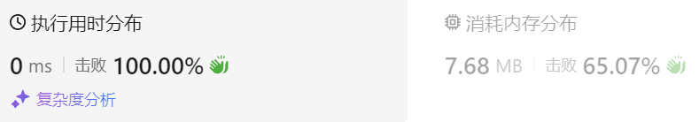
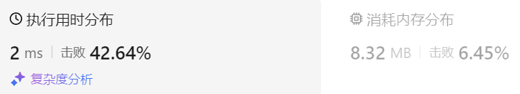

### 03、有效的括号（20240830，20题，简单。11min）
<div style="border: 1px solid black; padding: 10px; background-color: SteelBlue;">

给定一个只包括 '('，')'，'{'，'}'，'['，']' 的字符串 s ，判断字符串是否有效。

有效字符串需满足：

- 左括号必须用相同类型的右括号闭合。
- 左括号必须以正确的顺序闭合。
- 每个右括号都有一个对应的相同类型的左括号。
 

示例 1：

- 输入：s = "()"
- 输出：true

示例 2：

- 输入：s = "()[]{}"
- 输出：true

示例 3：

- 输入：s = "(]"
- 输出：false

示例 4：

- 输入：s = "([])"
- 输出：true

 

提示：

- 1 <= s.length <= 104
- s 仅由括号 '()[]{}' 组成

  </p>
</div>

<hr style="border-top: 5px solid #DC143C;">
<table>
  <tr>
    <td bgcolor="Yellow" style="padding: 5px; border: 0px solid black;">
      <span style="font-weight: bold; font-size: 20px;color: black;">
      自己答案（去注释，通过！）
      </span>
    </td>
  </tr>
</table>
<div style="padding: 0px; border: 1.5px solid LightSalmon; margin-bottom: 10px;">

```C++ {.line-numbers}
/*
11min
遍历字符串
遇到左边括号入栈
    遇到右边括号，查看stk的栈顶，是否匹配
    不匹配，返回false
    匹配，则出栈
最后栈不空，返回false
返回true
*/
class Solution {
public:
    bool isValid(string s) {
        stack<char> stk;
        size_t size = s.size();

        for(int i = 0; i < size; i++){
            if(s[i] == '(' || s[i] == '[' || s[i] == '{'){
                stk.push(s[i]);
            }else if(s[i] == ')'){
                if(stk.empty() || stk.top() != '('){
                    return false;
                }
                stk.pop();
            }else if(s[i] == ']'){
                if(stk.empty() || stk.top() != '['){
                    return false;
                }
                stk.pop();
            }else if(s[i] == '}'){
                if(stk.empty() || stk.top() != '{'){
                    return false;
                }
                stk.pop();
            }
        }
        if(!stk.empty()) return false;
        return true;
    }
};
```

</div>



<table>
  <tr>
    <td bgcolor="Yellow" style="padding: 5px; border: 0px solid black;">
      <span style="font-weight: bold; font-size: 20px;color: black;">
      仿照答案思路（入栈右括号）
      </span>
    </td>
  </tr>
</table>

<div style="padding: 0px; border: 1.5px solid LightSalmon; margin-bottom: 10px">

```C++ {.line-numbers}
/*
遇到左括号，入栈右括号
则遇到右括号时，栈顶不同就返回false
*/
class Solution {
public:
    bool isValid(string s) {
        stack<char> stk;
        size_t size = s.size();

        for(int i = 0; i < size; i++){
            if(s[i] == '('){
                stk.push(')');
            }else if(s[i] == '['){
                stk.push(']');
            }else if(s[i] == '{'){
                stk.push('}');
            }else if(stk.empty() || stk.top() != s[i]){
                return false;
            }else{
                stk.pop();
            }
        }
        if(!stk.empty()) return false;
        return true;
    }
};
```
</div>



<hr style="border-top: 5px solid #DC143C;">

<table>
  <tr>
    <td bgcolor="Yellow" style="padding: 5px; border: 0px solid black;">
      <span style="font-weight: bold; font-size: 20px;color: black;">
      随想录答案
      </span>
    </td>
  </tr>
</table>

<div style="padding: 0px; border: 1.5px solid LightSalmon; margin-bottom: 10px">

```C++ {.line-numbers}
class Solution {
public:
    bool isValid(string s) {
        if (s.size() % 2 != 0) return false; // 如果s的长度为奇数，一定不符合要求
        stack<char> st;
        for (int i = 0; i < s.size(); i++) {
            if (s[i] == '(') st.push(')');
            else if (s[i] == '{') st.push('}');
            else if (s[i] == '[') st.push(']');
            // 第三种情况：遍历字符串匹配的过程中，栈已经为空了，没有匹配的字符了，说明右括号没有找到对应的左括号 return false
            // 第二种情况：遍历字符串匹配的过程中，发现栈里没有我们要匹配的字符。所以return false
            else if (st.empty() || st.top() != s[i]) return false;
            else st.pop(); // st.top() 与 s[i]相等，栈弹出元素
        }
        // 第一种情况：此时我们已经遍历完了字符串，但是栈不为空，说明有相应的左括号没有右括号来匹配，所以return false，否则就return true
        return st.empty();
    }
};
```
</div>

时间复杂度: O(n)  
空间复杂度: O(n)