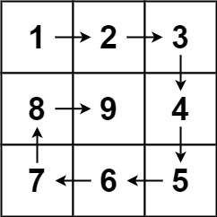

### 05、螺旋矩阵 II（20240807，59题，中等。34min）
<div style="border: 1px solid black; padding: 10px; background-color: SteelBlue;">

给你一个正整数 n ，生成一个包含 1 到 n2 所有元素，且元素按顺时针顺序螺旋排列的 n x n 正方形矩阵 matrix 。  


 

**示例 1**：
- 输入：n = 3
- 输出：[[1,2,3],[8,9,4],[7,6,5]]  

**示例 2**：
- 输入：n = 1
- 输出：[[1]]

  </p>
</div>

<hr style="border-top: 5px solid #DC143C;">
<table>
  <tr>
    <td bgcolor="Yellow" style="padding: 5px; border: 0px solid black;">
      <span style="font-weight: bold; font-size: 20px;color: black;">
      自己答案（去注释，通过！）
      </span>
    </td>
  </tr>
</table>
<div style="padding: 0px; border: 1.5px solid LightSalmon; margin-bottom: 10px;">

```C++
/*
34min
思路：
vector<vector<int>> vec记录四种转向；
vector<vector<int>> used记录填充过的格子；

当下一个要去的格子是外边界或者使用过的格子，需要转向

遍历过n*n个格子后结束

*/

class Solution {
public:
    vector<vector<int>> generateMatrix(int n) {
        vector<vector<int>> dir = {{0,1}, {1,0}, {0,-1}, {-1,0}};
        vector<vector<int>> vec(n, vector<int>(n, 0));
        vector<vector<int>> used(n, vector<int>(n, 0));
        int count = 0;  // 帮助记录当前使用的方向
        int sum_count = n*n;
        int x = 0;
        int y = -1;

        for(int i = 1; i <= sum_count; i++){
            vector<int> cur_dir = dir[count%4];
            x += cur_dir[0];
            y += cur_dir[1];

            vec[x][y] = i;
            used[x][y] = 1;

            if(x+cur_dir[0] < 0 || x+cur_dir[0] >= n || y+cur_dir[1] < 0 || y+cur_dir[1] >=n || used[x+cur_dir[0]][y+cur_dir[1]] == 1){
                ++count;  // 转向
            }
        }
        return vec;
    }
};

// 不使用used数组
class Solution {
public:
    vector<vector<int>> generateMatrix(int n) {
        vector<vector<int>> dir = {{0,1}, {1,0}, {0,-1}, {-1,0}};
        vector<vector<int>> vec(n, vector<int>(n, 0));
        // vector<vector<int>> used(n, vector<int>(n, 0));
        int count = 0;  // 帮助记录当前使用的方向
        int sum_count = n*n;
        int x = 0;
        int y = -1;

        for(int i = 1; i <= sum_count; i++){
            vector<int> cur_dir = dir[count%4];
            x += cur_dir[0];
            y += cur_dir[1];

            vec[x][y] = i;
            // used[x][y] = 1;

            if(x+cur_dir[0] < 0 || x+cur_dir[0] >= n || y+cur_dir[1] < 0 || y+cur_dir[1] >=n || vec[x+cur_dir[0]][y+cur_dir[1]] != 0){
                ++count;  // 转向
            }
        }
        return vec;
    }
};
```

</div>


<hr style="border-top: 5px solid #DC143C;">

<table>
  <tr>
    <td bgcolor="Yellow" style="padding: 5px; border: 0px solid black;">
      <span style="font-weight: bold; font-size: 20px;color: black;">
      随想录答案
      </span>
    </td>
  </tr>
</table>

<div style="padding: 0px; border: 1.5px solid LightSalmon; margin-bottom: 10px">

```C++
class Solution {
public:
    vector<vector<int>> generateMatrix(int n) {
        vector<vector<int>> res(n, vector<int>(n, 0)); // 使用vector定义一个二维数组
        int startx = 0, starty = 0; // 定义每循环一个圈的起始位置
        int loop = n / 2; // 每个圈循环几次，例如n为奇数3，那么loop = 1 只是循环一圈，矩阵中间的值需要单独处理
        int mid = n / 2; // 矩阵中间的位置，例如：n为3， 中间的位置就是(1，1)，n为5，中间位置为(2, 2)
        int count = 1; // 用来给矩阵中每一个空格赋值
        int offset = 1; // 需要控制每一条边遍历的长度，每次循环右边界收缩一位
        int i,j;
        while (loop --) {
            i = startx;
            j = starty;

            // 下面开始的四个for就是模拟转了一圈
            // 模拟填充上行从左到右(左闭右开)
            for (j; j < n - offset; j++) {
                res[i][j] = count++;
            }
            // 模拟填充右列从上到下(左闭右开)
            for (i; i < n - offset; i++) {
                res[i][j] = count++;
            }
            // 模拟填充下行从右到左(左闭右开)
            for (; j > starty; j--) {
                res[i][j] = count++;
            }
            // 模拟填充左列从下到上(左闭右开)
            for (; i > startx; i--) {
                res[i][j] = count++;
            }

            // 第二圈开始的时候，起始位置要各自加1， 例如：第一圈起始位置是(0, 0)，第二圈起始位置是(1, 1)
            startx++;
            starty++;

            // offset 控制每一圈里每一条边遍历的长度
            offset += 1;
        }

        // 如果n为奇数的话，需要单独给矩阵最中间的位置赋值
        if (n % 2) {
            res[mid][mid] = count;
        }
        return res;
    }
};
```
</div>

时间复杂度 O(n^2): 模拟遍历二维矩阵的时间  
空间复杂度 O(1)  


