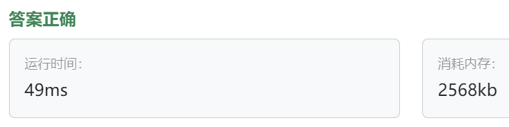
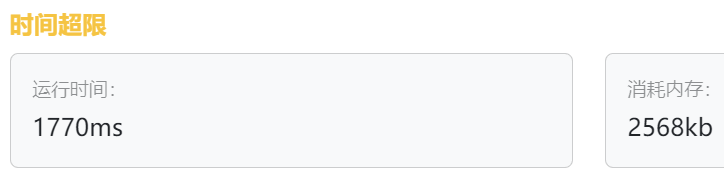
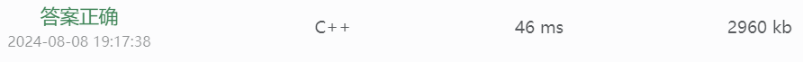

### 06、区间和（第九期模拟笔试）（20240808，58题，卡玛网）
<div style="border: 1px solid black; padding: 10px; background-color: SteelBlue;">

题目描述

>给定一个整数数组 Array，请计算该数组在每个指定区间内元素的总和。

输入描述
>第一行输入为整数数组 Array 的长度 n，接下来 n 行，每行一个整数，表示数组的元素。随后的输入为需要计算总和的区间下标：a，b （b > = a），直至文件结束。

输出描述
>输出每个指定区间内元素的总和。

输入示例
>5  
1  
2  
3  
4  
5  
0 1  
1 3  

输出示例
>3  
9  

提示信息
>数据范围：  
0 < n <= 100000

  </p>
</div>

<hr style="border-top: 5px solid #DC143C;">
<table>
  <tr>
    <td bgcolor="Yellow" style="padding: 5px; border: 0px solid black;">
      <span style="font-weight: bold; font-size: 20px;color: black;">
      仿照答案
      </span>
    </td>
  </tr>
</table>
<div style="padding: 0px; border: 1.5px solid LightSalmon; margin-bottom: 10px;">

```C++
#include <iostream>
#include <vector>
/*
思路：
依次计算各输入元素的累加和，并依次填入arry[i]
    区间[left, right]和即为arry[right]-arry[left]
    left为0时特化处理
这是前缀和方法，无需每次都计算区间[left, right]的累加和！！！

scanf、printf替代cin、cout的使用，可大大降低运行时间！！！

*/

using namespace std;

int main(){
    int count = 0;
    
    scanf("%d", &count);  // cin >> count;  scanf("%d", count) 要使用变量的地址！！！
    vector<int> arry(count, 0);
    
    int pre_sum = 0;
    for(int i = 0; i < count; i++){
        scanf("%d", &arry[i]);  // cin >> arry[i];  scanf(%d, &arry[i])
        pre_sum += arry[i];
        arry[i] = pre_sum;
    }

    int left = 0;
    int right = 0;
    
    while(~scanf("%d %d", &left, &right)){  // while(cin >> left >> right)
        if(left == 0){
            printf("%d\n", arry[right]);  // cout << arry[right] << endl;
        }else{
            printf("%d\n", arry[right] - arry[left-1]);  // cout << arry[right] - arry[left-1] << endl;
        }
    }
    
    return 0;
}
```

</div>



<table>
  <tr>
    <td bgcolor="Yellow" style="padding: 5px; border: 0px solid black;">
      <span style="font-weight: bold; font-size: 20px;color: black;">
      自己答案（超时）
      </span>
    </td>
  </tr>
</table>

<div style="padding: 0px; border: 1.5px solid LightSalmon; margin-bottom: 10px">

```C++
#include <iostream>
#include <vector>

using namespace std;
int main(){
    int count = 0;
    cin >> count;
    vector<int> arry(count, 0);
    
    for(int i = 0; i < count; i++){
        cin >> arry[i];
    }
    
    int left = 0;
    int right = 0;
    
    while(cin >> left >> right){
        int sum = 0;
        for(int j = left; j <= right; j++){
            sum += arry[j];
        }
        cout << sum << endl;
    }
    
    return 0;
}
```
</div>



<hr style="border-top: 5px solid #DC143C;">


<table>
  <tr>
    <td bgcolor="Yellow" style="padding: 5px; border: 0px solid black;">
      <span style="font-weight: bold; font-size: 20px;color: black;">
      随想录答案
      </span>
    </td>
  </tr>
</table>

<div style="padding: 0px; border: 1.5px solid LightSalmon; margin-bottom: 10px">

```C++
#include <iostream>
#include <vector>

using namespace std;

int main() {
    int n, a, b;
    cin >> n;
    vector<int> vec(n);
    vector<int> p(n);
    int presum = 0;
    for (int i = 0; i < n; i++) {
        scanf("%d", &vec[i]);
        presum += vec[i];
        p[i] = presum;
    }

    while (~scanf("%d%d", &a, &b)) {
        int sum;
        if (a == 0) sum = p[b];
        else sum = p[b] - p[a - 1];
        printf("%d\n", sum);
    }
}
```
</div>



<table>
  <tr>
    <td bgcolor="Yellow" style="padding: 5px; border: 0px solid black;">
      <span style="font-weight: bold; font-size: 20px;color: black;">
      1，按照你的解释，似乎不会退出while循环，那不就是无限循环了吗？
      </span>
    </td>
  </tr>
</table>

你提出的疑问很有道理，按我的解释来看，确实会出现逻辑错误。让我更正并澄清这个问题。

### `~scanf(...)` 的实际行为

1. **`scanf` 的返回值**：
   - `scanf` 返回成功读取并赋值的变量个数，这个值是一个非负整数。当读取失败或遇到 `EOF`（文件结束符）时，返回值可能是 `0` 或 `EOF`（通常为 `-1`）。

2. **`~` 按位取反**：
   - 对于正整数 `x`，按位取反后的值是负数。
   - 对于 `EOF`（一般为 `-1`），按位取反会得到 `0`。

### `while (~scanf("%d%d", &a, &b))` 的工作机制

- **成功读取的情况**：如果 `scanf` 成功读取了两个整数，返回值是 `2`。取反后，`~2` 的值为 `-3`。`while` 继续循环。
- **读取失败或遇到 `EOF` 的情况**：假设 `scanf` 返回 `EOF`，`EOF` 的值通常是 `-1`，按位取反后，`~(-1)` 的结果是 `0`。此时，`while` 条件变为 `false`，循环退出。

因此，这种写法在正常情况下不会导致无限循环。**一旦 `scanf` 返回 `EOF`，取反后的值会变为 `0`，从而退出 `while` 循环**。

### 代码示例

```c
#include <stdio.h>

int main() {
    int a, b;

    while (~scanf("%d%d", &a, &b)) {
        printf("Read values: a = %d, b = %d\n", a, b);
    }

    printf("Input ended or invalid input.\n");
    return 0;
}
```

### 行为总结

- 当输入有效数据时，`scanf` 会返回一个正整数，`~scanf(...)` 的结果是负数，循环继续。
- 当输入结束或遇到错误输入时，`scanf` 返回 `EOF`（通常是 `-1`），此时 `~EOF` 等于 `0`，`while` 条件变为 `false`，循环退出。

### 关键点

- **`~scanf(...)` 的设计巧妙性**在于它能够确保在 `scanf` 成功读取数据时继续循环，而在 `scanf` 失败时退出循环。
- **退出循环的条件**实际上依赖于 `scanf` 遇到 `EOF` 或无法读取时返回的 `-1`，取反后为 `0`，进而退出 `while` 循环。

所以，这种写法不会导致无限循环。**一旦 `scanf` 返回 `EOF` 或者读取失败，循环会正确退出**。


<table>
  <tr>
    <td bgcolor="Yellow" style="padding: 5px; border: 0px solid black;">
      <span style="font-weight: bold; font-size: 20px;color: black;">
      2，“~2 的值为 -3”，为什么，详细解释下
      </span>
    </td>
  </tr>
</table>

当你使用按位取反运算符 `~` 时，它对整数的二进制表示中的每一位进行取反。为了理解这个过程，我们可以从二进制表示入手。

### 按位取反运算符 `~`
`~x` 的结果是对 `x` 的二进制表示的每一位进行取反。例如，如果某一位为 `1`，则取反后变为 `0`；如果某一位为 `0`，则取反后变为 `1`。

### 示例：`~2` 的计算

1. **2 的二进制表示**：
   - 在 32 位系统中，`2` 的二进制表示为：
     ```
     00000000 00000000 00000000 00000010
     ```

2. **取反**：
   - 对这个二进制数的每一位进行取反（`0` 变 `1`，`1` 变 `0`）：
     ```
     11111111 11111111 11111111 11111101
     ```
   - 这个结果的二进制值就是 `~2` 的结果。

3. **解释结果**：
   - 在计算机中，最高位通常是符号位，`1` 表示负数，`0` 表示正数。
   - 上面的二进制结果 `11111111 11111111 11111111 11111101` 表示的十进制数是 `-3`。

### 为什么 `~2` 等于 `-3`

- 计算机使用补码（Two's Complement）表示负数。
- 要得到一个负数的补码，可以对对应正数的二进制表示取反，然后加 `1`。
  
  例如，`2` 的二进制表示为 `00000000 00000000 00000000 00000010`，取反后是 `11111111 11111111 11111111 11111101`，然后加 `1`，得到 `11111111 11111111 11111111 11111110`，这个表示的就是 `-2`。

- 所以当我们对 `2` 取反时，结果实际上是 `-2` 减去 `1`，即 `-3`。

### 总结
- `~2` 的结果为 `-3` 是因为计算机使用补码表示负数，取反运算 `~` 实际上将数字变为其补码形式。
- 计算 `~2` 时，二进制的 `2` 经过每一位取反后表示的正是 `-3`。

这个操作看起来复杂，但本质上只是通过位操作对数值进行了补码变换。

<table>
  <tr>
    <td bgcolor="Yellow" style="padding: 5px; border: 0px solid black;">
      <span style="font-weight: bold; font-size: 20px;color: black;">
      3，处理输入输出流时，scanf、printf替代cin、cout会大大提高效率，为什么？
      </span>
    </td>
  </tr>
</table>

`scanf` 和 `printf` 相比于 `cin` 和 `cout` 在处理输入输出流时效率更高，这是因为它们的底层实现机制不同。以下是具体原因：

### 1. **缓冲机制**

- **`cin` 和 `cout`**：
  - `cin` 和 `cout` 是 C++ 的标准输入输出流，使用了更复杂的缓冲机制和类型安全检查。
  - 它们是通过标准库对象 `std::cin` 和 `std::cout` 实现的，并且依赖于 C++ 的输入输出流库。这些流库提供了更多的功能，例如自动格式化、类型安全、以及国际化支持。
  - 为了保证与 C 的输入输出函数兼容，C++ 的输入输出流默认是同步的（即 `cin` 和 `cout` 与 `scanf` 和 `printf` 是同步的）。同步机制会带来额外的开销，从而降低性能。

- **`scanf` 和 `printf`**：
  - `scanf` 和 `printf` 是 C 语言的标准输入输出函数，操作的是底层的文件流 `FILE*`，直接与标准输入输出设备进行交互。
  - 它们只处理字符串格式化（即格式化输入/输出），没有额外的类型检查和格式化规则处理。由于功能相对简单，`scanf` 和 `printf` 的执行效率较高。

### 2. **类型安全和格式化**

- **`cin` 和 `cout`**：
  - `cin` 和 `cout` 提供了类型安全检查，即根据变量的类型自动选择合适的输入输出格式。这种类型检查在编译时增加了额外的开销。
  - `cout` 使用了 C++ 的流操作符 `<<`，这是一个模板化的机制，支持各种数据类型的输入输出。模板的灵活性和复杂性也会引入额外的运行时开销。

- **`scanf` 和 `printf`**：
  - `scanf` 和 `printf` 通过格式字符串来指定数据的输入输出格式，编译时并不进行类型安全检查。这减少了程序的运行时开销。
  - 由于格式字符串是固定的，程序只需要对字符串进行解析，然后直接进行数据输入输出，这在一定程度上提高了效率。

### 3. **同步机制**

- **默认同步**：
  - `cin` 和 `cout` 默认与 `scanf` 和 `printf` 同步。这是为了确保 C++ 和 C 的输入输出功能可以一起使用而不产生混淆。然而，这种同步机制会导致性能下降。
  - 你可以通过 `std::ios::sync_with_stdio(false);` 禁用同步，这样可以提高 `cin` 和 `cout` 的性能，但即使这样，它们的效率仍然可能不如 `scanf` 和 `printf`。

### 4. **低级别实现**

- **`scanf` 和 `printf`**：
  - 这两个函数更接近底层系统调用，减少了中间的抽象层和类型检查，直接操作底层流，从而提高了执行效率。
  
- **`cin` 和 `cout`**：
  - `cin` 和 `cout` 提供的功能更丰富，但也更抽象，运行时需要处理更多的库函数调用和复杂的逻辑。

### 结论

`scanf` 和 `printf` 提供了更直接、低级别的输入输出处理方式，相比 `cin` 和 `cout` 具有更高的效率。如果你需要处理大量的输入输出操作，特别是在时间敏感的场景中，使用 `scanf` 和 `printf` 可以显著提高性能。这就是为什么在某些竞争性编程或高性能需求的环境中，开发者通常倾向于使用 `scanf` 和 `printf` 来替代 `cin` 和 `cout`。

<table>
  <tr>
    <td bgcolor="Yellow" style="padding: 5px; border: 0px solid black;">
      <span style="font-weight: bold; font-size: 20px;color: black;">
      4，使用scanf 和 printf 替代 cin 和 cout时，要注意什么问题？举例子详细说明，以及是否存在场景不能替代？
      </span>
    </td>
  </tr>
</table>

使用 `scanf` 和 `printf` 替代 `cin` 和 `cout` 时，确实能提高输入输出的效率，但需要注意一些潜在的问题和限制。在某些场景下，这种替代并不适用。以下是你需要注意的事项、一些详细的例子以及不能替代的场景：

### 1. **类型安全问题**
   
`scanf` 和 `printf` 依赖格式化字符串进行输入输出，并且不进行编译时的类型检查。使用错误的格式化字符串可能会导致未定义行为。

#### 示例：

```cpp
int num;
scanf("%lf", &num); // 错误：%lf 用于 double 类型
```

这个例子中，`scanf` 的格式化字符串与变量类型不匹配，可能导致程序崩溃或读取错误的数据。在 `cin` 中，这种错误会在编译时捕获。

**注意**：使用 `scanf` 和 `printf` 时，必须确保格式化字符串与变量类型完全匹配。

### 2. **输入缓冲区问题**

`scanf` 不会自动清理输入缓冲区，导致潜在的输入混淆问题。特别是在处理字符串输入时，如果不注意清理缓冲区，可能会导致意外的输入结果。

#### 示例：

```cpp
char str1[10], str2[10];
scanf("%s", str1); // 输入 "hello"
scanf("%s", str2); // 输入 "world"
```

输入缓冲区如果包含换行符或空格，`scanf` 可能会错误地认为输入结束，或者未能正确读取输入。

**解决方法**：可以使用 `getchar()` 或 `scanf("%*c");` 来清除缓冲区中的换行符或其他残留字符。

### 3. **处理字符串**

`scanf` 和 `printf` 在处理字符串时，不能直接使用 `std::string`，而是要使用字符数组（`char[]`）。这意味着不能像使用 `cin` 和 `cout` 那样方便地处理动态长度的字符串。

#### 示例：

```cpp
char name[100];
scanf("%s", name); // 只能读取不包含空格的字符串
```

`cin` 可以直接处理 `std::string`，而 `scanf` 处理带有空格的字符串时，需要使用 `scanf("%[^\n]", name);` 之类的复杂格式化字符串。

### 4. **文件输入输出**

`scanf` 和 `printf` 主要用于标准输入输出，如果涉及文件操作，`cin` 和 `cout` 可以通过 `ifstream` 和 `ofstream` 更方便地进行处理。

#### 示例：

```cpp
FILE* file = fopen("input.txt", "r");
int num;
fscanf(file, "%d", &num);
fclose(file);
```

使用 `ifstream` 和 `ofstream` 可以更方便地管理文件流，并且不需要显式地打开和关闭文件：

```cpp
std::ifstream infile("input.txt");
int num;
infile >> num;
```

### 5. **宽字符和本地化支持**

`cin` 和 `cout` 支持本地化和宽字符，而 `scanf` 和 `printf` 对这些的支持较差。尤其在处理国际化程序时，`cin` 和 `cout` 更适合。

### 6. **复杂数据类型**

`cin` 和 `cout` 可以通过重载 `>>` 和 `<<` 运算符处理自定义类型，而 `scanf` 和 `printf` 只能处理基本类型数据，不能直接处理自定义数据类型。

#### 示例：

```cpp
struct Point {
    int x, y;
};

std::cin >> point.x >> point.y;
```

### **总结**

在性能关键的场合，特别是需要大量输入输出时，`scanf` 和 `printf` 可以替代 `cin` 和 `cout`，但要注意格式化字符串、缓冲区管理、字符串处理等问题。对于复杂的数据类型、文件操作、本地化需求或自定义类型，`cin` 和 `cout` 仍然是更好的选择。

<table>
  <tr>
    <td bgcolor="Yellow" style="padding: 5px; border: 0px solid black;">
      <span style="font-weight: bold; font-size: 20px;color: black;">
      5，请再举例子详细说明scanf 和 printf有哪些容易用错的场景，给出易错的例子，以及如何改善的例子
      </span>
    </td>
  </tr>
</table>


在使用 `scanf` 和 `printf` 时，有一些常见的易错场景。如果不小心处理这些情况，可能会导致错误的输入输出或程序崩溃。下面举例说明这些易错点，并给出改进的方案。

### 1. **格式化字符串与变量类型不匹配**

**错误例子：**

```cpp
int num;
scanf("%lf", &num); // 错误：%lf 用于 double 类型，而 num 是 int 类型
```

**问题描述：**
格式化字符串 `%lf` 是用于读取 `double` 类型的，而这里 `num` 是 `int` 类型，导致未定义行为。

**改进方案：**

```cpp
int num;
scanf("%d", &num); // 正确：使用 %d 读取 int 类型
```

### 2. **输入缓冲区未清理**

**错误例子：**

```cpp
int a;
char c;
scanf("%d", &a); // 输入 10
scanf("%c", &c); // 错误：c 可能接收了上一个输入留下的换行符
```

**问题描述：**
当用户输入数字并按下回车键时，换行符仍然留在输入缓冲区中。`scanf` 读取 `char` 类型的 `c` 时，可能会读取到这个换行符，而不是用户期望的字符。

**改进方案：**

```cpp
int a;
char c;
scanf("%d", &a); 
scanf(" %c", &c); // 正确：在 %c 前加上空格，跳过缓冲区中的空白字符
```

### 3. **读取字符串时数组越界**

**错误例子：**

```cpp
char str[5];
scanf("%s", str); // 错误：输入超过 4 个字符可能导致数组越界（包含终止符 '\0'）
```

**问题描述：**
`scanf` 不限制输入的字符串长度。如果用户输入的字符串长度超过数组容量，将导致数组越界，引发程序崩溃。

**改进方案：**

```cpp
char str[5];
scanf("%4s", str); // 正确：限制读取最多 4 个字符，保留一个空间给终止符 '\0'
```

### 4. **处理带空格的字符串**

**错误例子：**

```cpp
char name[50];
scanf("%s", name); // 错误：只能读取单词，无法读取包含空格的字符串
```

**问题描述：**
`scanf("%s", ...)` 只能读取到第一个空格为止，无法读取包含空格的完整字符串。

**改进方案：**

```cpp
char name[50];
scanf("%49[^\n]", name); // 正确：读取整行，直到换行符为止，保留一个空间给终止符 '\0'
```

### 5. **未初始化的指针或格式化字符串**

**错误例子：**

```cpp
int *p;
scanf("%d", p); // 错误：未初始化的指针可能导致段错误
```

**问题描述：**
`scanf` 的第二个参数应该是指向一个有效变量的指针，而这里的指针 `p` 未初始化，指向未知的内存地址，导致未定义行为。

**改进方案：**

```cpp
int num;
int *p = &num;
scanf("%d", p); // 正确：使用指向有效变量的指针
```

### 6. **使用 `scanf` 和 `printf` 时忽略返回值**

**错误例子：**

```cpp
int a;
scanf("%d", &a); // 错误：没有检查输入是否成功
```

**问题描述：**
`scanf` 返回成功读取的项目数，如果未能读取预期的项目，可能导致程序后续部分出现问题。

**改进方案：**

```cpp
int a;
if (scanf("%d", &a) != 1) {
    printf("Input error!\n");
    // 错误处理逻辑
}
```

### 7. **使用未定义的格式化字符串**

**错误例子：**

```cpp
int a;
scanf("%p", &a); // 错误：%p 用于指针类型，而 a 是 int 类型
```

**问题描述：**
使用未定义或不合适的格式化字符串可能会导致未定义行为或运行时错误。

**改进方案：**

```cpp
int a;
scanf("%d", &a); // 正确：使用合适的格式化字符串
```

### 8. **使用 `printf` 格式化输出时类型不匹配**

**错误例子：**

```cpp
int a = 5;
printf("%f\n", a); // 错误：%f 用于输出浮点数，而 a 是整数
```

**问题描述：**
`printf` 的格式化字符串必须与相应的变量类型匹配，否则会输出错误的数据或导致程序崩溃。

**改进方案：**

```cpp
int a = 5;
printf("%d\n", a); // 正确：使用 %d 输出整数
```

### 9. **避免在循环中使用 `scanf` 读取大量输入**

**错误例子：**

```cpp
for(int i = 0; i < 1000; i++) {
    int num;
    scanf("%d", &num); // 错误：大量输入可能导致缓冲区问题
}
```

**问题描述：**
在循环中大量使用 `scanf` 可能导致输入缓冲区积压，影响性能，尤其是在处理复杂输入时。

**改进方案：**

```cpp
int numArray[1000];
for(int i = 0; i < 1000; i++) {
    scanf("%d", &numArray[i]); // 正确：可以考虑批量读取或优化输入逻辑
}
```

### 总结

`scanf` 和 `printf` 在高效处理输入输出时非常有用，但使用时需要谨慎对待格式化字符串与变量类型匹配、输入缓冲区管理、字符串读取长度等问题。注意这些常见的易错点，并通过合适的改进措施，可以有效避免问题的发生。

我还要如下一些疑问
1，对于例子2，缓冲区中字符进入和流出机制是什么，char类型会读取到int a输入之后的回车，你是在改善中说道在%c前加一个空格，这是什么机制？加不同个数的空格会有影响吗？
2，你之前也提过“scanf 不会自动清理输入缓冲区，导致潜在的输入混淆问题”，那是否哪些会自动清理缓冲区的方法？介绍下它们是怎么做的。
3，你之前提到过可以使用getchar() 或 scanf("%*c")来清除缓冲区中的换行符或其他残留字符。为什么缓冲区会残留这些字符，以及是否可能存在其他长度更长的字符串，这时候getchar() 或 scanf("%*c")是否起不到作用了，这时候应该怎么办？

<table>
  <tr>
    <td bgcolor="Yellow" style="padding: 5px; border: 0px solid black;">
      <span style="font-weight: bold; font-size: 20px;color: black;">
      6，我还要如下一些疑问:</br>
      1)对于例子2，缓冲区中字符进入和流出机制是什么，char类型会读取到int a输入之后的回车，你是在改善中说道在%c前加一个空格，这是什么机制？加不同个数的空格会有影响吗？</br>
      2)你之前也提过“scanf 不会自动清理输入缓冲区，导致潜在的输入混淆问题”，那是否哪些会自动清理缓冲区的方法？介绍下它们是怎么做的。</br>
      3)你之前提到过可以使用getchar() 或 scanf("%*c")来清除缓冲区中的换行符或其他残留字符。为什么缓冲区会残留这些字符，以及是否可能存在其他长度更长的字符串，这时候getchar() 或 scanf("%*c")是否起不到作用了，这时候应该怎么办？</br>
      </span>
    </td>
  </tr>
</table>

### 1. 输入缓冲区的字符进入和流出机制

当你使用 `scanf` 读取输入时，用户输入的字符首先会被存储在输入缓冲区中，然后根据格式说明符的需求从缓冲区中读取数据。

例如：

```c
int a;
char ch;
scanf("%d", &a);
scanf("%c", &ch);
```

假设你输入的是 `5`，然后按下回车键，缓冲区的内容就是 `"5\n"`（其中 `\n` 表示换行符）。`scanf("%d", &a)` 会读取数字 `5` 并将其存储在 `a` 中，但换行符 `\n` 仍然留在缓冲区中。接下来的 `scanf("%c", &ch)` 会读取这个换行符并将其存储在 `ch` 中，而不是你期望的下一个字符。

在你的示例中：

```c
scanf(" %c", &ch);
```

在 `%c` 前面加一个空格可以跳过所有的空白字符（包括空格、换行符、制表符等），因此 `scanf` 会跳过缓冲区中残留的换行符，并读取下一个有效字符。

**关于空格的数量：**  
一个空格就足够了，它会跳过所有连续的空白字符。添加多个空格不会产生额外的效果。

### 2. 自动清理缓冲区的方法

在 C++ 中，`cin` 和 `getline` 这样的输入方法不会将换行符留在缓冲区中，因为它们会在读取时自动清除换行符。

例如：

```c++
std::string line;
std::getline(std::cin, line);
```

`getline` 读取整行并将换行符从缓冲区中删除。

与之相比，`scanf` 不会自动清理缓冲区，这就是为什么当你使用 `scanf` 读取字符串时，如果在输入整数或字符之后紧跟一个字符串读取操作，可能会出现问题。

### 3. 缓冲区残留字符的问题

缓冲区可能会保留诸如换行符或空格等字符，这些字符可能在某些情况下干扰接下来的输入操作。使用 `getchar()` 或 `scanf("%*c")` 可以消耗并忽略这些残留的字符，从而避免混淆。

但要注意，这些方法仅清除一个字符，如果缓冲区中有更多残留字符（比如一个长字符串），你需要使用循环清空缓冲区。

例如：

```c
int c;
while ((c = getchar()) != '\n' && c != EOF) {
    // 清除缓冲区中的所有字符直到遇到换行符
}
```

这种方法确保所有残留字符都被清理，避免影响后续的输入操作。


<table>
  <tr>
    <td bgcolor="Yellow" style="padding: 5px; border: 0px solid black;">
      <span style="font-weight: bold; font-size: 20px;color: black;">
      7，注意到你这里将c设置为了int类型，是否可以设置成char类型，效果一样呢？为什么不同类型，效果会一样
      </span>
    </td>
  </tr>
</table>

将 `c` 设置为 `int` 类型而不是 `char` 类型，在处理字符输入时有其特定的原因。虽然从表面上看，使用 `char` 类型似乎也能起到相同的效果，但在实际操作中存在细微的差别。

### 为什么使用 `int` 类型

`getchar()` 函数的返回值类型是 `int`，而不是 `char`。原因是它需要能够返回所有可能的字符以及一个特殊的值 `EOF`（-1），用于表示文件结束或读取错误。

当你使用 `char` 类型来接收 `getchar()` 的返回值时，如果读取到 `EOF`，它可能无法正确判断，因为 `char` 类型的范围较小（通常为 -128 到 127 或 0 到 255），而 `EOF` 是一个负数，通常为 -1。这种情况下，会丢失信息，导致无法正确判断是否到达文件结束或遇到错误。

### 示例代码对比

```c
int c;
while ((c = getchar()) != '\n' && c != EOF) {
    // 正确清除缓冲区中的所有字符直到遇到换行符或EOF
}
```

vs.

```c
char c;
while ((c = getchar()) != '\n' && c != EOF) { // 可能无法正确判断EOF
    // 潜在问题：如果 `EOF` 被读取，`c` 可能无法正确表示它
}
```

### 不同类型的效果比较

- **使用 `int`**：能够正确判断 `EOF`，并且处理所有可能的字符输入。
- **使用 `char`**：可能会误判 `EOF`，导致循环条件失效，程序进入错误的状态或无限循环。

因此，使用 `int` 来接收 `getchar()` 的返回值是为了确保能够正确处理 `EOF`，避免意外行为。


