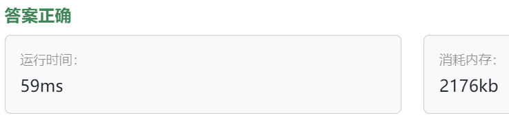

### 07、开发商购买土地（第五期模拟笔试）（20240809，44题，卡玛网）
<div style="border: 1px solid black; padding: 10px; background-color: SteelBlue;">


  </p>
</div>

<hr style="border-top: 5px solid #DC143C;">
<table>
  <tr>
    <td bgcolor="Yellow" style="padding: 5px; border: 0px solid black;">
      <span style="font-weight: bold; font-size: 20px;color: black;">
      自己答案（调试后通过！）
      </span>
    </td>
  </tr>
</table>
<div style="padding: 0px; border: 1.5px solid LightSalmon; margin-bottom: 10px;">

```C++
#include <iostream>
#include <vector>

using namespace std;

/*
计算每行每列的和
则切一刀，就是让行或者列分成两份后，两边的总和的差值最小

计算各列的总和sum1~sum_y，并累加得到累加和sum
    依次累加sum_i，直到大于等于sum/2;
    sum - sum_i_finish即为一个可能答案
再计算各行的这个值，对比取最小即可

colum_sum和row_sum两个数组分别从头进行累加
    加到某个数将达到总和的一半，
    需要记录刚好大于等于所有数总和一半值和小于一半值的两个点k1和k2
    行和列都有这两种分法，所以最后是比较这四种分法的最小值！！！
    
*/


int main(){
    int n = 0;
    int m = 0;
    
    while(~scanf("%d %d", &n, &m)){
        vector<vector<int>> map(n, vector<int>(m, 0));
        
        int calcu_colum_sum = 0;
        int calcu_row_sum = 0;
        
        vector<int> row_sum(n, 0);
        vector<int> colum_sum(m, 0);
        
        for(int x = 0; x < n; x++){
            int cur_row_sum = 0;
            for(int y = 0; y < m; y++){
                scanf(" %d", &map[x][y]);
                cur_row_sum += map[x][y];
            }
            row_sum[x] = cur_row_sum;
            calcu_row_sum += cur_row_sum;
        }
        for(int y = 0; y < m; y++){
            int cur_colum_sum = 0;
            for(int x = 0; x < n; x++){
                cur_colum_sum += map[x][y];
            }
            colum_sum[y] = cur_colum_sum;
            calcu_colum_sum += cur_colum_sum;
        }
        
        int count_row = 0;
        int tmp_count_row = 0;
        for(auto& num : row_sum){
            tmp_count_row += num;
            if(tmp_count_row > calcu_row_sum/2){
                break;
            }
            count_row = tmp_count_row;
        }
        
        int count_colum = 0;
        int tmp_count_colum = 0;
        for(auto& num : colum_sum){
            tmp_count_colum += num;
            if(tmp_count_colum >= calcu_colum_sum/2){
                break;
            }
            count_colum = tmp_count_colum;
        }
        
        int rest_row = calcu_row_sum - count_row;
        int rest_colum = calcu_colum_sum - count_colum;
        
        int rest_row_tmp = calcu_row_sum - tmp_count_row;
        int rest_colum_tmp = calcu_colum_sum - tmp_count_colum;
        
        int ret = min(abs(rest_row - count_row), abs(rest_colum - count_colum));
        int ret_tmp = min(abs(rest_row_tmp - tmp_count_row), abs(rest_colum_tmp - tmp_count_colum));
        printf("%d\n", min(ret, ret_tmp));
        // return 0;
    }
    return 0;
}
```

</div>



<table>
  <tr>
    <td bgcolor="Yellow" style="padding: 5px; border: 0px solid black;">
      <span style="font-weight: bold; font-size: 20px;color: black;">
      自己答案（通过！）
      </span>
    </td>
  </tr>
</table>

<div style="padding: 0px; border: 1.5px solid LightSalmon; margin-bottom: 10px">

```C++


```
</div>

<hr style="border-top: 5px solid #DC143C;">

<table>
  <tr>
    <td bgcolor="Yellow" style="padding: 5px; border: 0px solid black;">
      <span style="font-weight: bold; font-size: 20px;color: black;">
      自己调试版本（通过！！！）
      </span>
    </td>
  </tr>
</table>

<div style="padding: 0px; border: 1.5px solid LightSalmon; margin-bottom: 10px">

```C++


```
</div>

<table>
  <tr>
    <td bgcolor="Yellow" style="padding: 5px; border: 0px solid black;">
      <span style="font-weight: bold; font-size: 20px;color: black;">
      仿照答案版本v2（去注释）
      </span>
    </td>
  </tr>
</table>

<div style="padding: 0px; border: 1.5px solid LightSalmon; margin-bottom: 10px">

```C++


```
</div>

<hr style="border-top: 5px solid #DC143C;">

<table>
  <tr>
    <td bgcolor="Yellow" style="padding: 5px; border: 0px solid black;">
      <span style="font-weight: bold; font-size: 20px;color: black;">
      随想录答案
      </span>
    </td>
  </tr>
</table>

<div style="padding: 0px; border: 1.5px solid LightSalmon; margin-bottom: 10px">

```C++
#include <iostream>
#include <vector>
#include <climits>

using namespace std;
int main () {
    int n, m;
    cin >> n >> m;
    int sum = 0;
    vector<vector<int>> vec(n, vector<int>(m, 0)) ;
    for (int i = 0; i < n; i++) {
        for (int j = 0; j < m; j++) {
            cin >> vec[i][j];
            sum += vec[i][j];
        }
    }
    // 统计横向
    vector<int> horizontal(n, 0);
    for (int i = 0; i < n; i++) {
        for (int j = 0 ; j < m; j++) {
            horizontal[i] += vec[i][j];
        }
    }
    // 统计纵向
    vector<int> vertical(m , 0);
    for (int j = 0; j < m; j++) {
        for (int i = 0 ; i < n; i++) {
            vertical[j] += vec[i][j];
        }
    }
    int result = INT_MAX;
    int horizontalCut = 0;
    for (int i = 0 ; i < n; i++) {
        horizontalCut += horizontal[i];
        result = min(result, abs(sum - horizontalCut - horizontalCut));
    }
    int verticalCut = 0;
    for (int j = 0; j < m; j++) {
        verticalCut += vertical[j];
        result = min(result, abs(sum - verticalCut - verticalCut));
    }
    cout << result << endl;
}
```
</div>

时间复杂度： O(n^2)

<table>
  <tr>
    <td bgcolor="Yellow" style="padding: 5px; border: 0px solid black;">
      <span style="font-weight: bold; font-size: 20px;color: black;">
      随想录答案
      </span>
    </td>
  </tr>
</table>

<div style="padding: 0px; border: 1.5px solid LightSalmon; margin-bottom: 10px">

```C++
#include <iostream>
#include <vector>
#include <climits>

using namespace std;
int main () {
    int n, m;
    cin >> n >> m;
    int sum = 0;
    vector<vector<int>> vec(n, vector<int>(m, 0)) ;
    for (int i = 0; i < n; i++) {
        for (int j = 0; j < m; j++) {
            cin >> vec[i][j];
            sum += vec[i][j];
        }
    }

    int result = INT_MAX;
    int count = 0; // 统计遍历过的行
    for (int i = 0; i < n; i++) {
        for (int j = 0 ; j < m; j++) {
            count += vec[i][j];
            // 遍历到行末尾时候开始统计
            if (j == m - 1) result = min (result, abs(sum - count - count));

        }
    }

    count = 0; // 统计遍历过的列
    for (int j = 0; j < m; j++) {
        for (int i = 0 ; i < n; i++) {
            count += vec[i][j];
            // 遍历到列末尾的时候开始统计
            if (i == n - 1) result = min (result, abs(sum - count - count));
        }
    }
    cout << result << endl;
}
```
</div>
