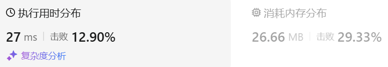

### 01、反转字符串（20240903，344题，简单，6min）
<div style="border: 1px solid black; padding: 10px; background-color: SteelBlue;">

编写一个函数，其作用是将输入的字符串反转过来。输入字符串以字符数组 s 的形式给出。

不要给另外的数组分配额外的空间，你必须原地修改输入数组、使用 O(1) 的额外空间解决这一问题。

 

示例 1：

- 输入：s = ["h","e","l","l","o"]
- 输出：["o","l","l","e","h"]

示例 2：

- 输入：s = ["H","a","n","n","a","h"]
- 输出：["h","a","n","n","a","H"]
 

提示：

- 1 <= s.length <= 105
- s[i] 都是 ASCII 码表中的可打印字符

  </p>
</div>

<hr style="border-top: 5px solid #DC143C;">
<table>
  <tr>
    <td bgcolor="Yellow" style="padding: 5px; border: 0px solid black;">
      <span style="font-weight: bold; font-size: 20px;color: black;">
      自己答案（6min）
      </span>
    </td>
  </tr>
</table>
<div style="padding: 0px; border: 1.5px solid LightSalmon; margin-bottom: 10px;">

```C++ {.line-numbers}
/*
6min
双指针指向字符串两端，相向运动，并交换过程中的两两字符
*/
class Solution {
public:
    void reverseString(vector<char>& s) {
        size_t size = s.size();
        int left = 0;
        int right = size-1;

        while(left < right){
            char tmp = s[left];
            s[left] = s[right];
            s[right] = tmp;
            left++;  // 退出循环条件！！！
            right--;
        }
    }
};
```

</div>



<hr style="border-top: 5px solid #DC143C;">

<table>
  <tr>
    <td bgcolor="Yellow" style="padding: 5px; border: 0px solid black;">
      <span style="font-weight: bold; font-size: 20px;color: black;">
      随想录答案
      </span>
    </td>
  </tr>
</table>

<div style="padding: 0px; border: 1.5px solid LightSalmon; margin-bottom: 10px">

```C++ {.line-numbers}
class Solution {
public:
    void reverseString(vector<char>& s) {
        for (int i = 0, j = s.size() - 1; i < s.size()/2; i++, j--) {
            swap(s[i],s[j]);
        }
    }
};
```
</div>

时间复杂度: O(n)  
空间复杂度: O(1)