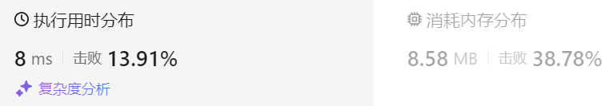
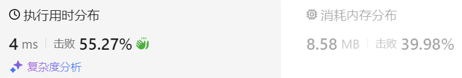

### 02、反转字符串II（20240903，541题，简单，36min）
<div style="border: 1px solid black; padding: 10px; background-color: SteelBlue;">

给定一个字符串 s 和一个整数 k，从字符串开头算起，每计数至 2k 个字符，就反转这 2k 字符中的前 k 个字符。

- 如果剩余字符少于 k 个，则将剩余字符全部反转。
- 如果剩余字符小于 2k 但大于或等于 k 个，则反转前 k 个字符，其余字符保持原样。
 

示例 1：

- 输入：s = "abcdefg", k = 2
- 输出："bacdfeg"

示例 2：

- 输入：s = "abcd", k = 2
- 输出："bacd"
 

提示：

- 1 <= s.length <= 104
- s 仅由小写英文组成
- 1 <= k <= 104

  </p>
</div>

<hr style="border-top: 5px solid #DC143C;">
<table>
  <tr>
    <td bgcolor="Yellow" style="padding: 5px; border: 0px solid black;">
      <span style="font-weight: bold; font-size: 20px;color: black;">
      自己答案（去注释，通过！）
      </span>
    </td>
  </tr>
</table>
<div style="padding: 0px; border: 1.5px solid LightSalmon; margin-bottom: 10px;">

```C++ {.line-numbers}
/*思路：
36min

0 k-1   2k-1  3k-1  4k-1  
[0:k-1]、[k:2k-1]、[2k:3k-1]、[3k:4k-1]....[n*2*k-1-2*k+1 : n*2*k-1-k]、[n*2*k-1-k+1 : n*2*k-1]

当n*2*k-1 >= size时，说明已可能字符串不能被2k整除，需要考虑多余的部分。
    当字符串最后字符的索引size-1落在区间[n*2*k-1-k+1 : n*2*k-1]，则需要反转区间[n*2*k-1-2*k+1 : n*2*k-1-k]
    当字符串最后字符的索引size-1落在区间[n*2*k-1-2*k+1 : n*2*k-1-k]，则需反转[n*2*k-1-2*k+1 : size-1]这个区间
*/

class Solution {
public:
    void changeStr(string& s, int left, int right){
        while(left < right){
            char tmp = s[left];
            s[left] = s[right];
            s[right] = tmp;
            left++;
            right--;
        }
    }
    string reverseStr(string s, int k) {
        size_t size = s.size();

        int n = 1;
        while(n*2*k-1 < size){
            int left = n*2*k-1-2*k+1;
            int right = n*2*k-1-k;
            changeStr(s, left, right);
            n++;
        }
        if(n*2*k-1 > size-1 && n*2*k-1-k+1 <= size-1){  // if(n*2*k-1 > size && n*2*k-1-k <= size)
            int left = n*2*k-1-2*k+1;
            int right = n*2*k-1-k;
            changeStr(s, left, right);
        }else if(n*2*k-1 > size-1 && n*2*k-1-k >= size-1){  // else if(n*2*k-1 >= size && n*2*k-1-k > size)
            int left = n*2*k-1-2*k+1;  // s="abcdefg", k=8
            int right = size-1;
            changeStr(s, left, right);
        }
        return s;
    }
};
```

</div>



<table>
  <tr>
    <td bgcolor="Yellow" style="padding: 5px; border: 0px solid black;">
      <span style="font-weight: bold; font-size: 20px;color: black;">
      仿照答案 
      </span>
    </td>
  </tr>
</table>

<div style="padding: 0px; border: 1.5px solid LightSalmon; margin-bottom: 10px">

```C++ {.line-numbers}
class Solution {
public:
    void reverse(string& s, int left, int right){
        while(left < right){
            swap(s[left], s[right]);
            left++;
            right--;
        }
    }
    string reverseStr(string s, int k) {
        size_t size = s.size();

        for(int i = 0; i < size; i += 2*k){
            if(i + k <= size){  // 剩余部分大于k。这里不管是否等于，都可以通过！！？？
                reverse(s, i, i+k-1);
                // reverse(s.begin() + i, s.begin() + i+k);  使用库函数
            }else{
                reverse(s, i, size-1);
                // reverse(s.begin() + i, s.end());  使用库函数
            }
        }
        return s;
    }
};
```
</div>



<hr style="border-top: 5px solid #DC143C;">

<table>
  <tr>
    <td bgcolor="Yellow" style="padding: 5px; border: 0px solid black;">
      <span style="font-weight: bold; font-size: 20px;color: black;">
      仿照答案版本v2（去注释）
      </span>
    </td>
  </tr>
</table>

<div style="padding: 0px; border: 1.5px solid LightSalmon; margin-bottom: 10px">

```C++ {.line-numbers}
class Solution {
public:
    string reverseStr(string s, int k) {
        for (int i = 0; i < s.size(); i += (2 * k)) {
            // 1. 每隔 2k 个字符的前 k 个字符进行反转
            // 2. 剩余字符小于 2k 但大于或等于 k 个，则反转前 k 个字符
            if (i + k <= s.size()) {
                reverse(s.begin() + i, s.begin() + i + k );
            } else {
                // 3. 剩余字符少于 k 个，则将剩余字符全部反转。
                reverse(s.begin() + i, s.end());
            }
        }
        return s;
    }
};
```
</div>

时间复杂度: O(n)  
空间复杂度: O(1)

<hr style="border-top: 5px solid #DC143C;">

<table>
  <tr>
    <td bgcolor="Yellow" style="padding: 5px; border: 0px solid black;">
      <span style="font-weight: bold; font-size: 20px;color: black;">
      仿照答案版本v2
      </span>
    </td>
  </tr>
</table>

<div style="padding: 0px; border: 1.5px solid LightSalmon; margin-bottom: 10px">

```C++ {.line-numbers}
class Solution {
public:
    void reverse(string& s, int start, int end) {
        for (int i = start, j = end; i < j; i++, j--) {
            swap(s[i], s[j]);
        }
    }
    string reverseStr(string s, int k) {
        for (int i = 0; i < s.size(); i += (2 * k)) {
            // 1. 每隔 2k 个字符的前 k 个字符进行反转
            // 2. 剩余字符小于 2k 但大于或等于 k 个，则反转前 k 个字符
            if (i + k <= s.size()) {
                reverse(s, i, i + k - 1);
                continue;
            }
            // 3. 剩余字符少于 k 个，则将剩余字符全部反转。
            reverse(s, i, s.size() - 1);
        }
        return s;
    }
};
```
</div>

时间复杂度: O(n)  
空间复杂度: O(1)或O(n), 取决于使用的语言中字符串是否可以修改 

<table>
  <tr>
    <td bgcolor="Yellow" style="padding: 5px; border: 0px solid black;">
      <span style="font-weight: bold; font-size: 20px;color: black;">
      随想录答案
      </span>
    </td>
  </tr>
</table>

<div style="padding: 0px; border: 1.5px solid LightSalmon; margin-bottom: 10px">

```C++ {.line-numbers}
class Solution {
public:
    string reverseStr(string s, int k) {
        int n = s.size(),pos = 0;
        while(pos < n){
            //剩余字符串大于等于k的情况
            if(pos + k < n) reverse(s.begin() + pos, s.begin() + pos + k);
            //剩余字符串不足k的情况 
            else reverse(s.begin() + pos,s.end());
            pos += 2 * k;
        }
        return s;
    }
};
```
</div>

时间复杂度: O(n)  
空间复杂度: O(1)