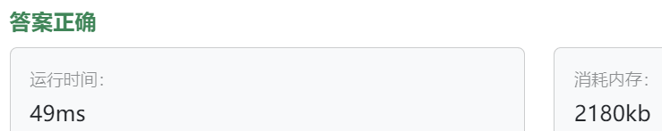

### 03、替换数字（第八期模拟笔试）（20240903，54题，卡玛网）
<div style="border: 1px solid black; padding: 10px; background-color: SteelBlue;">

**题目描述**
>给定一个字符串 s，它包含小写字母和数字字符，请编写一个函数，将字符串中的字母字符保持不变，而将每个数字字符替换为number。   
例如，对于输入字符串   "a1b2c3"，函数应该将其转换为 "anumberbnumbercnumber"。

**输入描述**
>输入一个字符串 s,s 仅包含小写字母和数字字符。

**输出描述**
>打印一个新的字符串，其中每个数字字符都被替换为了number

**输入示例**
>a1b2c3

**输出示例**
>anumberbnumbercnumber

**提示信息**
>数据范围：  
1 <= s.length < 10000。

  </p>
</div>

<hr style="border-top: 5px solid #DC143C;">
<table>
  <tr>
    <td bgcolor="Yellow" style="padding: 5px; border: 0px solid black;">
      <span style="font-weight: bold; font-size: 20px;color: black;">
      自己答案（17min）
      </span>
    </td>
  </tr>
</table>
<div style="padding: 0px; border: 1.5px solid LightSalmon; margin-bottom: 10px;">

```C++ {.line-numbers}
/*
17min
读取字符串使用cin >> str
然后遍历str，
    看str[i]是数字还是字母
    视情况拼接相应字符串至结果result中
*/
#include <bits/stdc++.h>

using namespace std;


int main(){  // string main()
    string str;
    // scanf("%s", &str);
    cin >> str;
    
    string result;
    size_t size = str.size();
    
    for(int i = 0; i < size; i++){
        if(isdigit(str[i])){  // if(str[i] >= '0' && str[i] <= '9')
            result += "number";
        }else{
            result += str[i];
        }
    }
    
    for(auto ch : result){
        printf("%c", ch);
    }
    return 0;
}
```

</div>



<hr style="border-top: 5px solid #DC143C;">

<table>
  <tr>
    <td bgcolor="Yellow" style="padding: 5px; border: 0px solid black;">
      <span style="font-weight: bold; font-size: 20px;color: black;">
      随想录答案
      </span>
    </td>
  </tr>
</table>

<div style="padding: 0px; border: 1.5px solid LightSalmon; margin-bottom: 10px">

```C++ {.line-numbers}
#include <iostream>
using namespace std;
int main() {
    string s;
    while (cin >> s) {
        int sOldIndex = s.size() - 1;
        int count = 0; // 统计数字的个数
        for (int i = 0; i < s.size(); i++) {
            if (s[i] >= '0' && s[i] <= '9') {
                count++;
            }
        }
        // 扩充字符串s的大小，也就是将每个数字替换成"number"之后的大小
        s.resize(s.size() + count * 5);
        int sNewIndex = s.size() - 1;
        // 从后往前将数字替换为"number"
        while (sOldIndex >= 0) {
            if (s[sOldIndex] >= '0' && s[sOldIndex] <= '9') {
                s[sNewIndex--] = 'r';
                s[sNewIndex--] = 'e';
                s[sNewIndex--] = 'b';
                s[sNewIndex--] = 'm';
                s[sNewIndex--] = 'u';
                s[sNewIndex--] = 'n';
            } else {
                s[sNewIndex--] = s[sOldIndex];
            }
            sOldIndex--;
        }
        cout << s << endl;       
    }
}
```
</div>

时间复杂度：O(n)  
空间复杂度：O(1)