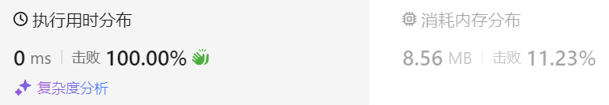

### 01、用栈实现队列（20240830，232题，简单。15min）
<div style="border: 1px solid black; padding: 10px; background-color: SteelBlue;">

请你仅使用两个栈实现先入先出队列。队列应当支持一般队列支持的所有操作（push、pop、peek、empty）：

实现 MyQueue 类：

- void push(int x) 将元素 x 推到队列的末尾
- int pop() 从队列的开头移除并返回元素
- int peek() 返回队列开头的元素
- boolean empty() 如果队列为空，返回 true ；否则，返回 false

说明：

- 你 只能 使用标准的栈操作 —— 也就是只有 push to top, peek/pop from top, size, 和 is empty 操作是合法的。
- 你所使用的语言也许不支持栈。你可以使用 list 或者 deque（双端队列）来模拟一个栈，只要是标准的栈操作即可。
 

示例 1：

- 输入：  
["MyQueue", "push", "push", "peek", "pop", "empty"]  
[[], [1], [2], [], [], []]  
- 输出：  
[null, null, null, 1, 1, false]

- 解释：  
MyQueue myQueue = new MyQueue();  
myQueue.push(1); // queue is: [1]  
myQueue.push(2); // queue is: [1, 2] (leftmost is front of the queue)  
myQueue.peek(); // return 1  
myQueue.pop(); // return 1, queue is [2]  
myQueue.empty(); // return false  
 

提示：

- 1 <= x <= 9
- 最多调用 100 次 push、pop、peek 和 empty
- 假设所有操作都是有效的 （例如，一个空的队列不会调用 pop 或者 peek 操作）
 

进阶：

- 你能否实现每个操作均摊时间复杂度为 O(1) 的队列？换句话说，执行 n 个操作的总时间复杂度为 O(n) ，即使其中一个操作可能花费较长时间。

  </p>
</div>

<hr style="border-top: 5px solid #DC143C;">
<table>
  <tr>
    <td bgcolor="Yellow" style="padding: 5px; border: 0px solid black;">
      <span style="font-weight: bold; font-size: 20px;color: black;">
      自己答案（去注释，通过！）
      </span>
    </td>
  </tr>
</table>
<div style="padding: 0px; border: 1.5px solid LightSalmon; margin-bottom: 10px;">

```C++ {.line-numbers}
/*
15min
栈1用于入栈，栈2用于出栈
    出栈时，检查栈2是否为空，为空就将栈1中元素放入栈2
    然后出栈栈2的栈顶元素
*/
class MyQueue {
private:
    stack<int> stk1;
    stack<int> stk2;
public:
    MyQueue() {

    }
    
    void push(int x) {
        stk1.push(x);
    }
    
    int pop() {
        if(stk2.empty()){
            while(!stk1.empty()){
                int tmp = stk1.top();
                stk1.pop();
                stk2.push(tmp);
            }
        }
        int tmp = stk2.top();
        stk2.pop();
        return tmp;
    }
    
    int peek() {
        if(stk2.empty()){
            while(!stk1.empty()){
                int tmp = stk1.top();
                stk1.pop();
                stk2.push(tmp);
            }
        }
        int tmp = stk2.top();
        return tmp;
    }
    
    bool empty() {
        if(stk1.empty() && stk2.empty()){
            return true;
        }else{
            return false;
        }
    }
};
```

</div>



<table>
  <tr>
    <td bgcolor="Yellow" style="padding: 5px; border: 0px solid black;">
      <span style="font-weight: bold; font-size: 20px;color: black;">
      仿照答案（优化）
      </span>
    </td>
  </tr>
</table>

<div style="padding: 0px; border: 1.5px solid LightSalmon; margin-bottom: 10px">

```C++ {.line-numbers}
class MyQueue {
private:
    stack<int> stk_in;  // 命名
    stack<int> stk_out;
public:
    MyQueue() {

    }
    
    void push(int x) {
        stk_in.push(x);
    }
    
    int pop() {
        int tmp = this->peek();  // 直接使用已有的peek函数！！！
        stk_out.pop();
        return tmp;
    }
    
    int peek() {
        if(stk_out.empty()){
            while(!stk_in.empty()){
                int tmp = stk_in.top();
                stk_in.pop();
                stk_out.push(tmp);
            }
        }
        int tmp = stk_out.top();
        return tmp;
    }
    
    bool empty() {
        if(stk_in.empty() && stk_out.empty()){
            return true;
        }else{
            return false;
        }
    }
};
```
</div>

<hr style="border-top: 5px solid #DC143C;">

<table>
  <tr>
    <td bgcolor="Yellow" style="padding: 5px; border: 0px solid black;">
      <span style="font-weight: bold; font-size: 20px;color: black;">
      随想录答案
      </span>
    </td>
  </tr>
</table>

<div style="padding: 0px; border: 1.5px solid LightSalmon; margin-bottom: 10px">

```C++ {.line-numbers}
class MyQueue {
public:
    stack<int> stIn;
    stack<int> stOut;
    /** Initialize your data structure here. */
    MyQueue() {

    }
    /** Push element x to the back of queue. */
    void push(int x) {
        stIn.push(x);
    }

    /** Removes the element from in front of queue and returns that element. */
    int pop() {
        // 只有当stOut为空的时候，再从stIn里导入数据（导入stIn全部数据）
        if (stOut.empty()) {
            // 从stIn导入数据直到stIn为空
            while(!stIn.empty()) {
                stOut.push(stIn.top());
                stIn.pop();
            }
        }
        int result = stOut.top();
        stOut.pop();
        return result;
    }

    /** Get the front element. */
    int peek() {
        int res = this->pop(); // 直接使用已有的pop函数
        stOut.push(res); // 因为pop函数弹出了元素res，所以再添加回去
        return res;
    }

    /** Returns whether the queue is empty. */
    bool empty() {
        return stIn.empty() && stOut.empty();
    }
};
```
</div>

时间复杂度: push和empty为O(1), pop和peek为O(n)  
空间复杂度: O(n)