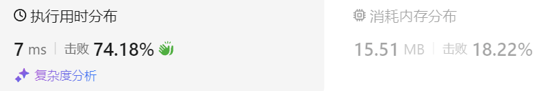

### 05、逆波兰表达式求值（20240902，150题，中等。21min）
<div style="border: 1px solid black; padding: 10px; background-color: SteelBlue;">

给你一个字符串数组 tokens ，表示一个根据 逆波兰表示法 表示的算术表达式。

请你计算该表达式。返回一个表示表达式值的整数。

注意：

- 有效的算符为 '+'、'-'、'*' 和 '/' 。
- 每个操作数（运算对象）都可以是一个整数或者另一个表达式。
- 两个整数之间的除法总是 向零截断 。
- 表达式中不含除零运算。
- 输入是一个根据逆波兰表示法表示的算术表达式。
- 答案及所有中间计算结果可以用 32 位 整数表示。
 

示例 1：

- 输入：tokens = ["2","1","+","3","*"]
- 输出：9
- 解释：该算式转化为常见的中缀算术表达式为：((2 + 1) * 3) = 9

示例 2：

- 输入：tokens = ["4","13","5","/","+"]
- 输出：6
- 解释：该算式转化为常见的中缀算术表达式为：(4 + (13 / 5)) = 6

示例 3：

- 输入：tokens = ["10","6","9","3","+","-11","*","/","*","17","+","5","+"]
- 输出：22
- 解释：该算式转化为常见的中缀算术表达式为：  
  ((10 * (6 / ((9 + 3) * -11))) + 17) + 5  
= ((10 * (6 / (12 * -11))) + 17) + 5   
= ((10 * (6 / -132)) + 17) + 5  
= ((10 * 0) + 17) + 5  
= (0 + 17) + 5  
= 17 + 5  
= 22  
 

提示：

- 1 <= tokens.length <= 104
- tokens[i] 是一个算符（"+"、"-"、"*" 或 "/"），或是在范围 [-200, 200] 内的一个整数
 

**逆波兰表达式：**

逆波兰表达式是一种后缀表达式，所谓后缀就是指算符写在后面。

- 平常使用的算式则是一种中缀表达式，如 ( 1 + 2 ) * ( 3 + 4 ) 。
- 该算式的逆波兰表达式写法为 ( ( 1 2 + ) ( 3 4 + ) * ) 。

逆波兰表达式主要有以下两个优点：

- 去掉括号后表达式无歧义，上式即便写成 1 2 + 3 4 + * 也可以依据次序计算出正确结果。
- 适合用栈操作运算：遇到数字则入栈；遇到算符则取出栈顶两个数字进行计算，并将结果压入栈中

  </p>
</div>

<hr style="border-top: 5px solid #DC143C;">
<table>
  <tr>
    <td bgcolor="Yellow" style="padding: 5px; border: 0px solid black;">
      <span style="font-weight: bold; font-size: 20px;color: black;">
      自己答案（21min）
      </span>
    </td>
  </tr>
</table>
<div style="padding: 0px; border: 1.5px solid LightSalmon; margin-bottom: 10px;">

```C++ {.line-numbers}
/*
21min
遇到操作符，出栈两个数进行运算；注意先出站的是右操作数，做操作数后出栈！！！
遇到数字，入栈
最后返回栈顶
*/
class Solution {
public:
    int evalRPN(vector<string>& tokens) {
        stack<int> stk;
        size_t size = tokens.size();

        for(int i = 0; i < size; i++){
            // if(tokens[i] == '+' || tokens[i] == '-' || tokens[i] == '*' || tokens[i] == '/')
            // if(tokens[i].size() == 1 && tokens[i] == '+' || tokens[i] == '-' || tokens[i] == '*' || tokens[i] == '/')
            if(tokens[i] == "+" || tokens[i] == "-" || tokens[i] == "*" || tokens[i] == "/"){  // 字符串不要和字符比较！！！
                int right = stk.top();   // int left = stk.top();
                stk.pop();
                int left = stk.top();   // 注意栈顶显示right，然后才是left操作数！！！
                stk.pop();
                int tmp = 0;

                if(tokens[i] == "+"){
                    tmp =  left + right;  // int tmp =  left + right;
                }else if(tokens[i] == "-"){
                    tmp =  left - right;  // 注意临时变量的作用域！！！
                }else if(tokens[i] == "*"){
                    tmp =  left * right;
                }else if(tokens[i] == "/"){
                    tmp =  left / right;
                }
                stk.push(tmp);
            }else{
                int num = stoi(tokens[i]);
                stk.push(num);
            }
        }
        return stk.top();
    }
};
```

</div>



<hr style="border-top: 5px solid #DC143C;">

<table>
  <tr>
    <td bgcolor="Yellow" style="padding: 5px; border: 0px solid black;">
      <span style="font-weight: bold; font-size: 20px;color: black;">
      随想录答案
      </span>
    </td>
  </tr>
</table>

<div style="padding: 0px; border: 1.5px solid LightSalmon; margin-bottom: 10px">

```C++ {.line-numbers}
class Solution {
public:
    int evalRPN(vector<string>& tokens) {
        // 力扣修改了后台测试数据，需要用longlong
        stack<long long> st; 
        for (int i = 0; i < tokens.size(); i++) {
            if (tokens[i] == "+" || tokens[i] == "-" || tokens[i] == "*" || tokens[i] == "/") {
                long long num1 = st.top();
                st.pop();
                long long num2 = st.top();
                st.pop();
                if (tokens[i] == "+") st.push(num2 + num1);
                if (tokens[i] == "-") st.push(num2 - num1);
                if (tokens[i] == "*") st.push(num2 * num1);
                if (tokens[i] == "/") st.push(num2 / num1);
            } else {
                st.push(stoll(tokens[i]));
            }
        }

        int result = st.top();
        st.pop(); // 把栈里最后一个元素弹出（其实不弹出也没事）
        return result;
    }
}; 
```
</div>

时间复杂度: O(n)  
空间复杂度: O(n)