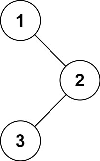
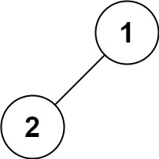
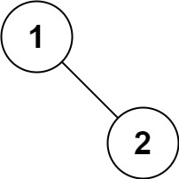
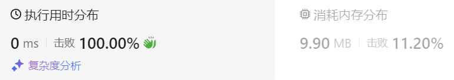
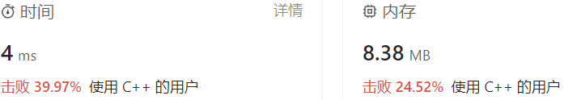

### 01、二叉树的前序遍历（20231102，144题，简单。240719整理，7min）
<div style="border: 1px solid black; padding: 10px; background-color: SteelBlue;">
给你二叉树的根节点 root ，返回它节点值的 前序 遍历。

示例 1：    


- 输入：root = [1,null,2,3]
- 输出：[1,2,3]

示例 2：

- 输入：root = []
- 输出：[]

示例 3：

- 输入：root = [1]
- 输出：[1]

示例 4：  


- 输入：root = [1,2]
- 输出：[1,2]

示例 5：  


- 输入：root = [1,null,2]
- 输出：[1,2]
 

提示：

- 树中节点数目在范围 [0, 100] 内
- -100 <= Node.val <= 100
 

进阶：递归算法很简单，你可以通过迭代算法完成吗？
  </p>
</div>

<hr style="border-top: 5px solid #DC143C;">

<table>
  <tr>
    <td bgcolor="Yellow" style="padding: 5px; border: 0px solid black;">
      <span style="font-weight: bold; font-size: 20px;color: black;">
      重新整理（递归法，240719，4min）
      </span>
    </td>
  </tr>
</table>
<div style="padding: 0px; border: 1.5px solid LightSalmon; margin-bottom: 10px;">

```C++
// 前序遍历，中左右
class Solution {
public:

    void trvalTree(TreeNode* cur_node, vector<int>& vec){
        if(cur_node == nullptr) return;

        vec.push_back(cur_node->val);
        trvalTree(cur_node->left,vec);
        trvalTree(cur_node->right,vec);
    }
    
    vector<int> preorderTraversal(TreeNode* root) {
        vector<int> vec;

        trvalTree(root, vec);
        return vec;
    }
};
```

</div>



<table>
  <tr>
    <td bgcolor="Yellow" style="padding: 5px; border: 0px solid black;">
      <span style="font-weight: bold; font-size: 20px;color: black;">
      重新整理（迭代法，240719，7min）
      </span>
    </td>
  </tr>
</table>
<div style="padding: 0px; border: 1.5px solid LightSalmon; margin-bottom: 10px;">

```C++
// 前序遍历，中左右
class Solution {
public:
    vector<int> preorderTraversal(TreeNode* root) {
        stack<TreeNode*> stk;
        vector<int> ret;

        TreeNode* cur_node = root;
        stk.push(cur_node);

        while(!stk.empty()){
            cur_node = stk.top();
            stk.pop();
            if(cur_node != nullptr){  // 参考答案是这样，感觉我这好点。if (node->right) st.push(node->right)
                ret.push_back(cur_node->val);
                
                stk.push(cur_node->right);  // 先右再左入栈，才是中左右出栈顺序！！！
                stk.push(cur_node->left);
            }
        }
        return ret;
    }
};
```

</div>


<hr style="border-top: 5px solid #DC143C;">
<table>
  <tr>
    <td bgcolor="Yellow" style="padding: 5px; border: 0px solid black;">
      <span style="font-weight: bold; font-size: 20px;color: black;">
      之前看过答案后面默写（递归方法版本）
      </span>
    </td>
  </tr>
</table>


<div style="padding: 0px; border: 1.5px solid LightSalmon; margin-bottom: 10px;">

```C++
/**
 * Definition for a binary tree node.
 * struct TreeNode {
 *     int val;
 *     TreeNode *left;
 *     TreeNode *right;
 *     TreeNode() : val(0), left(nullptr), right(nullptr) {}
 *     TreeNode(int x) : val(x), left(nullptr), right(nullptr) {}
 *     TreeNode(int x, TreeNode *left, TreeNode *right) : val(x), left(left), right(right) {}
 * };
 */
 /*
 思路：
 递归方式
 使用一个全局的容器存储遍历的结果，最后返回用的；也可以写在调用函数中，令被调函数为递归函数backingtracking()。
backingtracking()一个参数需要传入当前节点的下个待处理的节点，一个参数传入存储的容器；不需要返回值。
 */
class Solution {
public:
    void backingtracking(TreeNode * curNode, vector<int> &ret)  //ret必须传入引用
    {
        //跳出递归条件
        if(curNode == NULL) return;
        ret.push_back(curNode->val);
        backingtracking(curNode->left, ret);
        backingtracking(curNode->right, ret);
    }
    vector<int> preorderTraversal(TreeNode* root) {
        vector<int> ret;
        backingtracking(root, ret);
        return ret;
    }
};

```

</div>


<hr style="border-top: 5px solid #DC143C;">

<table>
  <tr>
    <td bgcolor="Yellow" style="padding: 5px; border: 0px solid black;">
      <span style="font-weight: bold; font-size: 20px;color: black;">
      之前看过答案后面默写（迭代方法版本）
      </span>
    </td>
  </tr>
</table>

<div style="padding: 0px; border: 1.5px solid LightSalmon; margin-bottom: 10px;">

```C++
/*
 思路（迭代方式）：
 前序遍历是中左右顺序，使用栈来做的刚好。
 由于中左右顺序刚好方便每次遍历现将最早读取的中间节点读取出来，然后依次将“右”、“左”入栈，
 右先于左入栈，符合中左右的顺序；读取“左”后，就是相同的遍历和入栈顺序。
 
 */
class Solution {
public:
    vector<int> preorderTraversal(TreeNode* root) {
        stack<TreeNode*> st;
        vector<int> ret;

        if(root == NULL) return ret;

        st.push(root);   //将根节点入栈
        //循环遍历树
        while(!st.empty())    /*while(st.top())*/
        {
            TreeNode* tmp = st.top();  //使用临时节点存放栈顶（中节点），然后弹出
            st.pop();
            ret.push_back(tmp->val);
            if(tmp->right) st.push(tmp->right);
            if(tmp->left) st.push(tmp->left);
        }
        return ret;
    }
};
```

</div>



<table>
  <tr>
    <td bgcolor="Yellow" style="padding: 5px; border: 0px solid black;">
      <span style="font-weight: bold; font-size: 20px;color: black;">
      随想录答案（递归法）
      </span>
    </td>
  </tr>
</table>

<div style="padding: 0px; border: 1.5px solid LightSalmon; margin-bottom: 10px">

```C++
class Solution {
public:
    void traversal(TreeNode* cur, vector<int>& vec) {
        if (cur == NULL) return;
        vec.push_back(cur->val);    // 中
        traversal(cur->left, vec);  // 左
        traversal(cur->right, vec); // 右
    }
    vector<int> preorderTraversal(TreeNode* root) {
        vector<int> result;
        traversal(root, result);
        return result;
    }
};
```
</div>

<table>
  <tr>
    <td bgcolor="Yellow" style="padding: 5px; border: 0px solid black;">
      <span style="font-weight: bold; font-size: 20px;color: black;">
      随想录答案（迭代法）
      </span>
    </td>
  </tr>
</table>

<div style="padding: 0px; border: 1.5px solid LightSalmon; margin-bottom: 10px">

```C++
class Solution {
public:
    vector<int> preorderTraversal(TreeNode* root) {
        stack<TreeNode*> st;
        vector<int> result;
        if (root == NULL) return result;
        st.push(root);
        while (!st.empty()) {
            TreeNode* node = st.top();                       // 中
            st.pop();
            result.push_back(node->val);
            if (node->right) st.push(node->right);           // 右（空节点不入栈）
            if (node->left) st.push(node->left);             // 左（空节点不入栈）
        }
        return result;
    }
};
```
</div>
