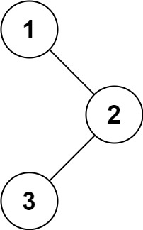
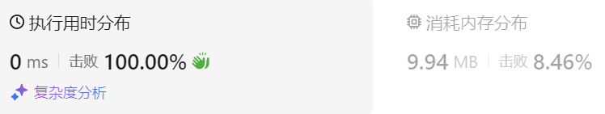
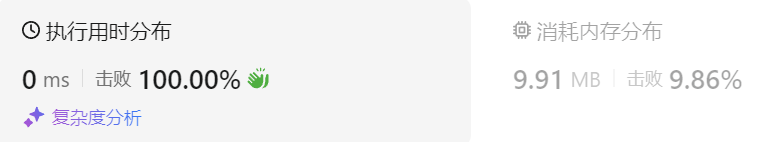
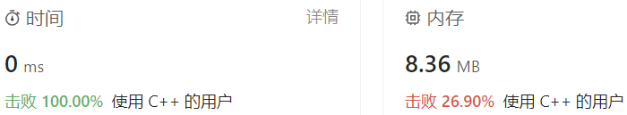
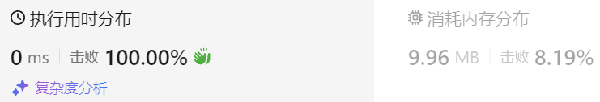

### 02、二叉树的中序遍历（20231106，94题，简单。240719整理，10min）
<div style="border: 1px solid black; padding: 10px; background-color: SteelBlue;">

给定一个二叉树的根节点 root ，返回 它的 **中序** 遍历 。

示例 1：



- 输入：root = [1,null,2,3]
- 输出：[1,3,2]

示例 2：

- 输入：root = []
- 输出：[]

示例 3：

- 输入：root = [1]
- 输出：[1]
 

提示：

- 树中节点数目在范围 [0, 100] 内
- -100 <= Node.val <= 100
 

进阶: 递归算法很简单，你可以通过迭代算法完成吗？

  </p>
</div>

<hr style="border-top: 5px solid #DC143C;">
<table>
  <tr>
    <td bgcolor="Yellow" style="padding: 5px; border: 0px solid black;">
      <span style="font-weight: bold; font-size: 20px;color: black;">
      重新整理（递归法，240719，3min）
      </span>
    </td>
  </tr>
</table>
<div style="padding: 0px; border: 1.5px solid LightSalmon; margin-bottom: 10px;">

```C++ {.line-numbers}
class Solution {
public:
    void travelTree(TreeNode* root, vector<int>& vec){
        if(root == NULL) return;

        travelTree(root->left, vec);
        vec.push_back(root->val);
        travelTree(root->right, vec);
    }

    vector<int> inorderTraversal(TreeNode* root) {
        vector<int> vec;

        travelTree(root, vec);
        return vec;
    }
};
```

</div>



<table>
  <tr>
    <td bgcolor="Yellow" style="padding: 5px; border: 0px solid black;">
      <span style="font-weight: bold; font-size: 20px;color: black;">
      重新整理（迭代法，240719，10min）
      </span>
    </td>
  </tr>
</table>

<div style="padding: 0px; border: 1.5px solid LightSalmon; margin-bottom: 10px">

```C++ {.line-numbers}
// 中序遍历，迭代方法，左中右顺序
class Solution {
public:
    vector<int> inorderTraversal(TreeNode* root) {
        TreeNode* cur_node = root;
        stack<TreeNode*> stk;
        vector<int> ret;

        // stk.push(cur_node);

        while(cur_node != NULL || !stk.empty()){
            if(cur_node != NULL){
                while(cur_node != NULL){  // 这里while循环可以不用，外层已经是一直找当前节点的左节点的操作了！！！
                    stk.push(cur_node);
                    cur_node = cur_node->left;
                }
            }else{
                cur_node = stk.top();
                stk.pop();

                ret.push_back(cur_node->val);
                cur_node = cur_node->right;
            }
        }
        return ret;
    }
};
```
</div>



<hr style="border-top: 5px solid #DC143C;">

<table>
  <tr>
    <td bgcolor="Yellow" style="padding: 5px; border: 0px solid black;">
      <span style="font-weight: bold; font-size: 20px;color: black;">
      随想录答案(递归法)
      </span>
    </td>
  </tr>
</table>

<div style="padding: 0px; border: 1.5px solid LightSalmon; margin-bottom: 10px">

```C++ {.line-numbers}
class Solution {
public:
    void traversal(TreeNode* cur, vector<int>& vec) {
        if (cur == NULL) return;
        traversal(cur->left, vec);  // 左
        vec.push_back(cur->val);    // 中
        traversal(cur->right, vec); // 右
    }

    vector<int> preorderTraversal(TreeNode* root) {
        vector<int> result;
        traversal(root, result);
        return result;
    }
};
```
</div>

<table>
  <tr>
    <td bgcolor="Yellow" style="padding: 5px; border: 0px solid black;">
      <span style="font-weight: bold; font-size: 20px;color: black;">
      随想录答案(迭代法)
      </span>
    </td>
  </tr>
</table>

<div style="padding: 0px; border: 1.5px solid LightSalmon; margin-bottom: 10px">

```C++ {.line-numbers}
class Solution {
public:
    vector<int> inorderTraversal(TreeNode* root) {
        vector<int> result;
        stack<TreeNode*> st;
        TreeNode* cur = root;
        while (cur != NULL || !st.empty()) {
            if (cur != NULL) { // 指针来访问节点，访问到最底层
                st.push(cur); // 将访问的节点放进栈
                cur = cur->left;                // 左
            } else {
                cur = st.top(); // 从栈里弹出的数据，就是要处理的数据（放进result数组里的数据）
                st.pop();
                result.push_back(cur->val);     // 中
                cur = cur->right;               // 右
            }
        }
        return result;
    }
};
```
</div>

<table>
  <tr>
    <td bgcolor="Yellow" style="padding: 5px; border: 0px solid black;">
      <span style="font-weight: bold; font-size: 20px;color: black;">
      随想录答案（统一迭代法！！！）
      </span>
    </td>
  </tr>
</table>

<div style="padding: 0px; border: 1.5px solid LightSalmon; margin-bottom: 10px">

```C++ {.line-numbers}
class Solution {
public:
    vector<int> inorderTraversal(TreeNode* root) {
        vector<int> result;
        stack<TreeNode*> st;
        if (root != NULL) st.push(root);
        while (!st.empty()) {
            TreeNode* node = st.top();
            if (node != NULL) {
                st.pop(); // 将该节点弹出，避免重复操作，下面再将右中左节点添加到栈中
                if (node->right) st.push(node->right);  // 添加右节点（空节点不入栈）

                st.push(node);                          // 添加中节点
                st.push(NULL); // 中节点访问过，但是还没有处理，加入空节点做为标记。

                if (node->left) st.push(node->left);    // 添加左节点（空节点不入栈）
            } else { // 只有遇到空节点的时候，才将下一个节点放进结果集
                st.pop();           // 将空节点弹出
                node = st.top();    // 重新取出栈中元素
                st.pop();
                result.push_back(node->val); // 加入到结果集
            }
        }
        return result;
    }
};
```
</div>

<hr style="border-top: 5px solid #DC143C;">

<table>
  <tr>
    <td bgcolor="Yellow" style="padding: 5px; border: 0px solid black;">
      <span style="font-weight: bold; font-size: 20px;color: black;">
      自己版本，未通过(迭代方法版本)
      </span>
    </td>
  </tr>
</table>

<div style="padding: 0px; border: 1.5px solid LightSalmon; margin-bottom: 10px">

```C++ {.line-numbers}
 /*
 思路（迭代方法）：
 从根节点开始遍历，左边有节点则依次入栈；
 遇到叶子节点则开始返回其值；当前节点存在右节点时，当前节点返回其值；有节点执行之前的相似步骤，一直遍历左节点，直至当前节点没有左节点时返回；
 遍历至最后栈为空，返回存储值的容器。
 */
class Solution {
public:
    vector<int> inorderTraversal(TreeNode* root) {
        stack<TreeNode*> st;
        vector<int> ret;

        st.push(root);
        while(!st.empty())
        {
            //遍历二叉树
            TreeNode* cur = st.top();
            while(cur->left)
            {
                st.push(cur->left);
            }
            //当前节点没有左节点，可以返回其值,并弹出栈；有右节点则随后入栈
            st.pop();  //没有左子节点的顶层节点弹出栈
            ret.push_back(cur->val);
            if(cur->right) st.push(cur->right);
        }
        return ret;
    }
};
```
</div>

<hr style="border-top: 5px solid #DC143C;">

<table>
  <tr>
    <td bgcolor="Yellow" style="padding: 5px; border: 0px solid black;">
      <span style="font-weight: bold; font-size: 20px;color: black;">
      ChatGPT修改版本，通过(迭代方法版本)
      </span>
    </td>
  </tr>
</table>

<div style="padding: 0px; border: 1.5px solid LightSalmon; margin-bottom: 10px">

```C++ {.line-numbers}
#include <vector>
#include <stack>

// Definition for a binary tree node.
struct TreeNode {
    int val;
    TreeNode *left;
    TreeNode *right;
    TreeNode() : val(0), left(nullptr), right(nullptr) {}
    TreeNode(int x) : val(x), left(nullptr), right(nullptr) {}
    TreeNode(int x, TreeNode *left, TreeNode *right) : val(x), left(left), right(right) {}
};

class Solution {
public:
    std::vector<int> inorderTraversal(TreeNode* root) {
        std::stack<TreeNode*> st;
        std::vector<int> ret;

        TreeNode* cur = root;
        while (cur != nullptr || !st.empty()) {
            // 遍历左子树
            while (cur != nullptr) {
                st.push(cur);
                cur = cur->left;
            }

            // 访问节点
            cur = st.top();
            st.pop();
            ret.push_back(cur->val);

            // 转向右子树
            cur = cur->right;
        }
        return ret;
    }
};
```

</div>



<hr style="border-top: 5px solid #DC143C;">

<table>
  <tr>
    <td bgcolor="Yellow" style="padding: 5px; border: 0px solid black;">
      <span style="font-weight: bold; font-size: 20px;color: black;">
      按照自己思路修改版本
      </span>
    </td>
  </tr>
</table>

<div style="padding: 0px; border: 1.5px solid LightSalmon; margin-bottom: 10px">

```C++ {.line-numbers}
class Solution {
public:
    vector<int> inorderTraversal(TreeNode* root) {
        stack<TreeNode*> st;
        vector<int> ret;
        TreeNode* cur = root;

        if(root == NULL) return ret;  /*头结点为空检查，不然访问左节点会出错*/

        /*由于st.push(cur)会将根节点放进栈，这里就不用st.push(root)这句，不然根节点重复进栈了！*/
        //cur != nullptr必须加，不然开始栈为空，不会进循环
        while(cur != nullptr || !st.empty())
        {
            //遍历二叉树
            //TreeNode* cur = st.top();
            while(cur != NULL)  
            {
                st.push(cur);
                cur = cur->left;
            }
            cur = st.top(); //可能没有左子节点，不能没有这句？
            ret.push_back(cur->val);
            //当前节点没有左节点，可以返回其值,并弹出栈；有右节点则随后入栈
            st.pop();  //没有左子节点的顶层节点弹出栈
            
            // if(cur->right) 
            // {
            //     st.push(cur->right);//有右节点时和这句重复push节点至栈中了：st.push(cur);
            //     cur = cur->right;
            // }
            // else
            // {
            //     cur = NULL;   /*不赋值为空，则有左子结点的会重复遍历其左子结点！*/
            // }
            cur = cur->right;  /*上面if else合并就是这一句*/
        }
        return ret;
    }
};
```
</div>


<hr style="border-top: 5px solid #DC143C;">

<table>
  <tr>
    <td bgcolor="Yellow" style="padding: 5px; border: 0px solid black;">
      <span style="font-weight: bold; font-size: 20px;color: black;">
      仿照答案（统一迭代法！！！）
      </span>
    </td>
  </tr>
</table>

<div style="padding: 0px; border: 1.5px solid LightSalmon; margin-bottom: 10px">

```C++ {.line-numbers}
/*
统一的迭代方法！！！
*/ 
class Solution {
public:
    vector<int> inorderTraversal(TreeNode* root) {
        vector<int> ret;
        if(root == nullptr) return ret;

        TreeNode* cur_node = nullptr;
        stack<TreeNode*> stk;
        stk.push(root);  // stk.push_back(root);stack入栈是push，而不是push_back！！！

        while(!stk.empty()){
            cur_node = stk.top();
            if(cur_node != nullptr){
                stk.pop();

                if(cur_node->right) stk.push(cur_node->right); // 右
                stk.push(cur_node);
                stk.push(nullptr);   // 中
                if(cur_node->left) stk.push(cur_node->left);   // 左

            }else{
                stk.pop();
                cur_node = stk.top();
                stk.pop();
                ret.push_back(cur_node->val);
            }
        }
        return ret;
    }
};
```
</div>

