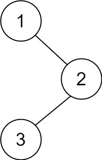
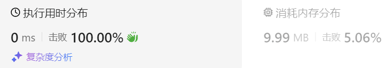
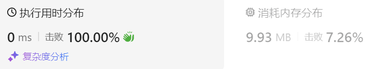
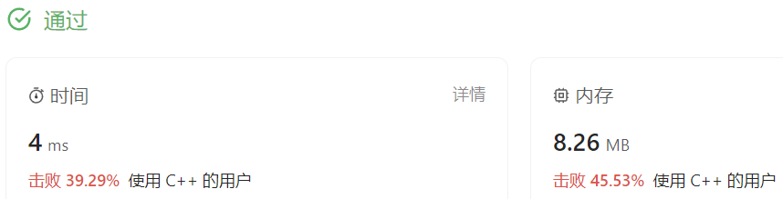

### 03、二叉树的后序遍历（20231106，145题，简单。240719整理）
<div style="border: 1px solid black; padding: 10px; background-color: SteelBlue;">

给你一棵二叉树的根节点 root ，返回其节点值的 **后序遍历** 。

示例 1：



- 输入：root = [1,null,2,3]
- 输出：[3,2,1]

示例 2：

- 输入：root = []
- 输出：[]

示例 3：

- 输入：root = [1]
- 输出：[1]
 

提示：

- 树中节点的数目在范围 [0, 100] 内
- -100 <= Node.val <= 100
 

进阶：递归算法很简单，你可以通过迭代算法完成吗？

  </p>
</div>

<hr style="border-top: 5px solid #DC143C;">
<table>
  <tr>
    <td bgcolor="Yellow" style="padding: 5px; border: 0px solid black;">
      <span style="font-weight: bold; font-size: 20px;color: black;">
      重新整理（递归法，4min）
      </span>
    </td>
  </tr>
</table>
<div style="padding: 0px; border: 1.5px solid LightSalmon; margin-bottom: 10px;">

```C++
class Solution {
public:
    void travelTree(TreeNode* cur_node, vector<int>& vec){
        if(cur_node == NULL) return;

        travelTree(cur_node->left, vec);
        travelTree(cur_node->right, vec);
        vec.push_back(cur_node->val);
    }
    vector<int> postorderTraversal(TreeNode* root) {
        vector<int> ret;

        travelTree(root, ret);

        return ret;
    }
};
```

</div>



<table>
  <tr>
    <td bgcolor="Yellow" style="padding: 5px; border: 0px solid black;">
      <span style="font-weight: bold; font-size: 20px;color: black;">
      重新整理（迭代法！！！）
      </span>
    </td>
  </tr>
</table>

<div style="padding: 0px; border: 1.5px solid LightSalmon; margin-bottom: 10px">

```C++
// 迭代方法， 后续遍历：左右中；先序遍历：中左右（调下顺序就是中右左，和后续遍历刚好相反）
// 所以可以求得变化后的先序遍历（中右左），倒序后就是后续遍历（左右中）
class Solution {
public:

    vector<int> postorderTraversal(TreeNode* root) {
        vector<int> ret;
        stack<TreeNode*> stk;
        TreeNode* cur_node;
        if(root == NULL) return ret;
        
        stk.push(root);

        // while(cur_node != NULL || !stk.empty())
        while(!stk.empty()){
            cur_node = stk.top();
            stk.pop();
            ret.push_back(cur_node->val);

            if(cur_node->left) stk.push(cur_node->left);  // 左边入栈，后取左节点
            if(cur_node->right) stk.push(cur_node->right); // 右边入栈，右节点先于左节点取！！！
        }
        // ret = reverse(ret.begin(), ret.end());
        reverse(ret.begin(), ret.end());

        return ret;
    }
};

```
</div>



<hr style="border-top: 5px solid #DC143C;">

<table>
  <tr>
    <td bgcolor="Yellow" style="padding: 5px; border: 0px solid black;">
      <span style="font-weight: bold; font-size: 20px;color: black;">
      随想录答案（递归法）
      </span>
    </td>
  </tr>
</table>

<div style="padding: 0px; border: 1.5px solid LightSalmon; margin-bottom: 10px">

```C++
class Solution {
public:
    void traversal(TreeNode* cur, vector<int>& vec) {
        if (cur == NULL) return;
        traversal(cur->left, vec);  // 左
        traversal(cur->right, vec); // 右
        vec.push_back(cur->val);    // 中
    }

    vector<int> preorderTraversal(TreeNode* root) {
        vector<int> result;
        traversal(root, result);
        return result;
    }
};
```
</div>

<table>
  <tr>
    <td bgcolor="Yellow" style="padding: 5px; border: 0px solid black;">
      <span style="font-weight: bold; font-size: 20px;color: black;">
      随想录答案（迭代法）
      </span>
    </td>
  </tr>
</table>

<div style="padding: 0px; border: 1.5px solid LightSalmon; margin-bottom: 10px">

```C++
class Solution {
public:
    vector<int> postorderTraversal(TreeNode* root) {
        stack<TreeNode*> st;
        vector<int> result;
        if (root == NULL) return result;
        st.push(root);
        while (!st.empty()) {
            TreeNode* node = st.top();
            st.pop();
            result.push_back(node->val);
            if (node->left) st.push(node->left); // 相对于前序遍历，这更改一下入栈顺序 （空节点不入栈）
            if (node->right) st.push(node->right); // 空节点不入栈
        }
        reverse(result.begin(), result.end()); // 将结果反转之后就是左右中的顺序了
        return result;
    }
};
```
</div>

<hr style="border-top: 5px solid #DC143C;">

<table>
  <tr>
    <td bgcolor="Yellow" style="padding: 5px; border: 0px solid black;">
      <span style="font-weight: bold; font-size: 20px;color: black;">
      自己版本，未通过(迭代方法版本)
      </span>
    </td>
  </tr>
</table>

<div style="padding: 0px; border: 1.5px solid LightSalmon; margin-bottom: 10px">

```C++
 /*
思路（迭代方法）：
先遍历到最左边的节点，然后处理右边的节点（遍历右节点）
处理右边节点还要再次检查最左边的节点，所以可以右节点的处理放在第二次循环
取值的时候应该蛮子节点没有左、右节点！
处理完左右节点，再处理中间节点，会重复搜索其左右节点，这种方法不行？？？
 */
class Solution {
public:
    vector<int> postorderTraversal(TreeNode* root) {
        TreeNode* cur = root;
        vector<int> ret;
        stack<TreeNode*> st;

        while(cur != NULL || !st.empty())
        {
            while(cur != NULL)
            {
                st.push(cur);
                cur = cur->left;  //左节点
            }

            if(cur->right) cur = cur->right;      //右节点

            if(cur->left == NULL && cur->right == NULL)
            {
                cur = st.top();
                ret.push_back(cur->val);
                st.pop();                 //中间节点
            }
        }
        return ret;
    }
};
```
</div>

<table>
  <tr>
    <td bgcolor="Yellow" style="padding: 5px; border: 0px solid black;">
      <span style="font-weight: bold; font-size: 20px;color: black;">
      看过答案思路后写的(迭代方法版本)
      </span>
    </td>
  </tr>
</table>

<div style="padding: 0px; border: 1.5px solid LightSalmon; margin-bottom: 10px">

```C++
 /*
 思路（迭代方法）：
 中序遍历方法只需要遍历时记录右边节点，而后序遍历要记录左右两边节点，并不好处理。
后序遍历：左右中。考虑中序遍历：中左右；变化一下做“中右左”也是方便的，后序的“左右中”与之刚好相反；
则对其进行倒序输出即可！！！
 */
class Solution {
public:
    vector<int> postorderTraversal(TreeNode* root) {
        //TreeNode* cur = root;
        vector<int> ret;
        stack<TreeNode*> st;

        if(root == NULL) return ret;   /*别忘了这句！！！*/

        st.push(root);
        while(!st.empty())
        {
            TreeNode* cur = st.top();
            ret.push_back(cur->val);
            st.pop();    //中节点

            if(cur->left) st.push(cur->left);    //左节点入栈
            if(cur->right)  st.push(cur->right);   //右节点入栈
        }
        reverse(ret.begin(), ret.end());
        return ret;
    }
};
```

</div>




