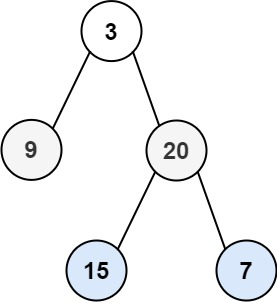

### 04、二叉树的层序遍历（20231106，102题，中等。240723整理，15min）
<div style="border: 1px solid black; padding: 10px; background-color: SteelBlue;">

给你二叉树的根节点 root ，返回其节点值的 层序遍历 。 （即逐层地，从左到右访问所有节点）。

 

示例 1：



- 输入：root = [3,9,20,null,null,15,7]
- 输出：[[3],[9,20],[15,7]]

示例 2：

- 输入：root = [1]
- 输出：[[1]]

示例 3：

- 输入：root = []
- 输出：[]
 

提示：

- 树中节点数目在范围 [0, 2000] 内
- -1000 <= Node.val <= 1000

  </p>
</div>

<hr style="border-top: 5px solid #DC143C;">
<table>
  <tr>
    <td bgcolor="Yellow" style="padding: 5px; border: 0px solid black;">
      <span style="font-weight: bold; font-size: 20px;color: black;">
      重新整理（240723，15min）
      </span>
    </td>
  </tr>
</table>
<div style="padding: 0px; border: 1.5px solid LightSalmon; margin-bottom: 10px;">

```C++ {.line-numbers}
 /*
 15min
 思路：
一个队列que1存当前层的节点，遍历当前层，将下一层节点给另一个队列que2
但队列1为空时，交换两个队列，直到两个队列都为空
 */
class Solution {
public:
    vector<vector<int>> levelOrder(TreeNode* root) {
        queue<TreeNode*> que1;
        queue<TreeNode*> que2;
        vector<vector<int>> ret;

        if(root == nullptr) return ret;  // 需要判断root是否为空！！！否则下面cur_node->val会报错

        que1.push(root);

        while(!que1.empty() || !que2.empty()){
            vector<int> tmp;
            while(!que1.empty()){
                TreeNode* cur_node = que1.front();
                que1.pop();
                tmp.push_back(cur_node->val);
                if(cur_node->left) que2.push(cur_node->left);
                if(cur_node->right) que2.push(cur_node->right);
            }
            ret.push_back(tmp);
            swap(que1, que2);
        }

        return ret;
    }
};
```

</div>


<hr style="border-top: 5px solid #DC143C;">

<table>
  <tr>
    <td bgcolor="Yellow" style="padding: 5px; border: 0px solid black;">
      <span style="font-weight: bold; font-size: 20px;color: black;">
      自己答案（通过！）
      </span>
    </td>
  </tr>
</table>

<div style="padding: 0px; border: 1.5px solid LightSalmon; margin-bottom: 10px">

```C++ {.line-numbers}
 /*
 思路：
使用两个队列，一个队列que1存放当前一行的所有节点；
遍历que1（当前行各个节点值放入tmp中，此行遍历结束，将tmp容器中的值放入ret中），将各个节点的左右节点放入que2；
最后调换que1和que2；
当que1为空时，结束。
 */
class Solution {
public:
    vector<vector<int>> levelOrder(TreeNode* root) {
        vector<int> tmp;
        vector<vector<int>> ret;
        queue<TreeNode*> que1;
        queue<TreeNode*> que2;

        if(root == NULL) return ret;

        que1.push(root);
        while(!que1.empty() || !que2.empty())
        {
            TreeNode* cur = que1.front();   /*que1.top();*/
            que1.pop();
            tmp.push_back(cur->val);
            if(cur->left) que2.push(cur->left);  //将下一层节点放入que2
            if(cur->right) que2.push(cur->right);

            if(que1.empty())   //que1空了，说明这一层遍历结束，调换两个队列
            {
                que1.swap(que2);
                ret.push_back(tmp);
                tmp.clear();
            }
        }
        return ret;
    }
};
```

</div>


<hr style="border-top: 5px solid #DC143C;">

<table>
  <tr>
    <td bgcolor="Yellow" style="padding: 5px; border: 0px solid black;">
      <span style="font-weight: bold; font-size: 20px;color: black;">
      随想录答案（迭代法，层序遍历）
      </span>
    </td>
  </tr>
</table>

<div style="padding: 0px; border: 1.5px solid LightSalmon; margin-bottom: 10px">

```C++ {.line-numbers}
class Solution {
public:
    vector<vector<int>> levelOrder(TreeNode* root) {
        queue<TreeNode*> que;
        if (root != NULL) que.push(root);
        vector<vector<int>> result;
        while (!que.empty()) {
            int size = que.size();
            vector<int> vec;
            // 这里一定要使用固定大小size，不要使用que.size()，因为que.size是不断变化的
            for (int i = 0; i < size; i++) {
                TreeNode* node = que.front();
                que.pop();
                vec.push_back(node->val);
                if (node->left) que.push(node->left);
                if (node->right) que.push(node->right);
            }
            result.push_back(vec);
        }
        return result;
    }
};
```
</div>

<table>
  <tr>
    <td bgcolor="Yellow" style="padding: 5px; border: 0px solid black;">
      <span style="font-weight: bold; font-size: 20px;color: black;">
      随想录答案（递归法）
      </span>
    </td>
  </tr>
</table>

<div style="padding: 0px; border: 1.5px solid LightSalmon; margin-bottom: 10px">

```C++ {.line-numbers}

class Solution {
public:
    void order(TreeNode* cur, vector<vector<int>>& result, int depth)
    {
        if (cur == nullptr) return;
        if (result.size() == depth) result.push_back(vector<int>());
        result[depth].push_back(cur->val);
        order(cur->left, result, depth + 1);
        order(cur->right, result, depth + 1);
    }
    vector<vector<int>> levelOrder(TreeNode* root) {
        vector<vector<int>> result;
        int depth = 0;
        order(root, result, depth);
        return result;
    }
};
```
</div>
