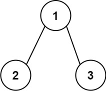
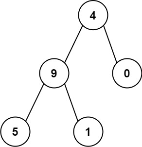
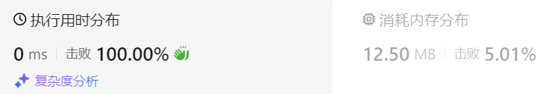

### 05、求根节点到叶节点数字之和（20240726，129题，中等，14min）
<div style="border: 1px solid black; padding: 10px; background-color: SteelBlue;">

给你一个二叉树的根节点 root ，树中每个节点都存放有一个 0 到 9 之间的数字。
每条从根节点到叶节点的路径都代表一个数字：

例如，从根节点到叶节点的路径 1 -> 2 -> 3 表示数字 123 。
计算从根节点到叶节点生成的 **所有数字之和** 。

**叶节点** 是指没有子节点的节点。

 

示例 1：



- 输入：root = [1,2,3]
- 输出：25
- 解释：  
从根到叶子节点路径 1->2 代表数字 12  
从根到叶子节点路径 1->3 代表数字 13  
因此，数字总和 = 12 + 13 = 25  

示例 2：



- 输入：root = [4,9,0,5,1]
- 输出：1026
- 解释：  
从根到叶子节点路径 4->9->5 代表数字 495  
从根到叶子节点路径 4->9->1 代表数字 491  
从根到叶子节点路径 4->0 代表数字 40  
因此，数字总和 = 495 + 491 + 40 = 1026  
 

提示：

- 树中节点的数目在范围 [1, 1000] 内
- 0 <= Node.val <= 9
- 树的深度不超过 10

  </p>
</div>

<hr style="border-top: 5px solid #DC143C;">
<table>
  <tr>
    <td bgcolor="Yellow" style="padding: 5px; border: 0px solid black;">
      <span style="font-weight: bold; font-size: 20px;color: black;">
      自己答案（迭代法，14min）
      </span>
    </td>
  </tr>
</table>
<div style="padding: 0px; border: 1.5px solid LightSalmon; margin-bottom: 10px;">

```C++
/*
14min
思路：
迭代法
使用一个栈stk_node记录递归遍历中的节点
使用一个栈path_stk记录递归遍历中，当前路径所有节点组合起来的字符

当遇到叶子节点时，将当前path_stk的top节点存入成员vector<string> vec中，

遍历整个树后，遍历vec
    vec中每个元素都是一条路径上节点组合的字符串
    将每个字符串转为数字，并相加得到sum
最后返回sum。
 */
class Solution {
public:
    vector<string> vec;

    int sumNumbers(TreeNode* root) {
        
        stack<TreeNode*> stk_node;
        stack<string> path_stk;
        stk_node.push(root);
        TreeNode* cur_node = nullptr;
        path_stk.push(to_string(root->val));

        while(!stk_node.empty()){
            cur_node = stk_node.top();
            stk_node.pop();
            string path = path_stk.top();
            path_stk.pop();

            if(cur_node->left == nullptr && cur_node->right == nullptr){
                vec.push_back(path);
            }

            if(cur_node->left){
                stk_node.push(cur_node->left);
                path_stk.push(path + to_string(cur_node->left->val));
            }

            if(cur_node->right){
                stk_node.push(cur_node->right);
                path_stk.push(path + to_string(cur_node->right->val));
            }
        }

        int sum = 0;
        for(auto& str : vec){
            int cur_num = stod(str);
            sum += cur_num;
        }
        return sum;
    }
};
```

</div>



<table>
  <tr>
    <td bgcolor="Yellow" style="padding: 5px; border: 0px solid black;">
      <span style="font-weight: bold; font-size: 20px;color: black;">
      自己答案（递归法）
      </span>
    </td>
  </tr>
</table>

<div style="padding: 0px; border: 1.5px solid LightSalmon; margin-bottom: 10px">

```C++
/*
9min
思路：
递归法
递归中，使用string path记录路径上各个节点组成的字符串
    遇到叶子节点，将当前的path存储在成员vector<string> vec中
    
遍历整个树后，遍历vec
    vec中每个元素都是一条路径上节点组合的字符串
    将每个字符串转为数字，并相加得到sum
最后返回sum。
 */
class Solution {
public:

    vector<string> vec;

    void travelTree(TreeNode* cur_node, string& path){
        if(cur_node == nullptr) return;

        path += to_string(cur_node->val);
        if(cur_node->left == nullptr && cur_node->right == nullptr){
            vec.push_back(path);
        }

        travelTree(cur_node->left, path);
        travelTree(cur_node->right, path);

        path.erase(path.size()-1, 1);
    }

    int sumNumbers(TreeNode* root) {
        
        string path;
        travelTree(root, path);

        int sum = 0;
        for(auto& str : vec){
            sum += stod(str);
        }

        return sum;
    }
};
```
</div>


<hr style="border-top: 5px solid #DC143C;">

<table>
  <tr>
    <td bgcolor="Yellow" style="padding: 5px; border: 0px solid black;">
      <span style="font-weight: bold; font-size: 20px;color: black;">
      随想录答案（递归法）
      </span>
    </td>
  </tr>
</table>

<div style="padding: 0px; border: 1.5px solid LightSalmon; margin-bottom: 10px">

```C++
class Solution {
private:
    int result;
    vector<int> path;
    // 把vector转化为int
    int vectorToInt(const vector<int>& vec) {
        int sum = 0;
        for (int i = 0; i < vec.size(); i++) {
            sum = sum * 10 + vec[i];
        }
        return sum;
    }
    void traversal(TreeNode* cur) {
        if (!cur->left && !cur->right) { // 遇到了叶子节点
            result += vectorToInt(path);
            return;
        }

        if (cur->left) { // 左 （空节点不遍历）
            path.push_back(cur->left->val);     // 处理节点
            traversal(cur->left);               // 递归
            path.pop_back();                    // 回溯，撤销
        }
        if (cur->right) { // 右 （空节点不遍历）
            path.push_back(cur->right->val);    // 处理节点
            traversal(cur->right);              // 递归
            path.pop_back();                    // 回溯，撤销
        }
        return ;
    }
public:
    int sumNumbers(TreeNode* root) {
        path.clear();
        if (root == nullptr) return 0;
        path.push_back(root->val);
        traversal(root);
        return result;
    }
};
```
</div>
